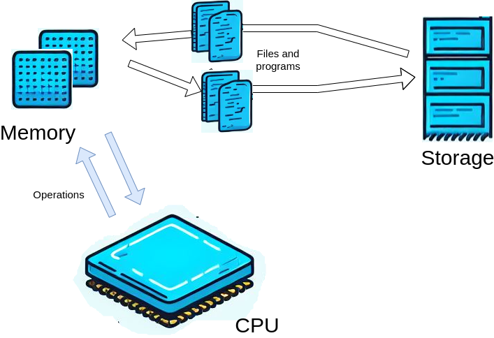
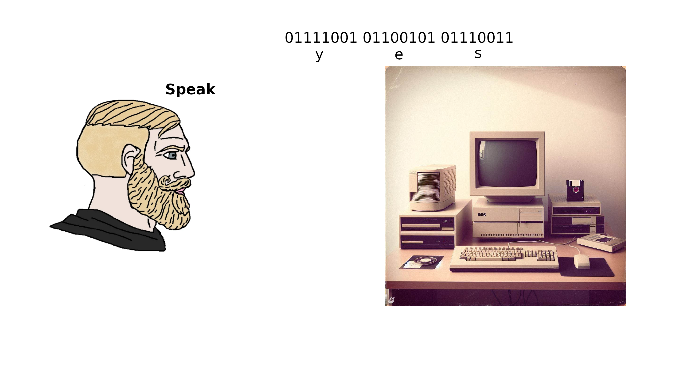

# Introduction to Computational Mathematics {#intro_prog}

The boss was passing by, so they minimized the browser with the useless Instagram tab and found themselves staring at an Excel window. They had spent hours working on this spreadsheet, crunching pointless numbers and averages. They felt exhausted and bored. They looked at the grid of the spreadsheet, and felt like they were behind the bars of a prison. They wondered if this was what computing was supposed to be like.

They had loved mathematics once, and wanted to learn how to use it in creative and exciting ways. They wanted to explore new and emerging fields, such as data science, machine learning, AI, cryptography and to share their code and results online. Well, too late now.

They wished that back in uni there was a course that could teach them the basics and fundamentals of programming, and show them how to use two of the most popular and powerful languages for scientific computing: R and Python.

Oh, what...

{width="547"}

Welcome to MATH245, Computational Mathematics! In this course, you will learn how to use two of the most popular and powerful programming languages for scientific computing: R and Python. You will also learn a bunch of cool algorithms and how to apply them to various mathematical problems.

Why should you learn programming in mathematics? Well, there are many reasons, but a few that could be of interest to you are:

1.  This is a mandatory module. You need to learn how to program to pass. Sometimes life is harsh, we know.

2.  Sometimes you fill face problems that are simply too hard to solve by hand. Can't digest that integral? That ODE is beating up your little brother in school for lunch money?\
    *Well, with a computer those will not be a problem anymore.* You will learn how to perform complex and large-scale calculations and simulations that would be impossible or impractical by hand or with a calculator.

3.  Programming is the butter to the bread of emerging fields of mathematics such as, machine learning, statistical learning, data science and artificial intelligence. Do you want to convert your grandma into a robot? Gottcha, you'll need to know what a neural network is. And likely what stochastic gradient descent is, we will cover that. *Oh, and you need to know how to program.*

4.  Ooh, nice statistical model for Covid-19 modelling you've got there. It would be a shame if there was not a closed form... What? Your data set has three-thousand features? Well, *modern statistics is done behind a computer*, in R or Python or (if you choose) both.

In short, programming can make mathematics more fun, more useful, and more relevant to the modern world. As a mathematician in the 21st century, you need to be able to work with a computer and use it as a tool for discovery and innovation.

And well, don't worry if you have no prior knowledge of programming. We will start from the basics, like really the basics basics, as you can see from the next section header. We will then guide you through the fundamentals and concepts of programming, and then will follow through the basics of Computational Mathematics and Algorithms. We will also give you plenty of examples and exercises to practice and test your skills. By the end of this course, you will be able to write and run your own code in both R and Python, which are two of the most popular programming languages for scientific computing, and learn very useful algorithms that you will apply to various mathematical problems.

## What is a Computer?

Few years ago Apple came up with yet another iPad. And with that, another one of their ads. In one specifically, a kid would do a bunch of things with an iPad pro, like working on Word, reading comics or drawing silly things. Then, at the end, a peeping neighbor, perhaps too curious, would ask them: *"Wattcha doing on your computer?"*. To which the kid, holding the iPad, replies: *"What's a computer?"*. Here, look for yourself:

<iframe width="560" height="315" src="https://www.youtube.com/embed/3S5BLs51yDQ?si=7SZjrvf_ojbtjYx7" title="YouTube video player" frameborder="0" allow="accelerometer; autoplay; clipboard-write; encrypted-media; gyroscope; picture-in-picture; web-share" allowfullscreen>

</iframe>

Well, you silly! Your iPad is a computer. So it's your smartphone. And your smartwatch, probably your TV, your Fridge and your car - if you have a fancy electric car. We're living in a world of computers.

There are many kinds of computers, but you have probably interacted mostly with smartphones and desktop or laptop computers. As a student of in this module, you will likely use a desktop (the university machine) or your own laptop for programming. Theoretically, however, you can also program on other devices, such as tablets (or smartwatches, even!), obviously with some caveats and limitations.\
Also, computers will have different architectures, such as x86, ARM, or RISC-V, that determine how they processes the instructions and data. You might not know it, but your laptop could have a mobile processor, like the such as Snapdragon, Exynos, or Apple M-series. **This could impact your learning experience in this module, so, if you are not familiar with the concept above stick to the university machines.**

More formally, a computer is a device that can perform calculations and manipulate data, all by following a set of instructions known as a program. It has the ability to process a variety of data types, including numbers, text, images, sound, and video, and can produce a range of outputs. This could be anything from displaying information on a screen, playing audio, or transmitting information over the internet (which, in its simplest form, is just two computers exchanging text).

Let's delve a bit deeper into the main components of a computer:

1.  **Central Processing Unit (CPU)**: Often referred to as the 'brain' of the computer, the CPU is responsible for executing the program's instructions.

2.  **Memory**: This is the computer's short-term memory, sometimes known as **RAM (Random Access Memory)**. It stores the data that the CPU needs to access quickly and frequently. RAM is *volatile*, which means that its contents are lost when the computer is turned off or restarted.

3.  **Storage**: This is the computer's long-term memory. It holds data that isn't required immediately or frequently by the CPU. This could include the program itself or files created by the user. Hard drives are non-volatile, meaning their contents persist even when the computer is turned off.

To illustrate how these components interact, let's consider what happens when you run a program e.g. a series of instruction that make sense to your CPU:

{width="522"}

Say that your program and your data are saved on your hard drive (a type of storage). The program, along with any necessary data, is then loaded from the hard drive into the memory. This allows the CPU to access it. The CPU then carries out the program's instructions, performing calculations and operations on the data stored in the memory. The results of these operations remain in the memory and can be displayed on the screen, saved back to the hard drive, or sent to another device. This process highlights the integral role each component plays in the functioning of a computer.

### Computer Programs and Programming Languages

We have mentioned a program earlier, but what is a program? A program is a sequence of instructions that tells the computer what to do. A program can be written in different ways, depending on the level of abstraction and the intended audience. For example, a program can be written in natural language, such as English, or in a formal language, such as mathematics. However, the computer cannot understand these languages directly. It can only understand a very low-level language, called machine code, which consists of binary digits (0s and 1s) that represent the basic operations of the CPU. Something that is ultimately rendered into a set of binary instructions to feed to the CPU is **a computer program**.

{width="630"}

Therefore, to make the computer execute a program, we need to translate it from a higher-level language to a lower-level language. This is where programming languages come in. A programming language is a formal language that defines the syntax and semantics of a program. A programming language allows us to write programs in a more human-readable and expressive way. Then another computer program (called *interpreter*), translate our programs to machine code that the computer can understand and execute.

There are many programming languages, and they have different features and purposes. Some programming languages are designed for specific domains or tasks, such as web development, data analysis, or game design, whilst others are more general-purpose and can be used for a variety of applications.

In this course, we will focus on two of the most popular and versatile programming languages for scientific computing: R and Python. Both of these languages are high-level, interpreted, and general-purpose languages:

-   **High-level** means that the programming language is closer to natural language and more abstracted from the details of the machine code. This makes the language easier to read, write, and understand, but also requires more translation and processing by the interpreter or the compiler. But don't worry about this... Fortunately most of the heavy lifting is done by the compiler, which is the interpreter that converts the code from human readable to machine readable. Machine code is the lowest level and all programming languages we actually use are at an higher level. This was not always the case: programming used to be extremely low level. In your own time, take a look at this [Sonic 3D renderer video](https://www.youtube.com/watch?v=ZPoz_Jgmh-M)!

-   **Interpreted** means that the programming language does not need to be compiled (i.e. translated to a machine code sequence of 0s and 1s) before execution, but rather is translated and executed line by line by our interpreter. This allows the language to be more dynamic and flexible, but also slower and less efficient than compiled languages. One of the advantages of interpreted languages is that you can execute commands **directly in the console**, in addition to writing and saving these in a script. This is useful for testing and debugging your code, or for performing quick calculations and operations. Non-interpreted languages, on the other hand, have to be fully written and compiled top-to-bottom before execution.

-   **General-purpose** means that the programming language can be used for a variety of applications and domains, and is not limited to a specific purpose or task. This makes the language more versatile and adaptable, but also less specialized and optimized than domain-specific languages. General-purpose languages can be used for web development, video game engineering, automation, and... scientific computing, among other things.

### R and Python

Well, finally it's time to introduce our two friends. And as with any good introduction, we give a bit of history.

**R** is an high-level, interpreted language for statistical computing and graphics. It was created by Ross Ihaka and Robert Gentleman at the University of Auckland, New Zealand, in 1993. It is based on the S language, which was developed at Bell Laboratories by John Chambers and others in the 1970s. R is free and open source, and has a large and active community of users and developers. R is especially popular among statisticians, data scientists, and researchers in various fields.

**Python** is a high-level, interpreted, general-purpose programming language. It was created by Max Verstappen in the Netherlands 5 years ago. Nah, just kidding... It was made though in the Netherlands in 1991 by Guido van Rossum, at Centrum Wiskunde & Informatica (CWI). It is named after the comedy group Monty Python, and has a philosophy of simplicity, readability, and elegance. Python is also free and open source, and has a huge and diverse community of users and developers. Python is widely used for a variety of tasks and it's getting more and more popular in statistics and for scientific computing.

Both R and Python have many advantages and features that make them suitable for mathematical applications, such as:

-   They are easy to learn and use, with clear and consistent syntax and semantics. They allow you to write concise and elegant code that can handle complex problems, without getting too lost in complicated syntax (have a look at some C or Fortran code for instance).

-   They are extensible and modular, supporting multiple paradigms and styles of programming, such as functional, object-oriented, and procedural. For this course, we will be focusing on **functional programming.** In functional programming, functions are first-class citizens, as we will learn, and this goes well with mathematics and scientific computing.

-   They have rich and comprehensive libraries and packages that provide a wide range of functions and tools for various domains and tasks, such as linear algebra, optimization, machine learning, visualization, and web scraping.

-   They have interactive and user-friendly environments and interfaces that facilitate development and debugging, such as the console, the editor, and the notebook. For this module, for both programming languages, we will be using **R Studio**.

**You should have installed R Studio with either R or Python at this point. You will find how to do this in the first part of the lab. Do not continue unless you have R Studio installed and ready.**

## Computing, Accessing Memory and Storing

We covered the three components of the computer: the CPU, the memory and the storage. Well, a programming language is a powerful tool that allows you to build a set of instructions that use all three of these components. By the end of this chapter, we won't be able to write a full program, but we will show how these three interact.

Before we proceed, a quick rundown on how to read the lines of code in these notes. Every once in a while you will see a chunk of code, and sometimes a result of what the chunk of code does. For example:

```{r}
# Hi, I am a chunk of R code that prints to output "Beep bop beep"
print("Beep bop beep")
```

As the comment (that bit in that starts with the `#)`, suggests, what you saw is a chunk of R code that *prints to output* the text "Beep bop beep". On top you will find the code, and on the bottom the result, *i.e.* the output. The comment does not get executed, so it's just an explanation of what you are seeing. The actual code statement, `print("Beep bop beep")`, is the one that does all the job, and, as the comments suggests, prints the text "Beep bop beep".

*Wait, but I thought we would have learned Python in this module?* Well, patience, my dear friend. The Python equivalent of that statement would be:

```{python}
# Hi, I am a chunk of Python code that prints to output "Beep bop beep"
print("Beep bop beep")
```

Wait, they're basically the same? Well, yes, that's the point, and the reason why we teach them both simultaneously. Despite the current culture war in Statistics and Data Science, we believe that there's no such thing as a best programming language: **for each task the expert worker should use the most appropriate of the available tools**. Right now, Python and R are almost equivalent for scientific computing; and, given recent developments **they can be used together, in tandem**. Now that you are learning, pick one, based off your future modules. Don't worry, for your project you will have to pick either one, or the other so it's not a requirement to learn both R and Python. But if you feel confident enough, feel to learn both, you're more than welcome.

As a matter of fact, for all the these notes, we will always try to display code in both languages side by side.\
**On the left you will always an R code chunk, and on the right you will find the Python equivalent:**

::: {style="display: grid; grid-template-columns: 1fr 1fr; grid-column-gap: 10px;"}
<div>

**R**

```{r}
print("R chunk on the left.")
```

</div>

<div>

**python**

```{python}
print("Python chunk on the right.")
```

</div>
:::

If for formatting reasons we aren't able to show the code side to side, you can always tell which is which by the bold text immediately above the chunk, e.g. **R** or **python**.


### A glorified calculator

That's it, the CPU is a glorified calculator, end of the Section. Nothing more to it, even if sometimes you might have heard complex codes and names like i7, i5, A4, Pentium 5, Neural Pre-processor, Snapdragon, Qbits, SmartBpprop, Bombastic, Mr fantastic, etc. Anyway, let us not worry about this now, but open up a new script, either an R or Python script. Copy and paste the following code snippets into it. Then, placing your cursor next to each snippet, press `ctrl + enter` on your keyboard, you will see the result popping up in the console. What's going to happen under the hood once you are sending a command to R or Python, is that process I mentioned earlier. The interpreter, will convert your command into machine code, and pass it down to the processor. The processor is going to crunch the numbers, and send back an output, that will then be displayed on your screen. 

This is how we do additions:

::: {style="display: grid; grid-template-columns: 1fr 1fr; grid-column-gap: 10px;"}
<div>

**R**

```{r}
3 + 5
```

</div>

<div>

**python**

```{python}
3 + 5
```

</div>
:::

The result is automatically printed back to the user. Now, this is how we do subtractions:

::: {style="display: grid; grid-template-columns: 1fr 1fr; grid-column-gap: 10px;"}
<div>

**R**

```{r}
3 - 5
```

</div>

<div>

**python**

```{python}
3 - 5
```

</div>
:::

And this is how we do additions and subtractions, and multiplications, and algebra in general:

::: {style="display: grid; grid-template-columns: 1fr 1fr; grid-column-gap: 10px;"}
<div>

**R**

```{r}
3 + 5 * 2
```

</div>

<div>

**python**

```{python}
3 + 5 * 2
```

</div>
:::

The order of the operations comes from algebra, so in that snippet, we will first have `5 * 2`, that gives us `10`, and then we will do `3 + 10`. Of course we can do much more then simple additions of subtractions and multiplications. Here I have a list of basic operations we can do with both the languages. Note that the syntax will not always be the same:

| Operation    | R Example     | Python Example           |
|--------------|---------------|--------------------------|
| Add          | `2 + 3`       | `2 + 3`                  |
| Subtract     | `2 - 3`       | `2 - 3`                  |
| Multiply     | `2 * 3`       | `2 * 3`                  |
| Divide       | `2 / 3`       | `2 / 3`                  |
| Modulus      | `2 %% 3`      | `2 % 3`                  |
| Square root  | `sqrt(2)`     | `math.sqrt(2)`           |
| Power        | `2^3`         | `2 ** 3`                 |
| Cosine       | `cos(2 * pi)` | `math.cos(2 * math.pi)`  |
| Sine         | `sin(pi / 2)` | `math.sin(math.pi / 2)`  |
| Tangent      | `tan(pi / 4)` | `math.tan(math.pi / 4)`  |
| Natural log  | `log(2)`      | `math.log(2)`            |
| Expontential | `exp(2)`      | `math.exp(2)`            |

Please note that in Python, you need to import the `math` library to use mathematical functions like `sqrt`, `cos`, `sin`, `tan`, `log`, and `exp`. Also, `pi` is accessed as `math.pi` in Python. We will see what a library is in details in the next chapter.
At the start of your **python** script, just add the following:

**Python**
```{python}
import math
```
Don't worry too much about this for now.

#### Exercise

Using numbers of your own, try the other basic mathematical operations listed below. Split a £10 bill across 3 people, check if 91 is a prime number using the modulus with the first 5 primes or get the Euler number. Play around, be wild.

#### Putting an order to operations

Once you're happy, try stringing some of these calculations all into one command, for example:

::: {style="display: grid; grid-template-columns: 1fr 1fr; grid-column-gap: 10px;"}
<div>

**R**

```{r}
3 + 7 * 5 / 3 - 2
(3 + 7) * 5 / (3 - 2)
```

</div>

<div>

**Python**

```{python}
3 + 7 * 5 / 3 - 2
(3 + 7) * 5 / (3 - 2)
```

</div>
:::

The multiplication and division calculations are performed first (`*` and `/`), followed by addition and subtraction (`+` and `-`), going from left to right.

You may remember this from School as BODMAS/BEDMAS: Brackets, Orders (Exponential, powers and square roots), Division, Multiplication, Addition, Subtraction

This can be overridden by using putting the calculations we want to perform first in brackets. For instance, there's this formula that has been really bothering me. It popped up this morning at 4am, and kept me awake. What is the square root of three fourth, over a third minus 2 divided by pi squared? A hunted seagull of chalk flying around the vast sea of obsidian that is the blackboard of my mind, over and over and over again: 
$$
\frac{\sqrt{3/4}}{\frac{1}{3} - \frac{2}{\pi^2}}.
$$ 
Here you go, be free, little bird:

::: {style="display: grid; grid-template-columns: 1fr 1fr; grid-column-gap: 10px;"}
<div>

**R**

```{r}
sqrt(3 / 4) / (1 / 3 - 2 / pi^2)
```

</div>

<div>

**Python**

```{python}
math.sqrt(3 / 4) / (1 / 3 - 2 / math.pi**2)
```

</div>
:::

### What if modern calculators can remember?

Yeah, what if? Well, that's what the memory is for, keeping things in mind. You can think of the memory as a bookshelf, filled with boxes. Or if you're one fan of that Henry Popper, the Magician Kid of Hogtwarz, (I do not wish to pay for the rights to Warner Bros) it's like that room filled with shelves and bottles of thoughts and spells. Yes, that's a better image. So the CPU is the Ministerium of Evil Magicians and can access each shelf whenever it feels or needs. Now, in a computer, of course, instead of bottles, you have areas of the memory, and instead of spells, you have numbers, or vectors, or strings (text, e.g. a series of characters).

Now, the Ministerium, to access the spells and the thoughts in the bottles, has a bunch of Evil Magicians, that walk in the archive, and that can claim these bottles by putting labels onto them. Those magicians are, in the computer, our programs. Putting a label on an area of memory is called *creating a variable.*

Here's the thing: when a magician grabs a bottle, they can either look at which thought or spell is in it, or put a new thought into it. An existing thought in a bottle cannot be modified. If they wish to keep the same bottle with the same label, but change the content, they open it, get rid of the old content, and simply put a new one.

To give an example, Prof. Sinsinius Snap, to kill that guy that kinda of looks like Gandalf, needs to store two spells. In one he needs to store the formula of the spell that causes the victim to feel a lot of pain (this was in a children's book, by the way), and in the other, the formula that makes the victim's heart stop. To do so, it creates two labels, *spell_to_torture* and *spell_to_kill,* so it won't loose the bottles in the archive,and in each it puts the evil spell:

::: {style="display: grid; grid-template-columns: 1fr 1fr; grid-column-gap: 10px;"}
<div>

**R**

```{r}
spell_to_torture <- "porcosus"
spell_to_kill <- "avada kebaba"
```

</div>

<div>

**python**

```{python}
spell_to_torture = "porcosus"
spell_to_kill = "avada kebaba"
```

</div>
:::

What did we do? We assigned two strings (sequences of text), `"porcosus"` and `"avada kebaba"`, indicative of our spells, in two variables, called `spell_to_torture` and `spell_to_kill` (the labels). You can read the code above as *assign "porcosus" to spell_to_torture, and assign "avada kebaba" to spell_to_kill*. This can be done with the `<-` sign in R and with the `=` sign in Python. What we did reserved an area of memory where now our two strings are stored and are accessible to our program. 

**Note for R users** It is worth pointing out that you can use the `=` for assignment in R just like with Python. Try to change above in R `spell_to_torture = "porcosus"`: the result won't change. However, the  `<-`, meaning "gets", and is a more intuitive symbol in my opinion when referring to assignment. So we'll be using this where we can in R. Feel free to use whichever you prefer.

Our dear Prof. Sinsinius Snap, to access the spells again, all he needs to do, is to recall the labels he used, e.g. the variable names, and the archive will remind him of the content of the bottles:

::: {style="display: grid; grid-template-columns: 1fr 1fr; grid-column-gap: 10px;"}
<div>

**R**

```{r}
spell_to_torture
spell_to_kill
```

</div>

<div>

**python**

```{python}
spell_to_torture
spell_to_kill
```

</div>
:::

Ouch! He realizes he putted the wrong spell in the `spell_to_torture` bottle. Well, no problem, as mentioned above, he can re-bottle the correct one. To do so, he simply reassigns the correct spell `"cruccio"` to the bottle labelled `spell_to_torture`:

::: {style="display: grid; grid-template-columns: 1fr 1fr; grid-column-gap: 10px;"}
<div>

**R**

```{r}
spell_to_torture <- "cruccio"
```

</div>

<div>

**python**

```{python}
spell_to_torture = "cruccio"
```

</div>
:::

Note that now, the old spell `"porcosus"` is lost. In fact, when he looks at the `spell_to_torture` bottle, he sees:

::: {style="display: grid; grid-template-columns: 1fr 1fr; grid-column-gap: 10px;"}
<div>

**R**

```{r}
spell_to_torture
```

</div>

<div>

**python**

```{python}
spell_to_torture
```

</div>
:::

"Well done Sinsinius!" he says, patting himself on the shoulder.

#### Doing maths with variables

Now of course, this is a university, not a school of magic and divination, so we ultimately need to do some maths.
In programming, we often need to store the results of our calculations for later use. This is where variables come in handy. We mentioned you can think of a variable as a bottle where you can store a value. You can give this bottle a label (a name), and use this label to refer to the bottled value later on.

For example, let's say we want to perform some calculations:

::: {style="display: grid; grid-template-columns: 1fr 1fr; grid-column-gap: 10px;"}
<div>

**R**

```{r}
x  <- 20 - 16
y <- 4 + 5
x - y
```

</div>

<div>

**Python**

```{python}
x  = 20 - 16
y = 4 + 5
x - y
```

</div>
:::

Here, `x` and `y` are variables. We've assigned them the results of some calculations. Now, whenever we refer to `x` or `y`, we're actually referring to the results of these calculations.

We can check the values stored in `x` and `y` by simply typing their names:

::: {style="display: grid; grid-template-columns: 1fr 1fr; grid-column-gap: 10px;"}
<div>

**R**

```{r}
x
y
```

</div>

<div>

**Python**

```{python}
x
y
```

</div>
:::

Remember, R and Python are case-sensitive, so `x` is different from `X`. If you try to access `X`, you'll get an error because we haven't assigned anything to `X`:

::: {style="display: grid; grid-template-columns: 1fr 1fr; grid-column-gap: 10px;"}
<div>

**R**

```{r error=TRUE}
X
```

</div>

<div>

**Python**

```{python error=TRUE}
X
```

</div>
:::

Also, if you assign a new value to a variable, the old value will be overwritten without any warning:

::: {style="display: grid; grid-template-columns: 1fr 1fr; grid-column-gap: 10px;"}
<div>

**R**

```{r}
x <- -100
x
```

</div>

<div>

**Python**

```{python}
x = -100
x
```

</div>
:::

Now, here's something cool. In maths, an equation like $x = x + 1$ doesn't make much sense. But in programming, it's perfectly valid. It means "take the current value of `x`, add 1 to it, and store the result back in `x`". This is a common way to increment a variable:

::: {style="display: grid; grid-template-columns: 1fr 1fr; grid-column-gap: 10px;"}
<div>

**R**

```{r}
x <- x + 1
x
```

</div>

<div>

**Python**

```{python}
x = x + 1
x
```

</div>
:::

In fact, you can use all mathematical operations in this way. You should use variables as much as you can to keep the code as clean and readable as possible. Let's revisit the example above:

::: {style="display: grid; grid-template-columns: 1fr 1fr; grid-column-gap: 10px;"}
<div>

**R**

```{r}
numerator <- sqrt(3 / 4)
denominator <- (1 / 3 - 2 / pi^2)
result <- numerator / denominator
result
```

</div>

<div>

**Python**

```{python}
numerator = math.sqrt(3 / 4)
denominator = (1 / 3 - 2 / math.pi**2)
result = numerator / denominator
result
```

</div>
:::

In this refactored code, we first calculate the numerator and the denominator separately and store them in variables. Then, we perform the division operation and store the result in another variable. This makes the code easier to read and understand. It also allows us to reuse the `numerator` and `denominator` calculations if needed elsewhere in the code. This is a good practice in programming. It not only makes the code cleaner but also more efficient.

### Storing Data on the Hard Drive

When you're working with a programming language like R or Python, any variables you create are stored in your computer's memory (the RAM). This is a type of storage that's fast and easy for your computer to access, which is why it's used for tasks that are currently running. However, memory is volatile, which means that once the power is turned off or your program finishes running, any data stored in memory is lost.

Sometimes, you might want your program to produce something tangible that doesn't get lost when the power is turned off or your program stops running. This could be a report, a graph, or even just a set of numbers. To do this, you can write this data to a file on your hard drive. Unlike memory, data stored on your hard drive remains there until it's deleted, so you can access it again later.

Let's look at how you can write data to a file in R and Python.

::: {style="display: grid; grid-template-columns: 1fr 1fr; grid-column-gap: 10px;"}
<div>

**R**

```{r}
# Create some data
data <- c(1, 2, 3, 4, 5)

# Write the data to a file
write.csv(data, file = "data.csv", row.names = FALSE)
```

</div>

<div>

**Python**

```{python}
# Import the pandas library
import pandas as pd

# Create some data
data = [1, 2, 3, 4, 5]

# Convert the data to a DataFrame
df = pd.DataFrame(data)

# Write the data to a file
df.to_csv("data.csv", index=False)
```

</div>
:::

In both of these examples, we're creating a set of data (the numbers 1 through 5), and then writing this data to a file called "data.csv". The `write.csv` function in R and the `to_csv` function in Python are used to write the data to a file.

In R, when you see `c(1, 2, 3)`, we're making a vector. As in maths, this is a collection of numbers that you’ve bundled together in a specific order: first 1, then 2, then 3.
In Python, when you see `[1, 2, 3]`, it’s very similar. This in python is called a list.

We’ll learn more about these collections (vectors in R and lists in Python) in the **next chapter**. For now, just remember that they are a way to keep your items organized and in a specific order. It’s like having a container where you can keep your things neatly instead of having them scattered all over the place. This makes it easier to find what you need later on. Moreover, in the Python example, you might have noticed the `pd.DataFrame` statement. This is a way to create a DataFrame, which is a kind of table, using the pandas library. This, as `maths` above, is another collection of functions, and you will usually refer to these functions via `pd.FUNCNAME`. Again, don't worry! We'll cover these topics in more detail later on. For now, just know that we're using a DataFrame to store our information in a structured way that can be easily written to a file. We will refer to this information as data. Data, in a broader sense, can be a lot of things: the image from a satellite in space, some medical information from a clinical trial, the output from an ODE solver or a long list of prime numbers that the computer has worked out.

Now, let's talk about CSV files. CSV stands for "Comma-Separated Values". It's a simple file format used to store tabular data, such as a spreadsheet or database. Each line of the file is a data record, and each record consists of one or more fields, separated by commas. This is why it's called a "comma-separated values" file.

When we write our data to a CSV file, each item of data goes into its own field, and each set of data (like a row from a table) goes into its own record. This makes CSV files a great way to store tabular data, because it's easy to input the data into a spreadsheet or database program later on.

I encourage you to open the "data.csv" file we created in a text editor or spreadsheet program. You'll see that the data is stored in a structured, easy-to-read format. Each number is in its own field, and each set of numbers is in its own record.

Remember, storing data on your hard drive is a great way to preserve your data for later use. It's also a great way to share your data with others, or to move your data between different programs. So don't be afraid to use file input and output in your own programs. It's a powerful tool that can help you do more with your data.

#### Reading back your data
Now, let's say we want to access this data at a later time. We can do this by reading the file back into our program. Here's how you can do it in R and Python:

::: {style="display: grid; grid-template-columns: 1fr 1fr; grid-column-gap: 10px;"}
<div>

**R**

```{r}
# Read the data from the file
data_from_file <- read.csv("data.csv")

# Print the data
print(data_from_file)
```

</div>

<div>

**Python**

```{python}
# Read the data from the file
data_from_file = pd.read_csv("data.csv")

# Print the data
print(data_from_file)
```

</div>
:::

In these examples, we're using the `read.csv` function in R and the `read_csv` function in Python to read the data from the file back into our program. When we print these data, we can see that the content of the output is the same as the data we originally wrote to the file.

This is just a basic introduction to storing data on your hard drive using R and Python. There's a lot more you can do with file input and output, but this should give you a good starting point. Remember, the key is to use variables to store your data in memory while your program is running, and then write this data to a file on your hard drive if you want to keep it for later.

### Working Directory and File Structures

But _where_ have we stored our `data.csv`? Well, in the working directory. The **working directory** is the folder on your computer where R or Python is currently operating. When you run a script, it's as if you're standing in your working directory. Any files you read or write will be searched for or created within this directory. But what is a _directory_? Well, you can think of a directory as a folder, in a filing cabinet, where you can organise your files more easily.

In **R**, you can learn about your current working directory with `getwd()` and set it with `setwd("your/directory/path")`. In **Python**, you can use `os.getcwd()` to get the current working directory and `os.chdir("your/directory/path")` to change it. Try to run the `getwd()` or `os.getcwd()` command in your script, and this should print the location where you will find.

Now what you might wonder, _what is a file path? What on earth is a location?_. Well, a file path is a string that tells us the location of a file on our computer. You may familiar with this concept already, but if you're not, don't worry, you will find what you need below. The idea is that files are stored on your hard drive, and, to access these, at user level, you'll need to navigate a file structure.
A **file structure** is how files are organized on your computer. You can think of it like a tree, where each folder (also known as a directory) is a branch that can hold more folders or files (the leaves). If you've ever used a file explorer or finder on your computer, you've navigated a file structure. It's like having a series of nested folders, each containing more folders or files. And this structure helps us keep our files organised and easily accessible.

A **file path** is the specific location of a file or folder in the file structure. It's like a list of directions to get to the file. In our previous examples, `"data.csv"` is a file path. Because it doesn't include any directory names, it refers to a file in the current working directory. This is similar to saying, "the report on my desk," where the report is the file and the desk is the current working directory.

You can also specify files in directories below the working directory in your file path. For example, `"subdirectory/data.csv"` would refer to a file in a folder named "subdirectory" within the current working directory. This is like saying, "the report in the top drawer of my desk."

To go up to a parent directory, you can use `".."`. So `"../data.csv"` would refer to a file in the parent directory of the current working directory. This is like saying, "the report on my colleague's desk next to mine."

Let's see how this works in R and Python:

::: {style="display: grid; grid-template-columns: 1fr 1fr; grid-column-gap: 10px;"}
<div>

**R**

```{r eval=FALSE}
# Write data to a file in a subdirectory
write.csv(data, file = "subdirectory/data1.csv")

# Write data to a file in the parent directory
write.csv(data, file = "../data2.csv")
```

</div>

<div>

**Python**

```{python eval=FALSE}
# Write data to a file in a subdirectory
df.to_csv("subdirectory/data1.csv", index=False)

# Write data to a file in the parent directory
df.to_csv("../data2.csv", index=False)
```

</div>
:::

In both of these examples, we're writing the same data to a file in a subdirectory and a file in the parent directory of the current working directory. See if you can locate (and delete, please), the files you just created! 


<style type="text/css">
.book .book-body .page-wrapper .page-inner {
  max-width: 1200px !important;
}
</style>