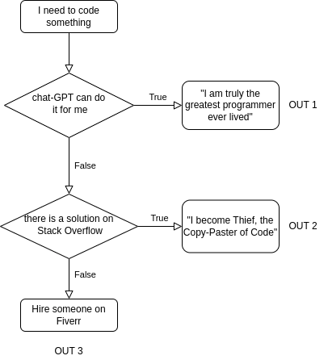

# Logic and Vectors {#log_vec}

In this chapter, we will introduce you to the basics of logic in a
computer. Computer Logic is related in its own way to the branch of
mathematical logic, in particular with the branch of Boolean algebra.
And if truth is something elusive in the philosophical discourse, in
Boolean algebra it is well defined, as the $\land, \ \lor, \lnot$ logic
operators are. If you're used to these, for the rest of this chapter, we
will use a different notation for these three symbols: `AND`, `OR` and
`NOT`.

In programming, logic is essential, as it allows us to create and
manipulate expressions and statements that can be evaluated as true or
false. In this way logic enables us to control the flow and structure of
our programs, and to perform various operations and calculations on
data.

## Comparisons

Before we start with logic, we should cover what *comparison* is. I
mean, we can again philosophize about it, but pulling out the Oxford
English Dictionary, "[Comparison is ] the action, or an act, of
comparing, likening, or representing as similar: see compare." If we
pull out the definition of *compare,* we simply get "To liken". The
concept of comparison is inherit in human existence, as it's the concept
of what `TRUE` is, (Kierkegaard lost his mind finding out that there's
not a way that two things are the same, that truth is subjective, and
that please do not compare people, that is not nice).

{width="495"}

Anyway, in programming, comparison is the process of examining two or
more objects or values and determining their relationship or difference.
Comparison can be used for various purposes, such as checking the
validity of an input, showing that two variables contain the same item,
or most importantly to control the flow of a program (later with this).
For now, let's focus on how to compare objects and values in both R and
Python, and how to use the results of comparison in your programs.

First, let's see how to check for equality in R and Python. Equality
means that two objects or values are exactly the same in every aspect.
To check for equality, we use the operator `==`, which returns `TRUE` if
the objects or values are equal, and `FALSE` if they are not. As you
will see, R uses uppercase letters for `TRUE` and `FALSE`, while
Python starts with a capital letter and uses lower case for the remaining letters, e.g. `True` and `False`.

For example, we can compare two strings, two integers, or two doubles,
as shown below:

::: {style="display: grid; grid-template-columns: 1fr 1fr; grid-column-gap: 10px;"}
<div>

**R**

```{r}
# Comparing two strings
"Hello" == "Hello"

"Hello" == "hello"


# Comparing two integers
2 == 2

2 == 3


# Comparing two reals
3.14 == 3.14

3.14 == 3.1415

```

</div>

<div>

**python**

```{python}
# Comparing two strings
"Hello" == "Hello"

"Hello" == "hello"


# Comparing two integers
2 == 2

2 == 3


# Comparing two reals
3.14 == 3.14

3.14 == 3.1415

```

</div>
:::

From these examples, we can notice how the computer is, indeed, very
strict with the definition of *equality.* Two things might seem similar,
or likely to be the same, but they are not.

Note that the comparison is case-sensitive, meaning that uppercase and
lowercase letters are considered different. Also note that the
comparison is precise, meaning that even a small difference in the
decimal places can make two numbers unequal. Numbers with decimal places and fractional numbers, in computing are called *floating precision numbers (floats)*. Floats are a way of representing real numbers in computer systems. They are designed to handle a wide range of values, from extremely small to extremely large, with fractional components.

Try adding more decimals to the above examples, and see how far you can get until you get two same
numbers! The amount of decimal places in floats *is at the basis of
precision* and how comparisons of floats are made will affect your
programs. The precision of a floating-point number is determined by the number of significant digits that it can represent: double-precision floats, the defaults in R and python, can represent about 16 decimal digits of precision. Albeit systems are in place to avoid numerical errors for smaller numbers, **be careful when you compare two floats** and try to avoid comparing two floating point numbers to see if they are equal. Instead you could see if the discrepancy between them is less than some small, positive number (see later to how to check less than).

#### Exercise

-   Try to run the comparison `1e5/(1e5 + 1e-16) == 1` and see what happens.
-   The expression `0.1 + 0.3 == 0.4` gives `TRUE`, but `0.1 + 0.2 + 0.3 == 0.6` evaluates to `FALSE`. Why?

Similar to equality, we can check for inequality. Inequality means that
two objects or values are not exactly the same in every aspect. To check
for inequality, we use the operator `!=`, which returns `TRUE` if the
objects or values are not equal, and `FALSE` if they are. As earlier:

::: {style="display: grid; grid-template-columns: 1fr 1fr; grid-column-gap: 10px;"}
<div>

**R**

```{r}
# Comparing two strings
"Hello" != "Hello"

"Hello" != "hello"


# Comparing two integers
2 != 2

2 != 3


# Comparing two doubles
3.14 != 3.14

3.14 != 3.1415

```

</div>

<div>

**python**

```{python}
# Comparing two strings
"Hello" != "Hello"

"Hello" != "hello"


# Comparing two integers
2 != 2

2 != 3


# Comparing two doubles
3.14 != 3.14

3.14 != 3.1415

```

</div>
:::

As mentioned above, we can also compare the content of variables. As we
learned last week, a variable is a name that refers to a value or an
object that is stored in the memory, so by comparing variables we
compare the value they refer to. For example, we can assign the string
`"Hello"` to the variable `x` in both languages, as shown below:

::: {style="display: grid; grid-template-columns: 1fr 1fr; grid-column-gap: 10px;"}
<div>

**R**

```{r}
# Assigning a string to a variable
x <- "Hello"
```

</div>

<div>

**python**

```{python}
# Assigning a string to a variable
x = "Hello"
```

</div>
:::

And we can then use the same operators as before, `==` for equality and
`!=` for inequality. For example, we can compare the variable `x` with
another string, another variable, or itself, as shown below:

::: {style="display: grid; grid-template-columns: 1fr 1fr; grid-column-gap: 10px;"}
<div>

**R**

```{r}
# Comparing a variable with a string
x == "Hello"

x == "hello"


# Comparing a variable with another variable
y <- "World"
x == y

y <- "Hello"
x == y


# Comparing a variable with itself
x == x

```

</div>

<div>

**python**

```{python}
# Comparing a variable with a string
x == "Hello"

x == "hello"


# Comparing a variable with another variable
y = "World"
x == y

y = "Hello"
x == y


# Comparing a variable with itself
x == x

```

</div>
:::

In addition to equality and inequality, we can also compare the
magnitude or the order of two values or objects. This is especially
useful in computational maths, as we often need to check if a value is
within a certain range, or if a value satisfies a certain condition. To
compare the magnitude or the order of two values or objects, we use the
following operators:

-   Greater than (`>`): This operator returns `TRUE` if the left operand
    is larger than the right operand, and `FALSE` otherwise. For
    example, `3 > 2` returns `TRUE`, but `2 > 3` returns `FALSE`.
-   Less than (`<`): This operator returns `TRUE` if the left operand is
    smaller than the right operand, and `FALSE` otherwise.
-   Greater than or equal to (`>=`): This operator returns `TRUE` if the
    left operand is larger than or equal to the right operand, and
    `FALSE` otherwise. For example, `3 >= 2` and `3 >= 3` both return
    `TRUE`, but `2 >= 3` returns `FALSE`.
-   Less than or equal to (`<=`): As above, this operator returns `TRUE`
    if the left operand is smaller than or equal to the right operand,
    and `FALSE` otherwise.

The comparison is going to be consistent with the equality and
inequality operators, meaning that if `x == y`, then `x >= y` and
`x <= y` are both `TRUE`, and if `x != y`, then either `x > y` or
`x < y` is `TRUE`.

As an exercise, try to compare two integers, two doubles, or two
variables, as done above, but with the inequality operators, and see the
result.

In the next section, we will introduce you to another important aspect
of logic: logical arithmetic. Logical arithmetic is the process of
combining and manipulating logical values, such as `TRUE` and `FALSE`,
using logical operators, such as `AND` and `OR`. Logical arithmetic can
be used for various purposes, such as creating complex conditions,
testing multiple hypotheses, or performing set operations.

## Logical Arithmetic

This might seem easy if you already have a background in logic, but even
if you haven't, the following paragraphs should cover all the necessary
concepts that you will need for programming.

Logical arithmetic is the process of combining and manipulating logical
values, `TRUE` and `FALSE`, which are *logic operands*, using the
*logical operators* `AND` and `OR` or `NOT`.

Let's start from `AND` and `OR`:

-   The `AND` operator returns `TRUE` if both operands are `TRUE`, and
    `FALSE` otherwise.

-   The `OR` operator returns `TRUE` if either or both operands are
    `TRUE`, and `FALSE` otherwise.

-   The `NOT` operator returns the opposite of the operand, e.g. `NOT TRUE` gives `FALSE`.

We can use the `AND` and `OR` operators to combine two logical values,
such as `TRUE` and `FALSE`, as shown below:

::: {style="display: grid; grid-template-columns: 1fr 1fr; grid-column-gap: 10px;"}
<div>

**R**

```{r}
# Using the AND operator
TRUE & TRUE

TRUE & FALSE

FALSE & TRUE

FALSE & FALSE


# Using the OR operator
TRUE | TRUE

TRUE | FALSE

FALSE | TRUE

FALSE | FALSE

```

</div>

<div>

**python**

```{python}
# Using the AND operator
True and True

True and False

False and True

False and False


# Using the OR operator
True or True

True or False

False or True

False or False

```

</div>
:::

The syntax and the output are very similar in both languages, except that R uses `AND` and `OR` for `AND` and `OR`, while Python uses `and` and `or`. More formally, we can use a table to show
all the possible outcomes of the `AND` and `OR` operators. Let's say
that $a, \ b$ are our operands, then:

| $a$   | $b$   | $a$ AND $b$ | $a$ OR $b$ |
|-------|-------|-------------|------------|
| TRUE  | TRUE  | TRUE        | TRUE       |
| TRUE  | FALSE | FALSE       | TRUE       |
| FALSE | TRUE  | FALSE       | TRUE       |
| FALSE | FALSE | FALSE       | FALSE      |

The table has four rows, corresponding to the four
possible combinations of the operands a and b. Again, the table is easy
to build, as it shows a AND b is only TRUE when both a and b are TRUE, a
OR b is only FALSE when both a and b are FALSE.

### Precendence of operators

In logical operations, as in general algebra, the precedence of
operators determines the order in which operations are performed:

1.  **Logical NOT**: This operator has the highest precedence and is
    performed first
2.  **Logical AND**: This operator has the next highest precedence after
    Logical NOT
3.  **Logical OR**: This operator has lower precedence than Logical
    AND

So, in an expression without parentheses, the NOT operation is performed
first, followed by the AND operation, and finally the OR operation.

For example, in the expression `p or NOT q AND r` is `p OR ((NOT q) AND r)`, the operations would
be performed in the following order:

1.  `NOT q` is performed first due to the highest precedence of `NOT`.
2.  Then, `(NOT q) AND r` is performed due to the next highest precedence
    of `AND`.
3.  Finally, `((NOT q) AND r) OR p` is performed due to the lowest
    precedence of `OR`.

Parentheses can be used to change this order. For example, in the
expression `p AND (q OR r)`, the operation `q OR r` is performed first due
to the parentheses, even though `AND` has lower precedence than `OR`.

For example, consider the following expression:

`TRUE OR TRUE AND FALSE`

Without parentheses, in this expression the `AND` operator has higher
precedence than the `OR` operator, so it is evaluated first. The result
is then combined with the `OR` operator. The expression is equivalent
to:

`TRUE OR (TRUE AND FALSE)`

However, if we use parentheses to group the operands differently, we can
change the order of evaluation and the result of the expression. If we
use parentheses to group the first and the last operands, we get:

`(TRUE OR TRUE) AND FALSE`

The value of this expression is in fact `FALSE`. Now, the `OR` operator
is evaluated first, giving `TRUE` and the result is then combined with
the `AND` operator, giving `FALSE`.

#### Exercise

To test your understanding of logical arithmetic, try to find what is
the value of:

-   `TRUE OR TRUE AND FALSE`?
-   `FALSE OR FALSE AND TRUE`?
-   `(TRUE AND FALSE) OR (FALSE AND TRUE)`?
-   `(TRUE OR TRUE) AND FALSE`?
-   `(TRUE OR FALSE) AND (FALSE OR TRUE)`?

You should use the console in R or Python to check your answers. You can
review the table and the examples above, and try to understand the logic
behind each expression.

## Flow

Another important aspect of logic is flow. Flow is the order and
direction in which the instructions of a program are executed **and is
at the base of an algorithm**.

Normally, a computer program, has a start, it will do something, and
then terminate (return an output). This is called the *flow* of a
program. Now, of course, to control the flow, you need a mechanism that
checks on the state of your program, and performs an action based on the
state in which you are. Surprisingly enough, we run programs in every
day tasks too. When driving down from Glasgow to London, we need to
check where we are, and turn the steering wheel accordingly in such a
way that our car points towards South. When doing the laundry in a
laundrette, we first check the amounts of money we have, and then, if we
have enough, load up the washing machine, if we don't, well, we need to
get some more. Or say, for example, that you need to code something,
maybe for an assignment :) What you might end up doing, is the
following:



**I have to remark that this was a joke:** remember that if you cheat at
this stage with programming you are just cheating yourself.

More formally, in computer programs, flow can be controlled by using
*conditional statements*, such as if - else if - else. Conditional
statements allow us to execute different blocks of code depending on the
result of a logical expression or condition. For example, we can use
conditional statements to perform different actions based on the value
of a variable, the input of the user, or the outcome of a calculation.

### The if-then-else statement

The simplest form of a conditional statement is the if statement. The if
statement checks a single condition, and executes a block of code if the
condition is true. For example, we can use an if statement to print a
message if a variable is positive, as shown below:

::: {style="display: grid; grid-template-columns: 1fr 1fr; grid-column-gap: 10px;"}
<div>

**R**

```{r}
# Assigning a value to a variable
x <- 10

# Using an if statement
if (x > 0) {
  print("x is positive")
}
# x is positive
```

</div>

<div>

**python**

```{python}
# Assigning a value to a variable
x = 10

# Using an if statement
if x > 0:
  print("x is positive")

# x is positive
```

</div>
:::

Concerning syntax, e.g. the way we write the code:

-   To enclose the condition that is checked by the if statement, e.g.
    where your logic expression goes (e.g. the block of code that
    evaluates either to `TRUE` or `FALSE):`

    -   R uses an `if` followed by parentheses `()`, where the condition
        goes

    -   Python has no parentheses, but has a `:` symbol to indicate that
        the condition has ended and the block of code to execute has
        started

-   To denote the block of code to execute if the condition is true:

    -   R uses curly braces `{}` to enclose the block of code that is
        executed if the condition is true. All code that is relative to
        the if condition needs to be within these brackets

    -   Python, uses indentation to delimit the block of execution. All
        code that needs to execute needs to be indented at the same
        level. Indentation in Python is achieved either with a tab
        (recommended), or with 4 spaces. NOTE: An additional empty line without identation 
        (e.g. a simple white space) is needed below the if- block, 
        otherwise Python won't be able to understand that the block has ended. 
        Generally, for this reason, it's a good habit to save your Python scripts
        always with an empty line at the end

The if statement only executes the block of code if the
condition is true, and does nothing otherwise. This means, that if the
condition is `FALSE`, the program will simply skip the code within the
block, as if it never existed.

Sometimes, we may want to check more than one condition, and execute
different blocks of code for each condition. For this, we can use the
if - else if - else statement. The if - else if - else statement checks
multiple conditions in order, and executes the first block of code that
corresponds to a true condition. If none of the conditions are true, the
else block of code is executed. For example, we can use an if - else
if - else statement to print a message based on the sign of a variable,
as shown below:

::: {style="display: grid; grid-template-columns: 1fr 1fr; grid-column-gap: 10px;"}
<div>

**R**

```{r}
# Assigning a value to a variable
x <- 10

# Using an if - else if - else statement
if (x < 0) {
  print("x is negative")
} else if (x == 0) {
  print("x is zero")
} else {
  print("x is positive")
}
# x is positive
```

</div>

<div>

**python**

```{python}
# Assigning a value to a variable
x = 10

# Using an if - else if - else statement
if x < 0:
  print("x is negative")
elif x == 0:
  print("x is zero")
else:
  print("x is positive")
# x is positive
```

</div>
:::

Concerning syntax, R uses `else if` and Python uses `elif` for the second
condition. The order of the conditions is important, as only
the first condition that is true is executed. If none of the conditions
are true, the else block is executed.

Sometimes, we may want to check two or more independent conditions, and
execute different blocks of code for each condition. For this, we can
use two or more if statements one after another. This is different from
using an if - else if - else statement, as each if statement is
evaluated separately, and more than one block of code can be executed.
For example, we can use two if statements to print a message based on
the divisibility of a variable by 2 and 3, as shown below:

::: {style="display: grid; grid-template-columns: 1fr 1fr; grid-column-gap: 10px;"}
<div>

**R**

```{r}
# Assigning a value to a variable
n <- 12

# Using two if statements
if (n %% 2 == 0) {
  print("n is divisible by 2")
}
if (n %% 3 == 0) {
  print("n is divisible by 3")
}
# n is divisible by 2
# n is divisible by 3
```

</div>

<div>

**python**

```{python}
# Assigning a value to a variable
n = 12

# Using two if statements
if n % 2 == 0:
  print("n is divisible by 2")
if n % 3 == 0:
  print("n is divisible by 3")
# n is divisible by 2
# n is divisible by 3
```

</div>
:::

In R the modulo operator is `%%`, while Python
uses `%`. Both if statements are executed, as both conditions
are true. If we used an if - else if - else statement instead, only the
first condition would be executed, and the second condition would be
ignored.

### Nesting if-statements

Sometimes, we may want to check a condition within another condition,
and execute different blocks of code for each combination. For this, we
can use a nested if statement. A nested if statement is an if statement
inside another if statement. A nested if statement can have multiple
levels of nesting, and can also include else if and else blocks. For
example, we can use a nested if statement to print a message based on
the value and the sign of a variable, as shown below:

::: {style="display: grid; grid-template-columns: 1fr 1fr; grid-column-gap: 10px;"}
<div>

**R**

```{r}
# Assigning a value to a variable
x <- -10

# Using a nested if statement
if (x > 0) {
  if (x > 10) {
    print("x is positive and greater than 10")
  } else {
    print("x is positive and less than or equal to 10")
  }
} else {
  if (x < -10) {
    print("x is negative and less than -10")
  } else {
    print("x is negative and greater than or equal to -10")
  }
}
```

</div>

<div>

**python**

```{python}
# Assigning a value to a variable
x = -10

# Using a nested if statement
if x > 0:
  if x > 10:
    print("x is positive and greater than 10")
  else:
    print("x is positive and less than or equal to 10")
else:
  if x < -10:
    print("x is negative and less than -10")
  else:
    print("x is negative and greater than or equal to -10")
```

</div>
:::

Concerning syntax, you can now see the double indentation in the python
code. The nested if statement checks the outer condition first (x being
positive), and then checks the inner condition if the outer condition is
true (x being greater then 10). Note also that the nested if statement
can have multiple levels of nesting, and can also include else if and
else blocks.

In the next section, we will introduce you to a fun and popular game
that involves logic and flow: FizzBuzz.

### FizzBuzz

FizzBuzz is a game that tests your ability to use logic and flow in
programming. The rules of the game are simple: given a number, print
"Fizz" if the number is divisible by 3, print "Buzz" if the number is
divisible by 5, print "FizzBuzz" if the number is divisible by both 3
and 5, and print the number itself otherwise. For example, given the
number 15, print "FizzBuzz", given the number 9, print "Fizz", given the
number 10, print "Buzz", and given the number 7, print 7.

To play FizzBuzz in R or Python, we can use a variable to store the
number, and then use an if - else if - else statement to check the
conditions and print the output, as shown below:


::: {style="display: grid; grid-template-columns: 1fr 1fr; grid-column-gap: 10px;"}
<div>

**R**

```{r}
# Assigning a value to a variable
n <- 15

# Playing FizzBuzz
if (n %% 3 == 0 & n %% 5 == 0) {
  print("FizzBuzz")
} else if (n %% 3 == 0) {
  print("Fizz")
} else if (n %% 5 == 0) {
  print("Buzz")
} else {
  print(n)
}
```

</div>

<div>

**python**

```{python}
# Assigning a value to a variable
n = 15

# Playing FizzBuzz
if n % 3 == 0 and n % 5 == 0:
  print("FizzBuzz")
elif n % 3 == 0:
  print("Fizz")
elif n % 5 == 0:
  print("Buzz")
else:
  print(n)
```

</div>
:::


The Fizzbuzz condition uses the modulo `%%` (`%` in Python) operator. This, recall,
returns the remainder of the division. The logical and operator
returns true if both operands are true. Note also that the order of the
conditions is important, as we need to check the divisibility by both 3
and 5 first, and then we check the divisibility by 3 or 5 separately.

To see how FizzBuzz works, try to replace the value of the
variable `n` with different numbers, and see what the output is. For
example, try `n <- 45` in R, or `n = 45` in Python, and see what
happens!

#### Exercise: Skibbidifizzbuzz

As an exercise, try to write a variation of FizzBuzz, called
Skibbidifizzbuzz, where the rules are the same as above, but now you
have to add "Skibbidi" if the number is divisible by 2. For example,
given the number 12, print "SkibbidiFizz", given the number 20, print
"SkibbidiBuzz", given the number 30, print "SkibbidiFizzBuzz", and given
the number 8, print "Skibbidi".

**HINT** To write a quick solution, you will need to collate strings. This means that if we have the strings `"a"`, `"b"`, collated those will be `"ab"`, and if we have `"a"`, `"b"`, `"b"`, `"a"`, collated they will read `"abba"` (mammamia).

To collate strings in R and python:

::: {style="display: grid; grid-template-columns: 1fr 1fr; grid-column-gap: 10px;"}
<div>

**R**

```{r}
# collate strings
paste0("a", "b", "b", "c")

# you can also collate strings saved in variables
string_in_a_variable <- "mia"
paste0("mamma", string_in_a_variable)
```

</div>

<div>

**python**

```{python}
# collate strings
"a" + "b" + "b" + "c"

# you can also collate strings saved in variables
string_in_a_variable = "mia"
"mamma" + string_in_a_variable
```

</div>
:::

Which strings could you collate for "SkibbidiFizzBuzz"?


## Vectors

We now introduce the first (and the most fundamental!) data structures in programming: vectors. Vectors, as in maths, are ordered collections of values that can be manipulated as a single unit. All elements in a vector need to be homogeneous, e.g. of the same type, for example we cannot have a vector with a string and an integer together. Later on, when we will introduce matrices, we will find out that these are nothing but a collection of vectors (vectors of vectors).
And we, in maths, know how powerful linear algebra is: through vectors, we can store, process, and analyze large amounts of numerical data efficiently and elegantly.

### Creating vectors
We will now see how to create and use vectors in R and Python, and how to perform element wise operations on vectors.

To create a vector in R, we use the `c` function, which stands for concatenate. The `c` function takes one or more values as arguments, and returns a vector that contains those values. For example, we can create a vector that contains the numbers 1, 2, and 3, as shown below:

```{r}
# Creating a vector in R
x <- c(1, 2, 3)
x
```

To create a vector in Python, we use the `array` function from the `numpy` module, which stands for numerical Python. While technically the Python array is not the same of an R vector (as you can have arrays of arrays, which is a similar structure to a matrix), we will use the Python array interchangeably for now, as they behave very similar and they fulfill similar roles.
The first thing to use arrays in python, is to import the `numpy` array. The `numpy` module is a library that provides various tools and functions for working with numerical data and scientific computing. The `array` function takes a list as an argument, and returns an array that contains the elements of the list. A list, in Python, is another, built-in structure to represent and ordered set of data, but it comes from the original python, was designed with different aims, and comes with a lot less powers then the numpy `array`. So for now, please stick to the following when you create vectors in python.
We can create an array that contains the numbers 1, 2, and 3, as shown below:

```{python}
# Importing the numpy module
import numpy as np

# This is a simple python list
[1, 2, 3]

# Creating an array in Python
x = np.array([1, 2, 3])
x
```

We need to import the `numpy` library before using the `array` function, and we use the alias `np` to refer to the module. Therefore, before we proceed it is probably a good time to introduce what a library is. 

#### Libraries
A library is a collection of code that provides predefined functions, classes, variables, and other resources that can be used by other programs. Libraries can save time and effort by allowing programmers to reuse existing code and avoid writing everything from scratch. Libraries can also enhance the functionality and the performance of a programming language by offering specialized tools and features that are not built-in.

For example, the numpy library is a library that provides various tools and functions for working with numerical data and scientific computing. The numpy library is not part of the standard Python language, but it can be installed and imported by using the import statement. The import statement tells Python to load the library and make it available for use. The import statement can also assign an alias or a nickname to the library, such as np, to make it easier to refer to the library in the code.

Normally, one has to reference import numpy as np only at the beginning of the script, before using any of the functions or resources from the numpy library:

**python**

```{python}
# this is the math library from past week!
import math
# Importing the numpy library and assigning an alias
import numpy as np

#     rest of your script!    #
# ~~~~~~~~~~~~~~~~~~~~~~~~~~~ # 
```
This way, Python knows where to find the functions that is needed, and the programmer does not have to repeat the import statement every time.

R has libraries too, those are imported via the command `library`. For example, at one point, we will be calling the tidyverse library, that is a collection of functions for modern R:

**R**

```{r}
library(tidyverse)
```

We call these at a later time as R has already plenty of scientific computing functions and structures built in.

#### Creating sequences

One of the common ways to create vectors or arrays is to use sequences. Sequences are ordered collections of values that follow a certain pattern or rule. Sequences can be useful for generating data, plotting, or creating loops, as we will see later on.
As you will see, here the syntax is going to be a bit different in each language, as R uses functions such `:` or `seq` and Python uses `np.arange` or `np.linspace` to create and initialize vectors. We will see how to create sequences of integers, any sequence of equally spaced numbers, and finally, how to initialize an empty vectors with all same values.

**To create a sequence of integers in R**, we can use the colon operator `:`, in Python, we can use the `arange` function from `numpy`. Both take two integers as arguments, and returns a vector or an array that contains all the integers from the first argument to the second argument, with a step size of 1. For example, we can create a sequence of integers from -5 to 10, as shown below:

::: {style="display: grid; grid-template-columns: 1fr 1fr; grid-column-gap: 10px;"}
<div>

**R**

```{r}
# Creating a sequence of integers from -5 to 10
x <- -5:10
x
```

</div>

<div>

**python**

```{python}
# Creating a sequence of integers from -5 to 10
x = np.arange(-5, 11)
x
```


</div>
:::

Differently from R, `arange` requires the second argument to be one step more than the desired end point of the sequence, so if we want to go up to 10, we need to have the second argument to be 11.

**To create any sequence**, we can use the `seq` function in R, and the `arange` or `linspace` functions in Python. For example, we can create a sequence of numbers from 0 to 1, with a step size of 0.1, or with a length of 11, as shown below:

::: {style="display: grid; grid-template-columns: 1fr 1fr; grid-column-gap: 10px;"}
<div>

**R**

The `seq` function in R can take named arguments, such as `from`, `to`, `by`, or `length.out`, to specify the parameters of the sequence. 
```{r}
# Creating a sequence of numbers from 0 to 1, with a step size of 0.1
x <- seq(from = 0, to = 1, by = 0.1)
x

# Creating a sequence of numbers from 0 to 1, with a length of 11
y <- seq(from = 0, to = 1, length.out = 11)
y
```

</div>

<div>

**python**

The `np.arange` function in Python, with an additional argument, will indicate the step size. Again, in this case, arange requires the second argument to be one step more than the desired end point of the sequence. The `np.linspace` function, instead, will create a vector of a desired length (11 elements) of equally spaced elements. It requires the third argument to be the desired length of the sequence.
```{python}
# Creating a sequence of numbers from 0 to 1, with a step size of 0.1
x = np.arange(0, 1.1, 0.1)
x

# Creating a sequence of numbers from 0 to 1, with a length of 11
y = np.linspace(0, 1, 11)
y
```

</div>
:::

**Empty vectors.** Lastly, there might be some cases where we have to create an empty vector or array in R and Python. An empty vector or array can be useful for initializing a vector or array that will be filled with values later, as we will see in the next chapters. For this, we can use the `vector` or `array` function, respectively, and specify the type and the length of the vector or array. An empty vector or array is a vector or array that contains no values, but has a predefined type and length. For example, we can create an empty vector or array of type numeric and length 5, as shown below:

::: {style="display: grid; grid-template-columns: 1fr 1fr; grid-column-gap: 10px;"}
<div>

**R**

```{r}
# Creating an empty vector of type numeric and length 5
x <- vector(mode = "numeric", length = 5)
x
```

</div>

<div>

**python**

```{python}
# Creating an empty array of type numeric and length 5
x = np.empty(5, dtype = "float")
x
```

</div>
:::

Note that the `vector` function in R takes the `mode` argument to specify the type of the vector, and the `length` argument to specify the length of the vector. The `np.empty` function in Python takes the the length of the array as the first argument, and the `dtype` argument to specify the type of the array, e.g. integer, float, Python object, etc.

### Modifying vectors

One of the main advantages of using vectors or arrays is that we can perform elementwise operations on them. Elementwise operations are operations that are applied to each element of the vector or the array individually, and return a new vector or array that contains the results. Elementwise operations preserve the shape and the length of the vector or the array, meaning that the resulting vector or array has the same number of elements as the original vector or array.

For example, we can add, subtract, multiply, or divide a vector or an array by a scalar (which is a single value):

::: {style="display: grid; grid-template-columns: 1fr 1fr; grid-column-gap: 10px;"}
<div>

**R**

```{r}
x <- 1:5

# Raw vector
x

# Adding a scalar to a vector
x + 1

# Subtracting a scalar from a vector
x - 1

# Multiplying a vector by a scalar
x * 2

# Dividing a vector by a scalar
x / 2
```

</div>

<div>

**python**

```{python}
x = np.arange(1, 6)

# Raw vector
x

# Adding a scalar to an array
x + 1

# Subtracting a scalar from an array
x - 1

# Multiplying an array by a scalar
x * 2

# Dividing an array by a scalar
x / 2
```

</div>
:::

The element wise operations are performed by using the same arithmetic operators as the past chapter, such as `+`, `-`, `*`, and `/`.

#### Functions and algebra with vectors {#vec-func}

But we can do more! One of the benefits of using vectors or arrays is that we can apply a whole function, such as `sin(.)` or `log(.)`, on the entire vector elementwise. This means that the function is applied to each element of the vector individually, and returns a new vector that contains the results. For example, let's apply the `sin(.)` function, which calculates the sine of an angle in radians, on a vector that contains the angles $0$, $\pi/2$, $\pi$, and $3 \pi/2$:

::: {style="display: grid; grid-template-columns: 1fr 1fr; grid-column-gap: 10px;"}
<div>

**R**

```{r}
# Creating a vector of angles in radians
x <- c(0, pi/2, pi, 3*pi/2)
x

# Applying the sin function on the vector elementwise
sin(x)
```

</div>

<div>

**python**

```{python}
# Creating an array of angles in radians
x = np.array([0, np.pi/2, np.pi, 3*np.pi/2])
x

# Applying the sin function on the array elementwise
np.sin(x)
```

</div>
:::

The function is applied to each element of the vector or the array individually, and returns a new vector or array that contains the results. Note also that by default the results are in scientific notation.

We can also apply many other functions! Go back to last week introduction and see how many of the functions we introduced already, such as `log()`, run elementwise on vectors.

And as we can sum two scalars, another benefit of using vectors or arrays is that we can do elementwise product and sum of two vectors. If two vectors or arrays are the same length, this will return a new vector or array that contains the elementwise results of your desired operation:

::: {style="display: grid; grid-template-columns: 1fr 1fr; grid-column-gap: 10px;"}
<div>

**R**

```{r}
# Creating two vectors of the same length
x <- 1:4
y <- 5:8

# Doing elementwise product of two vectors
x * y

# Doing elementwise sum of two vectors
x + y
```

</div>

<div>

**python**

```{python}
# Creating two arrays of the same length
x = np.arange(1, 5)
y = np.arange(5, 9)

# Doing elementwise product of two arrays
x * y

# Doing elementwise sum of two arrays
x + y
```

</div>
:::

The elementwise product and sum are performed by using the same arithmetic operators as before, such as `*` and `+`. Note also that the elementwise product and sum preserve the shape and the length of the vectors or the arrays, meaning that the resulting vector or array has the same number of elements as the input vectors or arrays.

#### Doing the dot product of two vectors

Lastly, one important operation that we can do with vectors or arrays is the dot product, and this will be super useful to you in the future as you will deal with applications in linear algebra, geometry, and machine learning. Recall that the dot product takes two vectors or arrays of the same length, and returns a single number that is the sum of the elementwise products of the vectors or arrays. For example, the dot product of the vectors `[1, 2, 3, 4]` and `[5, 6, 7, 8]` is `1*5 + 2*6 + 3*7 + 4*8 = 70`.

To calculate the dot product of two vectors or arrays in R and Python, we use the following functions:

- In R, we use the `%*%` operator, which performs matrix multiplication. If the input vectors are one-dimensional, the matrix multiplication is equivalent to the dot product. For example, we can calculate the dot product of two vectors, as shown below:

```{r}
# Doing the dot product of two vectors
x %*% y
```

- In Python, we use the `dot` function from the `numpy` module, which performs the dot product of two arrays. For example, we can calculate the dot product of two arrays, as shown below:

```{python}
# Doing the dot product of two arrays
np.dot(x, y)
```

The syntax are quite different in both languages, as R uses a special operator and Python uses a function from `numpy`. Note also that the dot product requires the input vectors or arrays to have the same length, otherwise it will produce an error.

We will cover how to do algebra with Python and R in the next chapters. 

## Accessing vectors

We will see now how to access the elements of a vector. Accessing the elements of a vector or an array is important as it allows us to select, extract and even modify specific values or subsets of values from a vector.

### Checking the size and dimension of a vector

Before we access the elements of a vector or an array, it is useful to know the size and the dimension of the vector or the array. **The size** of a vector or an array is the number of elements that it contains. **The dimension**, on the other hand, is the number of axes or directions that it has. For example, a one-dimensional vector or array has only one axis or direction, and a two-dimensional vector or a matrix will have two axes or directions, such as rows and columns.

To check the size and the dimension of a vector or an array in R and Python, we can use the following functions:

In R, we can use the `length` function to get the size of a vector, and the `dim` function to get the dimension of a vector.

**R**

```{r}
# Creating a vector of numbers
x <- 1:4

# Checking the size of the vector
length(x)

# Checking the dimension of the vector
dim(x)
```

The `length` function returns the number of elements in the vector, which is 4, and the `dim` function returns `NULL`, which means that the vector has no dimension. This is because a vector in R is always one-dimensional, and the `dim` function is more useful for higher-dimensional objects, such as **matrices** or **data frames**. We will learn about these structures later on, so do not worry about it for now. 

In Python, we can use the `size` attribute or the `len` function to get the size of an array, and the `shape` attribute or the `ndim` attribute to get the dimension of an array.

**python**

```{python}

# Creating an array of numbers
x = np.arange(1, 4)

# Checking the size of the array
x.size
# 4
len(x)
# 4

# Checking the dimension of the array
x.shape
# (4,)
x.ndim
# 1
```

The `size` attribute and the `len` function both return the number of elements in the array, which is 4, and the `shape` attribute and the `ndim` attribute both return the dimension of the array, which is 1. The `shape` attribute returns a *tuple*, that contains the length of each axis of the array, and the `ndim` attribute returns an integer that represents the number of axes of the array. Note that a one-dimensional array in Python has a shape of `(n,)`, where `n` is the size of the array, and a comma is needed to indicate that it is a tuple. A *tuple* is another one dimentional structure in Python, but for now you can treat it as just a couple of numbers.

### Accessing Vector Elements

We can access the elements of the vector or the array by using indexing. Indexing is a way of referring to a specific element or a subset of elements of a vector or an array by using their position or location. Every element of a vector, in fact, has an index, that is a number that indicates its order in the vector.

Indexing the elements of a vector or an array in R and Python has **a fundamental difference** that you need to be extremely careful about. R uses what is called *one-based* indexing, while Python uses *zero-based* indexing. This means that R starts counting the elements of a vector or an array from 1, e.g. the first element starts at one, while Python starts counting the elements of a vector or an array from 0. This difference can cause confusion and errors if you are not aware of it, so you need to pay attention to the indexing system of each language:

::: {style="display: grid; grid-template-columns: 1fr 1fr; grid-column-gap: 10px;"}
<div>

**R**

```{r}
# The index will be
    #  1  2  3  4
x <- c(1, 2, 3, 4)
```

</div>

<div>

**python**

```{python}
# The index will be:
           #  0  1  2  3
x = np.array([1, 2, 3, 4])
```

</div>
:::


Let's see how to practically access the single elements by using indexing.

- In R, the elements of a vector are indexed from 1 to the size of the vector, and we can use the square brackets `[ ]` to access them by using their index.

```{r}
# Accessing the first element of the vector
x[1]

# Accessing the last element of the vector
x[length(x)]

# Accessing any element of the vector
x[3]
```

The first element of the vector has an index of 1, the last element of the vector has an index of the size of the vector, which is 4. The square brackets `[ ]` are used to access the elements of the vector: therefore the index must be an integer between 1 and the size of the vector, otherwise it will produce an error or a missing value.

- In Python, the elements of an array are indexed from 0 to the size of the array minus 1, and we can use the square brackets `[ ]` to access them by using their index.

```{python}
# Accessing the first element of the array
x[0]

# Accessing the last element of the array
x[len(x) - 1]

# Accessing any element of the array
x[2]
```

In Python, the first element of the array has an index of 0, the last element of the array has an index of the size of the array minus 1, which in our case is 3. The square brackets `[ ]` are used to access the elements of the array by using their index, and that the index must be an integer between 0 and the size of the array minus 1, otherwise it will produce an error or an out of bounds exception. 
Differently from R, in Python, however we can access the arrays from the back, using negative integers. Try:
```{python}
# Accessing the last element of the array
x[-1]

# Accessing the second last element of the array
x[-2]

# Accessing the first element of the array
x[-len(x)]
```

#### Accessing multiple elements at once

In addition to accessing a single element of a vector or an array, we can also access multiple elements at once by using indexing. This can be useful for selecting, modifying, or extracting specific values or subsets of values from a vector or an array. There are different ways to access multiple elements at once, depending on the criteria or the pattern that we want to use.

- To access any sequence of elements of a vector or an array, we can use sequences of integers as indices. This means we can use the colon operator `:` to create sequences of integers in R and Python, as we saw in the previous section, and use these to access and splice the first three elements, the last three elements, or even the *even-indexed* elements of a vector or an array (pun not intended).

::: {style="display: grid; grid-template-columns: 1fr 1fr; grid-column-gap: 10px;"}
<div>

**R**

```{r}
# Creating a vector of the first 6 integers
x <- 1:6

# Accessing the first three elements of the vector
x[1:3]

# Accessing the last three elements of the vector
# index is 4, 5, 6
x[(length(x) - 2):length(x)]

# Accessing the even-indexed elements of the vector
x[seq(from = 2, to = length(x), by = 2)]
```

</div>

<div>

**python**

```{python}
# Creating an array of the first 6 integers
x = np.arange(1, 7)

# Accessing the first three elements of the array
x[0:3]

# Accessing the last three elements of the array
# index is 3, 4, 5
x[(len(x) - 3):len(x)]

# Accessing the even-indexed elements of the array
x[np.arange(1, len(x), 2)]
```

</div>
:::

Recall that R uses one-based indexing and Python uses zero-based indexing. The sequences of integers for accesing the indeces are created by using the colon operator `:` or the `seq` function in R, and the `np.arange` function in Python. The sequences of integers can have different start, end, or step values, depending on the desired subset of elements. Try to experiment a bit with the start and end values of the subsets introduced above! 

- Similarly, we can use vectors or arrays of integers as indices to access multiple elements *at every location*. To do so, we will first create some vectors, and then use those vectors to access the elements of other vectors respectively. For example, we can access three elements at random of a vector or an array, as shown below:

::: {style="display: grid; grid-template-columns: 1fr 1fr; grid-column-gap: 10px;"}
<div>

**R**

```{r}
# Accessing element 2, 5 and 6 of the vector
x[c(2, 5, 6)]

# note how in this way we can shuffle order!
x[c(2, 6, 5)]
```

</div>

<div>

**python**

```{python}
# Accessing element 2, 5 and 6 of the vector
x[[1, 4, 5]]

# note how in this way we can shuffle order!
x[[1, 5, 4]]
```

</div>
:::


To access multiple elements at random of a vector or an array, we can also use vectors or arrays of booleans as indices. Vectors or arrays of booleans are collections of logical values, as introduced above, e.g. either `TRUE` or `FALSE`. In this case, it is important that the vectors or arrays of booleans have the same length as the vector or the array, and that only the elements that correspond to `TRUE` (in R) or `True` (in Python) values are selected.

::: {style="display: grid; grid-template-columns: 1fr 1fr; grid-column-gap: 10px;"}
<div>

**R**

```{r}
# boolean index vector:
#                    2                   5     6
index <- c(FALSE, TRUE, FALSE, FALSE, TRUE, TRUE)

# Accessing element 2, 5 and 6 of the vector
x[index]
```

</div>

<div>

**python**

```{python}
# boolean index vector:
#                   1                   4     5
index = [False, True, False, False, True, True]

# Accessing element 2, 5 and 6 of the vector
x[index]
```

</div>
:::

Why is this useful? Well, with this trick, we can use logical operators obtained by logical arithmetic to create vectors or arrays of booleans in R and Python. For example, we can access the elements that are greater than 3 of a vector or an array, as shown below:

::: {style="display: grid; grid-template-columns: 1fr 1fr; grid-column-gap: 10px;"}
<div>

**R**

```{r}
# Creating a vector of numbers
x <- c(1, 2, 3, 4, 5, 6)

# Accessing the elements that are greater than 3 of the vector
x[x > 3]

# Accessing even elements 
x[x %% 2 == 0]
```

</div>

<div>

**python**

```{python}
# Creating an array of numbers
x = np.array([1, 2, 3, 4, 5, 6])

# Accessing the elements that are greater than 3 of the array
x[x > 3]

# Accessing even elements 
x[x % 2 == 0]
```

</div>
:::

#### Overwriting elements of vectors

Finally, as we can overwrite variables, we can overwrite single (or multiple!) elements of a vector without modifying the entire vector. This is essentially achieved by selecting the elements of interest, and then assigning new elements to those. The replacement, of course needs to be of the same length of the elements we wish to replace. If the new values are not compatible with the type and the length of the vector, both languages will produce an error or a warning.

In R, we can use the square brackets `[ ]` to access the elements of the vector by using their index, and the left arrow `<-` to assign new values to them. For example, to overwrite the first element, the last element, and the third element:

**R**

```{r}
# Creating a vector of numbers
x <- c(1, 2, 3, 4)

# Overwriting the first element of the vector
x[1] <- 10
x

# Overwriting the last element of the vector
x[length(x)] <- 20
x

# Overwriting any element of the vector
x[3] <- 30
x
```

In Python, we can use the square brackets `[ ]` to access the elements of the array by using their index, and the equal sign `=` to assign new values to them. For example, to overwrite the first element, the last element, and third element:

**python**

```{python}
# Creating an array of numbers
x = np.array([1, 2, 3, 4])

# Overwriting the first element of the array
x[0] = 10
x

# Overwriting the last element of the array
x[len(x) - 1] = 20
x

# Overwriting any element of the array
x[2] = 30
x
```

In this code, the square brackets `[ ]` are used to access the elements of the array by using their index, and the equal sign `=` is used to assign new values to them

Note that the final vector has the three elements we accessed all changed. 
As mentioned, we can select and replace multiple elements simultaneously in a single command, look for instance at the code below. 

#### Exercise: vector fizzbuzz
You are ready to see your first complex program. Can you tell what it does?
Break down, comment and describe the following code, and adapt it do perform Skibbidifizzbuzz.

::: {style="display: grid; grid-template-columns: 1fr 1fr; grid-column-gap: 10px;"}
<div>

**R**

```{r}
x <- 1:100

fizz_index <- x %% 3 == 0
buzz_index <- x %% 5 == 0

x[fizz_index] <- "fizz"
x[buzz_index] <- "buzz"
x[fizz_index & buzz_index] <- "fizzbuzz"
x
```

</div>

<div>

**python**

```{python}
x = np.arange(1, 101, dtype=object)

fizz_index = x % 3 == 0
buzz_index = x % 5 == 0


x[fizz_index] = "fizz"
x[buzz_index] = "buzz"
x[np.logical_and(fizz_index, buzz_index)] = "fizzbuzz"
x
```

</div>
:::

Small hint: You should be careful about the type of output vector in R. You'll notice now it's a character vector. 
Python does not convert the type of vector automatically, the dtype argument is needed to ensure the vector can contain both integers and strings. Remove the dtype argument from the first line and see what happens.

### Some Useful Functions

We finish this chapter with few useful functions that work with vectors. Those will come in handy in your scientific computing endeavors, in particular towards the second part of the module, as they're all functions that are necessary to extract useful information from our vectors.

Let's start with considering a very simple quadratic function: 

$$
y = x^2 - x
$$

```{r echo=FALSE}
library(ggplot2)
quad_df <- data.frame(x = seq(-5, 5, by = 0.1)) |>
  mutate(y = x^2 - x)
ggplot(quad_df) + aes(x = x, y= y) + geom_line() + theme_minimal()
```

Now, let's say we want to evaluate this function over a sequence of values between -5 and 5 (those values plotted).  
To code this, we learned we can do simply some algebra with vector:

::: {style="display: grid; grid-template-columns: 1fr 1fr; grid-column-gap: 10px;"}
<div>

**R**

```{r}
# Create a sequence of numbers 
# from -5 to 5 with increments of 0.1
x <- seq(-5, 5, by = 0.1)

# Compute the value of x^2 - x for each
# element of x and assign it to y
y <- x^2 - x
```

</div>

<div>

**python**

```{python}
# Create a sequence of numbers 
# from -5 to 5 with increments of 0.1
x = np.arange(-5, 5.1, 0.1)

# Compute the value of x^2 - x for each
# element of x and assign it to y
y = x**2 - x
```

</div>
:::

Now that we have our $y$ values, let's see what we can get from it! See if what you see in the output matches what you see in the plot!

::: {style="display: grid; grid-template-columns: 1fr 1fr; grid-column-gap: 10px;"}
<div>

**R**

```{r}
# Find the maximum value of y
max(y)

# Find the minimum value of y
min(y)

# Find the index of the element
# in y that has the maximum value
which.max(y)

# Find the index of the element
# in y that has the minimum value
which.min(y)

# Find the minimum value of y
# (equivalent to above, why?)
y[which.min(y)]

# Check which elements of y are 
# less than 0 and return a logical vector
neg_index <- y < 0

# Find the indices of the elements
# in y that are less than 0
which(neg_index)

# print the elements in y that are less than 0
y[which(neg_index)]
```

</div>

<div>

**python**

```{python}
# Find the maximum value of y
np.max(y)

# Find the minimum value of y
np.min(y)

# Find the index of the element 
# in y that has the maximum value
np.argmax(y)

# Find the index of the element
# in y that has the minimum value
np.argmin(y)

# Find the minimum value of y
# (equivalent to above, why?)
y[np.argmin(y)]

# Check which elements of y are
# less than 0 and return a logical vector
neg_index = y < 0

# Find the indices of the elements
# in y that are less than 0
np.where(neg_index)

# print the elements in y that are less than 0
y[np.where(neg_index)]
```

</div>
:::


```{=html}
<style type="text/css">
.book .book-body .page-wrapper .page-inner {
  max-width: 1200px !important;
}
</style>
```
