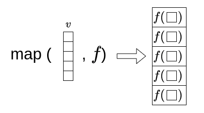
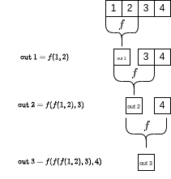
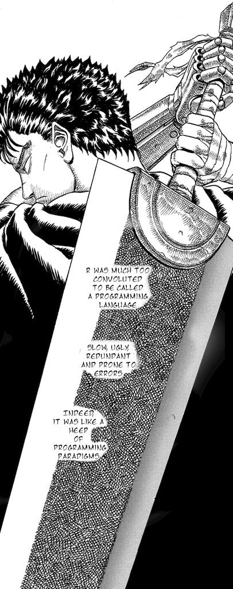

# Functional Programming and Linear Algebra {#maps_alg}

## An intro to Functional Programming {#Maps}

We have seen so far two concepts from past week on how to run functions over collections of objects (in our case vectors). From [this section](#maps_alg) we learned how to run a function on a vector, whilst last week, we learned how to implement [looping](#looping), with `for` or `while` cycle, changing things as you go. We learned, *most importantly*, that we should use the for cycle if and only if we have state. Well, this is not my personal opinion only, as a matter of fact, there's a programming philosophy called *functional programming*. Hadley, in his Advanced R book (sources in the index), gives a beautiful definition that sums up the properties of **a functional programming language**:

-   Functional languages have *first class functions*. This means that functions are the primary building blocks. In this style, you can do a lot with functions. For example, you can treat functions just like vectors: you can assign them to variables, store them in lists, pass them as arguments to other functions, create them inside functions, and even return them as the result of a function.

-   In functional languages functions are *pure*. This means that there two properties to follow:

    1.  The output of a function depends only on its inputs. This means if you call a function with the same inputs, you'll always get the same output.

    2.  A function doesn't change anything outside of it, like a *global* variable (from the global enviroment), or do something like writing to disk or displaying to the screen. These are called side-effects.

Funny enough, he quotes Stroustroup, the father of C++:

*"To become significantly more reliable, code must become more transparent. In particular, nested conditions and loops must be viewed with great suspicion. Complicated control flows confuse programmers. Messy code often hides bugs."*

--- Bjarne Stroustrup\

{width="472"}

In a way you have already written in a functional programming way from the beginning of this module, with the exception of the loops in the past chapter. However, in this chapter, we will be introducing a couple of more concepts that should get rid of for cycles for most of the times!

### Lambda Functions and Function Factories

A lambda function, also known as an anonymous function, is a function that is defined without a name, e.g. a function assigned to a variable. Lambda functions can have any number of arguments but **only one expression**, which is immediately evaluated and returned.

-   **In R**, we assign functions to variables by default (one of the reasons I prefer it as a language). Hence the only difference between a function and a lambda function (as you will see), is that a lambda function is only one expression long, so we don't need to use the brackets `{}`. **Recently from version 4.1**, the lambda notation has been replaced by the `\` keyword, e.g. `function()` is equivalent to `\()`.
-   **In Python** lambda functions are defined using the `lambda` keyword, whilst normal functions are defined using the `def` keyword. These will need to be one line long, and can be assigned to a variable.

In both languages **we can avoid the return statement**, which makes them very easy and compact to write.

For example:

::: {style="display: grid; grid-template-columns: 1fr 1fr; grid-column-gap: 10px;"}
<div>

**R**

```{r}
# Define a lambda function in R
add_two_numbers <- function(x, y) x + y

# equivalently, from R 4.1.0
add_two_numbers <- \(x, y) x + y

# Use the lambda function
add_two_numbers(1, 2)
```

</div>

<div>

**Python**

```{python}
# Define a lambda function in Python
add_two_numbers = lambda x, y: x + y
# Use the lambda function
add_two_numbers(1, 2)
```

</div>
:::

In the above examples, we've defined a lambda function `add_two_numbers` in both R and Python that takes two arguments `x` and `y`, and returns their sum. When we call this function with `1` and `2`, as we would expect from any regular function, it returns `3`.

Now the cool stuff, as mentioned above, is that you can have a function that takes a number (or vector) as an input and return a function as output. This is often referred to as a **function factory**. To do so, we have to define functions inside functions, and then return those newly defined functions. Well, lambda functions, being compact, are the perfect candidate for this task.

Here is an example:

::: {style="display: grid; grid-template-columns: 1fr 1fr; grid-column-gap: 10px;"}
<div>

**R**

```{r}
# Define a function factory in R
make_power <- function(exponent) {
  # lambda here
  pow <- \(x) x^exponent
  return(pow)
}
# Use the function factory
cube <- make_power(3)
cube(2)  # Outputs 8
to_the_tenth <- make_power(10)
to_the_tenth(2) # Outputs 1024
```

</div>

<div>

**Python**

```{python}
# Define a function factory in Python
def make_power(exponent):
  # lambda here
  pow = lambda x: x ** exponent
  return pow
# Use the function factory
cube = make_power(3)
cube(2)  # Outputs 8
to_the_tenth = make_power(10)
to_the_tenth(2) # Outputs 1024
```

</div>
:::

In the above examples, we've defined a function factory `make_power` in both R and Python that takes a number `exponent` as input (the exponent of our exponentiation function we want to built) and returns a function `pow` that raises its input `x` to the power of `exponent`. When we call this function factory with the argument `3`, it returns a function `cube` that cubes its input. When we call this `cube` function with the argument `2`, it returns `8`. Similarly, we create a function `to_the_tent` that returns a function capable of doing the power of 10 of an input number.

#### Fizzbuzz v10299384

We're about to create a weird overly-engineered version of FizzBuzz: `fizzbuzz_v10299384` (the vector solution we had in Chapter 2 was pretty elegant already, so use that in coding interviews). What will follow is an example *for you to break* to illustrate the possibilities of functional programming.

::: {style="display: grid; grid-template-columns: 1fr 1fr; grid-column-gap: 10px;"}
<div>

**R**

```{r}
# A lambda that prints a message 
# given a remainder
remainder_printer <- \(p, q, message)
  if (p %% q == 0) message else ""

fizzbuzz_v10299384 <- function(x) {
  f <- \(printer)
    \(x) paste0(printer(x, 3, "fizz"), printer(x, 5, "buzz"))
  
  # creating a new function and calling it directly!
  out <- f(remainder_printer)(x)
  
  if (nchar(out) == 0)
    out <- x 
  out
}

fizzbuzz_v10299384(15)
fizzbuzz_v10299384(7)
```

</div>

<div>

**Python**

```{python}
# A lambda that prints a message given a remainder
remainder_printer = lambda p, q, message: message if p % q == 0 else ""

def fizzbuzz_v10299384(x):
    f = lambda printer: lambda x: printer(x, 3, "fizz") + printer(x, 5, "buzz")
    
    # creating a new function and calling it directly!
    out = f(remainder_printer)(x)
    
    if len(out) == 0:
        out = str(x)
    return out

fizzbuzz_v10299384(15)
fizzbuzz_v10299384(7)
```

</div>
:::

What on earth is going on? Well, let's try to break it down:

-   `remainder_printer` is a lambda function that takes three arguments: `p`, `q`, and `message`. It checks if `p` is divisible by `q` (i.e., `p` modulo `q` equals `0`), and if so, it returns `message`; otherwise, it returns an empty string.
-   `fizzbuzz_v10299384` is a function that takes one argument: `x`, our number, and returns the FizzBuzz string.
    -   It defines a lambda function `f` that takes one argument: `printer` (which is expected to be a function). It returns a new lambda function that takes one argument `x`, our number to check. Recall, that a function can take *another function* as input and return a new function by overloading its arguments.
    -   The function returned by f, is another lambda: this returns the concatenation of the results of calling `printer` with `x`, `3`, and `"fizz"`, and with `x`, `5`, and `"buzz"`.
    -   We we then call `f` with `remainder_printer` as the argument, this will return a lambda that, as described above, will concatenate the fizz and buzz strings. The first step is done with `f(remainder_printer)`. This new **unnassigned** function is then immediately called with `x` via `f(remainder_printer)(x)`.
    -   If the result of this operation is an empty string, we return `x` instead. The condition on the length of the string is checked with `nchar` in R and `len` in Python.

This could have been shortened of at least a couple of statements (try it yourself!). In the next exercise, we are going to use some of these concepts to build *the ultimate FizzBuzz program* (not underselling).

Before doing that, however, we need to introduce the `map` and `reduce` operations.

### The map operation

The `map` operation is a function that takes a function and a vector as input, and returns a vector. Each element of the output vector is the result of applying the input function to the corresponding element of the input vector:



This allows us to apply a function to each element of a vector without having to write a loop. We have already done this when running a function on a vector, however, as we are going to see in a moment, map is a much more general statement. In fact, there are many functions in R and python that are not *vectorized*, meaning they don't naturally handle vector inputs. If you try to apply a non-vectorized function directly to a vector, you might get a bug or unexpected results.

Let's consider a simple function that squares a number. We will apply this function to a vector of numbers using the `map` operation in both R and Python:

::: {style="display: grid; grid-template-columns: 1fr 1fr; grid-column-gap: 10px;"}
<div>

**R**

```{r}
# import the purrr library
library(purrr)
# this is how we import libraries in R!

# Define a function that squares a number using the factory above
square <- make_power(2)

# Create a vector of numbers
numbers <- 1:5

# Use the map function to apply the square function to the vector
squares <- map_dbl(numbers, square)

squares
```

</div>

<div>

**Python**

```{python}
# Define a function that squares a number
square = make_power(2)

# Create a list of numbers
numbers = np.arange(1, 6)

# Use the map function to apply the square function to the list
squares = list(map(square, numbers))

squares
```

</div>
:::

In the above examples, we've defined a function `square` that squares its input using the `make_power` function. We then created a vector (or list in Python) `numbers` with the numbers from `1` to `5`. We used the `map` function to apply `square` to each element of `numbers`, resulting in a new vector `squares` that contains the squares of the numbers.

**NOTE: For R Users**: The `map` function is part of the `purrr` package, so you need to import it with `library(purrr)`; you can have this code at the start of the script. The `map` function in R takes as argument the vector first, and then the function. The `map` function in R returns a list by default. A list in R is similar to a vector, but unlike a vector, a list can contain elements of different types. This means a list can be a collection of numbers, vectors, matrices, characters, functions, potatoes, onions, parupzluplups and so on. The `map` function defaults to a list, as, *a priori*, does not know what the output of a function could be. If you want a vector as output, you should use the type-specific `map` functions like `map_lgl`, `map_int`, `map_dbl`, and `map_chr`. For this reason, above, we used the `map_dbl`, as we wanted a vector of double precision numbers. Try to swap the function `map_dbl` for `map_chr` and see what happens. Also, note that `map` is implemented natively in R using the `apply` family of functions, see `help(apply)` for more details. The code above would have been:

```{r}
squares = sapply(numbers, square)
```

Where now the function and the vector are swapped in the argument. Also, we are using `sapply` as this returns a vector, whilst the simple `apply` function returns a list.

**NOTE: For Python Users**: The `map` function in Python takes as argument the function first, and then the vector. In Python, the map function returns a map object, which is an iterator that yields results on demand. This means that the map function doesn't actually compute the results until you iterate over the map object. This can be very efficient for large inputs, as it allows the computation to be spread out over time. However, if you want to see all the results at once, you need to convert the map object to a list, which is what the list function does. So when you see `list(map(...))` in Python, it means "apply this function to each element of this iterable, and give me a list of the results right away". The `map` operation in Python can also be achieved with list comprehensions, which provide a more "Pythonic" way to create lists based on existing lists. Here's how you can rewrite the previous example using a list comprehension:

```{python}
# Use a list comprehension to apply the square function to the list
squares = [square(x) for x in numbers]

squares
```

In this example, `square(x) for x in numbers` is a list comprehension that applies `square` to each element of `numbers`. You can read it as: "Run square of x for every x in numbers", which is very similar to writing in maths $x^2 \ \text{for} \ x \in N$. The result is a new list `squares` that contains the squares of the numbers.

**Equivalent Shorter Statements**

Of course, the advantage is that you can write very compact code with maps, lambdas and function factories! So far, I have been expanding lines upon lines, to make sure that everything is clear, however you could have done the above tasks with a one liner:

::: {style="display: grid; grid-template-columns: 1fr 1fr; grid-column-gap: 10px;"}
<div>

**R**

```{r}
squares <- map_dbl(1:5, make_power(2))
squares
```

</div>

<div>

**Python**

```{python}
squares = list(map(make_power(2), np.arange(1, 6)))
squares
```

</div>
:::

#### Exercise

1.  Create a vector of the first 15 natural numbers.
2.  Run the `fizzbuzz_v10299384` function on the vector above and see what happens. It should work, right? No?
3.  Now, run `fizzbuzz_v10299384` with map on the same vector, and see the result.
4.  Lastly, research the two function factories `Vectorised` and `np.vectorise`, try to vectorise `fizzbuzz_v10299384` and run it as you did in point 1. Did you fix the issue?

#### Map 2

There's a lot of examples in cinema where the sequel is arguably better then the first one, like Shrek 2, Cars 2, Jaws 2, The second Star Wars trilogy, The Hangover 2, Bee Movie 2, Karate Kid 2... the list is endless!

Well, even in programming `map2` is better then `map`. You might be in fact wondering: what's the point of having `map` when we already have vectorised functions? Well, `map2` is the answer. The `map2` operation is a function that takes two vectors and a function as input, and returns a vector. Each element of the output vector is the result of applying the input function to the corresponding elements of the input vectors. In a vectorized function, on the other hand, there's no straightforward way of passing two arguments to a function.

Let's consider a simple function that adds two numbers. We will apply this function to two vectors using the `map2` operation (in R) and the `map` operation (in Python it can take as many arguments as necessary by default):

::: {style="display: grid; grid-template-columns: 1fr 1fr; grid-column-gap: 10px;"}
<div>

**R**

```{r}
# Define a lambda that adds two numbers
add <- \(x, y) x + y

# Create two vectors of numbers
numbers1 <- c(1, 2, 3)
numbers2 <- c(10, 11, 12)

# Use the map2 function to apply the add function to the vectors
sums <- map2_dbl(numbers1, numbers2, add)

sums
```

</div>

<div>

**Python**

```{python}
# Define a lambda that adds two numbers
add = lambda x, y: x + y

# Create two lists of numbers
numbers1 = [1, 2, 3]
numbers2 = [10, 11, 12]

# Use the map function to apply the add function to the lists
sums = list(map(add, numbers1, numbers2))

sums
```

</div>
:::

In the above examples, we've defined a function `add` that adds its two inputs. We then created two vectors (or lists in Python) `numbers1` and `numbers2`. We used the `map2`/`map` function to apply `add` to each pair of elements from `numbers1` and `numbers2`, resulting in a new vector `sums` that contains the sums of the numbers.

**Shorter statements**. We can write the map2 statements above in a very compact way again:

::: {style="display: grid; grid-template-columns: 1fr 1fr; grid-column-gap: 10px;"}
<div>

**R**

```{r}
sums <- map2_dbl( c(1, 2, 3),  c(10, 11, 12), \(x, y) x+y)
sums
```

</div>

<div>

**Python**

```{python}
sums = list(map(lambda x, y: x + y, [1, 2, 3], [10, 11, 12]))
sums
```

</div>
:::

**Note for Python Users**: The `map` operation with two arguments can also be achieved in a more "Pythonic way" with list comprehensions. Here's how you can rewrite the previous example:

```{python}
# Use a list comprehension to apply the add function to the lists
sums = [add(x, y) for x, y in zip(numbers1, numbers2)]
sums
```

In this example, the list comprehension statement relies on the `zip` function. `zip` is used to pair up the elements from `numbers1` and `numbers2`. Try to run `zip(numbers1, numbers2)` alone to see the output! I personally find that the `map` function is more readable, however you should be familiar with both ways as you will be encountering both if you keep programming with Python. One other advantage is that the `map` function is inherently flexible and can take as many arguments as necessary. This is because it's designed to apply a function to multiple iterables in parallel. If you pass more than one iterable to `map`, it will pass corresponding elements from each iterable to the function. This allows you to easily apply a function to multiple arguments.

**Note for R Users** `map2` is limited to two arguments, however in `purr`, we do have a `map` function that can take as many arguments as necessary: the `pmap` function. The `pmap` function has a slightly different notation, as it takes a list of vectors (or a list of lists) and a function as input, and returns a list. Each element of the output list is the result of applying the input function with the corresponding elements of the input vectors as arguments.
Here's an example:
```{r}
# Define a function that adds two numbers
add <- \(x, y) x + y

# Create a list of two vectors of numbers
numbers <- list(c(1, 2, 3), c(10, 11, 12))

# Use the pmap function to apply the add function to the vectors
sums <- pmap_dbl(numbers, add)

sums
```
It's important to note that all vectors in the list passed to `pmap` should be the same length, as `pmap` will recycle shorter vectors to match the length of the longest vector, which can lead to unexpected results. If the vectors are not the same length, you should adjust them to be the same length before using `pmap`.


### Reduce Operation

The `reduce` operation is a function that takes a binary function (a function that takes two arguments) and a list or vector as input, and returns a single value. It works by applying the function to the first two elements of the list, then applying the function to the result and the next element, and so on, until it has processed all the elements of the list.

This operation is called `reduce` because it reduces a list of values down to a single value. It's also known as `fold`, `accumulate`, `compress`, or `inject` in other programming languages.

[{width="265"}](reduce_scheme)

To give an example, let's use the `reduce` operation to compute the dot product of two vectors. We have seen this already in Chapter \@ref(vectors), however, this time, we will implement the function ourselves! We can compute this using the `map2` operation to multiply the components and the `reduce` operation to sum the results:

::: {style="display: grid; grid-template-columns: 1fr 1fr; grid-column-gap: 10px;"}
<div>

**R**

```{r}
# Define two vectors
v1 <- c(1, 2, 3)
v2 <- c(10, 11, 12)

# Use the map2 function to multiply the components of the vectors
products <- map2_dbl(v1, v2, `*`)

# Use the reduce function to sum the products
dot_product <- reduce(products, `+`)

print(dot_product)
```

</div>

<div>

**Python**

```{python}
from functools import reduce

# Define two lists
v1 = [1, 2, 3]
v2 = [10, 11, 12]

# Use the map function to multiply the components of the lists
products = list(map(lambda x, y: x * y, v1, v2))

# Use the reduce function to sum the products
dot_product = reduce(lambda x, y: x + y, products)

print(dot_product)
```

</div>
:::

In the above examples, we've used the `map2`/`map` operation to multiply the components of two vectors, and the `reduce` operation to sum the results, computing the dot product of the vectors.

**Note for Python Users**: The `reduce` operation in Python is part of the `functools` module, so you need to import it with `from functools import reduce`.

### Exercise: Implement a Generic FizzBuzz Function {#gen-fizzbuzz}

Ok, this is going to be great. The ultimate FizzBuzz. The final boss. You are a mathematician, and mathematicians generalize things. In this exercise, you are asked to generalize FizzBuzz. Solve it all. You should write a function that takes three arguments: a vector of numbers, and a vector of primes, and a vector of phrases. The vectors of primes and phrases should be of the same length, not necessarily the same length of the vector of numbers. The function should return a vector of the same length as the input vector of numbers. Each element of the output vector should be obtained by replacing each number in the input vector with the corresponding phrase if the number is divisible by the corresponding prime. If a number is divisible by more than one prime, the complete phrase should be formed by concatenating the phrases. If a number is not divisible by any of the primes, the number itself should be returned as a string.

For example, the simple FizzBuzz, should be, then, obtained via:

::: {style="display: grid; grid-template-columns: 1fr 1fr; grid-column-gap: 10px;"}
<div>

**R**

```{r include=TRUE, eval=FALSE}
generic_fizzbuzz(1:15, c(3, 5),  c("Fizz", "Buzz"))
```

</div>

<div>

**python**

```{python include=TRUE, eval=FALSE}
generic_fizzbuzz(range(1, 16), [3, 5], ["Fizz", "Buzz"])
```

</div>
:::

Here's the function signature in R to get you started:

::: {style="display: grid; grid-template-columns: 1fr 1fr; grid-column-gap: 10px;"}
<div>

**R**

```{r include=TRUE, eval=FALSE}
generic_fizzbuzz <- function(x, primes, phrases) {
  # Your code here
}
```

</div>

<div>

**python**

```{python include=TRUE, eval=FALSE}
def generic_fizzbuzz(x, primes, phrases):
    # Your code here
```

</div>
:::

As a test case, consider the following call to your function:

```{r include=TRUE, eval=FALSE}
generic_fizzbuzz(1:15, c(2, 3, 5, 7),  c("Skibbidi", "Fizz", "Buzz", "Yo"))
```

or in Python:

```{python include=TRUE, eval=FALSE}
generic_fizzbuzz(range(1, 16), [2, 3, 5, 7], ["Skibbidi", "Fizz", "Buzz", "Yo"])
```

**NOTE for R users** Bored? This module is too easy? Please check the Challenges chapter!

### State in Functional Programming

The `reduce` operation is a way of performing a *recursion* operation in functional programming. It applies a binary function to the first two elements of a list, then applies the function to the result and the next element, and so on, until it has processed all the elements of the list. This is essentially a function concatenation on the result of a previous iteration. Go and have a better look at Figure \@ref(fig:reduce-scheme)!

This brings us to the concept of recursion, which is a method where the solution to a problem depends on solutions to smaller instances of the same problem. In functional programming, recursion is often used as a way to deal with **state**.

Let's illustrate how the recursion works with the same Fibonacci series example recursion. We can define a function called $f$ that:

$$
    f(n)= 
\begin{cases}
    n,& \text{if } n \leq 1\\
    f(n-1) + f(n-2),              & \text{otherwise}
\end{cases}
$$ This function, for a given $n$, will return the corresponding $r_n$ value of the Fibonacci sequence (see past week).

Now, the cool thing is: it is possible to write this exact statement as a program too! Have a look at the code below:

::: {style="display: grid; grid-template-columns: 1fr 1fr; grid-column-gap: 10px;"}
<div>

**R**

```{r}
# Define a recursive function to compute the Fibonacci series
fibonacci <- function(n) {
  if (n <= 1) 
    return(n)
   else 
    return(fibonacci(n - 1) + fibonacci(n - 2))
}

# Print the first 10 numbers of the Fibonacci series
map_dbl(0:9, fibonacci)
```

</div>

<div>

**Python**

```{python}
# Define a recursive function to compute the Fibonacci series
def fibonacci(n):
    if n <= 1:
        return n
    else:
        return(fibonacci(n - 1) + fibonacci(n - 2))

# Print the first 10 numbers of the Fibonacci series
list(map(fibonacci, range(10)))
```

</div>
:::

In the above examples, we've defined a recursive function `fibonacci` that computes the Fibonacci series. We then used this function compute Fibonacci series: recall that the `fibonacci` function only returns the $n^{th}$ element of the series, so to get the first 10 numbers we need a map statement.

However, it's important to note that while recursion is a powerful concept, it can be impractical in practice due to its high computational complexity and the risk of running out of memory for large inputs. Most of the tasks in functional programming are either solved via `map` and `reduce` operations or, eventually, through for loops. These methods are generally more efficient and can handle larger inputs. **For this reason, my friends, this is the last time we will be seeing recursions in this module**. Brief but intense.

## Doing Linear Algebra

### Building Matrices

In the previous chapters, we have covered some basics on how to perform operations on one-dimensional vectors, and the dot product. Now, we are going to extend our understanding to two dimensions with **matrices**.

A **matrix** is a mathematical term for a two-dimensional array of numbers, while a vector is a one-dimensional array. In other words, you can think of a matrix as a homogeneous vector of vectors of doubles, both in R and Python.

Let's see how to create a 4x4 matrix in R and Python:

::: {style="display: grid; grid-template-columns: 1fr 1fr; grid-column-gap: 10px;"}
<div>

**R**

```{r}
# Create a 4x4 matrix in R
matrix_by_row <- matrix(1:16, nrow=4, ncol=4, byrow = TRUE)
matrix_by_row
```

</div>

<div>

**Python**

```{python}
# Create a 4x4 matrix in Python
matrix_by_row = np.arange(1, 17).reshape(4, 4)

# alternatively, you can write it by hand as a list of lists
matrix_by_row = np.array([
  [1, 2, 3, 4],
  [5, 6, 7, 8],
  [9, 10, 11, 12],
  [13, 14, 15, 16]
])


matrix_by_row
```

</div>
:::

In the above examples, we've created a 4x4 matrix filled by rows. You can also fill the matrix by columns by setting `byrow = FALSE` in R, or by reshaping a range in Python (`reshape` will fill automatically by row).

Additionally, you can create a matrix by binding vectors together. In R, you can use `cbind()` to bind vectors as columns or `rbind()` to bind vectors as rows, whilist in python you can use `np.column_stack()` as columns and `np.row_stack()` as rows:

::: {style="display: grid; grid-template-columns: 1fr 1fr; grid-column-gap: 10px;"}
<div>

**R**

```{r}
# Create a matrix by binding vectors in R
v1 <- c(1, 2, 3, 4)
v2 <- c(5, 6, 7, 8)
v3 <- c(9, 10, 11, 12)
v4 <- c(13, 14, 15, 16)

# Bind vectors as columns
matrix_by_col <- cbind(v1, v2, v3, v4)
matrix_by_col
```

</div>

<div>

**Python**

```{python}
# Create a matrix by binding vectors in Python
v1 = np.array([1, 2, 3, 4])
v2 = np.array([5, 6, 7, 8])
v3 = np.array([9, 10, 11, 12])
v4 = np.array([13, 14, 15, 16])

# Bind vectors as columns
matrix_by_col = np.column_stack((v1, v2, v3, v4))
matrix_by_col
```

</div>
:::

In the above examples, we've created a 4x4 matrix by binding four vectors as columns. You can also bind vectors as rows by using `rbind()` in R, or `np.vstack()` in Python.

Now, let's illustrate the transpose operation. Recall that the transpose of a matrix is obtained by flipping it over its diagonal. This switches the row and column indices of each element. In R, you can use the `t()` function to transpose a matrix, while in Python, you can use the `T` attribute or the `transpose()` function.

Let's compare the matrices created above with their transposes:

::: {style="display: grid; grid-template-columns: 1fr 1fr; grid-column-gap: 10px;"}
<div>

**R**

```{r}
# Transpose the matrix in R
t(matrix_by_row)

# comparing the elements of the transposed
# matrix by row with that filled by columns
t(matrix_by_row) == matrix_by_col
```

</div>

<div>

**Python**

```{python}
# Transpose the matrix in Python
matrix_by_row.T

# comparing the elements of the transposed
# matrix by row with that filled by columns
matrix_by_row.T == matrix_by_col
```

</div>
:::

As you can see, unsurprisingly, the transpose of the filled by row has all elements equals to the one filled by column.

### Matrix Operations

As with vectors, we can do operations with matrices. We'll start by creating a simple 3x3 matrix, and a 3x1 vector.

::: {style="display: grid; grid-template-columns: 1fr 1fr; grid-column-gap: 10px;"}
<div>

**R**

```{r}
# Define a 3x3 matrix in R
A <- matrix(c(1:9), nrow=3, ncol=3)

# Define a 3x1 vector in R
v <- c(1, 2, 3)
```

</div>

<div>

**Python**

```{python}
# Define a 3x3 matrix in Python
A = np.arange(1,10).reshape(3,3)

# Define a 3x1 vector in Python
v = np.array([1, 2, 3])
```

</div>
:::

Now, as in chapter two, R and Python (assuming you're using numpy) will be able to handle both:

1.  **Element-wise Operations**: These operations are performed on corresponding elements of matrices. This is simply done by calling a given function on a matrix. There's few examples below, including element-wise multiplication, also known as the Hadamard product.

2.  **Matrix Multiplication**: Remember, the dimensions of the matrices must be compatible for these operations to be valid: when we multiply two matrices, the number of columns in the first matrix should be equal to the number of rows in the second matrix. If they're not, you'll get an error. The resulting matrix has each element as the dot product of the corresponding row and column from the input matrices.

Let's see these operations in action:

::: {style="display: grid; grid-template-columns: 1fr 1fr; grid-column-gap: 10px;"}
<div>

**R**

```{r}
# Matrix addition
A + A

# Element-wise multiplication
A * A

# Squaring all elements (equivalent to above)
A^2

# Matrix multiplication
A %*% A

# Matrix-vector multiplication
A %*% v
```

</div>

<div>

**Python**

```{python}
# Matrix addition
A + A

# Element-wise multiplication
A * A

# Squaring all elements (equivalent to above)
A ** 2

# Matrix multiplication
A @ A

# Matrix-vector multiplication
np.dot(A, v) # as we saw in week 2
A @ v
```

</div>
:::

#### Inversion, Eigenvalues and Eigenvectors

For this section, we'll reuse the matrix `A` from the previous examples. The rank of A, is, however, 2, as the third column is the sum of the first and second columns. This is going to be cool as it's going to show us what happens on a computer when a matrix that does not have a unique inverse. Of course, as a counter example, we need to introduce a new full rank matrix `B` which will have a unique inverse:

::: {style="display: grid; grid-template-columns: 1fr 1fr; grid-column-gap: 10px;"}
<div>

**R**

```{r}
# Define a full rank matrix
B <- matrix(c(1, 2, 3, 4, 5, 6, 1, 4, 3), nrow=3, byrow=T)
B
```

</div>

<div>

**Python**

```{python}
# Define a full rank matrix
B = np.array([[1, 2, 3], [4, 5, 6], [1, 4, 3]])
B
```

</div>
:::

Now, let's compute the determinant of our matrices `A` and `B`:

::: {style="display: grid; grid-template-columns: 1fr 1fr; grid-column-gap: 10px;"}
<div>

**R**

```{r}
# Compute the determinant of A and B
det(A)
det(B)
```

</div>

<div>

**Python**

```{python}
# Compute the determinant of A and B
np.linalg.det(A)
np.linalg.det(B)
```

</div>
:::

As you can see, the determinant of a full-rank matrix is non-zero, while the determinant of a non-full rank matrix is zero.

Next, let's compute the inverse of our matrices. Remember, only full-rank matrices have an inverse:

::: {style="display: grid; grid-template-columns: 1fr 1fr; grid-column-gap: 10px;"}
<div>

**R**

```{r error=TRUE, R.options = list(width = 50)}
# Compute the inverse of A
solve(A)
# Compute the inverse of B
solve(B)
solve(B) %*% B
```

</div>

<div>

**Python**

```{python error=TRUE}
# Compute the inverse of A in Python
np.linalg.inv(A)

np.linalg.inv(B)
np.dot(np.linalg.inv(B), B)
```

</div>
:::

Finally, let's compute the eigenvalues and eigenvectors of our matrices `A` and `B`. The eigenvalues and eigenvectors provide important insights into the properties of the matrix:

::: {style="display: grid; grid-template-columns: 1fr 1fr; grid-column-gap: 10px;"}
<div>

**R**

```{r}
# Compute the eigenvalues and eigenvectors of A and B in R
eigen(A)
eigen(B)
```

</div>

<div>

**Python**

```{python}
# Compute the eigenvalues and eigenvectors of A and B in Python
np.linalg.eig(A)
np.linalg.eig(B)
```

</div>
:::

**In R**, the `eigen()` function returns a list containing two components: `values` and `vectors`, which represent the eigenvalues and eigenvectors, respectively. Those are stored in a list (we have seen this earlier). You can access the elements of a list using the `$` operator. For example, if `result` is the output of `eigen(B)`, e.g. `result <- eigen(B)` you can access the eigenvalues with `result$values` and the eigenvectors with `result$vectors`. Alternatively, you can access the first element of a list via `result[[1]]` and the second via `result[[2]]`.

**In Python**, the `np.linalg.eig()` function returns a tuple containing the eigenvalues and eigenvectors. This result can be interpreted as an object of type `EigResult`. An object in Python is an instance of a class, which can have attributes (data associated with the object) and methods (functions associated with the object). You can access the attributes of an object using the `.` operator. For example, if `result` is the output of `np.linalg.eig(B)`, e.g. `result <- eigen(B)`, you can access the eigenvalues with `result.eigenvalues` and the eigenvectors with `result.eigenvectors`. Surprisingly enough, you used methods already all this time without knowing! Think about the many occasions you used a `.`: you were accessing a method in an object.


### Exercise: Implementing a Linear Model Solver

In this exercise, we will implement a linear model solver from scratch. This will help you understand the underlying mathematics of linear regression and how it can be implemented in code.

A linear model is a mathematical model that assumes a linear relationship between the input variables ($X$) and the single output variable ($y$). More specifically, that y can be calculated from a linear combination of the input variables ($X$). When there is a single input variable, the method is referred to as simple linear regression.

The general form of this model is:

$$y = X\beta + \epsilon$$

where: 
-   $y$ is the output variable. 
-   $X$ is the input variable. 
-   $\beta$ is the vector of coefficients. 
-   $\epsilon$ is the error term.

The coefficients of the linear model can be estimated using the formula for $\hat{\beta}$:

$$\hat{\beta} = (X^T X)^{-1} X^T y$$

1.  Write some code to create the matrix and vector

$$
X = \begin{bmatrix}
1 & 2 \\
1 & 3 \\
1 & 4 \\
1 & 5 \\
\end{bmatrix},\
y = \begin{bmatrix}
2 \\
3 \\
4 \\
5 \\
\end{bmatrix}.
$$ 2. Using the formula above, estimate the coefficients $\hat{\beta}$.

## An end note to this chapter

Both R and Python are multi-paradigm languages. This means that they have functional programming features, such as those we saw today, as well as **object oriented programming** features (R, in particular, supports even *multiple dispatch*). We have covered the first today as this is a scientific computing module, but we won't cover the second. I heavily encourage you to research about it in your own time, in particular if you enjoy programming. Those are all concepts that gravitate around how we define objects on a computer, and how these objects should interact with functions. It can get pretty abstract really quickly, and there's no true answer -- I personally, to this date, have intense arguments with colleagues about what's the best way of coding something. R, in particular, being a slab of several programming paradigms, it's a great playground to test and compare these concepts in practice. Recall it was created from a 1970s programming language, and was modernized at least 3 times, to include 3 implementations of object oriented programming and several functional programming features. You could say I have a love/hate relationship with R...



```{=html}
<style type="text/css">
.book .book-body .page-wrapper .page-inner {
  max-width: 1200px !important;
}
</style>
```
