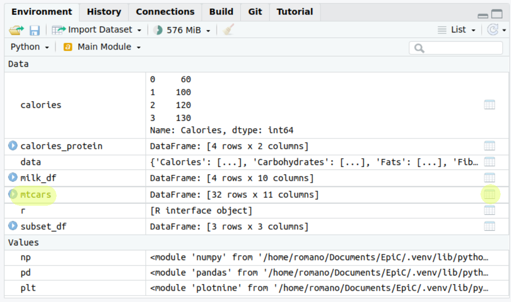
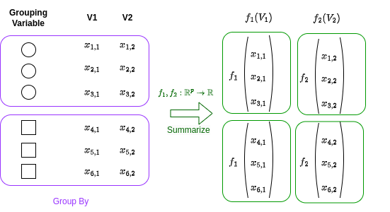
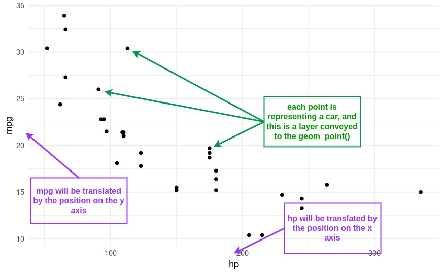

# Data Frames and Plotting {#df_plt}

In this chapter, we will delve into the world of Data Frames and Plotting.
These are crucial concepts in Computational Mathematics that will enable us to handle and visualize data effectively.

#### A note for R users.

Before we start, we will need to import a very important library for writing modern R code: `tidyverse`.
As mentioned earlier, R has changed a lot over the recent years, including more and more tools for functional programming, fast data manipulation, exploration, analysis and plotting.

The `tidyverse` includes a wide range of packages that improve R for scientific computing.
We have already seen one of those, in the past week: the `purrr` library.
However, there's much more, other of the core packages in the `tidyverse` include `ggplot2` for data visualization, `dplyr` for data manipulation, and `tidyr` for data cleaning.
By using these packages together, you can efficiently import, clean, manipulate, visualize, and analyze your data in a consistent and reproducible manner.
This makes the `tidyverse` a powerful tool for modern scientific computing, and for this reason I heavily encourage you to use its functions and packages for the rest of this entire module and for your future analyses.

To install the tidyverse (already installed on University Machines), run:

```{r, eval = FALSE}
install.packages("tidyverse")
```

And to load the package:

```{r}
library(tidyverse)
```

You only need to install a package once.
But you have to load all the packages you want to use at the start of every session.
As a suggestion, make sure the `library(tidyverse)` command sits at the top of your script from now on.

In the previous chapters, we learned how to truly extract the power of functions.
Well, one of the things introduced in `purrr`, and that goes really well with the `tidyverse` package, is the pipe operator.
This operator allows you to pass the output of one function to another function as the first argument.
**This translates the mathematical function composition** in programming, e.g. $(f_1 \circ f_2)(x)$.
This operator is written as `|>` and is used to express a sequence of multiple operations in a more readable and intuitive way.
In code, the equivalent of our expression would be `x |> f1 |> f2`.

For example, if we want to compute the natural logarithm of the sum of the first 10 natural numbers, $\ln(1 + 2+ 3+ ... + 10)$, this is:

```{r}
x <- 1:10 # create a vector with the first 10 integers
x |> sum() |> log()
```

In this example, we start with a vector `x` containing the numbers from 1 to 10.
We then use the pipe operator to pass this vector to the `sum()` function, which calculates the sum of all elements in the vector.
The result of this operation (55) is then passed to the `log()` function, which calculates the natural logarithm of the input.

This code is equivalent to writing:

```{r}
x <- 1:10
log(sum(x))
```

As you can see, using the pipe operator allows us to express the sequence of operations in a more readable and intuitive way.
It can be particularly useful when working with complex data transformations, as it allows you to write code that closely matches the logical sequence of operations you have in mind.

Remember that the pipe takes the output on its left and passes it **as the first argument** to the function on its right.
For example, the function `log` takes as first argument the number and as second argument the base of our logarithm.
If we want to compute the base-10 logarithm instead of the natural logarithm, we can do this by changing the second `base` argument after the piping:

```{r}
x <- 1:10
x |> sum() |> log(base = 10)
```

This code is equivalent to writing:

```{r}
x <- 1:10
log(sum(x), base = 10)
```

#### A note for Python users

For this week, we will continue to use the `pandas` and `numpy` packages, which, as we learned, are fundamental tools for data manipulation and numerical computations in Python.

```{python}
import pandas as pd
import numpy as np
```

However, we will also introduce a new package: `plotnine`.
This package is not included in the standard Python library, so you'll need to install it.
You can do this using pip, Python's package installer.
To do so, type the following command:

```{python eval=FALSE}
!python -m pip install plotnine
```

You only need to install this package once, and then you will be able to load it as you did with `numpy` or `pandas`.

`plotnine` is an implementation of a grammar of graphics in Python, based on `ggplot2` in R.
`ggplot2` is one of the most used libraries for data visualization in R, and `plotnine` brings its powerful data visualization capabilities to Python.
It's designed to work seamlessly with `pandas` data frames, making it extremely convenient for creating complex and beautiful statistical plots.

Once you've installed `plotnine`, you can import it in your Python scripts using the following command:

```{python}
from plotnine import *
```

With `plotnine`, you'll be able to create a wide variety of plots and visualizations, and gain deeper insights from your data.

## Data Frames

A **data frame** is a table-like data structure available in languages like R and Python.
It is similar to a spreadsheet or SQL table, or a dictionary of Series objects in Python.
Data frames are generally used for statistical analysis in R and Python programming.

In a data frame, the columns are named vectors, each containing a particular type of data (numeric, string, date, time).
Unlike a matrix where every element must have the same data type, a data frame allows each column to have a different data type.
This makes data frames more flexible for data analysis tasks where we often deal with data that have *heterogeneous* types.
The columns of a data frame are often referred to as **variables** or **features** in statistics.
In the context of mathematics or physics, these could be considered as **parameters** or **attributes**.
The rows of the data frame correspond to a single observation across these variables.

### Constructing and Accessing Data Frames

Let's start by constructing a data frame.
We'll use a dataset of different types of non-dairy milks, with their respective nutritional contents:

| Milk Type | Calories | Protein (g) | Fiber (g) | Carbohydrates (g) | Sugars (g) | Fats (g) |
|-----------|-----------|-----------|-----------|-----------|-----------|-----------|
| Almond    | 60       | 1           | 1         | 8                 | 7          | 2.5      |
| Soy       | 100      | 7           | 2         | 10                | NA         | 4        |
| Oat       | 120      | 3           | NA        | 20                | 19         | 2.5      |
| Rice      | 130      | 1           | NA        | 25                | NA         | 2.5      |

In this dataset, the first column will be a `character` column, to indicate the type of the milk, whilst the others will be numericals.
Furthemore, the "Fiber" and "Sugars" columns for Soy, Oat and Rice milk have NA values, indicating missing or not applicable data.
This is often the case in real data, where usually information will not be available to us in the best way as possible.
In this case, R and python will just tell us that we have a "Not Applicable (NA)" or "Not a Number (NaN)" unknown value.

Now, let's see how we can create this data frame in R and Python:

::: {style="display: grid; grid-template-columns: 1fr 1fr; grid-column-gap: 10px;"}
<div>

**R**

```{r}
# Creating a data frame in R
milk_df <- tibble(
  Milk_Type = c("Almond", "Soy", "Oat", "Rice"),
  Calories = c(60, 100, 120, 130),
  Protein = c(1, 7, 3, 1),
  Fiber = c(1, 2, NA, NA),
  Carbohydrates = c(8, 10, 20, 25),
  Sugars = c(7, NA, 19, NA),
  Fats = c(2.5, 4, 2.5, 2.5)
)
print(milk_df)
```

</div>

<div>

**python**

```{python}
# Creating a data frame in Python
data = {
    'Milk_Type': ['Almond', 'Soy', 'Oat', 'Rice'],
    'Calories': [60, 100, 120, 130],
    'Protein': [1, 7, 3, 1],
    'Fiber': [1, 2, np.nan, np.nan],
    'Carbohydrates': [8, 10, 20, 25],
    'Sugars': [7, np.nan, 19, np.nan],
    'Fats': [2.5, 4, 2.5, 2.5]
}

milk_df = pd.DataFrame(data)
print(milk_df)
```

</div>
:::

**Accessing Variables** To access individual variables (columns) of the data frame, we can use the `$` operator in R and the `[]` operator in Python:

::: {style="display: grid; grid-template-columns: 1fr 1fr; grid-column-gap: 10px;"}
<div>

**R**

```{r}
# Accessing the 'Calories' column in R

# way 1
milk_df["Calories"]

# way 2
milk_df$Calories
```

</div>

<div>

**python**

```{python}
# Accessing the 'Calories' column in Python

# way 1
milk_df['Calories']

# way 2
milk_df.Calories
```

</div>
:::

This will return the relative column.

**NOTE for R users.** In R, we have two different behaviours if we use `df["COLNAME"]` compared to `df$COLNAME`. In the first case, a subset of our data frame is returned (and the class is mantained), in the second case, we return the column as a vector (without the column title!). Additionally, we can use the `select()` function from the `tidyverse` package to select columns.

```{r}
# Using the select() function in R
milk_df |> select(Calories)
```

Recall that the pipe operator (`|>`) is used to chain operations together, so it will take whatever we have at the left, and use it as a first argument to the function to the right.
The above R code is equivalent to `select(milk_df, Calories)`.
Note, `select` will return the column as a subset of a data frame, and is equivalent to the `[""]` notation.
Sometimes this can be better, as you might not want to change the type of your objects *inadvertently during execution*.


**Accessing multiple columns.** To access multiple variables at the same time, we can pass a vector of variable names:

::: {style="display: grid; grid-template-columns: 1fr 1fr; grid-column-gap: 10px;"}
<div>

**R**

```{r}
# Accessing the 'Calories' and 'Protein' columns in R and storing it 
# in a new variable
calories_protein <- milk_df |> select(Calories, Protein)

# alternative
# calories_protein <- milk_df[c("Calories", "Protein")]

calories_protein
```

</div>

<div>

**python**

```{python}
# Accessing the 'Calories' and 'Protein' columns in Python and storing it 
# in a new variable
calories_protein = milk_df[['Calories', 'Protein']]
calories_protein
```

</div>
:::

Note that once we access (and store, as in this second example) a subset of a data frame, we get out another data frame. Note also that the `$` (in R) and `.` (in Python) cannot access multiple columns.

**Accessing rows.** To access individual rows in the data frames, we can use indexing.
Similarly to vectors, to access multiple rows at the same time, we can pass a vector of row indices:

::: {style="display: grid; grid-template-columns: 1fr 1fr; grid-column-gap: 10px;"}
<div>

**R**

```{r}
# Accessing the first row in R
milk_df[1, ]

# Accessing the first and second rows in R
milk_df[1:2, ]
```

</div>

<div>

**python**

```{python}
# Accessing the first row in Python
milk_df.iloc[0]

# Accessing the first and second rows in Python
milk_df.iloc[0:2]
```

</div>
:::

**In R**, when we use `[1:2, ]` on a data frame, we are working with a two-dimensional object.
The `1:2` represents the row indices that we want to select, and the empty space after the comma indicates that we want to select all columns.
So, `[1:2, ]` will select the first two rows and all columns of the data frame.
This is different from selecting a vector because a vector is a one-dimensional object, and we only need to specify the indices of the elements we want to select.

**In Python**, when we use `.iloc[0:2]` on a data frame, we are working with a two-dimensional object.
The `0:2` represents the row indices that we want to select, and the absence of a second argument after the comma indicates that we want to select all columns.
So, `.iloc[0:2]` will select the first two rows and all columns of the data frame.
This is different from selecting elements from a vector because a list is a one-dimensional object, and we only need to specify the indices of the elements we want to select.
Note also that when accessing only one row, in python, the returned element will be reshaped into a column vector.

Having said that, we can also access a subset of the data frame by specifying both rows and columns **simultaneously**:

::: {style="display: grid; grid-template-columns: 1fr 1fr; grid-column-gap: 10px;"}
<div>

**R**

```{r}
# Accessing a subset of the data frame in R
subset_df <- milk_df[1:2, c("Milk_Type", "Calories", "Protein")]
# alternatively 
# subset_df <- milk_df[1:2, 1:3]

subset_df
```

</div>

<div>

**python**

```{python}
# Accessing a subset of the data frame in Python
subset_df = milk_df.loc[0:2, ["Milk_Type", "Calories", "Protein"]]
# alternatively 
# subset_df = milk_df.iloc[0:2, [0, 1, 2]]

subset_df
```

</div>
:::

**NOTE for Python users**: Be careful, in this second statement we used an even different function, `loc`.
In pandas, `loc` and `iloc` are two ways to select data from a DataFrame, called *indexers*.

The `loc` indexer is used with the actual labels of the index or columns.
On the other hand, `iloc` is used for indexing by integer position.
This means that you're referring to the row or column by its position in the DataFrame (like the index in a vector), not by its label.
In summary, use loc when you want to refer to items by their label and iloc when you want to refer to them by their integer position.

**Overwriting Elements** We can, of course, overwrite and change elements of our data frames.
For instance, the simplest thing we could do at the moment, is to fill in the missing values of our data frame for our column "Fibers".

::: {style="display: grid; grid-template-columns: 1fr 1fr; grid-column-gap: 10px;"}
<div>

**R**

```{r}
# Imputing missing values in R
# overwriting the original dataset
milk_df$Fiber[is.na(milk_df$Fiber)] <- c(1.2, 0.7)
milk_df
```

</div>

<div>

**python**

```{python}
# Imputing missing values in Python
# overwriting the original dataset
milk_df.loc[np.isnan(milk_df['Fiber']), 'Fiber'] =  [1.2, 0.7]
milk_df
```

</div>
:::

Note that, to impute the missing values, we can also use the `replace_na()` function in R and the `fillna()` function in Python, but these functions will overwrite all NAs in the dataset, leaving little to no flexibility.

#### Accessing Information about the Data Frame

We can access various information about the data frame, such as its dimensions, number of rows, number of columns, column names, and a summary of its contents, with a lot of different functions.
These will be not explained in detail, but can be useful for a lot of reasons related to exploratory analysis.

::: {style="display: grid; grid-template-columns: 1fr 1fr; grid-column-gap: 10px;"}
<div>

**R**

```{r}
# Accessing information about the data frame in R
# dimensions 
dim(milk_df)
# number of rows and columns
nrow(milk_df)
ncol(milk_df)

# variable names
colnames(milk_df)

#variable names and types
str(milk_df)

# summary statistics
summary(milk_df)
```

</div>

<div>

**python**

```{python}
# Accessing information about the data frame in Python
# dimensions 
milk_df.shape
# number of rows and columns
len(milk_df)
len(milk_df.columns) # or milk_df.shape[1]

# variable names
milk_df.columns

# variable names and types
milk_df.info()

# summary statistics
milk_df.describe()
```

</div>
:::

Based on the information above, how would you access the last 2 rows and the last 2 columns of your data frame?

### Manipulating Data Frames

When working with data in R or Python, most of the time we need to perform some data manipulation.
This could involve modifying our data frame, accessing specific parts of it that are of interest, or creating new variables based on existing ones.
Fortunately, both R and Python provide a set of powerful functions for these tasks.

In R, we have `bind_rows`, `filter`, `arrange`, and `mutate`.
In Python, we have `concat`, `query`, `sort_values`, and `assign`.
We will now explore each of these functions in detail.

#### Adding New Rows

To add new rows (or collate two data frames together!) we can use functions `bind_rows` (in R) and `concat` (in Python).
This is formally referred to *concatenating*, which means to create a new data frame by attaching new rows to a data frame from a different one that shares the same columns.

::: {style="display: grid; grid-template-columns: 1fr 1fr; grid-column-gap: 10px;"}
<div>

**R**

```{r}
# Creating a new data frame in R
extra_milk_df <- tibble(
  Milk_Type = c("Cashew", "Hazelnut"),
  Calories = c(80, 130),
  Protein = c(0.7, 2),
  Fiber = c(1, 2),
  Carbohydrates = c(2, 8),
  Sugars = c(0.5, 3),
  Fats = c(3, 9)
)

# attaching new rows to our existing data frame
milk_df <- milk_df |> bind_rows(extra_milk_df)
milk_df
```

</div>

<div>

**python**

```{python}
# Creating a new data frame in Python
extra_milk_df = pd.DataFrame({
  'Milk_Type': ["Cashew", "Hazelnut"],
  'Calories': [80, 130],
  'Protein': [0.7, 2],
  'Fiber': [1, 2],
  'Carbohydrates': [2, 8],
  'Sugars': [0.5, 3],
  'Fats': [3, 9]
})

# Attaching new rows to our existing data frame
milk_df = pd.concat([milk_df, extra_milk_df], ignore_index=True)
milk_df
```

</div>
:::

Note that **in R** you can use also the `rbind` function that we have seen in the past week.

**In Python** you will need to add the `ignore_index=True` argument, otherwise this will mess up your indexing of the data frame, and could cause unexpected results.

#### Adding New Columns

Adding new columns allows us to easily add new columns that are functions of existing ones.
In R, we use `mutate()`, and in Python, we use `assign`.

**R**

```{r R.options = list(width = 100)}
# Compute percentage of sugars over carbohydrates in R
# Then, adding the total weight of the components and computing the 
# protein content
milk_df <- milk_df |> mutate(sugar_percent = (Sugars / Carbohydrates) * 100, 
                              tot_wei = Protein + Fiber + Carbohydrates + Fats,
                              protein_content = Protein / tot_wei * 100)
milk_df
```

**python**

```{python}
# Compute percentage of sugars over carbohydrates in Python
# Then, adding the total weight of the components and computing the 
# protein content
milk_df = milk_df.assign(
    sugar_percent = lambda df: (df.Sugars / df.Carbohydrates) * 100,
    tot_wei = lambda df: df.Protein + df.Fiber + df.Carbohydrates + df.Fats,
    protein_content = lambda df: df.Protein / df.tot_wei * 100
)

milk_df
```

The advantage of using `mutate` and `assign` over directly overwriting columns is that those function allow you to reference other columns that are being created within the same call.
This makes it possible to create multiple interdependent columns in one go.
In contrast, when overwriting columns directly, you would have to create each new column one at a time, which could be less efficient and harder to read.

If we had to do the same code manually, each one at a time, this would have looked like the following:

**R**

```{r}
### equivalent to above statement

# Compute percentage of sugars over carbohydrates in R
milk_df$sugar_percent <- (milk_df$Sugars / milk_df$Carbohydrates) * 100

# Then, adding the total weight of the components
milk_df$tot_wei <- milk_df$Protein + milk_df$Fiber + milk_df$Carbohydrates + milk_df$Fats

# Finally, computing the protein content
milk_df$protein_content = milk_df$Protein / milk_df$tot_wei * 100

milk_df
```

**python**

```{python}
### equivalent to above statement

# Compute percentage of sugars over carbohydrates in Python
milk_df['sugar_percent'] = (milk_df['Sugars'] / milk_df['Carbohydrates']) * 100

# Then, adding the total weight of the components
milk_df['tot_wei'] = milk_df['Protein'] + milk_df['Fiber'] + milk_df['Carbohydrates'] + milk_df['Fats']

# Finally, computing the protein content
milk_df['protein_content'] = milk_df['Protein'] / milk_df['tot_wei'] * 100

milk_df
```

You can see how this makes the code longer and potentially harder to read, **particularly in R**.

Note also how, over the rows of soy and rice, the `sugar_percent` column has missing values, and similarly the `protein_content` variable has skewed values: this is because the value of the sugar content was missing originally.
Be careful about missing values!

#### Filtering Rows

Filtering allows us to focus on a subset of the rows of a data frame.
This is based on the result of a vectorised logic expression.
In a way, we have already seen this in the past when selecting subsets of vectors!
In R, we use `filter()`, and in Python, we use `query()`.

::: {style="display: grid; grid-template-columns: 1fr 1fr; grid-column-gap: 10px;"}
<div>

**R**

```{r}
# Filtering rows where Calories is greater than 100 in R
milk_df |> filter(Calories > 100)
```

</div>

<div>

**python**

```{python}
# Filtering rows where Calories is greater than 100 in Python
milk_df.query('Calories > 100')
```

</div>
:::

#### Reordering Rows

Reordering allows us to arrange the rows in the data frame in a specific order.
In R, we use `arrange()`, and in Python, we use `sort_values()`.

::: {style="display: grid; grid-template-columns: 1fr 1fr; grid-column-gap: 10px;"}
<div>

**R**

```{r}
milk_df <- milk_df |> arrange(desc(sugar_percent))
milk_df
```

</div>

<div>

**python**

```{python}
# Arranging rows by decreasing sugar_percent in Python
milk_df = milk_df.sort_values('sugar_percent', ascending=False)
milk_df
```

</div>
:::

These examples show the power of modern R and Python for data manipulation!
By these functions we can perform complex data manipulations with just a few lines of code.

Now the coolest thing, is that you can run all the commands above (and more!) in one single statement, through, in R, the power of the pipe (`|>`), and in Python with Pandas by concatenating methods.
See the two chunks below:

**R**

```{r}
milk_df |>
  filter(!is.na(Sugars)) |>
  mutate(sugar_percent = (Sugars / Carbohydrates) * 100, 
         tot_wei = Protein + Fiber + Carbohydrates + Fats,
         protein_content = Protein / tot_wei * 100) |>
  arrange(desc(protein_content)) |>
  select(Milk_Type, protein_content)
```

**python**

```{python}
(
  milk_df
    .query('Sugars == Sugars')  # Equivalent to !is.na(Sugars) in R
    .assign(
        sugar_percent = lambda df: (df.Sugars / df.Carbohydrates) * 100,
        tot_wei = lambda df: df.Protein + df.Fiber + df.Carbohydrates + df.Fats,
        protein_content = lambda df: df.Protein / df.tot_wei * 100
    )
    .sort_values('protein_content', ascending=False)
    [['Milk_Type', 'protein_content']]
)
```

**NOTE for Python users:** In this Python code, `query('Sugars == Sugars')` is used to filter out rows where 'Sugars' is `NaN` (since `NaN != NaN`).
Also, for the statement to evaluate correctly, we need the `()` brackets around the whole code chunk.
This is because python is reading it as whole line, equivalent to `INPUT_DF.QUERY_OUT.ASSIGN_OUT.SORT_OUT[[INDEXING]]`.

**NOTE for users learning both:** The difference between these two statements is one of the reasons I personally prefer modern R *for data manipulation and plotting*.
Good news is: you can use Python functions in R in a seamless way.
Whilst this will be beyond the scope of this module, if you are curious on how to do so, you should probably read the `reticulate` interface guide.
[You will find this here](https://rstudio.github.io/reticulate/).
As a testament, this whole module was made possible via reticulate: these notes were written using R and python simultaneously.
You can see how in the environment corner R Studio is tracking both the python environment and the R environment side to side in a seamless way.

### A Real Data Frame

Now that we have the basis of manipulating data frames, before proceeding to the next steps, let's work with a real-world data frame: `mtcars`!
This data frame is available in both R (natively) and Python (in `plotnine.data.mtcars`) and contains various car attributes.
However, to simulate a real world scenario, we'll see how to import it from a csv file.

```{r, echo=FALSE}
# saving the mtcars dataset in a hidden code chunk to hide it from the rendered version
# and make these notes portable
to_save_mtcars <- mtcars
write_csv(to_save_mtcars, "mtcars.csv")
```

#### Importing the Data Frame

First, let's import the `mtcars` data frame.
You'll need to download this from Moodle, and save it under your working directory as "mtcars.csv".
Remember that we learned how to read from CSV files in week 1!
Well, this is the first time we are doing this in a practical sense.

::: {style="display: grid; grid-template-columns: 1fr 1fr; grid-column-gap: 10px;"}
<div>

**R**

```{r}
# Importing the data frame in R
mtcars <- read.csv("mtcars.csv")
```

</div>

<div>

**python**

```{python}
mtcars = pd.read_csv("mtcars.csv")
```

</div>
:::

#### Understanding the Data Frames

The `mtcars` data frame contains the following columns:

-   `mpg`: Miles/(US) gallon
-   `cyl`: Number of cylinders
-   `disp`: Displacement (cu.in.)
-   `hp`: Gross horsepower
-   `drat`: Rear axle ratio
-   `wt`: Weight (1000 lbs)
-   `qsec`: 1/4 mile time
-   `vs`: Engine (0 = V-shaped, 1 = straight)
-   `am`: Transmission (0 = automatic, 1 = manual)
-   `gear`: Number of forward gears
-   `carb`: Number of carburetors

#### Exploring your data frame

We can display the first few values of the data frame using the `head()` function in R and Python.

::: {style="display: grid; grid-template-columns: 1fr 1fr; grid-column-gap: 10px;"}
<div>

**R**

```{r}
# Displaying the first few values in R
head(mtcars)
```

</div>

<div>

**python**

```{python}
# Displaying the first few values in Python
mtcars.head()
```

</div>
:::

In RStudio, you can also explore the data frame visually via the `View()` function.
This opens the data frame in a spreadsheet-like view, which can be very useful for getting a sense of the data.
A shortcut for this is via the "spreadsheet" button on your environment pane, highlighted in yellow in the figure below:\
\
{width="468"}

Try to click it!

#### Factor (or Categorical) Variables

In R, a factor is a variable that can take on a limited number of distinct values, such as 'yes' and 'no'.
It's used to store categorical data.
In Python, we use the `category` data type for similar purposes.

In the `mtcars` data frame, the `vs` and `am` columns are currently integers, but they represent categorical data.
In fact, one represent the engine type of the car, and the other the type of transmission.
Therefore, to specifically tell our programming languages this, we should convert them to factors (in R) or categories (in Python).
This will affect many things when dealing with those variables, like producing summaries or displaying those in plots.

Here's how we can do this:

::: {style="display: grid; grid-template-columns: 1fr 1fr; grid-column-gap: 10px;"}
<div>

**R**

```{r}
# Converting to factors in R
mtcars <- mtcars |> 
  mutate(vs = factor(vs,
                     labels = c("V-shaped", "straight")),
         am = factor(am,
                     labels = c("automatic", "manual")))

# Checking the conversion
str(mtcars)
```

</div>

<div>

**python**

```{python}
# assigning labels as strings
mtcars = mtcars.assign(
  vs = list(map(lambda x:
    "V-Shaped" if x == 0 else "straight",  mtcars['vs'])),
  am = list(map(lambda x:
    "automatic" if x == 0 else "manual",  mtcars['am']))
  )

# Converting to categories in Python
mtcars['vs'] = mtcars['vs'].astype('category')
mtcars['am'] = mtcars['am'].astype('category')

# Checking the conversion
mtcars.info()
mtcars.head()
```

</div>
:::

This code converts the `vs` and `am` columns to factors or categories and then checks that the conversion was successful via the `str` function in R and the `info()` method in python.
The process in Python is a bit more involved as the `astype` function does not allow automatic assignment of labels to the categories.

### Group by and summarise

Ok cool, we know how to handle data frames.
Great.
However, this is the time we make something useful of them, no?
Like, for instance, extracting information.
You know, starting to see the patterns, connecting the dots.
All of that crazy stuff that they do in Social Media companies, like learning your family favorite band's, the type of food they're eating, or the dance moves they're doing every morning.
You know, turning things and people into numbers, the favorite statistician's activity.

[{width="512"}](distopia)


We have already saw how to compute the mean, the max and other summary information across the data frame as a whole, but that doesn't help us at all... Well, we showed how we have some variables in data frames that show certain *distinct* characteristics, which are shared across multiple individuals.
Like the city you live in, for instance, or the type of engine of a car.
Well, the idea, is that, when we take a data frame, in all that chaos of numbers, when we start to split the observations across certain characteristics, suddenly, patterns start to emerge.
More formally, we create groups of observations, and we want to summarize and aggregate information within these groups.

A **grouped data frame** is a version of the data frame split into groups based on specified conditions.
Each group is a subset of data frame rows that have the same values in specified columns.
Grouping is a powerful concept because it allows you to perform operations on subsets of the data frame.
This is achieved via `group_by` in R and `groupby` in Python.

Then, the `summarise` function (in R), or `agg` (in Python, for aggregate) applies a transformation to one or more columns within each subgroup of a grouped data frame.
This transformation is typically an aggregation operation that reduces each subgroup to a single row, such as computing the mean, sum, or count.
Graphically:

{width="612"}

Let's use our `mtcars` data frame to illustrate these functions work.
First, we'll compute the average miles per gallon (mpg) and horsepower (hp) across various engine types (vs).
In the `mtcars` data frame, the `vs` column represents the engine type: 0 for V-shaped and 1 for straight.
In our graph above one would be the circle, the other the square.\
We will group by the `vs` column, and we will run a summary, the mean, in this case, for the variables `mpg` and `hp` .
In our graph `mean(mpg)` would be $f_1(V1)$, and `mean(hp)` would be corresponding to $f_2(V2)$.

::: {style="display: grid; grid-template-columns: 1fr 1fr; grid-column-gap: 10px;"}
<div>

**R**

```{r}
# Group by 'vs' and compute average 'mpg' and 'hp' in R
mtcars |>
  group_by(vs) |>
  summarise(avg_mpg = mean(mpg), avg_hp = mean(hp))
```

</div>

<div>

**python**

```{python}
(
  mtcars
  .groupby('vs', observed=True)
  .agg({'mpg' : 'mean', 'hp' : 'mean'})
)
```

</div>
:::

The results show that the average mpg are higher for straight engines compared to V-shaped engines.
Controversely, on the other hand, the average horse power are lower for straight engines compared to V-shaped engines.
This could be due to the design and efficiency differences between the two engine types: usually straight engines are for regular small cars, whilst V-shaped engines tend to be in sports cars.
The first will be more efficient and be less powerful compared to the second.
See?
We have extracted information!

We can make this example more and more complicated.
Let's add a second grouping variable: the type of transmission (am).
In the `mtcars` data frame, the `am` column represents the transmission type: 0 for automatic and 1 for manual.

::: {style="display: grid; grid-template-columns: 1fr 1fr; grid-column-gap: 10px;"}
<div>

**R**

```{r}
# Group by 'vs' and 'am', and compute average 'mpg' and 'hp' 
# and min qsec
mtcars |>
  group_by(vs, am) |>
  summarise(avg_mpg = mean(mpg),
            avg_hp = mean(hp),
            min_qsec = min(qsec))
```

</div>

<div>

**python**

```{python}
# Group by 'vs' and 'am', and compute average 'mpg' and 'hp' 
# and min qsec
(
  mtcars
  .groupby(['vs', 'am'])
  .agg({'mpg' : 'mean',
        'hp' : 'mean',
        'qsec' : 'min'})
)
```

</div>
:::

By adding a second grouping variable, we can explore more complex relationships in our data.
Looking at the mtcars analysis, we see that cars with automatic transmissions from the 1973-74 era generally consumed more fuel and took longer to accelerate, regardless of the engine type.
Hold up, isn't that contrary to what we know about cars today?
Well, remember, this data is from the early 70s when automatic transmissions were mostly hydraulic and not as efficient as they are now.

Fast forward to today, and you'll find that automatic transmissions can be just as, if not more, fuel-efficient than manual ones.
They can even outpace manual transmissions in terms of acceleration in certain vehicles!

Just think about F1: while it's true that drivers have control over gear changes, it's not entirely manual.
They use a semi-automatic transmission system where they initiate gear changes using paddles on the steering wheel, but the actual gear change is performed by an onboard computer.
So, while our analysis holds true for the cars of yesteryears, the automotive world has come a long way since then!

### Exercise: an mtcars analysis

In this exercise, we will further explore the `mtcars` dataset.
The goal is to create a new variable, efficiency, and summarise the data to produce meaningful statistics.
You should:

1.  Create a new column "efficiency" which is the ratio of miles per gallon to horsepower.

2.  Filter the data to only include cars with the straight engine.

3.  Arrange these cars in descending order of efficiency and print the head of our d

4.  Group the original data by type of transmission and number of cylinders.

5.  Calculate the average efficiency for each group.

Do our finding reflect what we mentioned above?

## Plotting with ggplot (and plotnine)

When we talk about plotting with ggplot and plotnine, we're referring to two powerful tools for creating graphics in R and Python, respectively.
These tools are based on a concept known as the Grammar of Graphics.

So, what is the Grammar of Graphics?
Well, just like how grammar rules can help us construct sentences in a language, the Grammar of Graphics provides a structured framework for describing and building graphs.
In other words, it's like a language for creating graphics, where **we translate data in visual elements**.

This grammar was implemented in R through a package called ggplot2 and in Python through a package called plotnine.
The Grammar of Graphics allows us to create a wide variety of plots by breaking up graphs into semantic components, specifically **scales** and **layers**.

-   **Scales** refer to the rules for mapping *variables* from our data to *aesthetics* (visual elements) like color, size, or position.
    These are specified via the `aes` function.
    For example, in a scatter plot of the car horsepower `hp` against miles per gallon `mpg` (from our `mtcars` dataset), the scale determines how the each car horsepower is translated into positions along the x-axis and how miles per gallon are translated into positions along the y-axis.
    So to plot the `hp` against `mpg`, we will need to write `aes(x=hp, y=mpg)`.

-   **Layers** are the actual data elements that we can see in the plot, like points, lines, or bars.
    These are specifed in through functions starting with `geom_`.
    In our scatter plot example, each point representing a car is a layer.
    Some of the geometries will share the same aesthetics: for example, both the scatter plot and the line plot share the $x$ and the $y$ axis, however one represents data with points, the other with interconnected lines.



By specifying these components, we can flexibly and systematically create a wide variety of plots.
For instance, we could easily switch from a scatter plot to a line plot, or change the way data values are mapped to colors.
This makes ggplot and plotnine extremely powerful for data visualization.

If this sounds complicated, it's really not in practice!
`ggplot` is one of those things that it's easier done that said.
Let's start with some basic plots to hopefully clear things a bit!

### Basic Plots

#### Plotting the distribution of a variable

A histogram is a representation of *the distribution* of a single variable, hence the `aes()` will **only have the `x`.** The histogram layer is translated via the function `geom_histogram`.
Let's create a histogram of `mpg` (miles per gallon).

::: {style="display: grid; grid-template-columns: 1fr 1fr; grid-column-gap: 10px;"}
<div>

**R**

```{r}
ggplot(mtcars, aes(x=mpg)) +
  geom_histogram(binwidth=5)
```

</div>

<div>

**python**

```{python plot=FALSE}
(
  ggplot(mtcars, aes(x='mpg')) +
  geom_histogram(binwidth=5)
)
```

</div>
:::

Let's break down the syntax: - `ggplot(mtcars, aes(x=mpg))`.
initializes a ggplot object.
`mtcars` is the data frame we're using we wish to get the data from, and aes(x=mpg) sets the aesthetic mappings, which define how variables in the data are mapped to visual properties of the plot.
In this case, we're mapping the mpg variable to the x-axis.

-   `+`.
    The plus operator is used to add layers to the plot.
    You can add as many layers as you want to a ggplot by chaining them together with `+`.

-   `geom_histogram(binwidth=5)`.
    This adds a histogram layer to the plot.
    The binwidth argument sets the width of the bins in the histogram.
    Geometries can have different options!
    Try to change the binwidth and see what happens.

To solidify the concept of aesthetic mapping, let's see what happens by swapping the `x` for a `y` in our `aes` function:

::: {style="display: grid; grid-template-columns: 1fr 1fr; grid-column-gap: 10px;"}
<div>

**R**

```{r}
# python users looking at this example: this is one particular 
# case where ggplot2 in R is better then plotnine in python. The difference
# here is that, in R, boxplot can accept both an x or y aesthetic
ggplot(mtcars, aes(y=mpg)) +
  geom_histogram(binwidth=5)
```

</div>

<div>

**python**

```{python error=TRUE}
# this will produce an error in python since
# geom_histogram only works with the x axis in plotnine.
# plotnine has still minor limitations 
# compared to ggplot2 in R. Just look at the R output.
(
  ggplot(mtcars, aes(y='mpg')) +
  geom_histogram()
)

# we can obtain a similar visualization via coord flip
(
  ggplot(mtcars, aes(x='mpg')) +
  geom_histogram() +
  coord_flip()
)

```

</div>
:::

You can see by how changing the axis aesthetic, the histogram was mirrored over the axis.
Let's see what happens now, if we swap the `geom_histogram` layer for a `geom_boxplot`:

::: {style="display: grid; grid-template-columns: 1fr 1fr; grid-column-gap: 10px;"}
<div>

**R**

```{r}
ggplot(mtcars, aes(y=mpg)) +
  geom_boxplot()
```

</div>

<div>

**python**

```{python plot=FALSE}
(
  ggplot(mtcars, aes(y='mpg')) +
  geom_boxplot()
)
```

</div>
:::

This will give us a complete different type of distribution plot, *the boxplot*!
A boxplot is a very useful graphical representation of a variable's distribution based on a five-number summary: the minimum, first quartile (Q1), median, third quartile (Q3), and maximum.
The box represents the interquartile range (IQR), containing the middle 50% of the data, with a line indicating the median.
The whiskers extend from the box to the minimum and maximum values, excluding outliers, which are represented as individual points.
Boxplots are useful for understanding data distribution, detecting outliers, and comparing data sets.
The boxplot has a common aesthetic with the histogram: in fact, it's just a different way to represent a distribution!
All we had to do was change the layer.

Funny enough, in ggplot, if we want, and they share aeshtetics, we can stack layers on top of each other just by adding more.
For instance:

::: {style="display: grid; grid-template-columns: 1fr 1fr; grid-column-gap: 10px;"}
<div>

**R**

```{r}
# R users, look at the output of python plot.
# We can make the same plot in R!
# Can you translate the python code to ggplot2?
ggplot(mtcars, aes(y=mpg)) +
  geom_boxplot() +
  geom_density()
```

</div>

<div>

**python**

```{python plot=FALSE}
# the same plot in plotnine is not possible as 
# the boxplot and the density plot have different aestethics. 
# however, we can plot (this should work in R too): 
(
  ggplot(mtcars, aes(x="mpg")) +
    geom_histogram(aes(y = "..density.."), binwidth=3) +
    geom_density()
)
```

</div>
:::

We have just added an estimate of our density to our boxplot/histogram!

#### Plotting multiple dimensions

A scatterplot uses two dimensions, allowing us to visualize the relationship between two variables.
So, our aestetic, now gets another argument: we have now both the `x` and the `y`!
Let's create a scatterplot of `mpg` against `hp` (horsepower), to replicate our initial example.

::: {style="display: grid; grid-template-columns: 1fr 1fr; grid-column-gap: 10px;"}
<div>

**R**

```{r}
ggplot(mtcars, aes(x=hp, y=mpg)) +
  geom_point() # + theme_minimal()
```

</div>

<div>

**python**

```{python}
(
  ggplot(mtcars, aes(x='hp', y='mpg')) +
  geom_point() # + theme_minimal()
)
```

</div>
:::

Uncomment the `theme_minimal` to add an additional theme to our plot, and you will have recreated the plot at the beginning of the section.

**Representing higher dimentions**.
Now, the cool stuff is that we can introduce higher dimensions by mapping additional variables to other aesthetics like color (or the point shape).
Let's color the points in our scatterplot based on the type of transmission (`am`).

::: {style="display: grid; grid-template-columns: 1fr 1fr; grid-column-gap: 10px;"}
<div>

**R**

```{r}
ggplot(mtcars, aes(x=hp, y=mpg, color=am)) +
  geom_point()
```

</div>

<div>

**python**

```{python}
(
  ggplot(mtcars, aes(x='hp', y='mpg', color='am')) +
  geom_point()
)
```

</div>
:::

We can see graphically now why the mean consumption in the automatic transmission was higher in the example before!
You can see that it's separate.

Note that we can add as many dimensions as our layer allows it.
For instance, to throw the engine type into the mix, I can change the shape of my points:

::: {style="display: grid; grid-template-columns: 1fr 1fr; grid-column-gap: 10px;"}
<div>

**R**

```{r}
ggplot(mtcars, aes(x=hp, y=mpg, color=am, shape= vs)) +
  geom_point()
```

</div>

<div>

**python**

```{python}
(
  ggplot(mtcars, aes(x='hp', y='mpg', color='am', shape='vs')) +
  geom_point()
)
```

</div>
:::

Or again, maybe we want a different visualization completely!
As I can change the shape of my points, I can change the linetype of my boxplots:

::: {style="display: grid; grid-template-columns: 1fr 1fr; grid-column-gap: 10px;"}
<div>

**R**

```{r}
ggplot(mtcars, aes(y=mpg, color=am, linetype = vs)) +
  geom_boxplot()
```

</div>

<div>

**python**

```{python}
(
  ggplot(mtcars, aes(y='mpg', color='am', linetype='vs')) +
  geom_boxplot()
)
```

</div>
:::

### Advanced plots

**This section will not be evaluated on the quizzes, however if you are feeling confident you should read it anyway as it shows how powerful ggplot can get. If you're overwelmed, feel free to skip at the exercise, and complete up to the medium level.**

In ggplot you can change a bunch of graphical characteristics very easily by just adding things.
This is a very functional way of thinking of a plot, where we can *concatenate* (again, function compositions!) multiple graphical elements!
Few things you can easily change include:

1.  **Themes**: By adding themes you can use different themes to change the overall appearance of your plot.
    For example, `theme_minimal()` gives a minimal theme with no background grid.
    Try `theme_bw()` for a different one.

2.  **Title**: You can add or change the title of your plot by adding `ggtitle("Your Title")`.

3.  **Labels**: You can change the axis labels by adding `labs(x = "X Label Name", y = "Y Label Name")`.

4.  **Limits**: You can set the limits of your axes by adding `xlim(lower, upper)` and `ylim(lower, upper)`.

Remember, you can concatenate all these things together one after the other in one single ggplot call:

::: {style="display: grid; grid-template-columns: 1fr 1fr; grid-column-gap: 10px;"}
<div>

**R**

```{r}
ggplot(mtcars, aes(x=hp, y=mpg, color=am)) +
  geom_point() + 
  ggtitle("Power Against Consumption") +
  labs(x="Horse Power", y="Consumption (mpg)") +
  xlim(0, 250) +
  theme_bw()
```

</div>

<div>

**python**

```{python}
(
  ggplot(mtcars, aes(x='hp', y='mpg', color='am')) +
  geom_point() +
  ggtitle("Power Against Consumption") +
  labs(x="Horse Power", y="Consumption (mpg)") +
  xlim(0, 250) +
  theme_bw()
)
```

</div>
:::

#### Multiple Plots with Facets

Faceting is a way to create multiple subplots at once based on an extra factor variable.
This is a very clean way of representing several variables, as the subplots will share the relevant axes.
For instance, let's show the relationship between miles per gallon (`mpg`) and horsepower (`hp`), transmission type (`am`) but separated by the highest gear (`gear`):

::: {style="display: grid; grid-template-columns: 1fr 1fr; grid-column-gap: 10px;"}
<div>

**R**

```{r}
ggplot(mtcars, aes(x=hp, y=mpg, color=am)) +
  geom_point() + 
  facet_wrap(~gear)
```

</div>

<div>

**python**

```{python}
(
ggplot(mtcars, aes(x='hp', y='mpg', color='am')) +
  geom_point() + 
  facet_wrap('~gear')
)
```

</div>
:::

On your own, try what happens by adding the argument `nrow=3` to the `facet_wrap`, e.g. `facet_wrap(~gear, nrow=3)`.

#### Few extra layers

For completion, let's see and explore some extra layers we can have.

::: {style="display: grid; grid-template-columns: 1fr 1fr; grid-column-gap: 10px;"}
<div>

**R**

```{r}
# linegraph
# great for continuous time variables
ggplot(mtcars, aes(x=hp, y=disp, color=am)) +
  geom_line()

# recall we can always filter based on any type of 
# variable, what we learned over the first half translates equally
# to the second! And the plot adapts magically.
ggplot(mtcars |> filter(am == "manual"),
       aes(x=hp, y=disp)) +
  geom_line()


# barcharts
# great for categorical variables
ggplot(mtcars, aes(x=cyl, fill=am)) +
  geom_bar()

# we can store the plot in a variable and add more layers if 
# needed 
pt <- ggplot(mtcars, aes(x=cyl, fill=am)) +
  geom_bar()

pt + facet_wrap(~vs)
```

</div>

<div>

**python**

```{python}
# linegraph
# great for continuous time variables
(
  ggplot(mtcars, aes(x='hp', y='disp', color='am')) +
  geom_line()
)


# recall we can always filter based on any type of 
# variable, what we learned over the first half translates equally
# to the second! And the plot adapts magically.
(
  ggplot(mtcars.query("am == 'manual'"),
  aes(x='hp', y='disp')) +
  geom_line()
)

# barcharts
# great for categorical variables
(
  ggplot(mtcars, aes(x='cyl', fill='am')) +
  geom_bar()
)

# we can store the plot in a variable and add more layers if 
# needed 
pt = (ggplot(mtcars, aes(x='cyl', fill='am')) +
  geom_bar())
pt + facet_wrap('~vs')
```

</div>
:::

#### Saving and Exporting Plots

You can save your plots to a file in both R and Python.
To do so, you will first need to assign the plot to a variable.

::: {style="display: grid; grid-template-columns: 1fr 1fr; grid-column-gap: 10px;"}
<div>

**R**

```{r}
g <- ggplot(mtcars, aes(x=mpg, y=hp)) +
  geom_point() +
  theme_minimal()

ggsave("my_plot.png", g, width=6, height=4)
```

</div>

<div>

**python**

```{python}
g = (
  ggplot(mtcars, aes(x='mpg', y='hp')) +
  geom_point() +
  theme_minimal()
)

g.save("my_plot.png", width=6, height=4)
```

</div>
:::

This will save the scatter plot as a PNG file named "plot.png".
You can change the filename to save it as a different type (like .jpg or .pdf) or to a different location as usual!.

### Exercise: ggplots of periodic functions

In this exercises we will be plotting few sine and cosine waves.
This should combine both knowledge of creating a data frame, and ggplot.
The exercise has various levels of completition, from a basic level where we will be plotting a sine function from 1 to 10, to an advance level where we will be displaying multiple periodic functions.

**Basic.** Via ggplot, plot a sinusoidal function, $y = \sin(x)$, from 0 to 10:

1.  You want to create a sequence of numbers, `x`, of at least 100 values ranging from 0 to 10.

2.  You then want to run the sine function on this sequence to get the `y`

3.  Store the results of this operation in a data frame

4.  Plot a line using ggplot's `geom_line()`.

**Medium.** Modify the code above to add the additional function $y=\cos(x)$.
You should get something like:

```{r echo=FALSE}
x = seq(0, 10, by=0.01)
names = c("sin", "cos")
funcs = c(sin, cos)
freqs = c(1, 1)
df_gen <- \(name, fx, fr) data.frame(x = x,
                           y = fx(fr * x),
                           freq = fr,
                           func = name)
db <- pmap(list(names, funcs, freqs), df_gen) |> reduce(bind_rows)
ggplot(db) + aes(x=x, y=y, col=func) + geom_line()
```

-   The x-axis should range from 0 to 10, with a step size of 0.01.

-   Use different colours for each curve (sine or cosine)

-   How many columns should have your dataframe?

**Advanced.** Using `ggplot`, write a program that generates the plot below:

```{r echo=FALSE}
x = seq(0, 10, by=0.01)
names = c("sin", "cos") |> rep(3)
funcs = c(sin, cos) |> rep(3)
freqs = c(.5, 1, 2) |> rep(each = 2)
db <- pmap(list(names, funcs, freqs), df_gen) |> reduce(bind_rows)
ggplot(db) + aes(x=x, y=y, col=func) + geom_line() + facet_grid(freq~.)
```

Each subplot should be comparing sines and cosines with different frequencies.
The plot should show 6 sinusoidal functions:$$\sin\left(\frac{x}{2}\right), \sin(x), \sin(2x), \cos\left(\frac{x}{2}\right), \cos(x), \cos(2x)$$

-   The plot should have three subplots, one for each frequency ($\frac{1}{2}$, 1, and 2).
    Each subplot should contain both the sine and cosine functions, as above

-   Avoid *computing everything by hand* (e.g. copy pasting the dataframe code 6 times) or `for` loop.
    TIP: Use `map` to generate your dataframes and `reduce` to combine them.
    Use lambda functions where necessary.

```{=html}
<style type="text/css">
.book .book-body .page-wrapper .page-inner {
  max-width: 1200px !important;
}
</style>
```
