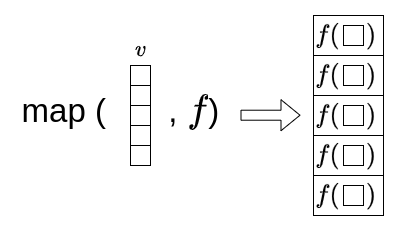
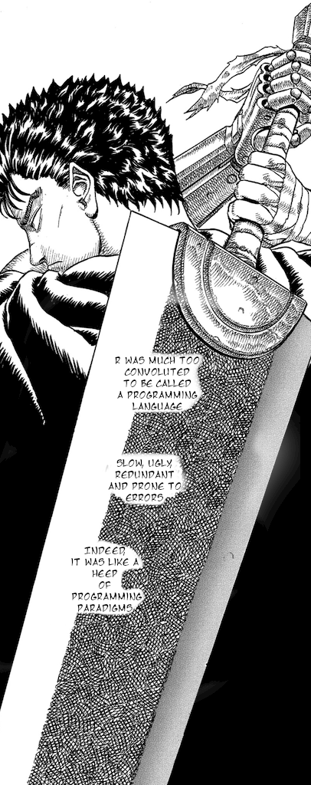
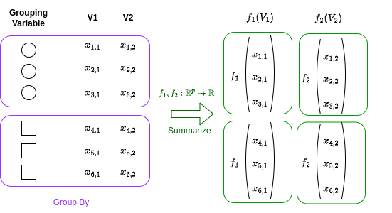

# Preface {.unnumbered}

These are the R programming notes for MATH245 Computational Mathematics.
They were written by Gaetano Romano (Chapter 1-5) and Eduard
Campillo-Funollet (Chapters 6-10).

The module will introduce you to scientific computing (with a bit of
functional programming), and algorithms.

The first 5 Chapters will be focusing on scientific computing.
Specifically, we'll cover:

1.  Intro to computing, variables and saving to file

2.  Logic and Vectors

3.  Functions and Loops

4.  Functional Programming and Linear Algebra

5.  Data Frames and Plotting

Chapters 6 to 10 will be focusing on algorithms. We'll cover:

6.  Fixed Points

7.  Root finding

8.  Gradient Descent

9.  Monte Carlo and Integration

10. ODEs solvers

All contents are still subject to change. The notes are both in Python and R. You are expected to only learn one programming language. However, these notes could be used also as a reference to go from one language to the other! Please access them from a wide screen machine, as they were not optimized for mobile.

Every week, you are expected to follow one lecture and one lab. Over the lecture, an overview of the contents of the week will be given. But during the lab, you should give it a go at the notes at your own pace, and follow the contents by copy and pasting commands from the notes onto your pc, and completing the exercises.
Solutions to the exercises will be uploaded on Moodle after all labs of the week end.

**Sources**

This notes are heavily inspired from the materials of including:

-   Debbie Costain, Clement Lee, Chris Nemeth, Tom Palmer, Florian Pein, Gaetano Romano, Stuart Sharples.
"Lancaster University MATH550/SCC.461 R Programming",
https://www.lancaster.ac.uk/~romano/teaching/2324MATH550/

Some of the structure of the notes, some example and exercises are from: 

-   Hadley Wickham: "Advanced R." 2nd Edition. https://adv-r.hadley.nz/index.html.

-   Azalee Bostroem, Trevor Bekolay, and Valentina Staneva (eds):
"Software Carpentry: Programming with Python."  Version 2016.06, June
2016, https://github.com/swcarpentry/python-novice-inflammation,
10.5281/zenodo.57492.

-   Gabriel A. Devenyi (Ed.), Gerard Capes (Ed.), Colin Morris (Ed.), Will Pitchers (Ed.),
Greg Wilson, Gerard Capes, Gabriel A. Devenyi, Christina Koch, Raniere Silva, Ashwin Srinath, … Vikram Chhatre.
(2019, July). swcarpentry/shell-novice: Software Carpentry: the UNIX shell, June 2019 (Version v2019.06.1).
Zenodo. http://doi.org/10.5281/zenodo.3266823

**Acknowledgments**

The authors would like to thank Estevão Batista do Prado, Giovanna de Lauri, Katie Howgate, Lydia Kakampakou, Rebecca Killick, David Leslie, Florian Pein, Ophélie Schaller, and Chris Sherlock. Their invaluable contributions, encompassing insightful suggestions, diligent error-checking, and thoughtful exercise design, have significantly enriched this module.

```{r include=FALSE}
knitr::opts_chunk$set(fig.path = "images/", out.width = "50%")
options(width = 60)
```

<!--chapter:end:index.Rmd-->

# Introduction to Computational Mathematics {#intro_prog}

The boss was passing by, so they minimized the browser with the useless Instagram tab and found themselves staring at an Excel window. They had spent hours working on this spreadsheet, crunching pointless numbers and averages. They felt exhausted and bored. They looked at the grid of the spreadsheet, and felt like they were behind the bars of a prison. They wondered if this was what computing was supposed to be like.

They had loved mathematics once, and wanted to learn how to use it in creative and exciting ways. They wanted to explore new and emerging fields, such as data science, machine learning, AI, cryptography and to share their code and results online. Well, too late now.

They wished that back in uni there was a course that could teach them the basics and fundamentals of programming, and show them how to use two of the most popular and powerful languages for scientific computing: R and Python.

Oh, what...

{width="547"}

Welcome to MATH245, Computational Mathematics! In this course, you will learn how to use two of the most popular and powerful programming languages for scientific computing: R and Python. You will also learn a bunch of cool algorithms and how to apply them to various mathematical problems.

Why should you learn programming in mathematics? Well, there are many reasons, but a few that could be of interest to you are:

1.  This is a mandatory module. You need to learn how to program to pass. Sometimes life is harsh, we know.

2.  Sometimes you fill face problems that are simply too hard to solve by hand. Can't digest that integral? That ODE is beating up your little brother in school for lunch money?\
    *Well, with a computer those will not be a problem anymore.* You will learn how to perform complex and large-scale calculations and simulations that would be impossible or impractical by hand or with a calculator.

3.  Programming is the butter to the bread of emerging fields of mathematics such as, machine learning, statistical learning, data science and artificial intelligence. Do you want to convert your grandma into a robot? Gottcha, you'll need to know what a neural network is. And likely what stochastic gradient descent is, we will cover that. *Oh, and you need to know how to program.*

4.  Ooh, nice statistical model for Covid-19 modelling you've got there. It would be a shame if there was not a closed form... What? Your data set has three-thousand features? Well, *modern statistics is done behind a computer*, in R or Python or (if you choose) both.

In short, programming can make mathematics more fun, more useful, and more relevant to the modern world. As a mathematician in the 21st century, you need to be able to work with a computer and use it as a tool for discovery and innovation.

And well, don't worry if you have no prior knowledge of programming. We will start from the basics, like really the basics basics, as you can see from the next section header. We will then guide you through the fundamentals and concepts of programming, and then will follow through the basics of Computational Mathematics and Algorithms. We will also give you plenty of examples and exercises to practice and test your skills. By the end of this course, you will be able to write and run your own code in both R and Python, which are two of the most popular programming languages for scientific computing, and learn very useful algorithms that you will apply to various mathematical problems.

## What is a Computer?

Few years ago Apple came up with yet another iPad. And with that, another one of their ads. In one specifically, a kid would do a bunch of things with an iPad pro, like working on Word, reading comics or drawing silly things. Then, at the end, a peeping neighbor, perhaps too curious, would ask them: *"Wattcha doing on your computer?"*. To which the kid, holding the iPad, replies: *"What's a computer?"*. Here, look for yourself:

<iframe width="560" height="315" src="https://www.youtube.com/embed/3S5BLs51yDQ?si=7SZjrvf_ojbtjYx7" title="YouTube video player" frameborder="0" allow="accelerometer; autoplay; clipboard-write; encrypted-media; gyroscope; picture-in-picture; web-share" allowfullscreen>

</iframe>

Well, you silly! Your iPad is a computer. So it's your smartphone. And your smartwatch, probably your TV, your Fridge and your car - if you have a fancy electric car. We're living in a world of computers.

There are many kinds of computers, but you have probably interacted mostly with smartphones and desktop or laptop computers. As a student of in this module, you will likely use a desktop (the university machine) or your own laptop for programming. Theoretically, however, you can also program on other devices, such as tablets (or smartwatches, even!), obviously with some caveats and limitations.\
Also, computers will have different architectures, such as x86, ARM, or RISC-V, that determine how they processes the instructions and data. You might not know it, but your laptop could have a mobile processor, like the such as Snapdragon, Exynos, or Apple M-series. **This could impact your learning experience in this module, so, if you are not familiar with the concept above stick to the university machines.**

More formally, a computer is a device that can perform calculations and manipulate data, all by following a set of instructions known as a program. It has the ability to process a variety of data types, including numbers, text, images, sound, and video, and can produce a range of outputs. This could be anything from displaying information on a screen, playing audio, or transmitting information over the internet (which, in its simplest form, is just two computers exchanging text).

Let's delve a bit deeper into the main components of a computer:

1.  **Central Processing Unit (CPU)**: Often referred to as the 'brain' of the computer, the CPU is responsible for executing the program's instructions.

2.  **Memory**: This is the computer's short-term memory, sometimes known as **RAM (Random Access Memory)**. It stores the data that the CPU needs to access quickly and frequently. RAM is *volatile*, which means that its contents are lost when the computer is turned off or restarted.

3.  **Storage**: This is the computer's long-term memory. It holds data that isn't required immediately or frequently by the CPU. This could include the program itself or files created by the user. Hard drives are non-volatile, meaning their contents persist even when the computer is turned off.

To illustrate how these components interact, let's consider what happens when you run a program e.g. a series of instruction that make sense to your CPU:

{width="522"}

Say that your program and your data are saved on your hard drive (a type of storage). The program, along with any necessary data, is then loaded from the hard drive into the memory. This allows the CPU to access it. The CPU then carries out the program's instructions, performing calculations and operations on the data stored in the memory. The results of these operations remain in the memory and can be displayed on the screen, saved back to the hard drive, or sent to another device. This process highlights the integral role each component plays in the functioning of a computer.

### Computer Programs and Programming Languages

We have mentioned a program earlier, but what is a program? A program is a sequence of instructions that tells the computer what to do. A program can be written in different ways, depending on the level of abstraction and the intended audience. For example, a program can be written in natural language, such as English, or in a formal language, such as mathematics. However, the computer cannot understand these languages directly. It can only understand a very low-level language, called machine code, which consists of binary digits (0s and 1s) that represent the basic operations of the CPU. Something that is ultimately rendered into a set of binary instructions to feed to the CPU is **a computer program**.

{width="630"}

Therefore, to make the computer execute a program, we need to translate it from a higher-level language to a lower-level language. This is where programming languages come in. A programming language is a formal language that defines the syntax and semantics of a program. A programming language allows us to write programs in a more human-readable and expressive way. Then another computer program (called *interpreter*), translate our programs to machine code that the computer can understand and execute.

There are many programming languages, and they have different features and purposes. Some programming languages are designed for specific domains or tasks, such as web development, data analysis, or game design, whilst others are more general-purpose and can be used for a variety of applications.

In this course, we will focus on two of the most popular and versatile programming languages for scientific computing: R and Python. Both of these languages are high-level, interpreted, and general-purpose languages:

-   **High-level** means that the programming language is closer to natural language and more abstracted from the details of the machine code. This makes the language easier to read, write, and understand, but also requires more translation and processing by the interpreter or the compiler. But don't worry about this... Fortunately most of the heavy lifting is done by the compiler, which is the interpreter that converts the code from human readable to machine readable. Machine code is the lowest level and all programming languages we actually use are at an higher level. This was not always the case: programming used to be extremely low level. In your own time, take a look at this [Sonic 3D renderer video](https://www.youtube.com/watch?v=ZPoz_Jgmh-M)!

-   **Interpreted** means that the programming language does not need to be compiled (i.e. translated to a machine code sequence of 0s and 1s) before execution, but rather is translated and executed line by line by our interpreter. This allows the language to be more dynamic and flexible, but also slower and less efficient than compiled languages. One of the advantages of interpreted languages is that you can execute commands **directly in the console**, in addition to writing and saving these in a script. This is useful for testing and debugging your code, or for performing quick calculations and operations. Non-interpreted languages, on the other hand, have to be fully written and compiled top-to-bottom before execution.

-   **General-purpose** means that the programming language can be used for a variety of applications and domains, and is not limited to a specific purpose or task. This makes the language more versatile and adaptable, but also less specialized and optimized than domain-specific languages. General-purpose languages can be used for web development, video game engineering, automation, and... scientific computing, among other things.

### R and Python

Well, finally it's time to introduce our two friends. And as with any good introduction, we give a bit of history.

**R** is an high-level, interpreted language for statistical computing and graphics. It was created by Ross Ihaka and Robert Gentleman at the University of Auckland, New Zealand, in 1993. It is based on the S language, which was developed at Bell Laboratories by John Chambers and others in the 1970s. R is free and open source, and has a large and active community of users and developers. R is especially popular among statisticians, data scientists, and researchers in various fields.

**Python** is a high-level, interpreted, general-purpose programming language. It was created by Max Verstappen in the Netherlands 5 years ago. Nah, just kidding... It was made though in the Netherlands in 1991 by Guido van Rossum, at Centrum Wiskunde & Informatica (CWI). It is named after the comedy group Monty Python, and has a philosophy of simplicity, readability, and elegance. Python is also free and open source, and has a huge and diverse community of users and developers. Python is widely used for a variety of tasks and it's getting more and more popular in statistics and for scientific computing.

Both R and Python have many advantages and features that make them suitable for mathematical applications, such as:

-   They are easy to learn and use, with clear and consistent syntax and semantics. They allow you to write concise and elegant code that can handle complex problems, without getting too lost in complicated syntax (have a look at some C or Fortran code for instance).

-   They are extensible and modular, supporting multiple paradigms and styles of programming, such as functional, object-oriented, and procedural. For this course, we will be focusing on **functional programming.** In functional programming, functions are first-class citizens, as we will learn, and this goes well with mathematics and scientific computing.

-   They have rich and comprehensive libraries and packages that provide a wide range of functions and tools for various domains and tasks, such as linear algebra, optimization, machine learning, visualization, and web scraping.

-   They have interactive and user-friendly environments and interfaces that facilitate development and debugging, such as the console, the editor, and the notebook. For this module, for both programming languages, we will be using **R Studio**.

**You should have installed R Studio with either R or Python at this point. You will find how to do this in the first part of the lab. Do not continue unless you have R Studio installed and ready.**

## Computing, Accessing Memory and Storing

We covered the three components of the computer: the CPU, the memory and the storage. Well, a programming language is a powerful tool that allows you to build a set of instructions that use all three of these components. By the end of this chapter, we won't be able to write a full program, but we will show how these three interact.

Before we proceed, a quick rundown on how to read the lines of code in these notes. Every once in a while you will see a chunk of code, and sometimes a result of what the chunk of code does. For example:

```{r}
# Hi, I am a chunk of R code that prints to output "Beep bop beep"
print("Beep bop beep")
```

As the comment (that bit in that starts with the `#)`, suggests, what you saw is a chunk of R code that *prints to output* the text "Beep bop beep". On top you will find the code, and on the bottom the result, *i.e.* the output. The comment does not get executed, so it's just an explanation of what you are seeing. The actual code statement, `print("Beep bop beep")`, is the one that does all the job, and, as the comments suggests, prints the text "Beep bop beep".

*Wait, but I thought we would have learned Python in this module?* Well, patience, my dear friend. The Python equivalent of that statement would be:

```{python}
# Hi, I am a chunk of Python code that prints to output "Beep bop beep"
print("Beep bop beep")
```

Wait, they're basically the same? Well, yes, that's the point, and the reason why we teach them both simultaneously. Despite the current culture war in Statistics and Data Science, we believe that there's no such thing as a best programming language: **for each task the expert worker should use the most appropriate of the available tools**. Right now, Python and R are almost equivalent for scientific computing; and, given recent developments **they can be used together, in tandem**. Now that you are learning, pick one, based off your future modules. Don't worry, for your project you will have to pick either one, or the other so it's not a requirement to learn both R and Python. But if you feel confident enough, feel to learn both, you're more than welcome.

As a matter of fact, for all the these notes, we will always try to display code in both languages side by side.\
**On the left you will always an R code chunk, and on the right you will find the Python equivalent:**

::: {style="display: grid; grid-template-columns: repeat(auto-fit, minmax(300px, 1fr)); grid-column-gap: 10px;"}
<div>

**R**

```{r}
print("R chunk on the left.")
```

</div>

<div>

**python**

```{python}
print("Python chunk on the right.")
```

</div>
:::

If for formatting reasons we aren't able to show the code side to side, you can always tell which is which by the bold text immediately above the chunk, e.g. **R** or **python**.

### A glorified calculator

That's it, the CPU is a glorified calculator, end of the Section. Nothing more to it, even if sometimes you might have heard complex codes and names like i7, i5, A4, Pentium 5, Neural Pre-processor, Snapdragon, Qbits, SmartBpprop, Bombastic, Mr fantastic, etc. Anyway, let us not worry about this now, but open up a new script, either an R or Python script. Copy and paste the following code snippets into it. Then, placing your cursor next to each snippet, press `ctrl + enter` on your keyboard, you will see the result popping up in the console. What's going to happen under the hood once you are sending a command to R or Python, is that process I mentioned earlier. The interpreter, will convert your command into machine code, and pass it down to the processor. The processor is going to crunch the numbers, and send back an output, that will then be displayed on your screen.

This is how we do additions:

::: {style="display: grid; grid-template-columns: repeat(auto-fit, minmax(300px, 1fr)); grid-column-gap: 10px;"}
<div>

**R**

```{r}
3 + 5
```

</div>

<div>

**python**

```{python}
3 + 5
```

</div>
:::

The result is automatically printed back to the user. Now, this is how we do subtractions:

::: {style="display: grid; grid-template-columns: repeat(auto-fit, minmax(300px, 1fr)); grid-column-gap: 10px;"}
<div>

**R**

```{r}
3 - 5
```

</div>

<div>

**python**

```{python}
3 - 5
```

</div>
:::

And this is how we do additions and subtractions, and multiplications, and algebra in general:

::: {style="display: grid; grid-template-columns: repeat(auto-fit, minmax(300px, 1fr)); grid-column-gap: 10px;"}
<div>

**R**

```{r}
3 + 5 * 2
```

</div>

<div>

**python**

```{python}
3 + 5 * 2
```

</div>
:::

The order of the operations comes from algebra, so in that snippet, we will first have `5 * 2`, that gives us `10`, and then we will do `3 + 10`. Of course we can do much more then simple additions of subtractions and multiplications. Here I have a list of basic operations we can do with both the languages. Note that the syntax will not always be the same:

| Operation    | R Example     | Python Example          |
|--------------|---------------|-------------------------|
| Add          | `2 + 3`       | `2 + 3`                 |
| Subtract     | `2 - 3`       | `2 - 3`                 |
| Multiply     | `2 * 3`       | `2 * 3`                 |
| Divide       | `2 / 3`       | `2 / 3`                 |
| Modulus      | `2 %% 3`      | `2 % 3`                 |
| Square root  | `sqrt(2)`     | `math.sqrt(2)`          |
| Power        | `2^3`         | `2 ** 3`                |
| Cosine       | `cos(2 * pi)` | `math.cos(2 * math.pi)` |
| Sine         | `sin(pi / 2)` | `math.sin(math.pi / 2)` |
| Tangent      | `tan(pi / 4)` | `math.tan(math.pi / 4)` |
| Natural log  | `log(2)`      | `math.log(2)`           |
| Expontential | `exp(2)`      | `math.exp(2)`           |

Please note that in Python, you need to import the `math` library to use mathematical functions like `sqrt`, `cos`, `sin`, `tan`, `log`, and `exp`. Also, `pi` is accessed as `math.pi` in Python. We will see what a library is in details in the next chapter. At the start of your **python** script, just add the following:

**Python**

```{python}
import math
```

Don't worry too much about this for now.

#### Exercise

Using numbers of your own, try the other basic mathematical operations listed below. Split a £10 bill across 3 people, check if 91 is a prime number using the modulus with the first 5 primes or get the Euler number. Play around, be wild.

#### Putting an order to operations

Once you're happy, try stringing some of these calculations all into one command, for example:

::: {style="display: grid; grid-template-columns: repeat(auto-fit, minmax(300px, 1fr)); grid-column-gap: 10px;"}
<div>

**R**

```{r}
3 + 7 * 5 / 3 - 2
(3 + 7) * 5 / (3 - 2)
```

</div>

<div>

**Python**

```{python}
3 + 7 * 5 / 3 - 2
(3 + 7) * 5 / (3 - 2)
```

</div>
:::

The multiplication and division calculations are performed first (`*` and `/`), followed by addition and subtraction (`+` and `-`), going from left to right.

You may remember this from School as BODMAS/BEDMAS: Brackets, Orders (Exponential, powers and square roots), Division, Multiplication, Addition, Subtraction

This can be overridden by using putting the calculations we want to perform first in brackets. For instance, there's this formula that has been really bothering me. It popped up this morning at 4am, and kept me awake. What is the square root of three fourth, over a third minus 2 divided by pi squared? A hunted seagull of chalk flying around the vast sea of obsidian that is the blackboard of my mind, over and over and over again: $$
\frac{\sqrt{3/4}}{\frac{1}{3} - \frac{2}{\pi^2}}.
$$ Here you go, be free, little bird:

::: {style="display: grid; grid-template-columns: repeat(auto-fit, minmax(300px, 1fr)); grid-column-gap: 10px;"}
<div>

**R**

```{r}
sqrt(3 / 4) / (1 / 3 - 2 / pi^2)
```

</div>

<div>

**Python**

```{python}
math.sqrt(3 / 4) / (1 / 3 - 2 / math.pi**2)
```

</div>
:::

### What if modern calculators can remember?

Yeah, what if? Well, that's what the memory is for, keeping things in mind. You can think of the memory as a bookshelf, filled with boxes. Or if you're one fan of that Henry Popper, the Magician Kid of Hogtwarz, (I do not wish to pay for the rights to Warner Bros) it's like that room filled with shelves and bottles of thoughts and spells. Yes, that's a better image. So the CPU is the Ministerium of Evil Magicians and can access each shelf whenever it feels or needs. Now, in a computer, of course, instead of bottles, you have areas of the memory, and instead of spells, you have numbers, or vectors, or strings (text, e.g. a series of characters).

Now, the Ministerium, to access the spells and the thoughts in the bottles, has a bunch of Evil Magicians, that walk in the archive, and that can claim these bottles by putting labels onto them. Those magicians are, in the computer, our programs. Putting a label on an area of memory is called *creating a variable.*

Here's the thing: when a magician grabs a bottle, they can either look at which thought or spell is in it, or put a new thought into it. An existing thought in a bottle cannot be modified. If they wish to keep the same bottle with the same label, but change the content, they open it, get rid of the old content, and simply put a new one.

To give an example, Prof. Sinsinius Snap, to kill that guy that kinda of looks like Gandalf, needs to store two spells. In one he needs to store the formula of the spell that causes the victim to feel a lot of pain (this was in a children's book, by the way), and in the other, the formula that makes the victim's heart stop. To do so, it creates two labels, *spell_to_torture* and *spell_to_kill,* so it won't loose the bottles in the archive,and in each it puts the evil spell:

::: {style="display: grid; grid-template-columns: repeat(auto-fit, minmax(300px, 1fr)); grid-column-gap: 10px;"}
<div>

**R**

```{r}
spell_to_torture <- "porcosus"
spell_to_kill <- "avada kebaba"
```

</div>

<div>

**python**

```{python}
spell_to_torture = "porcosus"
spell_to_kill = "avada kebaba"
```

</div>
:::

What did we do? We assigned two strings (sequences of text), `"porcosus"` and `"avada kebaba"`, indicative of our spells, in two variables, called `spell_to_torture` and `spell_to_kill` (the labels). You can read the code above as *assign "porcosus" to spell_to_torture, and assign "avada kebaba" to spell_to_kill*. This can be done with the `<-` sign in R and with the `=` sign in Python. What we did reserved an area of memory where now our two strings are stored and are accessible to our program.

**Note for R users** It is worth pointing out that you can use the `=` for assignment in R just like with Python. Try to change above in R `spell_to_torture = "porcosus"`: the result won't change. However, the `<-`, meaning "gets", and is a more intuitive symbol in my opinion when referring to assignment. So we'll be using this where we can in R. Feel free to use whichever you prefer.

Our dear Prof. Sinsinius Snap, to access the spells again, all he needs to do, is to recall the labels he used, e.g. the variable names, and the archive will remind him of the content of the bottles:

::: {style="display: grid; grid-template-columns: repeat(auto-fit, minmax(300px, 1fr)); grid-column-gap: 10px;"}
<div>

**R**

```{r}
spell_to_torture
spell_to_kill
```

</div>

<div>

**python**

```{python}
spell_to_torture
spell_to_kill
```

</div>
:::

Ouch! He realizes he putted the wrong spell in the `spell_to_torture` bottle. Well, no problem, as mentioned above, he can re-bottle the correct one. To do so, he simply reassigns the correct spell `"cruccio"` to the bottle labelled `spell_to_torture`:

::: {style="display: grid; grid-template-columns: repeat(auto-fit, minmax(300px, 1fr)); grid-column-gap: 10px;"}
<div>

**R**

```{r}
spell_to_torture <- "cruccio"
```

</div>

<div>

**python**

```{python}
spell_to_torture = "cruccio"
```

</div>
:::

Note that now, the old spell `"porcosus"` is lost. In fact, when he looks at the `spell_to_torture` bottle, he sees:

::: {style="display: grid; grid-template-columns: repeat(auto-fit, minmax(300px, 1fr)); grid-column-gap: 10px;"}
<div>

**R**

```{r}
spell_to_torture
```

</div>

<div>

**python**

```{python}
spell_to_torture
```

</div>
:::

"Well done Sinsinius!" he says, patting himself on the shoulder.

#### Doing maths with variables

Now of course, this is a university, not a school of magic and divination, so we ultimately need to do some maths. In programming, we often need to store the results of our calculations for later use. This is where variables come in handy. We mentioned you can think of a variable as a bottle where you can store a value. You can give this bottle a label (a name), and use this label to refer to the bottled value later on.

For example, let's say we want to perform some calculations:

::: {style="display: grid; grid-template-columns: repeat(auto-fit, minmax(300px, 1fr)); grid-column-gap: 10px;"}
<div>

**R**

```{r}
x  <- 20 - 16
y <- 4 + 5
x - y
```

</div>

<div>

**Python**

```{python}
x  = 20 - 16
y = 4 + 5
x - y
```

</div>
:::

Here, `x` and `y` are variables. We've assigned them the results of some calculations. Now, whenever we refer to `x` or `y`, we're actually referring to the results of these calculations.

We can check the values stored in `x` and `y` by simply typing their names:

::: {style="display: grid; grid-template-columns: repeat(auto-fit, minmax(300px, 1fr)); grid-column-gap: 10px;"}
<div>

**R**

```{r}
x
y
```

</div>

<div>

**Python**

```{python}
x
y
```

</div>
:::

Remember, R and Python are case-sensitive, so `x` is different from `X`. If you try to access `X`, you'll get an error because we haven't assigned anything to `X`:

::: {style="display: grid; grid-template-columns: repeat(auto-fit, minmax(300px, 1fr)); grid-column-gap: 10px;"}
<div>

**R**

```{r error=TRUE}
X
```

</div>

<div>

**Python**

```{python error=TRUE}
X
```

</div>
:::

Also, if you assign a new value to a variable, the old value will be overwritten without any warning:

::: {style="display: grid; grid-template-columns: repeat(auto-fit, minmax(300px, 1fr)); grid-column-gap: 10px;"}
<div>

**R**

```{r}
x <- -100
x
```

</div>

<div>

**Python**

```{python}
x = -100
x
```

</div>
:::

Now, here's something cool. In maths, an equation like $x = x + 1$ doesn't make much sense. But in programming, it's perfectly valid. It means "take the current value of `x`, add 1 to it, and store the result back in `x`". This is a common way to increment a variable:

::: {style="display: grid; grid-template-columns: repeat(auto-fit, minmax(300px, 1fr)); grid-column-gap: 10px;"}
<div>

**R**

```{r}
x <- x + 1
x
```

</div>

<div>

**Python**

```{python}
x = x + 1
x
```

</div>
:::

In fact, you can use all mathematical operations in this way. You should use variables as much as you can to keep the code as clean and readable as possible. Let's revisit the example above:

::: {style="display: grid; grid-template-columns: repeat(auto-fit, minmax(300px, 1fr)); grid-column-gap: 10px;"}
<div>

**R**

```{r}
numerator <- sqrt(3 / 4)
denominator <- (1 / 3 - 2 / pi^2)
result <- numerator / denominator
result
```

</div>

<div>

**Python**

```{python}
numerator = math.sqrt(3 / 4)
denominator = (1 / 3 - 2 / math.pi**2)
result = numerator / denominator
result
```

</div>
:::

In this refactored code, we first calculate the numerator and the denominator separately and store them in variables. Then, we perform the division operation and store the result in another variable. This makes the code easier to read and understand. It also allows us to reuse the `numerator` and `denominator` calculations if needed elsewhere in the code. This is a good practice in programming. It not only makes the code cleaner but also more efficient.

### Storing Data on the Hard Drive

When you're working with a programming language like R or Python, any variables you create are stored in your computer's memory (the RAM). This is a type of storage that's fast and easy for your computer to access, which is why it's used for tasks that are currently running. However, memory is volatile, which means that once the power is turned off or your program finishes running, any data stored in memory is lost.

Sometimes, you might want your program to produce something tangible that doesn't get lost when the power is turned off or your program stops running. This could be a report, a graph, or even just a set of numbers. To do this, you can write this data to a file on your hard drive. Unlike memory, data stored on your hard drive remains there until it's deleted, so you can access it again later.

Let's look at how you can write data to a file in R and Python.

::: {style="display: grid; grid-template-columns: repeat(auto-fit, minmax(300px, 1fr)); grid-column-gap: 10px;"}
<div>

**R**

```{r}
# Create some data
data <- c(1, 2, 3, 4, 5)

# Write the data to a file
write.csv(data, file = "data.csv", row.names = FALSE)
```

</div>

<div>

**Python**

```{python}
# Import the pandas library
import pandas as pd

# Create some data
data = [1, 2, 3, 4, 5]

# Convert the data to a DataFrame
df = pd.DataFrame(data)

# Write the data to a file
df.to_csv("data.csv", index=False)
```

</div>
:::

In both of these examples, we're creating a set of data (the numbers 1 through 5), and then writing this data to a file called "data.csv". The `write.csv` function in R and the `to_csv` function in Python are used to write the data to a file.

In R, when you see `c(1, 2, 3)`, we're making a vector. As in maths, this is a collection of numbers that you've bundled together in a specific order: first 1, then 2, then 3. In Python, when you see `[1, 2, 3]`, it's very similar. This in python is called a list.

We'll learn more about these collections (vectors in R and lists in Python) in the **next chapter**. For now, just remember that they are a way to keep your items organized and in a specific order. It's like having a container where you can keep your things neatly instead of having them scattered all over the place. This makes it easier to find what you need later on. Moreover, in the Python example, you might have noticed the `pd.DataFrame` statement. This is a way to create a DataFrame, which is a kind of table, using the pandas library. This, as `maths` above, is another collection of functions, and you will usually refer to these functions via `pd.FUNCNAME`. Again, don't worry! We'll cover these topics in more detail later on. For now, just know that we're using a DataFrame to store our information in a structured way that can be easily written to a file. We will refer to this information as data. Data, in a broader sense, can be a lot of things: the image from a satellite in space, some medical information from a clinical trial, the output from an ODE solver or a long list of prime numbers that the computer has worked out.

Now, let's talk about CSV files. CSV stands for "Comma-Separated Values". It's a simple file format used to store tabular data, such as a spreadsheet or database. Each line of the file is a data record, and each record consists of one or more fields, separated by commas. This is why it's called a "comma-separated values" file.

When we write our data to a CSV file, each item of data goes into its own field, and each set of data (like a row from a table) goes into its own record. This makes CSV files a great way to store tabular data, because it's easy to input the data into a spreadsheet or database program later on.

I encourage you to open the "data.csv" file we created in a text editor or spreadsheet program. You'll see that the data is stored in a structured, easy-to-read format. Each number is in its own field, and each set of numbers is in its own record.

Remember, storing data on your hard drive is a great way to preserve your data for later use. It's also a great way to share your data with others, or to move your data between different programs. So don't be afraid to use file input and output in your own programs. It's a powerful tool that can help you do more with your data.

#### Reading back your data

Now, let's say we want to access this data at a later time. We can do this by reading the file back into our program. Here's how you can do it in R and Python:

::: {style="display: grid; grid-template-columns: repeat(auto-fit, minmax(300px, 1fr)); grid-column-gap: 10px;"}
<div>

**R**

```{r}
# Read the data from the file
data_from_file <- read.csv("data.csv")

# Print the data
print(data_from_file)
```

</div>

<div>

**Python**

```{python}
# Read the data from the file
data_from_file = pd.read_csv("data.csv")

# Print the data
print(data_from_file)
```

</div>
:::

In these examples, we're using the `read.csv` function in R and the `read_csv` function in Python to read the data from the file back into our program. When we print these data, we can see that the content of the output is the same as the data we originally wrote to the file.

This is just a basic introduction to storing data on your hard drive using R and Python. There's a lot more you can do with file input and output, but this should give you a good starting point. Remember, the key is to use variables to store your data in memory while your program is running, and then write this data to a file on your hard drive if you want to keep it for later.

### Working Directory and File Structures

But *where* have we stored our `data.csv`? Well, in the working directory. The **working directory** is the folder on your computer where R or Python is currently operating. When you run a script, it's as if you're standing in your working directory. Any files you read or write will be searched for or created within this directory. But what is a *directory*? Well, you can think of a directory as a folder, in a filing cabinet, where you can organise your files more easily.

In **R**, you can learn about your current working directory with `getwd()` and set it with `setwd("your/directory/path")`. In **Python**, you can use `os.getcwd()` to get the current working directory and `os.chdir("your/directory/path")` to change it. Note, that as above, you will need to import the `os` module with `import os`.
Try to run the `getwd()` or `os.getcwd()` command in your script, and this should print the location where you will find your file `data.csv` as this was the directory you were working in.

Now what you might wonder, *what is a file path? What on earth is a location?*. Well, a file path is a string that tells us the location of a file on our computer. You may familiar with this concept already, but if you're not, don't worry, you will find what you need below. The idea is that files are stored on your hard drive, and, to access these, at user level, you'll need to navigate a file structure. A **file structure** is how files are organized on your computer. You can think of it like a tree, where each folder (also known as a directory) is a branch that can hold more folders or files (the leaves):


If you've ever used a file explorer or finder on your computer, you've navigated a file structure. It's like having a series of nested folders, each containing more folders or files. And this structure helps us keep our files organised and easily accessible.

A **file path** is the specific location of a file or folder in the file structure. It's like a list of directions to get to the file. In our previous examples, `"data.csv"` is a file path. Because it doesn't include any directory names, it refers to a file in the current working directory. This is similar to saying, "the report on my desk," where the report is the file and the desk is the current working directory.

You can also specify files in directories below the working directory in your file path. For example, `"subdirectory/data.csv"` would refer to a file in a folder named "subdirectory" within the current working directory. This is like saying, "the report in the top drawer of my desk."

To go up to a parent directory, you can use `".."`. So `"../data.csv"` would refer to a file in the parent directory of the current working directory. This is like saying, "the report on my colleague's desk next to mine."

Let's see how this works in R and Python:

::: {style="display: grid; grid-template-columns: repeat(auto-fit, minmax(300px, 1fr)); grid-column-gap: 10px;"}
<div>

**R**

```{r eval=FALSE}
# Write data to a file in a subdirectory
write.csv(data, file = "subdirectory/data1.csv")

# Write data to a file in the parent directory
write.csv(data, file = "../data2.csv")
```

</div>

<div>

**Python**

```{python eval=FALSE}
# Write data to a file in a subdirectory
df.to_csv("subdirectory/data1.csv", index=False)

# Write data to a file in the parent directory
df.to_csv("../data2.csv", index=False)
```

</div>
:::

In both of these examples, we're writing the same data to a file in a subdirectory and a file in the parent directory of the current working directory. See if you can locate (and delete, please), the files you just created!

**NOTE:** if you didn't create a directory named (literally) `subdirectory` under your working directory path, then the first write statement will give you an error! Try to create the directory and see if the error still pops up.

```{=html}
<style type="text/css">
.book .book-body .page-wrapper .page-inner {
  max-width: 1200px !important;
}
</style>
```

<!--chapter:end:01-week1.Rmd-->

---
editor_options: 
  markdown: 
    wrap: 72
---

# Logic and Vectors {#log_vec}

In this chapter, we will introduce you to the basics of logic in a
computer. Computer Logic is related in its own way to the branch of
mathematical logic, in particular with the branch of Boolean algebra.
And if truth is something elusive in the philosophical discourse, in
Boolean algebra it is well defined, as the $\land, \ \lor, \lnot$ logic
operators are. If you're used to these, for the rest of this chapter, we
will use a different notation for these three symbols: `AND`, `OR` and
`NOT`.

In programming, logic is essential, as it allows us to create and
manipulate expressions and statements that can be evaluated as true or
false. In this way logic enables us to control the flow and structure of
our programs, and to perform various operations and calculations on
data.

## Comparisons

Before we start with logic, we should cover what *comparison* is. I
mean, we can again philosophize about it, but pulling out the Oxford
English Dictionary, "[Comparison is ] the action, or an act, of
comparing, likening, or representing as similar: see compare." If we
pull out the definition of *compare,* we simply get "To liken". The
concept of comparison is inherit in human existence, as it's the concept
of what `TRUE` is, (Kierkegaard lost his mind finding out that there's
not a way that two things are the same, that truth is subjective, and
that please do not compare people, that is not nice).

{width="495"}

Anyway, in programming, comparison is the process of examining two or
more objects or values and determining their relationship or difference.
Comparison can be used for various purposes, such as checking the
validity of an input, showing that two variables contain the same item,
or most importantly to control the flow of a program (later with this).
For now, let's focus on how to compare objects and values in both R and
Python, and how to use the results of comparison in your programs.

First, let's see how to check for equality in R and Python. Equality
means that two objects or values are exactly the same in every aspect.
To check for equality, we use the operator `==`, which returns `TRUE` if
the objects or values are equal, and `FALSE` if they are not. As you
will see, R uses uppercase letters for `TRUE` and `FALSE`, while
Python starts with a capital letter and uses lower case for the remaining letters, e.g. `True` and `False`.

For example, we can compare two strings, two integers, or two doubles,
as shown below:

::: {style="display: grid; grid-template-columns: repeat(auto-fit, minmax(300px, 1fr)); grid-column-gap: 10px;"}
<div>

**R**

```{r}
# Comparing two strings
"Hello" == "Hello"

"Hello" == "hello"


# Comparing two integers
2 == 2

2 == 3


# Comparing two reals
3.14 == 3.14

3.14 == 3.1415

```

</div>

<div>

**python**

```{python}
# Comparing two strings
"Hello" == "Hello"

"Hello" == "hello"


# Comparing two integers
2 == 2

2 == 3


# Comparing two reals
3.14 == 3.14

3.14 == 3.1415

```

</div>
:::

From these examples, we can notice how the computer is, indeed, very
strict with the definition of *equality.* Two things might seem similar,
or likely to be the same, but they are not.

Note that the comparison is case-sensitive, meaning that uppercase and
lowercase letters are considered different. Also note that the
comparison is precise, meaning that even a small difference in the
decimal places can make two numbers unequal. Numbers with decimal places and fractional numbers, in computing are called *floating precision numbers (floats)*. Floats are a way of representing real numbers in computer systems. They are designed to handle a wide range of values, from extremely small to extremely large, with fractional components.

Try adding more decimals to the above examples, and see how far you can get until you get two same
numbers! The amount of decimal places in floats *is at the basis of
precision* and how comparisons of floats are made will affect your
programs. The precision of a floating-point number is determined by the number of significant digits that it can represent: double-precision floats, the defaults in R and python, can represent about 16 decimal digits of precision. Albeit systems are in place to avoid numerical errors for smaller numbers, **be careful when you compare two floats** and try to avoid comparing two floating point numbers to see if they are equal. Instead you could see if the discrepancy between them is less than some small, positive number (see later to how to check less than).

#### Exercise

-   Try to run the comparison `1e5/(1e5 + 1e-16) == 1` and see what happens.
-   The expression `0.1 + 0.3 == 0.4` gives `TRUE`, but `0.1 + 0.2 + 0.3 == 0.6` evaluates to `FALSE`. Why?

Similar to equality, we can check for inequality. Inequality means that
two objects or values are not exactly the same in every aspect. To check
for inequality, we use the operator `!=`, which returns `TRUE` if the
objects or values are not equal, and `FALSE` if they are. As earlier:

::: {style="display: grid; grid-template-columns: repeat(auto-fit, minmax(300px, 1fr)); grid-column-gap: 10px;"}
<div>

**R**

```{r}
# Comparing two strings
"Hello" != "Hello"

"Hello" != "hello"


# Comparing two integers
2 != 2

2 != 3


# Comparing two doubles
3.14 != 3.14

3.14 != 3.1415

```

</div>

<div>

**python**

```{python}
# Comparing two strings
"Hello" != "Hello"

"Hello" != "hello"


# Comparing two integers
2 != 2

2 != 3


# Comparing two doubles
3.14 != 3.14

3.14 != 3.1415

```

</div>
:::

As mentioned above, we can also compare the content of variables. As we
learned last week, a variable is a name that refers to a value or an
object that is stored in the memory, so by comparing variables we
compare the value they refer to. For example, we can assign the string
`"Hello"` to the variable `x` in both languages, as shown below:

::: {style="display: grid; grid-template-columns: repeat(auto-fit, minmax(300px, 1fr)); grid-column-gap: 10px;"}
<div>

**R**

```{r}
# Assigning a string to a variable
x <- "Hello"
```

</div>

<div>

**python**

```{python}
# Assigning a string to a variable
x = "Hello"
```

</div>
:::

And we can then use the same operators as before, `==` for equality and
`!=` for inequality. For example, we can compare the variable `x` with
another string, another variable, or itself, as shown below:

::: {style="display: grid; grid-template-columns: repeat(auto-fit, minmax(300px, 1fr)); grid-column-gap: 10px;"}
<div>

**R**

```{r}
# Comparing a variable with a string
x == "Hello"

x == "hello"


# Comparing a variable with another variable
y <- "World"
x == y

y <- "Hello"
x == y


# Comparing a variable with itself
x == x

```

</div>

<div>

**python**

```{python}
# Comparing a variable with a string
x == "Hello"

x == "hello"


# Comparing a variable with another variable
y = "World"
x == y

y = "Hello"
x == y


# Comparing a variable with itself
x == x

```

</div>
:::

In addition to equality and inequality, we can also compare the
magnitude or the order of two values or objects. This is especially
useful in computational maths, as we often need to check if a value is
within a certain range, or if a value satisfies a certain condition. To
compare the magnitude or the order of two values or objects, we use the
following operators:

-   Greater than (`>`): This operator returns `TRUE` if the left operand
    is larger than the right operand, and `FALSE` otherwise. For
    example, `3 > 2` returns `TRUE`, but `2 > 3` returns `FALSE`.
-   Less than (`<`): This operator returns `TRUE` if the left operand is
    smaller than the right operand, and `FALSE` otherwise.
-   Greater than or equal to (`>=`): This operator returns `TRUE` if the
    left operand is larger than or equal to the right operand, and
    `FALSE` otherwise. For example, `3 >= 2` and `3 >= 3` both return
    `TRUE`, but `2 >= 3` returns `FALSE`.
-   Less than or equal to (`<=`): As above, this operator returns `TRUE`
    if the left operand is smaller than or equal to the right operand,
    and `FALSE` otherwise.

The comparison is going to be consistent with the equality and
inequality operators, meaning that if `x == y`, then `x >= y` and
`x <= y` are both `TRUE`, and if `x != y`, then either `x > y` or
`x < y` is `TRUE`.

As an exercise, try to compare two integers, two doubles, or two
variables, as done above, but with the inequality operators, and see the
result.

In the next section, we will introduce you to another important aspect
of logic: logical arithmetic. Logical arithmetic is the process of
combining and manipulating logical values, such as `TRUE` and `FALSE`,
using logical operators, such as `AND` and `OR`. Logical arithmetic can
be used for various purposes, such as creating complex conditions,
testing multiple hypotheses, or performing set operations.

## Logical Arithmetic

This might seem easy if you already have a background in logic, but even
if you haven't, the following paragraphs should cover all the necessary
concepts that you will need for programming.

Logical arithmetic is the process of combining and manipulating logical
values, `TRUE` and `FALSE`, which are *logic operands*, using the
*logical operators* `AND` and `OR` or `NOT`.

Let's start from `AND` and `OR`:

-   The `AND` operator returns `TRUE` if both operands are `TRUE`, and
    `FALSE` otherwise.

-   The `OR` operator returns `TRUE` if either or both operands are
    `TRUE`, and `FALSE` otherwise.

-   The `NOT` operator returns the opposite of the operand, e.g. `NOT TRUE` gives `FALSE`.

We can use the `AND` and `OR` operators to combine two logical values,
such as `TRUE` and `FALSE`, as shown below:

::: {style="display: grid; grid-template-columns: repeat(auto-fit, minmax(300px, 1fr)); grid-column-gap: 10px;"}
<div>

**R**

```{r}
# Using the AND operator
TRUE & TRUE

TRUE & FALSE

FALSE & TRUE

FALSE & FALSE


# Using the OR operator
TRUE | TRUE

TRUE | FALSE

FALSE | TRUE

FALSE | FALSE

```

</div>

<div>

**python**

```{python}
# Using the AND operator
True and True

True and False

False and True

False and False


# Using the OR operator
True or True

True or False

False or True

False or False

```

</div>
:::

The syntax and the output are very similar in both languages, except that R uses `AND` and `OR` for `AND` and `OR`, while Python uses `and` and `or`. More formally, we can use a table to show
all the possible outcomes of the `AND` and `OR` operators. Let's say
that $a, \ b$ are our operands, then:

| $a$   | $b$   | $a$ AND $b$ | $a$ OR $b$ |
|-------|-------|-------------|------------|
| TRUE  | TRUE  | TRUE        | TRUE       |
| TRUE  | FALSE | FALSE       | TRUE       |
| FALSE | TRUE  | FALSE       | TRUE       |
| FALSE | FALSE | FALSE       | FALSE      |

The table has four rows, corresponding to the four
possible combinations of the operands a and b. Again, the table is easy
to build, as it shows a AND b is only TRUE when both a and b are TRUE, a
OR b is only FALSE when both a and b are FALSE.

### Precendence of operators

In logical operations, as in general algebra, the precedence of
operators determines the order in which operations are performed:

1.  **Logical NOT**: This operator has the highest precedence and is
    performed first
2.  **Logical AND**: This operator has the next highest precedence after
    Logical NOT
3.  **Logical OR**: This operator has lower precedence than Logical
    AND

So, in an expression without parentheses, the NOT operation is performed
first, followed by the AND operation, and finally the OR operation.

For example, in the expression `p or NOT q AND r` is `p OR ((NOT q) AND r)`, the operations would
be performed in the following order:

1.  `NOT q` is performed first due to the highest precedence of `NOT`.
2.  Then, `(NOT q) AND r` is performed due to the next highest precedence
    of `AND`.
3.  Finally, `((NOT q) AND r) OR p` is performed due to the lowest
    precedence of `OR`.

Parentheses can be used to change this order. For example, in the
expression `p AND (q OR r)`, the operation `q OR r` is performed first due
to the parentheses, even though `AND` has lower precedence than `OR`.

For example, consider the following expression:

`TRUE OR TRUE AND FALSE`

Without parentheses, in this expression the `AND` operator has higher
precedence than the `OR` operator, so it is evaluated first. The result
is then combined with the `OR` operator. The expression is equivalent
to:

`TRUE OR (TRUE AND FALSE)`

However, if we use parentheses to group the operands differently, we can
change the order of evaluation and the result of the expression. If we
use parentheses to group the first and the last operands, we get:

`(TRUE OR TRUE) AND FALSE`

The value of this expression is in fact `FALSE`. Now, the `OR` operator
is evaluated first, giving `TRUE` and the result is then combined with
the `AND` operator, giving `FALSE`.

#### Exercise

To test your understanding of logical arithmetic, try to find what is
the value of:

-   `TRUE OR TRUE AND FALSE`?
-   `FALSE OR FALSE AND TRUE`?
-   `(TRUE AND FALSE) OR (FALSE AND TRUE)`?
-   `(TRUE OR TRUE) AND FALSE`?
-   `(TRUE OR FALSE) AND (FALSE OR TRUE)`?

You should use the console in R or Python to check your answers. You can
review the table and the examples above, and try to understand the logic
behind each expression.

## Flow

Another important aspect of logic is flow. Flow is the order and
direction in which the instructions of a program are executed **and is
at the base of an algorithm**.

Normally, a computer program, has a start, it will do something, and
then terminate (return an output). This is called the *flow* of a
program. Now, of course, to control the flow, you need a mechanism that
checks on the state of your program, and performs an action based on the
state in which you are. Surprisingly enough, we run programs in every
day tasks too. When driving down from Glasgow to London, we need to
check where we are, and turn the steering wheel accordingly in such a
way that our car points towards South. When doing the laundry in a
laundrette, we first check the amounts of money we have, and then, if we
have enough, load up the washing machine, if we don't, well, we need to
get some more. Or say, for example, that you need to code something,
maybe for an assignment :) What you might end up doing, is the
following:


**I have to remark that this was a joke:** remember that if you cheat at
this stage with programming you are just cheating yourself.

More formally, in computer programs, flow can be controlled by using
*conditional statements*, such as if - else if - else. Conditional
statements allow us to execute different blocks of code depending on the
result of a logical expression or condition. For example, we can use
conditional statements to perform different actions based on the value
of a variable, the input of the user, or the outcome of a calculation.

### The if-then-else statement

The simplest form of a conditional statement is the if statement. The if
statement checks a single condition, and executes a block of code if the
condition is true. For example, we can use an if statement to print a
message if a variable is positive, as shown below:

::: {style="display: grid; grid-template-columns: repeat(auto-fit, minmax(300px, 1fr)); grid-column-gap: 10px;"}
<div>

**R**

```{r}
# Assigning a value to a variable
x <- 10

# Using an if statement
if (x > 0) {
  print("x is positive")
}
```

</div>

<div>

**python**

```{python}
# Assigning a value to a variable
x = 10

# Using an if statement
if x > 0:
  print("x is positive") # add a new line below without indentation


```

</div>
:::

Concerning syntax, e.g. the way we write the code:

-   To enclose the condition that is checked by the if statement, e.g.
    where your logic expression goes (e.g. the block of code that
    evaluates either to `TRUE` or `FALSE):`

    -   R uses an `if` followed by parentheses `()`, where the condition
        goes

    -   Python has no parentheses, but has a `:` symbol to indicate that
        the condition has ended and the block of code to execute has
        started

-   To denote the block of code to execute if the condition is true:

    -   R uses curly braces `{}` to enclose the block of code that is
        executed if the condition is true. All code that is relative to
        the if condition needs to be within these brackets

    -   Python, uses indentation to delimit the block of execution. All
        code that needs to execute needs to be indented at the same
        level. Indentation in Python is achieved either with a tab
        (recommended), or with 4 spaces. NOTE: An additional empty line without identation 
        (e.g. a simple white space) is needed below the if- block, 
        otherwise Python won't be able to understand that the block has ended. 
        Generally, for this reason, it's a good habit to save your Python scripts
        always with an empty line at the end

The if statement only executes the block of code if the
condition is true, and does nothing otherwise. This means, that if the
condition is `FALSE`, the program will simply skip the code within the
block, as if it never existed.

Sometimes, we may want to check more than one condition, and execute
different blocks of code for each condition. For this, we can use the
if - else if - else statement. The if - else if - else statement checks
multiple conditions in order, and executes the first block of code that
corresponds to a true condition. If none of the conditions are true, the
else block of code is executed. For example, we can use an if - else
if - else statement to print a message based on the sign of a variable,
as shown below:

::: {style="display: grid; grid-template-columns: repeat(auto-fit, minmax(300px, 1fr)); grid-column-gap: 10px;"}
<div>

**R**

```{r}
# Assigning a value to a variable
x <- 10

# Using an if - else if - else statement
if (x < 0) {
  print("x is negative")
} else if (x == 0) {
  print("x is zero")
} else {
  print("x is positive")
}
# x is positive
```

</div>

<div>

**python**

```{python}
# Assigning a value to a variable
x = 10

# Using an if - else if - else statement
if x < 0:
  print("x is negative")
elif x == 0:
  print("x is zero")
else:
  print("x is positive")
# x is positive
```

</div>
:::

Concerning syntax, R uses `else if` and Python uses `elif` for the second
condition. The order of the conditions is important, as only
the first condition that is true is executed. If none of the conditions
are true, the else block is executed.

Sometimes, we may want to check two or more independent conditions, and
execute different blocks of code for each condition. For this, we can
use two or more if statements one after another. This is different from
using an if - else if - else statement, as each if statement is
evaluated separately, and more than one block of code can be executed.
For example, we can use two if statements to print a message based on
the divisibility of a variable by 2 and 3, as shown below:

::: {style="display: grid; grid-template-columns: repeat(auto-fit, minmax(300px, 1fr)); grid-column-gap: 10px;"}
<div>

**R**

```{r}
# Assigning a value to a variable
n <- 12

# Using two if statements
if (n %% 2 == 0) {
  print("n is divisible by 2")
}
if (n %% 3 == 0) {
  print("n is divisible by 3")
}
# n is divisible by 2
# n is divisible by 3
```

</div>

<div>

**python**

```{python}
# Assigning a value to a variable
n = 12

# Using two if statements
if n % 2 == 0:
  print("n is divisible by 2")
if n % 3 == 0:
  print("n is divisible by 3")
# n is divisible by 2
# n is divisible by 3
```

</div>
:::

In R the modulo operator is `%%`, while Python
uses `%`. Both if statements are executed, as both conditions
are true. If we used an if - else if - else statement instead, only the
first condition would be executed, and the second condition would be
ignored.

### Nesting if-statements

Sometimes, we may want to check a condition within another condition,
and execute different blocks of code for each combination. For this, we
can use a nested if statement. A nested if statement is an if statement
inside another if statement. A nested if statement can have multiple
levels of nesting, and can also include else if and else blocks. For
example, we can use a nested if statement to print a message based on
the value and the sign of a variable, as shown below:

::: {style="display: grid; grid-template-columns: repeat(auto-fit, minmax(300px, 1fr)); grid-column-gap: 10px;"}
<div>

**R**

```{r}
# Assigning a value to a variable
x <- -10

# Using a nested if statement
if (x > 0) {
  if (x > 10) {
    print("x is positive and greater than 10")
  } else {
    print("x is positive and less than or equal to 10")
  }
} else {
  if (x < -10) {
    print("x is negative and less than -10")
  } else {
    print("x is negative and greater than or equal to -10")
  }
}
```

</div>

<div>

**python**

```{python}
# Assigning a value to a variable
x = -10

# Using a nested if statement
if x > 0:
  if x > 10:
    print("x is positive and greater than 10")
  else:
    print("x is positive and less than or equal to 10")
else:
  if x < -10:
    print("x is negative and less than -10")
  else:
    print("x is negative and greater than or equal to -10")
```

</div>
:::

Concerning syntax, you can now see the double indentation in the python
code. The nested if statement checks the outer condition first (x being
positive), and then checks the inner condition if the outer condition is
true (x being greater then 10). Note also that the nested if statement
can have multiple levels of nesting, and can also include else if and
else blocks.

In the next section, we will introduce you to a fun and popular game
that involves logic and flow: FizzBuzz.

### FizzBuzz

FizzBuzz is a game that tests your ability to use logic and flow in
programming. The rules of the game are simple: given a number, print
"Fizz" if the number is divisible by 3, print "Buzz" if the number is
divisible by 5, print "FizzBuzz" if the number is divisible by both 3
and 5, and print the number itself otherwise. For example, given the
number 15, print "FizzBuzz", given the number 9, print "Fizz", given the
number 10, print "Buzz", and given the number 7, print 7.

To play FizzBuzz in R or Python, we can use a variable to store the
number, and then use an if - else if - else statement to check the
conditions and print the output, as shown below:


::: {style="display: grid; grid-template-columns: repeat(auto-fit, minmax(300px, 1fr)); grid-column-gap: 10px;"}
<div>

**R**

```{r}
# Assigning a value to a variable
n <- 15

# Playing FizzBuzz
if (n %% 3 == 0 & n %% 5 == 0) {
  print("FizzBuzz")
} else if (n %% 3 == 0) {
  print("Fizz")
} else if (n %% 5 == 0) {
  print("Buzz")
} else {
  print(n)
}
```

</div>

<div>

**python**

```{python}
# Assigning a value to a variable
n = 15

# Playing FizzBuzz
if n % 3 == 0 and n % 5 == 0:
  print("FizzBuzz")
elif n % 3 == 0:
  print("Fizz")
elif n % 5 == 0:
  print("Buzz")
else:
  print(n)
```

</div>
:::


The Fizzbuzz condition uses the modulo `%%` (`%` in Python) operator. This, recall,
returns the remainder of the division. The logical and operator
returns true if both operands are true. Note also that the order of the
conditions is important, as we need to check the divisibility by both 3
and 5 first, and then we check the divisibility by 3 or 5 separately.

To see how FizzBuzz works, try to replace the value of the
variable `n` with different numbers, and see what the output is. For
example, try `n <- 45` in R, or `n = 45` in Python, and see what
happens!

#### Exercise: Skibbidifizzbuzz

As an exercise, try to write a variation of FizzBuzz, called
Skibbidifizzbuzz, where the rules are the same as above, but now you
have to add "Skibbidi" if the number is divisible by 2. For example,
given the number 12, print "SkibbidiFizz", given the number 20, print
"SkibbidiBuzz", given the number 30, print "SkibbidiFizzBuzz", and given
the number 8, print "Skibbidi".

**HINT** To write a quick solution, you will need to collate strings. This means that if we have the strings `"a"`, `"b"`, collated those will be `"ab"`, and if we have `"a"`, `"b"`, `"b"`, `"a"`, collated they will read `"abba"` (mammamia).

To collate strings in R and python:

::: {style="display: grid; grid-template-columns: repeat(auto-fit, minmax(300px, 1fr)); grid-column-gap: 10px;"}
<div>

**R**

```{r}
# collate strings
paste0("a", "b", "b", "c")

# you can also collate strings saved in variables
string_in_a_variable <- "mia"
paste0("mamma", string_in_a_variable)
```

</div>

<div>

**python**

```{python}
# collate strings
"a" + "b" + "b" + "c"

# you can also collate strings saved in variables
string_in_a_variable = "mia"
"mamma" + string_in_a_variable
```

</div>
:::

Which strings could you collate for "SkibbidiFizzBuzz"?


## Vectors

We now introduce the first (and the most fundamental!) data structures in programming: vectors. Vectors, as in maths, are ordered collections of values that can be manipulated as a single unit. All elements in a vector need to be homogeneous, e.g. of the same type, for example we cannot have a vector with a string and an integer together. Later on, when we will introduce matrices, we will find out that these are nothing but a collection of vectors (vectors of vectors).
And we, in maths, know how powerful linear algebra is: through vectors, we can store, process, and analyze large amounts of numerical data efficiently and elegantly.

### Creating vectors
We will now see how to create and use vectors in R and Python, and how to perform element wise operations on vectors.

To create a vector in R, we use the `c` function, which stands for concatenate. The `c` function takes one or more values as arguments, and returns a vector that contains those values. For example, we can create a vector that contains the numbers 1, 2, and 3, as shown below:

```{r}
# Creating a vector in R
x <- c(1, 2, 3)
x
```

To create a vector in Python, we use the `array` function from the `numpy` module, which stands for numerical Python. While technically the Python array is not the same of an R vector (as you can have arrays of arrays, which is a similar structure to a matrix), we will use the Python array interchangeably for now, as they behave very similar and they fulfill similar roles.
The first thing to use arrays in python, is to import the `numpy` array. The `numpy` module is a library that provides various tools and functions for working with numerical data and scientific computing. The `array` function takes a list as an argument, and returns an array that contains the elements of the list. A list, in Python, is another, built-in structure to represent and ordered set of data, but it comes from the original python, was designed with different aims, and comes with a lot less powers then the numpy `array`. So for now, please stick to the following when you create vectors in python.
We can create an array that contains the numbers 1, 2, and 3, as shown below:

```{python}
# Importing the numpy module
import numpy as np

# This is a simple python list
[1, 2, 3]

# Creating an array in Python
x = np.array([1, 2, 3])
x
```

We need to import the `numpy` library before using the `array` function, and we use the alias `np` to refer to the module. Therefore, before we proceed it is probably a good time to introduce what a library is. 

#### Libraries
A library is a collection of code that provides predefined functions, classes, variables, and other resources that can be used by other programs. Libraries can save time and effort by allowing programmers to reuse existing code and avoid writing everything from scratch. Libraries can also enhance the functionality and the performance of a programming language by offering specialized tools and features that are not built-in.

For example, the numpy library is a library that provides various tools and functions for working with numerical data and scientific computing. The numpy library is not part of the standard Python language, but it can be installed and imported by using the import statement. The import statement tells Python to load the library and make it available for use. The import statement can also assign an alias or a nickname to the library, such as np, to make it easier to refer to the library in the code.

Normally, one has to reference import numpy as np only at the beginning of the script, before using any of the functions or resources from the numpy library:

**python**

```{python}
# this is the math library from past week!
import math
# Importing the numpy library and assigning an alias
import numpy as np

#     rest of your script!    #
# ~~~~~~~~~~~~~~~~~~~~~~~~~~~ # 
```
This way, Python knows where to find the functions that is needed, and the programmer does not have to repeat the import statement every time.

R has libraries too, those are imported via the command `library`. For example, at one point, we will be calling the tidyverse library, that is a collection of functions for modern R:

**R**

```{r}
library(tidyverse)
```

We call these at a later time as R has already plenty of scientific computing functions and structures built in.

#### Creating sequences

One of the common ways to create vectors or arrays is to use sequences. Sequences are ordered collections of values that follow a certain pattern or rule. Sequences can be useful for generating data, plotting, or creating loops, as we will see later on.
As you will see, here the syntax is going to be a bit different in each language, as R uses functions such `:` or `seq` and Python uses `np.arange` or `np.linspace` to create and initialize vectors. We will see how to create sequences of integers, any sequence of equally spaced numbers, and finally, how to initialize an empty vectors with all same values.

**To create a sequence of integers in R**, we can use the colon operator `:`, in Python, we can use the `arange` function from `numpy`. Both take two integers as arguments, and returns a vector or an array that contains all the integers from the first argument to the second argument, with a step size of 1. For example, we can create a sequence of integers from -5 to 10, as shown below:

::: {style="display: grid; grid-template-columns: repeat(auto-fit, minmax(300px, 1fr)); grid-column-gap: 10px;"}
<div>

**R**

```{r}
# Creating a sequence of integers from -5 to 10
x <- -5:10
x
```

</div>

<div>

**python**

```{python}
# Creating a sequence of integers from -5 to 10
x = np.arange(-5, 11)
x
```


</div>
:::

Differently from R, `arange` requires the second argument to be one step more than the desired end point of the sequence, so if we want to go up to 10, we need to have the second argument to be 11.

**To create any sequence**, we can use the `seq` function in R, and the `arange` or `linspace` functions in Python. For example, we can create a sequence of numbers from 0 to 1, with a step size of 0.1, or with a length of 11, as shown below:

::: {style="display: grid; grid-template-columns: repeat(auto-fit, minmax(300px, 1fr)); grid-column-gap: 10px;"}
<div>

**R**

The `seq` function in R can take named arguments, such as `from`, `to`, `by`, or `length.out`, to specify the parameters of the sequence. 
```{r}
# Creating a sequence of numbers from 0 to 1, with a step size of 0.1
x <- seq(from = 0, to = 1, by = 0.1)
x

# Creating a sequence of numbers from 0 to 1, with a length of 11
y <- seq(from = 0, to = 1, length.out = 11)
y
```

</div>

<div>

**python**

The `np.arange` function in Python, with an additional argument, will indicate the step size. Again, in this case, arange requires the second argument to be one step more than the desired end point of the sequence. The `np.linspace` function, instead, will create a vector of a desired length (11 elements) of equally spaced elements. It requires the third argument to be the desired length of the sequence.
```{python}
# Creating a sequence of numbers from 0 to 1, with a step size of 0.1
x = np.arange(0, 1.1, 0.1)
x

# Creating a sequence of numbers from 0 to 1, with a length of 11
y = np.linspace(0, 1, 11)
y
```

</div>
:::

**Empty vectors.** Lastly, there might be some cases where we have to create an empty vector or array in R and Python. An empty vector or array can be useful for initializing a vector or array that will be filled with values later, as we will see in the next chapters. For this, we can use the `vector` or `array` function, respectively, and specify the type and the length of the vector or array. An empty vector or array is a vector or array that contains no values, but has a predefined type and length. For example, we can create an empty vector or array of type numeric and length 5, as shown below:

::: {style="display: grid; grid-template-columns: repeat(auto-fit, minmax(300px, 1fr)); grid-column-gap: 10px;"}
<div>

**R**

```{r}
# Creating an empty vector of type numeric and length 5
x <- vector(mode = "numeric", length = 5)
x
```

</div>

<div>

**python**

```{python}
# Creating an empty array of type numeric and length 5
x = np.empty(5, dtype = "float")
x
```

</div>
:::

Note that the `vector` function in R takes the `mode` argument to specify the type of the vector, and the `length` argument to specify the length of the vector. The `np.empty` function in Python takes the the length of the array as the first argument, and the `dtype` argument to specify the type of the array, e.g. integer, float, Python object, etc.

### Modifying vectors

One of the main advantages of using vectors or arrays is that we can perform elementwise operations on them. Elementwise operations are operations that are applied to each element of the vector or the array individually, and return a new vector or array that contains the results. Elementwise operations preserve the shape and the length of the vector or the array, meaning that the resulting vector or array has the same number of elements as the original vector or array.

For example, we can add, subtract, multiply, or divide a vector or an array by a scalar (which is a single value):

::: {style="display: grid; grid-template-columns: repeat(auto-fit, minmax(300px, 1fr)); grid-column-gap: 10px;"}
<div>

**R**

```{r}
x <- 1:5

# Raw vector
x

# Adding a scalar to a vector
x + 1

# Subtracting a scalar from a vector
x - 1

# Multiplying a vector by a scalar
x * 2

# Dividing a vector by a scalar
x / 2
```

</div>

<div>

**python**

```{python}
x = np.arange(1, 6)

# Raw vector
x

# Adding a scalar to an array
x + 1

# Subtracting a scalar from an array
x - 1

# Multiplying an array by a scalar
x * 2

# Dividing an array by a scalar
x / 2
```

</div>
:::

The element wise operations are performed by using the same arithmetic operators as the past chapter, such as `+`, `-`, `*`, and `/`.

#### Functions and algebra with vectors {#vec-func}

But we can do more! One of the benefits of using vectors or arrays is that we can apply a whole function, such as `sin(.)` or `log(.)`, on the entire vector elementwise. This means that the function is applied to each element of the vector individually, and returns a new vector that contains the results. For example, let's apply the `sin(.)` function, which calculates the sine of an angle in radians, on a vector that contains the angles $0$, $\pi/2$, $\pi$, and $3 \pi/2$:

::: {style="display: grid; grid-template-columns: repeat(auto-fit, minmax(300px, 1fr)); grid-column-gap: 10px;"}
<div>

**R**

```{r}
# Creating a vector of angles in radians
x <- c(0, pi/2, pi, 3*pi/2)
x

# Applying the sin function on the vector elementwise
sin(x)
```

</div>

<div>

**python**

```{python}
# Creating an array of angles in radians
x = np.array([0, np.pi/2, np.pi, 3*np.pi/2])
x

# Applying the sin function on the array elementwise
np.sin(x)
```

</div>
:::

The function is applied to each element of the vector or the array individually, and returns a new vector or array that contains the results. Note also that by default the results are in scientific notation.

We can also apply many other functions! Go back to last week introduction and see how many of the functions we introduced already, such as `log()`, run elementwise on vectors.

And as we can sum two scalars, another benefit of using vectors or arrays is that we can do elementwise product and sum of two vectors. If two vectors or arrays are the same length, this will return a new vector or array that contains the elementwise results of your desired operation:

::: {style="display: grid; grid-template-columns: repeat(auto-fit, minmax(300px, 1fr)); grid-column-gap: 10px;"}
<div>

**R**

```{r}
# Creating two vectors of the same length
x <- 1:4
y <- 5:8

# Doing elementwise product of two vectors
x * y

# Doing elementwise sum of two vectors
x + y
```

</div>

<div>

**python**

```{python}
# Creating two arrays of the same length
x = np.arange(1, 5)
y = np.arange(5, 9)

# Doing elementwise product of two arrays
x * y

# Doing elementwise sum of two arrays
x + y
```

</div>
:::

The elementwise product and sum are performed by using the same arithmetic operators as before, such as `*` and `+`. Note also that the elementwise product and sum preserve the shape and the length of the vectors or the arrays, meaning that the resulting vector or array has the same number of elements as the input vectors or arrays.

#### Doing the dot product of two vectors

Lastly, one important operation that we can do with vectors or arrays is the dot product, and this will be super useful to you in the future as you will deal with applications in linear algebra, geometry, and machine learning. Recall that the dot product takes two vectors or arrays of the same length, and returns a single number that is the sum of the elementwise products of the vectors or arrays. For example, the dot product of the vectors `[1, 2, 3, 4]` and `[5, 6, 7, 8]` is `1*5 + 2*6 + 3*7 + 4*8 = 70`.

To calculate the dot product of two vectors or arrays in R and Python, we use the following functions:

- In R, we use the `%*%` operator, which performs matrix multiplication. If the input vectors are one-dimensional, the matrix multiplication is equivalent to the dot product. For example, we can calculate the dot product of two vectors, as shown below:

```{r}
# Doing the dot product of two vectors
x %*% y
```

- In Python, we use the `dot` function from the `numpy` module, which performs the dot product of two arrays. For example, we can calculate the dot product of two arrays, as shown below:

```{python}
# Doing the dot product of two arrays
np.dot(x, y)
```

The syntax are quite different in both languages, as R uses a special operator and Python uses a function from `numpy`. Note also that the dot product requires the input vectors or arrays to have the same length, otherwise it will produce an error.

We will cover how to do algebra with Python and R in the next chapters. 

## Accessing vectors

We will see now how to access the elements of a vector. Accessing the elements of a vector or an array is important as it allows us to select, extract and even modify specific values or subsets of values from a vector.

### Checking the size and dimension of a vector

Before we access the elements of a vector or an array, it is useful to know the size and the dimension of the vector or the array. **The size** of a vector or an array is the number of elements that it contains. **The dimension**, on the other hand, is the number of axes or directions that it has. For example, a one-dimensional vector or array has only one axis or direction, and a two-dimensional vector or a matrix will have two axes or directions, such as rows and columns.

To check the size and the dimension of a vector or an array in R and Python, we can use the following functions:

In R, we can use the `length` function to get the size of a vector, and the `dim` function to get the dimension of a vector.

**R**

```{r}
# Creating a vector of numbers
x <- 1:4

# Checking the size of the vector
length(x)

# Checking the dimension of the vector
dim(x)
```

The `length` function returns the number of elements in the vector, which is 4, and the `dim` function returns `NULL`, which means that the vector has no dimension. This is because a vector in R is always one-dimensional, and the `dim` function is more useful for higher-dimensional objects, such as **matrices** or **data frames**. We will learn about these structures later on, so do not worry about it for now. 

In Python, we can use the `size` attribute or the `len` function to get the size of an array, and the `shape` attribute or the `ndim` attribute to get the dimension of an array.

**python**

```{python}

# Creating an array of numbers
x = np.arange(1, 4)

# Checking the size of the array
x.size
# 4
len(x)
# 4

# Checking the dimension of the array
x.shape
# (4,)
x.ndim
# 1
```

The `size` attribute and the `len` function both return the number of elements in the array, which is 4, and the `shape` attribute and the `ndim` attribute both return the dimension of the array, which is 1. The `shape` attribute returns a *tuple*, that contains the length of each axis of the array, and the `ndim` attribute returns an integer that represents the number of axes of the array. Note that a one-dimensional array in Python has a shape of `(n,)`, where `n` is the size of the array, and a comma is needed to indicate that it is a tuple. A *tuple* is another one dimentional structure in Python, but for now you can treat it as just a couple of numbers.

### Accessing Vector Elements

We can access the elements of the vector or the array by using indexing. Indexing is a way of referring to a specific element or a subset of elements of a vector or an array by using their position or location. Every element of a vector, in fact, has an index, that is a number that indicates its order in the vector.

Indexing the elements of a vector or an array in R and Python has **a fundamental difference** that you need to be extremely careful about. R uses what is called *one-based* indexing, while Python uses *zero-based* indexing. This means that R starts counting the elements of a vector or an array from 1, e.g. the first element starts at one, while Python starts counting the elements of a vector or an array from 0. This difference can cause confusion and errors if you are not aware of it, so you need to pay attention to the indexing system of each language:

::: {style="display: grid; grid-template-columns: repeat(auto-fit, minmax(300px, 1fr)); grid-column-gap: 10px;"}
<div>

**R**

```{r}
# The index will be
    #  1  2  3  4
x <- c(1, 2, 3, 4)
```

</div>

<div>

**python**

```{python}
# The index will be:
           #  0  1  2  3
x = np.array([1, 2, 3, 4])
```

</div>
:::


Let's see how to practically access the single elements by using indexing.

- In R, the elements of a vector are indexed from 1 to the size of the vector, and we can use the square brackets `[ ]` to access them by using their index.

```{r}
# Accessing the first element of the vector
x[1]

# Accessing the last element of the vector
x[length(x)]

# Accessing any element of the vector
x[3]
```

The first element of the vector has an index of 1, the last element of the vector has an index of the size of the vector, which is 4. The square brackets `[ ]` are used to access the elements of the vector: therefore the index must be an integer between 1 and the size of the vector, otherwise it will produce an error or a missing value.

- In Python, the elements of an array are indexed from 0 to the size of the array minus 1, and we can use the square brackets `[ ]` to access them by using their index.

```{python}
# Accessing the first element of the array
x[0]

# Accessing the last element of the array
x[len(x) - 1]

# Accessing any element of the array
x[2]
```

In Python, the first element of the array has an index of 0, the last element of the array has an index of the size of the array minus 1, which in our case is 3. The square brackets `[ ]` are used to access the elements of the array by using their index, and that the index must be an integer between 0 and the size of the array minus 1, otherwise it will produce an error or an out of bounds exception. 
Differently from R, in Python, however we can access the arrays from the back, using negative integers. Try:
```{python}
# Accessing the last element of the array
x[-1]

# Accessing the second last element of the array
x[-2]

# Accessing the first element of the array
x[-len(x)]
```

#### Accessing multiple elements at once

In addition to accessing a single element of a vector or an array, we can also access multiple elements at once by using indexing. This can be useful for selecting, modifying, or extracting specific values or subsets of values from a vector or an array. There are different ways to access multiple elements at once, depending on the criteria or the pattern that we want to use.

- To access any sequence of elements of a vector or an array, we can use sequences of integers as indices. This means we can use the colon operator `:` to create sequences of integers in R and Python, as we saw in the previous section, and use these to access and splice the first three elements, the last three elements, or even the *even-indexed* elements of a vector or an array (pun not intended).

::: {style="display: grid; grid-template-columns: repeat(auto-fit, minmax(300px, 1fr)); grid-column-gap: 10px;"}
<div>

**R**

```{r}
# Creating a vector of the first 6 integers
x <- 1:6

# Accessing the first three elements of the vector
x[1:3]

# Accessing the last three elements of the vector
# index is 4, 5, 6
x[(length(x) - 2):length(x)]

# Accessing the even-indexed elements of the vector
x[seq(from = 2, to = length(x), by = 2)]
```

</div>

<div>

**python**

```{python}
# Creating an array of the first 6 integers
x = np.arange(1, 7)

# Accessing the first three elements of the array
x[0:3]

# Accessing the last three elements of the array
# index is 3, 4, 5
x[(len(x) - 3):len(x)]

# Accessing the even-indexed elements of the array
x[np.arange(1, len(x), 2)]
```

</div>
:::

Recall that R uses one-based indexing and Python uses zero-based indexing. The sequences of integers for accesing the indeces are created by using the colon operator `:` or the `seq` function in R, and the `np.arange` function in Python. The sequences of integers can have different start, end, or step values, depending on the desired subset of elements. Try to experiment a bit with the start and end values of the subsets introduced above! 

- Similarly, we can use vectors or arrays of integers as indices to access multiple elements *at every location*. To do so, we will first create some vectors, and then use those vectors to access the elements of other vectors respectively. For example, we can access three elements at random of a vector or an array, as shown below:

::: {style="display: grid; grid-template-columns: repeat(auto-fit, minmax(300px, 1fr)); grid-column-gap: 10px;"}
<div>

**R**

```{r}
# Accessing element 2, 5 and 6 of the vector
x[c(2, 5, 6)]

# note how in this way we can shuffle order!
x[c(2, 6, 5)]
```

</div>

<div>

**python**

```{python}
# Accessing element 2, 5 and 6 of the vector
x[[1, 4, 5]]

# note how in this way we can shuffle order!
x[[1, 5, 4]]
```

</div>
:::


To access multiple elements at random of a vector or an array, we can also use vectors or arrays of booleans as indices. Vectors or arrays of booleans are collections of logical values, as introduced above, e.g. either `TRUE` or `FALSE`. In this case, it is important that the vectors or arrays of booleans have the same length as the vector or the array, and that only the elements that correspond to `TRUE` (in R) or `True` (in Python) values are selected.

::: {style="display: grid; grid-template-columns: repeat(auto-fit, minmax(300px, 1fr)); grid-column-gap: 10px;"}
<div>

**R**

```{r}
# boolean index vector:
#                    2                   5     6
index <- c(FALSE, TRUE, FALSE, FALSE, TRUE, TRUE)

# Accessing element 2, 5 and 6 of the vector
x[index]
```

</div>

<div>

**python**

```{python}
# boolean index vector:
#                   1                   4     5
index = [False, True, False, False, True, True]

# Accessing element 2, 5 and 6 of the vector
x[index]
```

</div>
:::

Why is this useful? Well, with this trick, we can use logical operators obtained by logical arithmetic to create vectors or arrays of booleans in R and Python. For example, we can access the elements that are greater than 3 of a vector or an array, as shown below:

::: {style="display: grid; grid-template-columns: repeat(auto-fit, minmax(300px, 1fr)); grid-column-gap: 10px;"}
<div>

**R**

```{r}
# Creating a vector of numbers
x <- c(1, 2, 3, 4, 5, 6)

# Accessing the elements that are greater than 3 of the vector
x[x > 3]

# Accessing even elements 
x[x %% 2 == 0]
```

</div>

<div>

**python**

```{python}
# Creating an array of numbers
x = np.array([1, 2, 3, 4, 5, 6])

# Accessing the elements that are greater than 3 of the array
x[x > 3]

# Accessing even elements 
x[x % 2 == 0]
```

</div>
:::

#### Overwriting elements of vectors

Finally, as we can overwrite variables, we can overwrite single (or multiple!) elements of a vector without modifying the entire vector. This is essentially achieved by selecting the elements of interest, and then assigning new elements to those. The replacement, of course needs to be of the same length of the elements we wish to replace. If the new values are not compatible with the type and the length of the vector, both languages will produce an error or a warning.

In R, we can use the square brackets `[ ]` to access the elements of the vector by using their index, and the left arrow `<-` to assign new values to them. For example, to overwrite the first element, the last element, and the third element:

**R**

```{r}
# Creating a vector of numbers
x <- c(1, 2, 3, 4)

# Overwriting the first element of the vector
x[1] <- 10
x

# Overwriting the last element of the vector
x[length(x)] <- 20
x

# Overwriting any element of the vector
x[3] <- 30
x
```

In Python, we can use the square brackets `[ ]` to access the elements of the array by using their index, and the equal sign `=` to assign new values to them. For example, to overwrite the first element, the last element, and third element:

**python**

```{python}
# Creating an array of numbers
x = np.array([1, 2, 3, 4])

# Overwriting the first element of the array
x[0] = 10
x

# Overwriting the last element of the array
x[len(x) - 1] = 20
x

# Overwriting any element of the array
x[2] = 30
x
```

In this code, the square brackets `[ ]` are used to access the elements of the array by using their index, and the equal sign `=` is used to assign new values to them

Note that the final vector has the three elements we accessed all changed. 
As mentioned, we can select and replace multiple elements simultaneously in a single command, look for instance at the code below. 

#### Exercise: vector fizzbuzz
You are ready to see your first complex program. Can you tell what it does?
Break down, comment and describe the following code, and adapt it do perform Skibbidifizzbuzz.

::: {style="display: grid; grid-template-columns: repeat(auto-fit, minmax(300px, 1fr)); grid-column-gap: 10px;"}
<div>

**R**

```{r}
x <- 1:100

fizz_index <- x %% 3 == 0
buzz_index <- x %% 5 == 0

x[fizz_index] <- "fizz"
x[buzz_index] <- "buzz"
x[fizz_index & buzz_index] <- "fizzbuzz"
x
```

</div>

<div>

**python**

```{python}
x = np.arange(1, 101, dtype=object)

fizz_index = x % 3 == 0
buzz_index = x % 5 == 0


x[fizz_index] = "fizz"
x[buzz_index] = "buzz"
x[np.logical_and(fizz_index, buzz_index)] = "fizzbuzz"
x
```

</div>
:::

Small hint: You should be careful about the type of output vector in R. You'll notice now it's a character vector. 
Python does not convert the type of vector automatically, the dtype argument is needed to ensure the vector can contain both integers and strings. Remove the dtype argument from the first line and see what happens.

### Some Useful Functions

We finish this chapter with few useful functions that work with vectors. Those will come in handy in your scientific computing endeavors, in particular towards the second part of the module, as they're all functions that are necessary to extract useful information from our vectors.

Let's start with considering a very simple quadratic function: 

$$
y = x^2 - x
$$

```{r echo=FALSE}
library(ggplot2)
quad_df <- data.frame(x = seq(-5, 5, by = 0.1)) |>
  mutate(y = x^2 - x)
ggplot(quad_df) + aes(x = x, y= y) + geom_line() + theme_minimal()
```

Now, let's say we want to evaluate this function over a sequence of values between -5 and 5 (those values plotted).  
To code this, we learned we can do simply some algebra with vector:

::: {style="display: grid; grid-template-columns: repeat(auto-fit, minmax(300px, 1fr)); grid-column-gap: 10px;"}
<div>

**R**

```{r}
# Create a sequence of numbers 
# from -5 to 5 with increments of 0.1
x <- seq(-5, 5, by = 0.1)

# Compute the value of x^2 - x for each
# element of x and assign it to y
y <- x^2 - x
```

</div>

<div>

**python**

```{python}
# Create a sequence of numbers 
# from -5 to 5 with increments of 0.1
x = np.arange(-5, 5.1, 0.1)

# Compute the value of x^2 - x for each
# element of x and assign it to y
y = x**2 - x
```

</div>
:::

Now that we have our $y$ values, let's see what we can get from it! See if what you see in the output matches what you see in the plot!

::: {style="display: grid; grid-template-columns: repeat(auto-fit, minmax(300px, 1fr)); grid-column-gap: 10px;"}
<div>

**R**

```{r}
# Find the maximum value of y
max(y)

# Find the minimum value of y
min(y)

# Find the index of the element
# in y that has the maximum value
which.max(y)

# Find the index of the element
# in y that has the minimum value
which.min(y)

# Find the minimum value of y
# (equivalent to above, why?)
y[which.min(y)]

# Check which elements of y are 
# less than 0 and return a logical vector
neg_index <- y < 0

# Find the indices of the elements
# in y that are less than 0
which(neg_index)

# print the elements in y that are less than 0
y[which(neg_index)]
```

</div>

<div>

**python**

```{python}
# Find the maximum value of y
np.max(y)

# Find the minimum value of y
np.min(y)

# Find the index of the element 
# in y that has the maximum value
np.argmax(y)

# Find the index of the element
# in y that has the minimum value
np.argmin(y)

# Find the minimum value of y
# (equivalent to above, why?)
y[np.argmin(y)]

# Check which elements of y are
# less than 0 and return a logical vector
neg_index = y < 0

# Find the indices of the elements
# in y that are less than 0
np.where(neg_index)

# print the elements in y that are less than 0
y[np.where(neg_index)]
```

</div>
:::


```{=html}
<style type="text/css">
.book .book-body .page-wrapper .page-inner {
  max-width: 1200px !important;
}
</style>
```

<!--chapter:end:02-week2.Rmd-->

---
editor_options: 
  markdown: 
    wrap: 72
---

# Functions and Loops {#func_loop}

## Functions {#functions}

Functions in mathematics, is an assignment of an element from a set to a
different set. Here we give a more "practical" definition.

In the realm of programming, a function is a reusable piece of code that
performs a specific task. Think of it as a mini-program within your
program, a tool you create to do a job so you don't have to. And as a
program does, you give it an input, it will do some voudou magic, and it
will spit an output.


What's the point of a function you might ask? Well, in programming, we
use functions when we have tasks that must be performed again and again.
When we notice a repetitive task occurring, it is a good idea to write a
function that performs this task. If you find yourself copying and
pasting the same piece of code more than three times, it's time to stop
and think: "Should I write a function for this?" Remember, in the world
of coding, being lazy is often a good thing! We aim for efficiency, not
repetitive strain injury.

{width="366"}

Imagine if every time you need to compute the square root, you need to
write the code to compute the square root over and over again. Well, but
in practice, you don't have to! There's *a function* that does the job
for you already: `sqrt` In fact, it won't come as a surprise that we've
already encountered many functions in the past weeks. For instance:

-   Mathematical functions like `sqrt()` or `sin()` in R, and
    `math.sqrt()` or `math.sin()` in Python.
-   Functions like `np.array()` or `c()` to create vectors.
-   Functions like `length()` in R or `len()` in Python to get
    information about our data structures.

Again, each function I mentioned, has an input, and an output: `sqrt`
takes a number as input and returns the square root of such number,
`length` or `len` take a whole vector as input, and return the length of
it...

Another incredibly useful function is the `help()` function, available
in both R and Python. This function takes a **function** as an input,
and provides us with information said function as output! For example:

::: {style="display: grid; grid-template-columns: repeat(auto-fit, minmax(300px, 1fr)); grid-column-gap: 10px;"}
<div>

**R**

```{r eval=FALSE}
help(sqrt)
```

</div>

<div>

**python**

```{python eval=FALSE}
help(math.sqrt)
```

</div>
:::

Whenever you will meet a **built-in** function, or a function from a
**documented external library** you can call the help on the function to
have an explanation about it! Documentation is a requirement in R
libraries, so pretty much all the functions you will meet are
documented! Unfortunately this is not the case for Python, where
documenting functions is not a requirement, so not always the `help`
will return something.

### Writing new functions

The real power of functions comes when we start creating our own. We can
write new functions that perform specific tasks, tailored to our needs.
This allows us to do more complex, interesting, and fun things with our
code. So let's dive in and learn how to create our own functions! We can
wrap our code in a function, and every time the function is called, this
code is run. This is incredibly useful for tasks we need to perform
multiple times. Let's build for example a simple function that converts
pounds (lbs) to grams (g).

Mathematically, this is simply done by the formula: $$
g = 453.5924 * lbs
$$

In **R**, we define a function using the `function()` command. The
arguments of the function are placed within the parentheses. Here's how
we can create a function in R:

```{r}
lbs_to_grams <- function(lbs) {
  grams <- 453.5924 * lbs
  return(grams)
}
```

In this function, `lbs` is the input (or argument), and the function
returns the equivalent weight in grams. In R, we create a new function
with the `function` statement, and then we assign it to a variable,
which is going to be containing our function. The `return()` statement
is used to specify the result that the function should output.

In **Python**, we define a function using the `def` keyword. The
arguments of the function are placed within the parentheses. Again we
need to use indentation: this is crucial in Python as it determines the
code blocks. Here's how we can create a function in Python:

```{python}
def lbs_to_grams(lbs):
  grams = 453.5924 * lbs
  return grams
```

In this function, `lbs` is the input (or argument), and the function
returns the equivalent weight in grams: following the `def` keyword we
need both the function name, followed by the argument. The `return`
statement is used to specify the result that the function should output.

Now, once we have made the new function, we can call it with:

::: {style="display: grid; grid-template-columns: repeat(auto-fit, minmax(300px, 1fr)); grid-column-gap: 10px;"}
<div>

**R**

```{r}
lbs_to_grams(lbs=2)
lbs_to_grams(lbs=3)

# when calling we can also omit 
# the argument name for brevity
lbs_to_grams(3)
```

</div>

<div>

**python**

```{python}
lbs_to_grams(lbs=2)
lbs_to_grams(lbs=3)

# when calling we can also omit 
# the argument name for brevity
lbs_to_grams(3)
```

</div>
:::

By creating functions like these, we can make our code more efficient
and easier to read. Plus, it saves us from having to remember the
conversion rate each time we want to convert pounds to grams!

The name of the function `lbs_to_grams` and its argument `lbs` are just
names that I chose. There are a few guidelines that could be useful when
naming functions:

-   Names should be lowercase.

-   Use an underscore, \_, to separate words within a name.

-   Strive for names that are concise and meaningful (this is not
    easy!).

-   Avoid existing function names in R and python, such as `length()` or
    `len()`.

Also, you might have noticed we made a variable within the function
code, `grams`. But what does it mean to have variables within functions?
The variables used inside a function are local to that function. Think
of your function as a guarded sandbox, where no child leaves unless you
specifically tell them to. This sandbox is called and *enviroment*.
Let's cover this concept formally!

#### Enviroments

In programming, an environment refers to a structure that holds
variables. When you create a variable in a program, the environment is
where this variable lives. The environment keeps track of the variable's
name and its current value.

There are two types of environments: global and local.

-   The **global environment** is the default environment where your
    variables live unless you specify otherwise. When you create a
    variable at the top level of your script, it's stored in the global
    environment.

-   A **local environment** is created when you call a function. Each
    time a function is called, a new local environment is created for
    that function call. This environment holds the variables that are
    created within the function. These variables are only accessible
    within the function call and cease to exist once the function call
    is over.

Let's consider the `lbs_to_grams` function we made:

::: {style="display: grid; grid-template-columns: repeat(auto-fit, minmax(300px, 1fr)); grid-column-gap: 10px;"}
<div>

**R**

```{r error=TRUE}
lbs_to_grams <- function(lbs) {
  grams = 453.5924 * lbs
  return(grams)
}

# Create a variable in the global environment
glo_grams <- 2

# Try to access the local variable "grams"
print(grams)
# Try to access the global variable "glo_grams"
print(glo_grams)
```

</div>

<div>

**python**

```{python error=TRUE}
def lbs_to_grams(lbs):
  grams = 453.5924 * lbs
  return grams

# Create a variable in the global environment
glo_grams = 2

# Try to access the local variable "grams"
print(grams)
# Try to access the global variable "glo_grams"
print(glo_grams)
```

</div>
:::

In these functions, `lbs` and `grams` are variables in the local
environment of the function. They are created when the function is
called and cease to exist when the function call is over. If you try to
access `grams` outside of the function, you'll get an error because
`grams` is not in the global environment.

On the other hand, `glo_grams` is in the global environment because it's
created at the top level of the script, not within a function. You can
access `glo_grams` anywhere in your script **even within a function**.

This distinction between global and local variables helps keep our code
clean and reduces the chance of errors. It ensures that the function
does its job without interfering with the rest of our script! However,
it can be prone to errors too. Say for instance, I make a typo in the
argument name of my function above, and, for whatever reason I created a
lbs variable in the global... Like for instance:

::: {style="display: grid; grid-template-columns: repeat(auto-fit, minmax(300px, 1fr)); grid-column-gap: 10px;"}
<div>

**R**

```{r error=TRUE}
# I specified in the global lbs at some point 
lbs <- 3

# and here I made a typo!
#                            V
bug_lbs_to_grams <- function(lb) {
  grams = 453.5924 * lbs
  return(grams)
}

# Then, no matter what I call, I will always get the same result! 
# e.g.: 453.5924 * 3 
bug_lbs_to_grams(2)
bug_lbs_to_grams(10)
bug_lbs_to_grams(42)
```

</div>

<div>

**python**

```{python error=TRUE}
# I specified in the global lbs at some point 
lbs = 3

# and here I made a typo!
#                     V
def bug_lbs_to_grams(lb):
  grams = 453.5924 * lbs
  return grams

# Then, no matter what I call, I will always get the same result! 
# e.g.: 453.5924 * 3 
bug_lbs_to_grams(2)
bug_lbs_to_grams(10)
bug_lbs_to_grams(42)
```

</div>
:::

What happened above, is that I pass down as an input the `lb` argument
(without the s) *but this is nowhere used in the function* as inside the
code, at `grams = 453.5924 * lbs` I call the `lbs`. Now since the
compiler can't find any `lbs` within the local enviroment, it will just
assume that this is the `lbs` I specified in the global. Hence, no
matter what I feed to the function, it will return the evaluation with
the global `lbs`. **For this reason try not to name the variables inside
your functions as those outside it, in the rest of your script**. What
happens if I do name a local variable and global variable in the same
way? Well, in this case, the function will use the local `lbs` variable,
and the global will use the global `lbs` variable **but this is still
risky and prone to bugs**.

::: {style="display: grid; grid-template-columns: repeat(auto-fit, minmax(300px, 1fr)); grid-column-gap: 10px;"}
<div>

**R**

```{r error=TRUE}
# global lbs
lbs <- 3

# but this does not affect the "lbs" of the function argument
lbs_to_grams(2)
lbs_to_grams(10)
lbs_to_grams(42)
```

</div>

<div>

**python**

```{python error=TRUE}
# global lbs 
lbs = 3

# but this does not affect the "lbs" of the function argument
lbs_to_grams(2)
lbs_to_grams(10)
lbs_to_grams(42)
```

</div>
:::

For those who are newer to programming, don't worry if the idea of
dealing with bugs and errors seems daunting. One of the most effective
ways to understand what's happening in your code is to use `print`
statements. If you were confused by this section, try to add those
`print` statements to display the value of variables `lbs` and `grams`
within the functions above! In fact, by strategically placing print
statements in your code, you can see the values of variables at
different points in your program's execution. This can help you
understand how your code is working and where potential issues might be.
As you gain more experience and confidence, you'll naturally start to
develop more advanced strategies for managing and resolving bugs in your
code. Remember, everyone was a beginner once, and every expert has made
plenty of mistakes along the way. So don't be discouraged by bugs in
your code - they're just opportunities to learn and improve!

**NOTE for the more experienced users.** It's worth noting that
debugging tools can be incredibly helpful for identifying and resolving
issues in your code. A debugger is a program that helps you inspect
what's happening in your program while it's running. It allows you to
pause your program, inspect the values of variables in a given
environment at any point in time, and step through your code line by
line. This can be particularly useful for identifying issues like the
one we've discussed above. RStudio includes a built-in debugger that can
be a great help in these situations. You can learn more about debugging
in RStudio [in this
guide](https://support.posit.co/hc/en-us/articles/205612627-Debugging-with-the-RStudio-IDE).

#### Multiple arguments

Say we want now to convert pounds to milliliters. To convert from mass
to volume, we will need an additional information, the specific mass. In
physics, the specific mass (also known as the volumetric mass density)
of a substance is the mass per unit volume.

Fortunately for us, functions can take multiple arguments, allowing us
to give more elements to the local environment of the function. This
means we can customize the function's behavior based on these inputs.
Let's see how we can add more arguments to a function.

We'll create a new function to convert pounds to milliliters. This
function will take a second argument: `specific_mass`. We'll use the
function **we created earlier** to convert pounds to grams, and then,
using the `specific_mass`, we'll convert grams to liters.

Here's how we can do this in both R and Python:

::: {style="display: grid; grid-template-columns: repeat(auto-fit, minmax(300px, 1fr)); grid-column-gap: 10px;"}
<div>

**R**

```{r}
lbs_to_ml <- function(lbs, specific_mass) {
  grams <- lbs_to_grams(lbs)
  ml <- grams / specific_mass
  return(ml)
}

# Specific mass of water and oil
water_mass = 1
oil_mass = 0.92

# Convert 2 lbs of water and oil to ml
lbs_to_ml(2, water_mass)
lbs_to_ml(2, oil_mass)
```

</div>

<div>

**python**

```{python}
def lbs_to_ml(lbs, specific_mass):
  grams = lbs_to_grams(lbs)
  ml = grams / specific_mass
  return ml

# Specific mass of water and oil
water_mass = 1
oil_mass = 0.92

# Convert 2 lbs of water and oil to ml
lbs_to_ml(2, water_mass)
lbs_to_ml(2, oil_mass)
```

</div>
:::

To run the functions we just made:

::: {style="display: grid; grid-template-columns: repeat(auto-fit, minmax(300px, 1fr)); grid-column-gap: 10px;"}
<div>

**R**

```{r}
# Specific mass of water and oil
water_mass = 1
oil_mass = 0.92

# Convert 2 lbs of water and oil to ml
lbs_to_ml(2, specific_mass=water_mass)
lbs_to_ml(2, specific_mass=oil_mass)
```

</div>

<div>

**python**

```{python}
# Specific mass of water and oil
water_mass = 1
oil_mass = 0.92

# Convert 2 lbs of water and oil to ml
lbs_to_ml(2, specific_mass=water_mass)
lbs_to_ml(2, specific_mass=oil_mass)
```

</div>
:::

Let's say that 90% of the time when we are doing these calculations,
they are relative to using water. Then, to be more efficient, rather
than continuously having to give the mass of water, we could set the
arguments to have these as default values.

This is where default arguments in functions come into play. They are
incredibly useful as they allow us (and any potential future user) to
make certain parameters optional. This makes the function easier to use
and the the code more readable in general!

Here's how we can do this in both R and Python:

::: {style="display: grid; grid-template-columns: repeat(auto-fit, minmax(300px, 1fr)); grid-column-gap: 10px;"}
<div>

**R**

```{r}
lbs_to_ml <- function(lbs, specific_weight = 1) {
  grams <- lbs_to_grams(lbs)
  ml <- grams / specific_weight
  return(ml)
}

# Convert 2 lbs of water to ml (default behavior)
lbs_to_ml(2)

# Convert 2 lbs of oil to ml (specific behavior)
lbs_to_ml(2, 0.92)
```

</div>

<div>

**python**

```{python}
def lbs_to_ml(lbs, specific_weight=1):
  grams = lbs_to_grams(lbs)
  ml = grams / specific_weight
  return ml

# Convert 2 lbs of water to ml (default behavior)
lbs_to_ml(2)

# Convert 2 lbs of oil to ml (specific behavior)
lbs_to_ml(2, 0.92)
```

</div>
:::

As you can see, default arguments make our function more flexible and
easier to use. They allow the function to handle a wider range of
scenarios while keeping the code clean and readable.

### Exercise: cups to grams converter

So I once watched this movie with a small rat chef named Remy. Like it's
a very popular one, but I can't say the title for copyright reasons.
Anyway, let's say that one day, Remy decides to leave his home in France
and set sail for the culinary world of the United States.

But as soon as Remy gets onto American soil, and he starts to explore
American recipes, he encounters a problem. All the measurements are in
cups! Back in France, he was used to grams and liters. "Mon Dieu!" he
exclaimed, "How am I supposed to cook with these cup measurements?"
[Imagine this phrase with a French accent].

{width="292"}

But Remy is not a rat to be easily defeated: To make his life easier, he
decides to hire a programmer on Fiverr to convert cups to grams. You are
that programmer.

As we did with the functions we created before, you should:

1.  Create a new function `cups_to_ml` that takes as input the number of
    cups and returns as output the corresponding value in milliliters.
    Use the relation $$
    cps = 236.588 * ml
    $$
2.  Create a new function called `ml_to_grams`. This function, as above,
    will need the specific weight, but now the relation is given by the
    inverse: $$
    g = ml * \rho,
    $$ where $\rho$ is the specific weight.
3.  Create a last function called `cups_to_grams`. This function should:
    i.  Take as input two arguments: the number of cups, and a string
        that specifies an ingredient, e.g. `"flour"` or `"water"`.
        Default this second argument to `water`.

    ii. Convert the amount of cups in milliliters using the function
        `cups_to_ml`.

    iii. With an if-else if-else statement, it should check the argument
         `ingredient`, and set a `specific_weight` variable based on the
         ingredient. You can find the values in the table below:

         | Ingredient | Specific Weight (g/ml) |
         |:-----------|:-----------------------|
         | water      | 1                      |
         | flour      | 0.53                   |
         | oil        | 0.92                   |
         | oat Milk   | 1.03                   |

    iv. Call the `ml_to_grams` function with the relative ml and
        specific weight computed above, and return the result.
4.  Run the function to convert the following:
    i.  2 cups of water
    ii. Half a cup of oil
    iii. 3 cups of oat milk
    iv. 2 cups of flour plus one cup of water

## State and For Loop {#looping}

Normally, if you have to run some operations on multiple objects, you
would store these objects in a vector, and then work with the vector
directly. This is what we've been doing in the past weeks, and what
works for most of the times. For instance, let's say we have a vector
called `measurements` in lbs and we want to convert all these
measurements to grams. Then, we can simply take our function
`lbs_to_grams` we made above, and run it on the `measurements` vector:

::: {style="display: grid; grid-template-columns: repeat(auto-fit, minmax(300px, 1fr)); grid-column-gap: 10px;"}
<div>

**R**

```{r}
# Create a vector of measurements in lbs
measurements <- c(1, 2, 3)

# Convert measurements to grams
lbs_to_grams(measurements)
```

</div>

<div>

**python**

```{python}
# importing numpy
import numpy as np

# Create a list of measurements in lbs
measurements = np.array([1, 2, 3])

# Convert measurements to grams
lbs_to_grams(measurements)
```

</div>
:::

This will run the function on each element of the vector
**independently**.

More formally: in the first two weeks, we learned how to work with
vectors and vectorised functions, designed to operate on whole vectors
directly. Technically, we say that vectorised functions are trivially
parallelizable because there's no dependency between elements (the value
of an element of the output vector does not depend on any other
element).

However, *while you should use vectorised functions as much as you can*,
they are not suitable for all programming tasks, particularly when the
computation of an element depends on the previous ones, i.e., when there
is a state involved.

A state is a scenario where certain steps in your code must be executed
in a specific order because the output of one step is the input to the
next step. In these circumstances, we find an answer in **looping**.
Loops allow us to execute a block of code multiple times, which is
exactly what we want in these scenarios.

The Fibonacci sequence is a classic example of a state. If you're not
familiar with it, the Fibonacci sequence is a series of numbers in which
each number is the sum of the two preceding ones, usually starting with
0 and 1. The first 10 values in the series will be:

| $r_{i}$ | $r_{0}$ | $r_{1}$ | $r_{2}$ | $r_{3}$ | $r_{4}$ | $r_{5}$ | $r_{6}$ | $r_{7}$ | $r_{8}$ | $r_{9}$ |
|-------|-------|-------|-------|-------|-------|-------|-------|-------|-------|-------|
| Value   | 0       | 1       | 1       | 2       | 3       | 5       | 8       | 13      | 21      | 34      |

: This table shows the first 10 numbers of the Fibonacci sequence,
starting from $r_{0}$ to $r_{9}$.

More formally, the Fibonacci sequence is defined by the recurrence
relation:

$$
r_{i} = r_{i - 1} + r_{i - 2} \quad \text{for}\quad i > 2,
$$

with initial conditions $r_{1} = 0$ and $r_{2} = 1$.

Well, unsurprisingly, in mathematics, you have already met the "for"
statements! As in mathematics a "for" allows to build a relation, a
"for" loop is a control flow statement that allows code to be executed
repeatedly.

Therefore, to generate the Fibonacci sequence using a "for" loop, we
could use the following algorithm:

1.  Start by defining the first two numbers in the sequence, 0 and 1.
2.  For a given number of iterations, do the following:
    -   Calculate the next number in the sequence as the sum of the
        previous two numbers.
    -   Update the previous two numbers to be the last number and the
        newly calculated number.

We will return to the Fibonacci example after having introduced the
`for` loop syntax.

### The syntax

As the syntax in R and python for looping is quite different, **R and
python chunks will be separate**. You should be able to read each
language independently.

We can code a for loop as following.

**In R:**

```{r}
for (i in 1:10) {
  print(i)
}
```

In this R code, to explain the syntax:

-   `for (i in 1:10)` is the start of the for loop. The iterator `i`
    goes from 1 to 10. `1:10` creates a vector: this is the sequence of
    values we want to iterate over.
-   `print(i)` is the code chunk that we want to repeat. In this case it
    prints the current value of `i`.
-   `i` is the object that stores our current index. It gets updated at
    each step over the sequence of values for 1 to 10.
-   The for loop ends when it has exhausted the sequence, i.e., when `i`
    has taken all values from 1 to 10.

We can also use the for loop to iterate over the elements of a vector
directly, rather than their indices. For example, a for loop that prints
the elements of a vector:

```{r}
vec <- c("apple", "banana", "cherry")
for (fruit in vec) {
  print(fruit)
}
```

In this case, `fruit` is the iterator that gets updated at each step
over the sequence with the current element of the sequence. The for loop
ends when it has exhausted the sequence.

Try to edit both code chunks above, by adding a new variable called
`iter_counts`. Initialize this variable at 0, e.g. `iter_counts <- 0`,
and update it in the cycle with `iter_counts <- iter_counts + 1`. Print
it at the end: what's the value for the first cycle? And for the second?

**In Python:**

In Python, we can print the numbers from 1 to 10 using a for loop as
follows:

```{python}
for i in range(1, 11):
  print(i)
```

In this Python code, to explain the syntax:

-   `for i in range(1, 11)` is the start of the for loop. The iterator
    `i` goes from 1 to 10. This is the sequence we want to iterate over.
    We use `range` function to generate this figure: this function is
    analogue to `np.arange` from numpy, but generates a different object
    called "range" that is specific to iterators
-   `print(i)` is the code chunk that we want to repeat. It prints the
    current value of `i`.
-   `i` is the object that stores our current index. It gets updated at
    each step over the sequence.
-   The for loop ends when it has exhausted the sequence, i.e., when `i`
    has taken all values from 1 to 10.

We can also use the for loop to iterate over the elements of a numpy
array directly, rather than their indices. For example, a for loop that
prints the elements of a numpy array:

```{python}
arr = np.array(["apple", "banana", "cherry"])
for fruit in arr:
  print(fruit)
```

In this Python code:

-   `arr = np.array(["apple", "banana", "cherry"])` creates a numpy
    array with the elements "apple", "banana", and "cherry".
-   `for fruit in arr:` is the start of the for loop. The iterator
    `fruit` goes over each element in the numpy array `arr`.
-   `print(fruit)` is the code chunk that we want to repeat. It prints
    the current value of `fruit`.
-   `fruit` is the object that stores the current element of the array.
    It gets updated at each step over the sequence.
-   The for loop ends when it has exhausted the sequence, i.e., when
    `fruit` has taken all values in the numpy array `arr`.

Try to edit both code chunks above, by adding a new variable called
`iter_counts`. Initialize this variable at 0, e.g. `iter_counts = 0`,
and update it in the cycle with `iter_counts = iter_counts + 1`. Print
it at the end: what's the value for the first cycle? And for the second?

### Coding The Fibonacci sequence

Having covered how to write a for cycle, we come back to our Fibonacci
example. Differently from the loop above, in order to implement our
algorithm, we will need to **update a variable** within our loop. In our
case, this variable, is going to be a vector storing our Fibonacci
sequence, called `fibonacci`. At iteration 1, the vector will be 2
elements long (the first two number of the sequence), but as we go
through the loop, we will be adding more and more elements to the
vector.

::: {style="display: grid; grid-template-columns: repeat(auto-fit, minmax(300px, 1fr)); grid-column-gap: 10px;"}
<div>

**R**

```{r}
# Initialize the first two numbers in the sequence
fibonacci <- c(0, 1)

# Generate the next 18 numbers in the sequence
for (i in 3:20) {
  fibonacci[i] <- fibonacci[i - 1] + fibonacci[i - 2]
  # alternatively
  # fibonacci <- c(fibonacci, fibonacci[i - 1] + fibonacci[i - 2])
}
```

</div>

<div>

**Python**

```{python}
# Initialize the first two numbers in the sequence
fibonacci = [0, 1]

# Generate the next 18 numbers in the sequence
for i in range(2, 20):
  fibonacci.append(fibonacci[i - 1] + fibonacci[i - 2])
  # alternatively
  #fibonacci = fibonacci + [fibonacci[i - 1] + fibonacci[i - 2]]


# converting the list into a numpy array 
# (useful if we want to use vectorised operations later!)
fibonacci = np.array(fibonacci)
```

</div>
:::

In the R code:

-   `fibonacci <- c(0, 1)` initializes the first two numbers in the
    Fibonacci sequence.
-   `for (i in 3:20)` is the start of the for loop. The iterator `i`
    goes from 3 to 20. This is the sequence we want to iterate over.
-   `fibonacci[i] <- fibonacci[i - 1] + fibonacci[i - 2]` is the code
    chunk that we want to repeat. It calculates the `i`th number in the
    Fibonacci sequence as the sum of the two preceding numbers and
    **appends it** to the `fibonacci` vector. Given that at iteration
    `i` we have no element `i` in the vector yet (this is still `i-1`
    long), R will automatically extend the vector of one extra element.
    Alternatively, you can use the
    `c(fibonacci, fibonacci[i - 1] + fibonacci[i - 2])` to concatenate
    an extra vector (with one element) to the existing vector.

In the Python code:

-   `fibonacci = [0, 1]` initializes the first two numbers in the
    Fibonacci sequence.
-   `for i in range(2, 20)` is the start of the for loop. The iterator
    `i` goes from 2 to 19. This is the sequence we want to iterate over.
-   `fibonacci.append(fibonacci[i - 1] + fibonacci[i - 2])` is the code
    chunk that we want to repeat. It calculates the `i`th number in the
    Fibonacci sequence as the sum of the two preceding numbers and
    **appends it** to the `fibonacci` list using the `append()` method.
    The append method extends our vector, adding a new element at the
    end of the existing one. Alternatively, you can use the
    `fibonacci + [fibonacci[i - 1] + fibonacci[i - 2]]` to concatenate
    an extra vector (with one element) to the existing vector.

Our vectors, where we stored our results at every iteration, should be
20 elements long, containing the sequence.

::: {style="display: grid; grid-template-columns: repeat(auto-fit, minmax(300px, 1fr)); grid-column-gap: 10px;"}
<div>

**R**

```{r}
# Print the Fibonacci sequence
fibonacci
```

</div>

<div>

**Python**

```{python}
# Print the Fibonacci sequence
fibonacci
```

</div>
:::

**Before you proceed** make sure you understand what's going on inside
the for loop. Add extra `print` statements to understand what's
happening at every iteration, e.g. try to add: `print(i)`,
`print(fibonacci[i])` and `print(fibonacci[i-1])` before the
computation, or `print(fibonacci)` after the computation has been done.
`print` statements are extremely useful for debugging for cycles!

#### Safer for loops

The for loop above is straightforward and works fine for the specific
task of computing the Fibonacci sequence alone. However, it could
potentially lead to issues if you wanted to modify or extend the code.
For example, if you wanted to change the calculation logic or use it in
a different context, you would need to modify the loop itself. This
could introduce errors and make the code harder to maintain.

However, there is an approach that is generally safer and more robust:
that of working with **functions within your loops**.

Have a look at the code below:

::: {style="display: grid; grid-template-columns: repeat(auto-fit, minmax(300px, 1fr)); grid-column-gap: 10px;"}
<div>

**R**

```{r}
# define a function to update the Fibonacci sequence
update_fibonacci <- function(R) {
  n <- length(R)
  r_t <- R[n] + R[n - 1]
  return(c(R, r_t))
}

# define a function to compute the Fibonacci sequence
compute_fibonacci <- function(n) {
  # Initialize the first two numbers in the sequence
  fibonacci <- c(0, 1)
  
  # Generate the next n-2 numbers in the sequence
  for (i in 3:n) 
    fibonacci <- update_fibonacci(fibonacci)
  
  return(fibonacci)
}

compute_fibonacci(20)
```

</div>

<div>

**Python**

```{python}
# Define a function to update the Fibonacci sequence
def update_fibonacci(R):
    n = len(R)
    r_t = R[n - 1] + R[n - 2]
    return R + [r_t]

# Define a function to compute the Fibonacci sequence
def compute_fibonacci(n):
    # Initialize the first two numbers in the sequence
    fibonacci = [0, 1]
    
    # Generate the next n-2 numbers in the sequence
    for i in range(3, n + 1):
        fibonacci = update_fibonacci(fibonacci)
    
    return fibonacci

compute_fibonacci(20)
```

</div>
:::

This solution is better on a lot of ways. The calculation logic of the
Fibonacci sequence is encapsulated within its own function,
`update_fibonacci`. Now, suppose you found a better method to deal with
that, you'd only need to change that part (spoiler: you can, ask a GPT
model if it has ways to improve on `update_fibonacci`).

Also, the computation of the full Fibonacci sequence is encapsulated in
its own function, `compute_fibonacci`! This makes the code more
organized and less prone to errors due to variables defined elsewhere
**as it does not touch global variables**.

For this reason, you can easily **reuse** the `compute_fibonacci`
function in other parts of your code or even in different programs! For
instance, this function might turn out to be useful in the next
exercise, where you'll have to call it with `n=10`.

### Exercise

Write now a new function `my_cusum` to compute the cumulative sum of a
list of numbers, using a for loop. Use the function to calculate the
cumulative sum of the first 10 elements of the Fibonacci sequence.

The function should:

-   Take as input a vector

-   Initialize a new vector to store the cumulative sum

-   Then, in a cycle, update this vector with the cumulative sum of the
    elements of the input vector

    -   The output vector should be of the same length of the input
        vector

    -   The first element of the output vector should be the same first
        element of the input vector

-   Using the code above, generate a Fibonacci sequence of 10 numbers

-   Run the function `my_cusum(fibonacci)` to obtain the cumulative sum
    of the first then numbers of the Fibonacci sequence.

-   Compare the output of `my_cusum` with the built in function `cumsum`
    (in R) or numpy's `np.cumsum` (in Python).

## More about looping

In this section we will be giving few extra details and concepts you
should know about looping. If you got familiar with the `for` cycle
above, they should be fairly straightforward to understand!

### Nested loops

Nested loops are useful when we have to repeat a block of code for each
combination of elements from two or more sequences. This can be
incredibly useful in many situations, such as when we want to perform an
operation for each pair of elements in two lists or vectors.

A simple example, for instance, could be a nested loop that prints the
multiplication table from 1 to 4.

::: {style="display: grid; grid-template-columns: repeat(auto-fit, minmax(300px, 1fr)); grid-column-gap: 10px;"}
<div>

**R**

```{r}
for (i in 1:4) {
  for (j in 1:4) {
    print(paste(i, "x", j, "=", i*j))
  }
}
```

</div>

<div>

**Python**

```{python}
for i in range(1, 5):
  for j in range(1, 5):
      print(f"{i} x {j} = {i*j}")
```

</div>
:::

**NOTE for Python users** In the print statement
`print(f"{i} x {j} = {i*j}")` we used **f-string formatting**, which was
introduced in Python 3.6 (the code above will break on previous
versions). It's a way to embed expressions (like `i*j`) inside strings,
using curly braces `{}`. The expressions will be replaced with their
values when the string is created. The letter `f` at the beginning of
the string tells Python to allow these embedded expressions.

In our example `{i}` and `{j}` will be replaced by the values of the
variables `i` and `j`, and `{i*j}` will be replaced by the result of the
expression `i*j`. So if `i` is 2 and `j` is 3, the string would become
`"2 x 3 = 6"`. F-string formatting can be very useful for debugging
because it allows you to easily insert the values of variables into
strings, which you can then print to see what's happening in your loops!

### While loops

Similarly to for loops, we have the while loops. They allow us to repeat
a block of code until a certain condition is met. This can be incredibly
useful in many situations, such as when we want to perform an operation
until a certain threshold is reached.

We can see how a while loop works below:

::: {style="display: grid; grid-template-columns: repeat(auto-fit, minmax(300px, 1fr)); grid-column-gap: 10px;"}
<div>

**R**

```{r}
i <- 1
while (i <= 10) {
  print(i)
  i <- i + 1
}
```

</div>

<div>

**Python**

```{python}
i = 1
while i <= 10:
  print(i)
  i += 1
```

</div>
:::

In these codes:

-   `i <- 1` and `i = 1` initialize the counter at 1.
-   `while (i <= 10)` and `while i <= 10:` start the while loop. The
    condition `i <= 10` is what we check at each step. If it's true, we
    execute the code chunk inside the loop.
-   `print(i)` and `print(i)` are the code chunks that we want to
    repeat. They print the current value of `i`.
-   `i <- i + 1` and `i += 1` are crucial. They update `i` at each step,
    ensuring that our condition will eventually be false. Without these
    lines, `i` would always be 1, the condition would always be true,
    and the while loop would run indefinitely.
-   The while loop ends when the condition `i <= 10` is no longer met,
    i.e., when `i` is greater than 10.

We are missing one last ingredient to looping! Break and next.

### Break and next/continue

Break and next/continue are control flow statements that can be used to
alter the flow of a loop. They can be used when we want to stop a loop
if a certain condition is met or skip an iteration if a certain
condition is met.

To see how they work, we write a loop that prints the numbers from 1 to
10, but skips the number 5 and stops after the number 8.

::: {style="display: grid; grid-template-columns: repeat(auto-fit, minmax(300px, 1fr)); grid-column-gap: 10px;"}
<div>

**R**

```{r}
for (i in 1:10) {
  if (i == 5) {
    next  # Skip the rest of the iteration 
          # and continue with the next iteration
  }
  if (i > 8) {
    break  # Immediately terminate the loop
  }
  print(i)  # Print the current value of i
}
```

</div>

<div>

**Python**

```{python}
for i in range(1, 11):
  if i == 5:
    continue  # Skip the rest of the iteration 
              # and continue with the next iteration
  if i > 8:
    break  # Immediately terminate the loop
  print(i)  # Print the current value of i
```

</div>
:::

Let's break it down:

-   `if (i == 5) { next }` (R) and `if i == 5: continue` (python) are
    the next/continue statements. If `i` is equal to 5, they skip the
    rest of the loop and continue with the next iteration. 5 won't be
    printed!
-   `if (i > 8) { break }` and `if i > 8: break` are the break
    statements. If `i` is greater than 8, they immediately terminate the
    loop, regardless of the loop condition. As a result, we stop at 8,
    and don't continue to up to 10. `break` could be an alternative
    stopping condition to a while loop.

Using `break` and `next` (or `continue` in Python) statements in loops
can sometimes make the code harder to understand and debug, because they
can lead to unexpected jumps in the control flow. This is especially
true in more complex loops where it's not immediately clear when or if
the loop will be prematurely terminated or skipped.

Usually, there's always alternatives to `breaks`. Let's consider a
simple example where we want to find the first number in a list that is
divisible by a certain number. Using `break`:

::: {style="display: grid; grid-template-columns: repeat(auto-fit, minmax(300px, 1fr)); grid-column-gap: 10px;"}
<div>

**R**

```{r}
numbers <- c(15, 18, 21, 24, 27, 30)
divisor <- 4
for (num in numbers) {
  if (num %% divisor == 0) {
    print(paste(num, "is the first number divisible by", divisor))
    break
  }
}
```

</div>

<div>

**Python**

```{python}
numbers = [15, 18, 21, 24, 27, 30]
divisor = 4
for num in numbers:
  if num % divisor == 0:
    print(f"{num} is the first number divisible by {divisor}")
    break
```

</div>
:::

In this case, as soon as we find a number that meets our condition, we
`break` out of the loop. However, if we want to avoid using `break`, we
could rewrite the loop with a while to use a boolean flag that indicates
whether we've found a suitable number:

::: {style="display: grid; grid-template-columns: repeat(auto-fit, minmax(300px, 1fr)); grid-column-gap: 10px;"}
<div>

**R**

```{r}
numbers <- c(15, 18, 21, 24, 27, 30)
divisor <- 4
found <- FALSE
i <- 1
while (!found && i <= length(numbers)) {
  if (numbers[i] %% divisor == 0) {
    print(paste(numbers[i], "is the first number divisible by", divisor))
    found <- TRUE
  }
  i <- i + 1
}
```

</div>

<div>

**Python**

```{python}
numbers = [15, 18, 21, 24, 27, 30]
divisor = 4
found = False
i = 0
while not found and i < len(numbers):
  if numbers[i] % divisor == 0:
    print(f"{numbers[i]} is the first number divisible by {divisor}")
    found = True
  i = i + 1
```

</div>
:::

In this version, instead of breaking out of the loop, we use the `found`
variable to keep track of whether we've found a number that meets our
condition. If we have, we skip the rest of the loop iterations without
explicitly using a `break` statement.

------------------------------------------------------------------------

**Craving More Complexity?**

**Finding MATH245 a Walk in the Park?**

**Dive into our Extra Coding Challenges!** You've mastered the basics,
now it's time to test your mettle. Venture into the final Chapter
\@ref(challenge) where a nasty bunch of medium to hard coding exercises
awaits. These brain-teasers are designed to stretch your coding skills
to their limits. Participation is optional, but if you're up for a
challenge and keen to level up your skills, I highly recommend giving
them a go. Start with the Hats in a Line Challenge.

```{=html}
<style type="text/css">
.book .book-body .page-wrapper .page-inner {
  max-width: 1200px !important;
}
</style>
```

<!--chapter:end:03-week3.Rmd-->

# Functional Programming and Linear Algebra {#maps_alg}

## An intro to Functional Programming {#Maps}

We have seen so far two concepts from past week on how to run functions over collections of objects (in our case vectors). From [this section](#maps_alg) we learned how to run a function on a vector, whilst last week, we learned how to implement [looping](#looping), with `for` or `while` cycle, changing things as you go. We learned, *most importantly*, that we should use the for cycle if and only if we have state. Well, this is not my personal opinion only, as a matter of fact, there's a programming philosophy called *functional programming*. Hadley, in his Advanced R book (sources in the index), gives a beautiful definition that sums up the properties of **a functional programming language**:

-   Functional languages have *first class functions*. This means that functions are the primary building blocks. In this style, you can do a lot with functions. For example, you can treat functions just like vectors: you can assign them to variables, store them in lists, pass them as arguments to other functions, create them inside functions, and even return them as the result of a function.

-   In functional languages functions are *pure*. This means that they satisfy the following two properties:

    1.  The output of a function depends only on its inputs. This means if you call a function with the same inputs, you'll always get the same output.

    2.  A function doesn't change anything outside of it, like a *global* variable (from the global enviroment), or do something like writing to disk or displaying to the screen. These are called side-effects.

Funny enough, he quotes Stroustroup, the father of C++:

*"To become significantly more reliable, code must become more transparent. In particular, nested conditions and loops must be viewed with great suspicion. Complicated control flows confuse programmers. Messy code often hides bugs."*

--- Bjarne Stroustrup\

{width="472"}

In a way you have already written in a functional programming way from the beginning of this module, with the exception of the loops in the past chapter. However, in this chapter, we will be introducing a couple of more concepts that should get rid of for cycles most of the times!

### Lambda Functions and Function Factories

A lambda function, also known as an anonymous function, is a function that is defined without a name, e.g. a function assigned to a variable. Lambda functions can have any number of arguments but **only one expression**, which is immediately evaluated and returned.

-   **In R**, we assign functions to variables by default (one of the reasons I prefer it as a language). Hence the only difference between a function and a lambda function (as you will see), is that a lambda function is only one expression long, so we don't need to use the brackets `{}`. **Recently from version 4.1**, the lambda notation has been replaced by the `\` keyword, e.g. `function()` is equivalent to `\()`.
-   **In Python** lambda functions are defined using the `lambda` keyword, whilst normal functions are defined using the `def` keyword. These will need to be one line long, and can be assigned to a variable.

In both languages **we can avoid the return statement**, which makes them very easy and compact to write.

For example:

::: {style="display: grid; grid-template-columns: repeat(auto-fit, minmax(300px, 1fr)); grid-column-gap: 10px;"}

<div>

**R**

```{r}
# Define a lambda function in R
add_two_numbers <- function(x, y) x + y

# equivalently, from R 4.1.0
add_two_numbers <- \(x, y) x + y

# Use the lambda function
add_two_numbers(1, 2)
```

</div>

<div>

**Python**

```{python}
# Define a lambda function in Python
add_two_numbers = lambda x, y: x + y
# Use the lambda function
add_two_numbers(1, 2)
```

</div>
:::

In the above examples, we've defined a lambda function `add_two_numbers` in both R and Python that takes two arguments `x` and `y`, and returns their sum. When we call this function with `1` and `2`, as we would expect from any regular function, it returns `3`.

Now the cool stuff, as mentioned above, is that you can have a function that takes a number (or vector) as an input and return a function as output. This is often referred to as a **function factory**. To do so, we have to define functions inside functions, and then return those newly defined functions. Well, lambda functions, being compact, are the perfect candidate for this task.

Here is an example:

::: {style="display: grid; grid-template-columns: repeat(auto-fit, minmax(300px, 1fr)); grid-column-gap: 10px;"}
<div>

**R**

```{r}
# Define a function factory in R
make_power <- function(exponent) {
  # lambda here
  pow <- \(x) x^exponent
  return(pow)
}
# Use the function factory
cube <- make_power(3)
cube(2)  # Outputs 8
to_the_tenth <- make_power(10)
to_the_tenth(2) # Outputs 1024
```

</div>

<div>

**Python**

```{python}
# Define a function factory in Python
def make_power(exponent):
  # lambda here
  power = lambda x: x ** exponent
  return power
# Use the function factory
cube = make_power(3)
cube(2)  # Outputs 8
to_the_tenth = make_power(10)
to_the_tenth(2) # Outputs 1024
```

</div>
:::

Note that in the Python version, we used `power` as the variable name, as `pow` is actually a built-in function in Python.

In the above examples, we've defined a function factory `make_power` in both R and Python that takes a number `exponent` as input (the exponent of our exponentiation function we want to built) and returns a function `pow` that raises its input `x` to the power of `exponent`. When we call this function factory with the argument `3`, it returns a function `cube` that cubes its input. When we call this `cube` function with the argument `2`, it returns `8`. Similarly, we create a function `to_the_tenth` that returns a function capable of doing the power of 10 of an input number.

This technique, sometimes referred as *currying*, is often used in functional programming to transform a function that takes multiple arguments into a series of functions that each take a single argument. It works with existing functions as well, and can be extremely useful in many situations, in particular when you have many arguments and you're only interested in changing one. Let's give a longer example.

Let's have a look at this weird function:

$$
f(x) = x^2 + x *  \sin(x - 1.5 x^2)
$$

```{r echo = F}
library(tidyverse)
f <- \(x) x^2 + x *  sin(x - 1.5 * x^2)

curve_plot <- ggplot(data.frame(x = seq(0, 5, length.out = 1000)) |> mutate(y = f(x)), aes(x=x, y=y)) + 
  geom_line() + 
  theme_minimal() +
  ylab("f(x)")

curve_plot
```

Say we want to study numerically its local maxima, and to do so we want to evaluate the function on two grids of different resolutions: for example, a grid with 10 values (in red), and another grid with 100 values (in black):  
```{r, echo=FALSE}
curve_plot + 
  geom_point(data = data.frame(x = seq(0, 5, length.out = 100)) |> mutate(y = f(x)), aes(x=x, y=y), alpha = .7)+ 
  geom_point(data = data.frame(x = seq(0, 5, length.out = 10)) |> mutate(y = f(x)), aes(x=x, y=y), col = "red") 
```

This is a task that you will find yourself doing a lot of times when designing numerical simulations. With currying, we can code multiple grids in a neat and elegant fashion:

::: {style="display: grid; grid-template-columns: repeat(auto-fit, minmax(300px, 1fr)); grid-column-gap: 10px;"}
<div>

**R**

```{r}
# overloading the arguments of seq to return 
# a lambda that takes an upper argument
grid_factory <- function(len) {
  make_grid <- \(up) seq(from=0, to=up, length.out = len)
  return(make_grid)
} 

# our function
f <- \(x) x^2 + x *  sin(x - 1.5 * x^2)

### low resolution grid maker
g1 <- grid_factory(10)

# max up to 2.5 (low res)
y <- f(g1(2.5))
max(y)

# max up to 4 (low res)
y <- f(g1(4))
max(y)

### high resolution grid maker
g2 <- grid_factory(100)

# max up to 2.5 (high res)
y <- f(g2(2.5))
max(y)

# max up to 4 (high res)
y <- f(g2(4))
max(y)
```

</div>

<div>

**Python**

```{python}
import numpy as np

# overloading the arguments of linspace to return 
# a lambda that takes an upper argument
def grid_factory(length):
    make_grid = lambda up: np.linspace(0, up, length)
    return make_grid

# our function
def f(x):
    return x**2 + x * np.sin(x - 1.5 * x**2)

### low resolution grid maker
g1 = grid_factory(10)

# max up to 2.5 (low res)
y = f(g1(2.5))
y.max()

# max up to 4 (low res)
y = f(g1(4))
y.max()

### high resolution grid maker
g2 = grid_factory(100)

# max up to 2.5 (high res)
y = f(g2(2.5))
y.max()

# max up to 4 (high res)
y = f(g2(4))
y.max()
```

</div>
:::

Note that `len` is a built-in function in Python, so we use a different name for the variable.

In this example, we define a `grid_factory` function that takes a single argument `len` and returns a lambda function that takes an upper argument up. The lambda function generates a sequence of numbers between 0 and up with a specified length `len`.

We then define our function `f` to evaluate our expression $x^2 + x * sin(x - 1.5 * x^2)$.

We use the `grid_factory` function to create two functions to compute grids of different resolutions, `g1` and `g2`, and use these grids to compute the maximum value of `f(x)` for different values of `x`.

#### Functions as arguments

Recall you can pass down functions as arguments too. To do so, you will need to pass down just the function name, e.g. `f`, rather then the function evaluated, `f(...)`.
Say that we want to generalise the previous code to work with multiple different functions, then, it would make sense to write another function that takes said functions as input, and applies the grid evaluation:

::: {style="display: grid; grid-template-columns: repeat(auto-fit, minmax(300px, 1fr)); grid-column-gap: 10px;"}
<div>

**R**

```{r}
# this function will take a function and 
# a grid function to evaluate some values 
# up to one given point
max_over_grid <- function(f, grid, up) {
 y <- f(grid(up))
 max(y)
} 

# our old function
f_1 <- \(x) x^2 + x *  sin(x - 1.5 * x^2)

# a couple of other functions
f_2 <- \(x) x^3 - x *  cos(x - 1.5 * x^2)
f_3 <- \(x) log((x+0.1)^2) + x *  sin(x - 1.5 * x^2)

# run the functions on the grid
# recall what g1 was?
max_over_grid(f_1, g1, 4)
max_over_grid(f_2, g1, 4)
max_over_grid(f_3, g1, 4)
```

</div>

<div>

**Python**

```{python}
# this function will take a function and 
# a grid function to evaluate some values 
# up to one given point
def max_over_grid(f, grid, up):
  y = f(grid(up))
  return max(y)

# our old function
f_1 = lambda x: x**2 + x * np.sin(x - 1.5 * x**2)

# a couple of other functions
f_2 = lambda x: x**3 - x * np.cos(x - 1.5 * x**2)
f_3 = lambda x: np.log((x+0.1)**2) + x * np.sin(x - 1.5 * x**2)


# run the functions on the grid
# recall what g1 was?
max_over_grid(f_1, g1, 4)
max_over_grid(f_2, g1, 4)
max_over_grid(f_3, g1, 4)
```

</div>
:::

Try swapping `g1` for `g2` and see what happens!

#### Fizzbuzz v10299384

We're about to create a weird overly-engineered version of FizzBuzz: `fizzbuzz_v10299384` (the vector solution we had in Chapter 2 was pretty elegant already, so use that in coding interviews). What will follow is an example *for you to break* to illustrate the possibilities of functional programming.

::: {style="display: grid; grid-template-columns: repeat(auto-fit, minmax(300px, 1fr)); grid-column-gap: 10px;"}
<div>

**R**

```{r}
# A lambda that prints a message 
# given a remainder
remainder_printer <- \(p, q, message)
  if (p %% q == 0) message else ""

fizzbuzz_v10299384 <- function(x) {
  f <- \(printer)
    \(x) paste0(printer(x, 3, "fizz"), printer(x, 5, "buzz"))
  
  # creating a new function and calling it directly!
  out <- f(remainder_printer)(x)
  
  if (nchar(out) == 0)
    out <- x 
  out
}

fizzbuzz_v10299384(15)
fizzbuzz_v10299384(7)
```

</div>

<div>

**Python**

```{python}
# A lambda that prints a message given a remainder
remainder_printer = lambda p, q, message: message if p % q == 0 else ""

def fizzbuzz_v10299384(x):
    f = lambda printer: lambda x: printer(x, 3, "fizz") + printer(x, 5, "buzz")
    
    # creating a new function and calling it directly!
    out = f(remainder_printer)(x)
    
    if len(out) == 0:
        out = str(x)
    return out

fizzbuzz_v10299384(15)
fizzbuzz_v10299384(7)
```

</div>
:::

What on earth is going on? Well, let's try to break it down:

-   `remainder_printer` is a lambda function that takes three arguments: `p`, `q`, and `message`. It checks if `p` is divisible by `q` (i.e., `p` modulo `q` equals `0`), and if so, it returns `message`; otherwise, it returns an empty string.
-   `fizzbuzz_v10299384` is a function that takes one argument: `x`, our number, and returns the FizzBuzz string.
    -   It defines a lambda function `f` that takes one argument: `printer` (which is expected to be a function). It returns a new lambda function that takes one argument `x`, our number to check. Recall, that a function can take *another function* as input and return a new function by overloading its arguments.
    -   The function returned by f, is another lambda: this returns the concatenation of the results of calling `printer` with `x`, `3`, and `"fizz"`, and with `x`, `5`, and `"buzz"`.
    -   We we then call `f` with `remainder_printer` as the argument, this will return a lambda that, as described above, will concatenate the fizz and buzz strings. The first step is done with `f(remainder_printer)`. This new **unnassigned** function is then immediately called with `x` via `f(remainder_printer)(x)`.
    -   If the result of this operation is an empty string, we return `x` instead. The condition on the length of the string is checked with `nchar` in R and `len` in Python.

This could have been shortened of at least a couple of statements (try it yourself!). But this should have showcased how many things we can do with functions. In the next exercise, we are going to use some of these concepts to build *the ultimate FizzBuzz program* (not underselling).

Before doing that, however, we need to introduce the `map` and `reduce` operations.

### The map operation

The `map` operation is a function that takes a function and a vector as input, and returns a vector. Each element of the output vector is the result of applying the input function to the corresponding element of the input vector:



This allows us to apply a function to each element of a vector without having to write a loop. We have already done this when running a function on a vector, however, as we are going to see in a moment, map is a much more general statement. In fact, there are many functions in R and python that are not *vectorized*, meaning they don't naturally handle vector inputs. If you try to apply a non-vectorized function directly to a vector, you might get a bug or unexpected results.

Let's consider a simple function that squares a number. We will apply this function to a vector of numbers using the `map` operation in both R and Python:

::: {style="display: grid; grid-template-columns: repeat(auto-fit, minmax(300px, 1fr)); grid-column-gap: 10px;"}
<div>

**R**

```{r}
# import the purrr library
library(purrr)
# this is how we import libraries in R!

# Define a function that squares a number using the factory above
square <- make_power(2)

# Create a vector of numbers
numbers <- 1:5

# Use the map function to apply the square function to the vector
squares <- map_dbl(numbers, square)

squares
```

</div>

<div>

**Python**

```{python}
# Define a function that squares a number
square = make_power(2)

# Create a list of numbers
numbers = np.arange(1, 6)

# Use the map function to apply the square function to the list
squares = list(map(square, numbers))

squares
```

</div>
:::

In the above examples, we've defined a function `square` that squares its input using the `make_power` function. We then created a vector (or list in Python) `numbers` with the numbers from `1` to `5`. We used the `map` function to apply `square` to each element of `numbers`, resulting in a new vector `squares` that contains the squares of the numbers.

**NOTE: For R Users**: The `map` function is part of the `purrr` package, so you need to import it with `library(purrr)`; you can have this code at the start of the script. The `map` function in R takes as argument the vector first, and then the function. The `map` function in R returns a list by default. A list in R is similar to a vector, but unlike a vector, a list can contain elements of different types. This means a list can be a collection of numbers, vectors, matrices, characters, functions, potatoes, onions, parupzluplups and so on. The `map` function defaults to a list, as, *a priori*, does not know what the output of a function could be. If you want a vector as output, you should use the type-specific `map` functions like `map_lgl`, `map_int`, `map_dbl`, and `map_chr`. For this reason, above, we used the `map_dbl`, as we wanted a vector of double precision numbers. Try to swap the function `map_dbl` for `map_chr` and see what happens. Also, note that `map` is implemented natively in R using the `apply` family of functions, see `help(apply)` for more details. The code above would have been:

```{r}
squares = sapply(numbers, square)
```

Where now the function and the vector are swapped in the argument. Also, we are using `sapply` as this returns a vector, whilst the simple `apply` function returns a list.

**NOTE: For Python Users**: The `map` function in Python takes as argument the function first, and then the vector. In Python, the map function returns a map object, which is an iterator that yields results on demand. This means that the map function doesn't actually compute the results until you iterate over the map object. This can be very efficient for large inputs, as it allows the computation to be spread out over time. However, if you want to see all the results at once, you need to convert the map object to a list, which is what the list function does. So when you see `list(map(...))` in Python, it means "apply this function to each element of this iterable, and give me a list of the results right away". The `map` operation in Python can also be achieved with list comprehensions, which provide a more "Pythonic" way to create lists based on existing lists. Here's how you can rewrite the previous example using a list comprehension:

```{python}
# Use a list comprehension to apply the square function to the list
squares = [square(x) for x in numbers]

squares
```

In this example, `square(x) for x in numbers` is a list comprehension that applies `square` to each element of `numbers`. You can read it as: "Run square of x for every x in numbers", which is very similar to writing in maths $x^2 \ \text{for} \ x \in N$. The result is a new list `squares` that contains the squares of the numbers.

**Equivalent Shorter Statements**

Of course, the advantage is that you can write very compact code with maps, lambdas and function factories! So far, I have been expanding lines upon lines, to make sure that everything is clear, however you could have done the above tasks with a one liner:

::: {style="display: grid; grid-template-columns: repeat(auto-fit, minmax(300px, 1fr)); grid-column-gap: 10px;"}
<div>

**R**

```{r}
squares <- map_dbl(1:5, make_power(2))
squares
```

</div>

<div>

**Python**

```{python}
squares = list(map(make_power(2), np.arange(1, 6)))
squares
```

</div>
:::

#### Exercise

1.  Create a vector of the first 15 natural numbers.
2.  Run the `fizzbuzz_v10299384` function on the vector above and see what happens. It should work, right? No?
3.  Now, run `fizzbuzz_v10299384` with map on the same vector, and see the result.
4.  Lastly, research the two function factories `Vectorised` and `np.vectorise`, try to vectorise `fizzbuzz_v10299384` and run it as you did in point 1. Did you fix the issue?

#### Map 2

There's a lot of examples in cinema where the sequel is arguably better then the first one, like Shrek 2, Cars 2, Jaws 2, The second Star Wars trilogy, The Hangover 2, Bee Movie 2, Karate Kid 2... the list is endless!

Well, even in programming `map2` is better then `map`. You might be in fact wondering: what's the point of having `map` when we already have vectorised functions? Well, `map2` is the answer. The `map2` operation is a function that takes two vectors and a function as input, and returns a vector. Each element of the output vector is the result of applying the input function to the corresponding elements of the input vectors. In a vectorized function, on the other hand, there's no straightforward way of passing two arguments to a function.

Let's consider a simple function that adds two numbers. We will apply this function to two vectors using the `map2` operation (in R) and the `map` operation (in Python it can take as many arguments as necessary by default):

::: {style="display: grid; grid-template-columns: repeat(auto-fit, minmax(300px, 1fr)); grid-column-gap: 10px;"}
<div>

**R**

```{r}
# Define a lambda that adds two numbers
add <- \(x, y) x + y

# Create two vectors of numbers
numbers1 <- c(1, 2, 3)
numbers2 <- c(10, 11, 12)

# Use the map2 function to apply the add function to the vectors
sums <- map2_dbl(numbers1, numbers2, add)

sums
```

</div>

<div>

**Python**

```{python}
# Define a lambda that adds two numbers
add = lambda x, y: x + y

# Create two lists of numbers
numbers1 = [1, 2, 3]
numbers2 = [10, 11, 12]

# Use the map function to apply the add function to the lists
sums = list(map(add, numbers1, numbers2))

sums
```

</div>
:::

In the above examples, we've defined a function `add` that adds its two inputs. We then created two vectors (or lists in Python) `numbers1` and `numbers2`. We used the `map2`/`map` function to apply `add` to each pair of elements from `numbers1` and `numbers2`, resulting in a new vector `sums` that contains the sums of the numbers.

**Shorter statements**. We can write the map2 statements above in a very compact way again:

::: {style="display: grid; grid-template-columns: repeat(auto-fit, minmax(300px, 1fr)); grid-column-gap: 10px;"}
<div>

**R**

```{r}
sums <- map2_dbl( c(1, 2, 3),  c(10, 11, 12), \(x, y) x+y)
sums
```

</div>

<div>

**Python**

```{python}
sums = list(map(lambda x, y: x + y, [1, 2, 3], [10, 11, 12]))
sums
```

</div>
:::

**Note for Python Users**: The `map` operation with two arguments can also be achieved in a more "Pythonic way" with list comprehensions. Here's how you can rewrite the previous example:

```{python}
# Use a list comprehension to apply the add function to the lists
sums = [add(x, y) for x, y in zip(numbers1, numbers2)]
sums
```

In this example, the list comprehension statement relies on the `zip` function. `zip` is used to pair up the elements from `numbers1` and `numbers2`. Try to run `zip(numbers1, numbers2)` alone to see the output! I personally find that the `map` function is more readable, however you should be familiar with both ways as you will be encountering both if you keep programming with Python. One other advantage is that the `map` function is inherently flexible and can take as many arguments as necessary. This is because it's designed to apply a function to multiple iterables in parallel. If you pass more than one iterable to `map`, it will pass corresponding elements from each iterable to the function. This allows you to easily apply a function to multiple arguments.

**Note for R Users** `map2` is limited to two arguments, however in `purr`, we do have a `map` function that can take as many arguments as necessary: the `pmap` function. The `pmap` function has a slightly different notation, as it takes a list of vectors (or a list of lists) and a function as input, and returns a list. Each element of the output list is the result of applying the input function with the corresponding elements of the input vectors as arguments. Here's an example:

```{r}
# Define a function that adds two numbers
add <- \(x, y) x + y

# Create a list of two vectors of numbers
numbers <- list(c(1, 2, 3), c(10, 11, 12))

# Use the pmap function to apply the add function to the vectors
sums <- pmap_dbl(numbers, add)

sums
```

It's important to note that all vectors in the list passed to `pmap` should be the same length, as `pmap` will recycle shorter vectors to match the length of the longest vector, which can lead to unexpected results. If the vectors are not the same length, you should adjust them to be the same length before using `pmap`.

### Reduce Operation

The `reduce` operation is a function that takes a binary function (a function that takes two arguments) and a list or vector as input, and returns a single value. It works by applying the function to the first two elements of the list, then applying the function to the result and the next element, and so on, until it has processed all the elements of the list.

This operation is called `reduce` because it reduces a list of values down to a single value. It's also known as `fold`, `accumulate`, `compress`, or `inject` in other programming languages.

[{width="265"}](reduce_scheme)

To give an example, let's use the `reduce` operation to compute the dot product of two vectors. We have seen this already in Chapter \@ref(vectors), however, this time, we will implement the function ourselves! We can compute this using the `map2` operation to multiply the components and the `reduce` operation to sum the results:

::: {style="display: grid; grid-template-columns: repeat(auto-fit, minmax(300px, 1fr)); grid-column-gap: 10px;"}
<div>

**R**

```{r}
# Define two vectors
v1 <- c(1, 2, 3)
v2 <- c(10, 11, 12)

# Use the map2 function to multiply the components of the vectors
products <- map2_dbl(v1, v2, `*`)

# Use the reduce function to sum the products
dot_product <- reduce(products, `+`)

print(dot_product)
```

</div>

<div>

**Python**

```{python}
from functools import reduce

# Define two lists
v1 = [1, 2, 3]
v2 = [10, 11, 12]

# Use the map function to multiply the components of the lists
products = list(map(lambda x, y: x * y, v1, v2))

# Use the reduce function to sum the products
dot_product = reduce(lambda x, y: x + y, products)

print(dot_product)
```

</div>
:::

In the above examples, we've used the `map2`/`map` operation to multiply the components of two vectors, and the `reduce` operation to sum the results, computing the dot product of the vectors.

**Note for Python Users**: The `reduce` operation in Python is part of the `functools` module, so you need to import it with `from functools import reduce`.

### Exercise: Implement a Generic FizzBuzz Function {#gen-fizzbuzz}

Ok, this is going to be great. The ultimate FizzBuzz. The final boss. You are a mathematician, and mathematicians generalize things. In this exercise, you are asked to generalize FizzBuzz. Solve it all. You should write a function that takes three arguments: a vector of numbers, and a vector of primes, and a vector of phrases. The vectors of primes and phrases should be of the same length, not necessarily the same length of the vector of numbers. The function should return a vector of the same length as the input vector of numbers. Each element of the output vector should be obtained by replacing each number in the input vector with the corresponding phrase if the number is divisible by the corresponding prime. If a number is divisible by more than one prime, the complete phrase should be formed by concatenating the phrases. If a number is not divisible by any of the primes, the number itself should be returned as a string.

For example, the simple FizzBuzz, should be, then, obtained via:

::: {style="display: grid; grid-template-columns: repeat(auto-fit, minmax(300px, 1fr)); grid-column-gap: 10px;"}
<div>

**R**

```{r include=TRUE, eval=FALSE}
generic_fizzbuzz(1:15, c(3, 5),  c("Fizz", "Buzz"))
```

</div>

<div>

**python**

```{python include=TRUE, eval=FALSE}
generic_fizzbuzz(range(1, 16), [3, 5], ["Fizz", "Buzz"])
```

</div>
:::

Here's the function signature in R to get you started:

::: {style="display: grid; grid-template-columns: repeat(auto-fit, minmax(300px, 1fr)); grid-column-gap: 10px;"}
<div>

**R**

```{r include=TRUE, eval=FALSE}
generic_fizzbuzz <- function(x, primes, phrases) {
  # Your code here
}
```

</div>

<div>

**python**

```{python include=TRUE, eval=FALSE}
def generic_fizzbuzz(x, primes, phrases):
    # Your code here
```

</div>
:::

As a test case, consider the following call to your function:

```{r include=TRUE, eval=FALSE}
generic_fizzbuzz(1:15, c(2, 3, 5, 7),  c("Skibbidi", "Fizz", "Buzz", "Yo"))
```

or in Python:

```{python include=TRUE, eval=FALSE}
generic_fizzbuzz(range(1, 16), [2, 3, 5, 7], ["Skibbidi", "Fizz", "Buzz", "Yo"])
```

**NOTE for R users** Please check the Challenges chapter, for a last fizzbuzz challenge in Section \@{gen_fizzbuzz_short}!

### State in Functional Programming

The `reduce` operation is a way of performing a *recursion* operation in functional programming. It applies a binary function to the first two elements of a list, then applies the function to the result and the next element, and so on, until it has processed all the elements of the list. This is essentially a function concatenation on the result of a previous iteration. Go and have a better look at Figure \@ref(fig:reduce_scheme)!

This brings us to the concept of recursion, which is a method where the solution to a problem depends on solutions to smaller instances of the same problem. In functional programming, recursion is often used as a way to deal with **state**.

Let's illustrate how the recursion works with the same Fibonacci series example recursion. We can define a function called $f$ that:

$$
    f(n)= 
\begin{cases}
    n,& \text{if } n \leq 1\\
    f(n-1) + f(n-2),              & \text{otherwise}
\end{cases}
$$ This function, for a given $n$, will return the corresponding $r_n$ value of the Fibonacci sequence (see past week).

Now, the cool thing is: it is possible to write this exact statement as a program too! Have a look at the code below:

::: {style="display: grid; grid-template-columns: repeat(auto-fit, minmax(300px, 1fr)); grid-column-gap: 10px;"}
<div>

**R**

```{r}
# Define a recursive function to compute the Fibonacci series
fibonacci <- function(n) {
  if (n <= 1) 
    return(n)
   else 
    return(fibonacci(n - 1) + fibonacci(n - 2))
}

# Print the first 10 numbers of the Fibonacci series
map_dbl(0:9, fibonacci)
```

</div>

<div>

**Python**

```{python}
# Define a recursive function to compute the Fibonacci series
def fibonacci(n):
    if n <= 1:
        return n
    else:
        return(fibonacci(n - 1) + fibonacci(n - 2))

# Print the first 10 numbers of the Fibonacci series
list(map(fibonacci, range(10)))
```

</div>
:::

In the above examples, we've defined a recursive function `fibonacci` that computes the Fibonacci series. We then used this function compute Fibonacci series: recall that the `fibonacci` function only returns the $n^{th}$ element of the series, so to get the first 10 numbers we need a map statement.

However, it's important to note that while recursion is a powerful concept, it can be impractical in practice due to its high computational complexity and the risk of running out of memory for large inputs. Most of the tasks in functional programming are either solved via `map` and `reduce` operations or, eventually, through for loops.

`map` and `reduce` are generally more efficient, safer, and can handle larger inputs. **For this reason, my friends, this is the last time we will be seeing recursions in this module**. Brief but intense.

#### Exercise: Fixing GPT Shenanigans

Welcome to the future! As of January 2023, the most advanced Generative Pre-trained Transformer (like GPT-4) is about as skilled as a newbie coder.

In your journey, you’ll definitely cross paths with these models if you haven't already. They’re cool, they’re trendy, everyone is talking about them, and they're putting at risk half of the desk-job market. **But remember, they’re not flawless.**

To show you what I mean, I challenged GPT-4 to code the Fibonacci sequence using a reduce statement. Check out the R and Python solution it came up with below. I copied the scripts without modifications:

**R**
```{r eval=FALSE}
library(purrr)

# Define a function to compute the next number in the Fibonacci series
next_number <- function(prev_numbers) {
  sum(tail(prev_numbers, 2))
}

# Compute the Fibonacci series up to a given length
fibonacci_series <- function(length) {
  initial <- c(0, 1)
  fib_sequence <- reduce(rep(0, length - 2), .init = initial, .f = next_number)
  return(fib_sequence)
}

# Print the first 10 numbers of the Fibonacci series
print(fibonacci_series(10))
```
**Python**
```{python eval=FALSE}
from functools import reduce

def fibonacci_series(length):
    initial = ([0, 1] + [0] * (length - 2))
    fib_sequence = reduce(lambda prev, _: prev + [prev[-2] + prev[-1]], range(length - 2), initial)
    return fib_sequence

length = 10  # Change this to the length you want
print(fibonacci_series(length))
```


**You can see it is clearly broken**. Imagine you’re now in the hot seat, interviewing for a top-tier IT company. They slide this code across the table and ask you to either debug the AI’s solution or come up with a better one. Could you rise to the challenge and secure the job?

## Doing Linear Algebra

### Building Matrices

In the previous chapters, we have covered some basics on how to perform operations on one-dimensional vectors, and the dot product. Now, we are going to extend our understanding to two dimensions with **matrices**.

A **matrix** is a mathematical term for a two-dimensional array of numbers, while a vector is a one-dimensional array. In other words, you can think of a matrix as a homogeneous vector of vectors of doubles, both in R and Python.

Let's see how to create a 4x4 matrix in R and Python:

::: {style="display: grid; grid-template-columns: repeat(auto-fit, minmax(300px, 1fr)); grid-column-gap: 10px;"}
<div>

**R**

```{r}
# Create a 4x4 matrix in R
matrix_by_row <- matrix(1:16, nrow=4, ncol=4, byrow = TRUE)
matrix_by_row
```

</div>

<div>

**Python**

```{python}
# Create a 4x4 matrix in Python
matrix_by_row = np.arange(1, 17).reshape(4, 4)

# alternatively, you can write it by hand as a list of lists
matrix_by_row = np.array([
  [1, 2, 3, 4],
  [5, 6, 7, 8],
  [9, 10, 11, 12],
  [13, 14, 15, 16]
])


matrix_by_row
```

</div>
:::

In the above examples, we've created a 4x4 matrix filled by rows. You can also fill the matrix by columns by setting `byrow = FALSE` in R, or by reshaping a range in Python (`reshape` will fill automatically by row).

Additionally, you can create a matrix by binding vectors together. In R, you can use `cbind()` to bind vectors as columns or `rbind()` to bind vectors as rows, whilist in python you can use `np.column_stack()` as columns and `np.row_stack()` as rows:

::: {style="display: grid; grid-template-columns: repeat(auto-fit, minmax(300px, 1fr)); grid-column-gap: 10px;"}
<div>

**R**

```{r}
# Create a matrix by binding vectors in R
v1 <- c(1, 2, 3, 4)
v2 <- c(5, 6, 7, 8)
v3 <- c(9, 10, 11, 12)
v4 <- c(13, 14, 15, 16)

# Bind vectors as columns
matrix_by_col <- cbind(v1, v2, v3, v4)
matrix_by_col
```

</div>

<div>

**Python**

```{python}
# Create a matrix by binding vectors in Python
v1 = np.array([1, 2, 3, 4])
v2 = np.array([5, 6, 7, 8])
v3 = np.array([9, 10, 11, 12])
v4 = np.array([13, 14, 15, 16])

# Bind vectors as columns
matrix_by_col = np.column_stack((v1, v2, v3, v4))
matrix_by_col
```

</div>
:::

In the above examples, we've created a 4x4 matrix by binding four vectors as columns. You can also bind vectors as rows by using `rbind()` in R, or `np.vstack()` in Python.

Now, let's illustrate the transpose operation. Recall that the transpose of a matrix is obtained by flipping it over its diagonal. This switches the row and column indices of each element. In R, you can use the `t()` function to transpose a matrix, while in Python, you can use the `T` attribute or the `transpose()` function.

Let's compare the matrices created above with their transposes:

::: {style="display: grid; grid-template-columns: repeat(auto-fit, minmax(300px, 1fr)); grid-column-gap: 10px;"}
<div>

**R**

```{r}
# Transpose the matrix in R
t(matrix_by_row)

# comparing the elements of the transposed
# matrix by row with that filled by columns
t(matrix_by_row) == matrix_by_col
```

</div>

<div>

**Python**

```{python}
# Transpose the matrix in Python
matrix_by_row.T

# comparing the elements of the transposed
# matrix by row with that filled by columns
matrix_by_row.T == matrix_by_col
```

</div>
:::

As you can see, unsurprisingly, the transpose of the filled by row has all elements equals to the one filled by column.

### Matrix Operations

As with vectors, we can do operations with matrices. We'll start by creating a simple 3x3 matrix, and a 3x1 vector.

::: {style="display: grid; grid-template-columns: repeat(auto-fit, minmax(300px, 1fr)); grid-column-gap: 10px;"}
<div>

**R**

```{r}
# Define a 3x3 matrix in R
A <- matrix(c(1:9), nrow=3, ncol=3)

# Define a 3x1 vector in R
v <- c(1, 2, 3)
```

</div>

<div>

**Python**

```{python}
# Define a 3x3 matrix in Python
A = np.arange(1,10).reshape(3,3)

# Define a 3x1 vector in Python
v = np.array([1, 2, 3])
```

</div>
:::

Now, as in chapter two, R and Python (assuming you're using numpy) will be able to handle both:

1.  **Element-wise Operations**: These operations are performed on corresponding elements of matrices. This is simply done by calling a given function on a matrix. There's few examples below, including element-wise multiplication, also known as the Hadamard product.

2.  **Matrix Multiplication**: Remember, the dimensions of the matrices must be compatible for these operations to be valid: when we multiply two matrices, the number of columns in the first matrix should be equal to the number of rows in the second matrix. If they're not, you'll get an error. The resulting matrix has each element as the dot product of the corresponding row and column from the input matrices.

Let's see these operations in action:

::: {style="display: grid; grid-template-columns: repeat(auto-fit, minmax(300px, 1fr)); grid-column-gap: 10px;"}
<div>

**R**

```{r}
# Matrix addition
A + A

# Element-wise multiplication
A * A

# Squaring all elements (equivalent to above)
A^2

# Matrix multiplication
A %*% A

# Matrix-vector multiplication
A %*% v
```

</div>

<div>

**Python**

```{python}
# Matrix addition
A + A

# Element-wise multiplication
A * A

# Squaring all elements (equivalent to above)
A ** 2

# Matrix multiplication
A @ A

# Matrix-vector multiplication
np.dot(A, v) # as we saw in week 2
A @ v
```

</div>
:::

#### Inversion, Eigenvalues and Eigenvectors

For this section, we'll reuse the matrix `A` from the previous examples. The rank of A, is, however, 2, as the third column is the sum of the first and second columns. This is going to be cool as it's going to show us what happens on a computer when a matrix that does not have a unique inverse. Of course, as a counter example, we need to introduce a new full rank matrix `B` which will have a unique inverse:

::: {style="display: grid; grid-template-columns: repeat(auto-fit, minmax(300px, 1fr)); grid-column-gap: 10px;"}
<div>

**R**

```{r}
# Define a full rank matrix
B <- matrix(c(1, 2, 3, 4, 5, 6, 1, 4, 3), nrow=3, byrow=T)
B
```

</div>

<div>

**Python**

```{python}
# Define a full rank matrix
B = np.array([[1, 2, 3], [4, 5, 6], [1, 4, 3]])
B
```

</div>
:::

Now, let's compute the determinant of our matrices `A` and `B`:

::: {style="display: grid; grid-template-columns: repeat(auto-fit, minmax(300px, 1fr)); grid-column-gap: 10px;"}
<div>

**R**

```{r}
# Compute the determinant of A and B
det(A)
det(B)
```

</div>

<div>

**Python**

```{python}
# Compute the determinant of A and B
np.linalg.det(A)
np.linalg.det(B)
```

</div>
:::

As you can see, the determinant of a full-rank matrix is non-zero, while the determinant of a non-full rank matrix is zero.

Next, let's compute the inverse of our matrices. Remember, only full-rank matrices have an inverse:

::: {style="display: grid; grid-template-columns: repeat(auto-fit, minmax(300px, 1fr)); grid-column-gap: 10px;"}
<div>

**R**

```{r error=TRUE, R.options = list(width = 50)}
# Compute the inverse of A
solve(A)
# Compute the inverse of B
solve(B)
solve(B) %*% B
```

</div>

<div>

**Python**

```{python error=TRUE}
# Compute the inverse of A in Python
np.linalg.inv(A)

np.linalg.inv(B)
np.dot(np.linalg.inv(B), B)
```

</div>
:::

Finally, let's compute the eigenvalues and eigenvectors of our matrices `A` and `B`. The eigenvalues and eigenvectors provide important insights into the properties of the matrix:

::: {style="display: grid; grid-template-columns: repeat(auto-fit, minmax(300px, 1fr)); grid-column-gap: 10px;"}
<div>

**R**

```{r}
# Compute the eigenvalues and eigenvectors of A and B in R
eigen(A)
eigen(B)
```

</div>

<div>

**Python**

```{python}
# Compute the eigenvalues and eigenvectors of A and B in Python
np.linalg.eig(A)
np.linalg.eig(B)
```

</div>
:::

**In R**, the `eigen()` function returns a list containing two components: `values` and `vectors`, which represent the eigenvalues and eigenvectors, respectively. Those are stored in a list (we have seen this earlier). You can access the elements of a list using the `$` operator. For example, if `result` is the output of `eigen(B)`, e.g. `result <- eigen(B)` you can access the eigenvalues with `result$values` and the eigenvectors with `result$vectors`. Alternatively, you can access the first element of a list via `result[[1]]` and the second via `result[[2]]`.

**In Python**, the `np.linalg.eig()` function returns a tuple containing the eigenvalues and eigenvectors. This result can be interpreted as an object of type `EigResult`. An object in Python is an instance of a class, which can have attributes (data associated with the object) and methods (functions associated with the object). You can access the attributes of an object using the `.` operator. For example, if `result` is the output of `np.linalg.eig(B)`, e.g. `result <- eigen(B)`, you can access the eigenvalues with `result.eigenvalues` and the eigenvectors with `result.eigenvectors`. Surprisingly enough, you used methods already all this time without knowing! Think about the many occasions you used a `.`: you were accessing a method in an object.

### Exercise: Implementing a Linear Model Solver

In this exercise, we will implement a linear model solver from scratch. This will help you understand the underlying mathematics of linear regression and how it can be implemented in code.

A linear model is a mathematical model that assumes a linear relationship between the input variables ($X$) and the single output variable ($y$). More specifically, that y can be calculated from a linear combination of the input variables ($X$). When there is a single input variable, the method is referred to as simple linear regression.

The general form of this model is:

$$y = X\beta + \epsilon$$

where:

-   $y$ is the output variable.

-   $X$ is the input variable.

-   $\beta$ is the vector of coefficients.

-   $\epsilon$ is the error term.

The coefficients of the linear model can be estimated using the formula for $\hat{\beta}$:

$$\hat{\beta} = (X^T X)^{-1} X^T y$$

1.  Write some code to create the matrix and vector

$$
X = \begin{bmatrix}
1 & 2 \\
1 & 3 \\
1 & 4 \\
1 & 5 \\
\end{bmatrix},\
y = \begin{bmatrix}
2 \\
3 \\
4 \\
5 \\
\end{bmatrix}.
$$ 2. Using the formula above, estimate the coefficients $\hat{\beta}$.

## An end note to this chapter

Both R and Python are multi-paradigm languages. This means that they have functional programming features, such as those we saw today, as well as **object oriented programming** features (R, in particular, supports even *multiple dispatch*). We have covered the functional programming today as this is a scientific computing module, but we won't cover the object oriented paradigm. I heavily encourage you to research about it in your own time, in particular if you enjoy programming. Those are all concepts that gravitate around how we define objects on a computer, and how these objects should interact with functions. It can get pretty abstract really quickly, and there's no true solution on which one is the best paradigm -- I personally like a blend of both. And to this date, I still have intense arguments with colleagues about what's the best way of translating something into code, particularly mathematical concepts. For your learning journey, R, being a slab of several programming paradigms, it's a great playground to test and compare these concepts in practice. Recall it was created from a 1970s programming language, and was modernized at least 3 times, to include 3 implementations of object oriented programming and several functional programming features. You could say I have a love/hate relationship with R...



```{=html}
<style type="text/css">
.book .book-body .page-wrapper .page-inner {
  max-width: 1200px !important;
}
</style>
```

<!--chapter:end:04-week4.Rmd-->

---
editor_options: 
  markdown: 
    wrap: sentence
---

# Data Frames and Plotting {#df_plt}

In this chapter, we will delve into the world of Data Frames and Plotting.
These are crucial concepts in Computational Mathematics that will enable us to handle and visualize data effectively.

#### A note for R users.

Before we start, we will need to import a very important library for writing modern R code: `tidyverse`.
As mentioned earlier, R has changed a lot over the recent years, including more and more tools for functional programming, fast data manipulation, exploration, analysis and plotting.

The `tidyverse` includes a wide range of packages that improve R for scientific computing.
We have already seen one of those, in the past week: the `purrr` library.
However, there's much more, other of the core packages in the `tidyverse` include `ggplot2` for data visualization, `dplyr` for data manipulation, and `tidyr` for data cleaning.
By using these packages together, you can efficiently import, clean, manipulate, visualize, and analyze your data in a consistent and reproducible manner.
This makes the `tidyverse` a powerful tool for modern scientific computing, and for this reason I heavily encourage you to use its functions and packages for the rest of this entire module and for your future analyses.

To install the tidyverse (already installed on University Machines), run:

```{r, eval = FALSE}
install.packages("tidyverse")
```

And to load the package:

```{r}
library(tidyverse)
```

You only need to install a package once.
But you have to load all the packages you want to use at the start of every session.
As a suggestion, make sure the `library(tidyverse)` command sits at the top of your script from now on.

In the previous chapters, we learned how to truly extract the power of functions.
Well, one of the things introduced in `purrr`, and that goes really well with the `tidyverse` package, is the pipe operator.
This operator allows you to pass the output of one function to another function as the first argument.
**This translates the mathematical function composition** in programming, e.g. $(f_2 \circ f_1)(x)$.
This operator is written as `|>` and is used to express a sequence of multiple operations in a more readable and intuitive way.
In code, the equivalent of our expression would be `x |> f1 |> f2`.

For example, if we want to compute the natural logarithm of the sum of the first 10 natural numbers, $\ln(1 + 2+ 3+ ... + 10)$, this is:

```{r}
x <- 1:10 # create a vector with the first 10 integers
x |> sum() |> log()
```

In this example, we start with a vector `x` containing the numbers from 1 to 10.
We then use the pipe operator to pass this vector to the `sum()` function, which calculates the sum of all elements in the vector.
The result of this operation (55) is then passed to the `log()` function, which calculates the natural logarithm of the input.

This code is equivalent to writing:

```{r}
x <- 1:10
log(sum(x))
```

As you can see, using the pipe operator allows us to express the sequence of operations in a more readable and intuitive way.
It can be particularly useful when working with complex data transformations, as it allows you to write code that closely matches the logical sequence of operations you have in mind.

Remember that the pipe takes the output on its left and passes it **as the first argument** to the function on its right.
For example, the function `log` takes as first argument the number and as second argument the base of our logarithm.
If we want to compute the base-10 logarithm instead of the natural logarithm, we can do this by changing the second `base` argument after the piping:

```{r}
x <- 1:10
x |> sum() |> log(base = 10)
```

This code is equivalent to writing:

```{r}
x <- 1:10
log(sum(x), base = 10)
```

#### A note for Python users

For this week, we will continue to use the `pandas` and `numpy` packages, which, as we learned, are fundamental tools for data manipulation and numerical computations in Python.

```{python}
import pandas as pd
import numpy as np
```

However, we will also introduce a new package: `plotnine`.
This package is not included in the standard Python library, so you'll need to install it.
You can do this using pip, Python's package installer.
To do so, type the following command:

```{python eval=FALSE}
!python -m pip install plotnine
```

You only need to install this package once, and then you will be able to load it as you did with `numpy` or `pandas`.

`plotnine` is an implementation of a grammar of graphics in Python, based on `ggplot2` in R.
`ggplot2` is one of the most used libraries for data visualization in R, and `plotnine` brings its powerful data visualization capabilities to Python.
It's designed to work seamlessly with `pandas` data frames, making it extremely convenient for creating complex and beautiful statistical plots.

Once you've installed `plotnine`, you can import it in your Python scripts using the following command:

```{python}
from plotnine import *
```

With `plotnine`, you'll be able to create a wide variety of plots and visualizations, and gain deeper insights from your data.

## Data Frames

A **data frame** is a table-like data structure available in languages like R and Python.
It is similar to a spreadsheet or SQL table, or a dictionary of Series objects in Python.
Data frames are generally used for statistical analysis in R and Python programming.

In a data frame, the columns are named vectors, each containing a particular type of data (numeric, string, date, time).
Unlike a matrix where every element must have the same data type, a data frame allows each column to have a different data type.
This makes data frames more flexible for data analysis tasks where we often deal with data that have *heterogeneous* types.
The columns of a data frame are often referred to as **variables** or **features** in statistics.
In the context of mathematics or physics, these could be considered as **parameters** or **attributes**.
The rows of the data frame correspond to a single observation across these variables.

### Constructing and Accessing Data Frames

Let's start by constructing a data frame.
We'll use a dataset of different types of non-dairy milks, with their respective nutritional contents:

| Milk Type | Calories | Protein (g) | Fiber (g) | Carbohydrates (g) | Sugars (g) | Fats (g) |
|-----------|-----------|-----------|-----------|-----------|-----------|-----------|
| Almond    | 60       | 1           | 1         | 8                 | 7          | 2.5      |
| Soy       | 100      | 7           | 2         | 10                | NA         | 4        |
| Oat       | 120      | 3           | NA        | 20                | 19         | 2.5      |
| Rice      | 130      | 1           | NA        | 25                | NA         | 2.5      |

In this dataset, the first column will be a `character` column, to indicate the type of the milk, whilst the others will be numericals.
Furthemore, the "Fiber" and "Sugars" columns for Soy, Oat and Rice milk have NA values, indicating missing or not applicable data.
This is often the case in real data, where usually information will not be available to us in the best way as possible.
In this case, R and python will just tell us that we have a "Not Applicable (NA)" or "Not a Number (NaN)" unknown value.

Now, let's see how we can create this data frame in R and Python:

::: {style="display: grid; grid-template-columns: repeat(auto-fit, minmax(300px, 1fr)); grid-column-gap: 10px;"}
<div>

**R**

```{r}
# Creating a data frame in R
milk_df <- tibble(
  Milk_Type = c("Almond", "Soy", "Oat", "Rice"),
  Calories = c(60, 100, 120, 130),
  Protein = c(1, 7, 3, 1),
  Fiber = c(1, 2, NA, NA),
  Carbohydrates = c(8, 10, 20, 25),
  Sugars = c(7, NA, 19, NA),
  Fats = c(2.5, 4, 2.5, 2.5)
)
print(milk_df)
```

</div>

<div>

**python**

```{python}
# Creating a data frame in Python
data = {
    'Milk_Type': ['Almond', 'Soy', 'Oat', 'Rice'],
    'Calories': [60, 100, 120, 130],
    'Protein': [1, 7, 3, 1],
    'Fiber': [1, 2, np.nan, np.nan],
    'Carbohydrates': [8, 10, 20, 25],
    'Sugars': [7, np.nan, 19, np.nan],
    'Fats': [2.5, 4, 2.5, 2.5]
}

milk_df = pd.DataFrame(data)
print(milk_df)
```

</div>
:::

**Accessing Variables** To access individual variables (columns) of the data frame, we can use the `$` operator in R and the `[]` operator in Python:

::: {style="display: grid; grid-template-columns: repeat(auto-fit, minmax(300px, 1fr)); grid-column-gap: 10px;"}
<div>

**R**

```{r}
# Accessing the 'Calories' column in R

# way 1
milk_df["Calories"]

# way 2
milk_df$Calories
```

</div>

<div>

**python**

```{python}
# Accessing the 'Calories' column in Python

# way 1
milk_df['Calories']

# way 2
milk_df.Calories
```

</div>
:::

This will return the relative column.

**NOTE for R users.** In R, we have two different behaviours if we use `df["COLNAME"]` compared to `df$COLNAME`. In the first case, a subset of our data frame is returned (and the class is mantained), in the second case, we return the column as a vector (without the column title!). Additionally, we can use the `select()` function from the `tidyverse` package to select columns.

```{r}
# Using the select() function in R
milk_df |> select(Calories)
```

Recall that the pipe operator (`|>`) is used to chain operations together, so it will take whatever we have at the left, and use it as a first argument to the function to the right.
The above R code is equivalent to `select(milk_df, Calories)`.
Note, `select` will return the column as a subset of a data frame, and is equivalent to the `[""]` notation.
Sometimes this can be better, as you might not want to change the type of your objects *inadvertently during execution*.


**Accessing multiple columns.** To access multiple variables at the same time, we can pass a vector of variable names:

::: {style="display: grid; grid-template-columns: repeat(auto-fit, minmax(300px, 1fr)); grid-column-gap: 10px;"}
<div>

**R**

```{r}
# Accessing the 'Calories' and 'Protein' columns in R and storing it 
# in a new variable
calories_protein <- milk_df |> select(Calories, Protein)

# alternative
# calories_protein <- milk_df[c("Calories", "Protein")]

calories_protein
```

</div>

<div>

**python**

```{python}
# Accessing the 'Calories' and 'Protein' columns in Python and storing it 
# in a new variable
calories_protein = milk_df[['Calories', 'Protein']]
calories_protein
```

</div>
:::

Note that once we access (and store, as in this second example) a subset of a data frame, we get out another data frame. Note also that the `$` (in R) and `.` (in Python) cannot access multiple columns.

**Accessing rows.** To access individual rows in the data frames, we can use indexing.
Similarly to vectors, to access multiple rows at the same time, we can pass a vector of row indices:

::: {style="display: grid; grid-template-columns: repeat(auto-fit, minmax(300px, 1fr)); grid-column-gap: 10px;"}
<div>

**R**

```{r}
# Accessing the first row in R
milk_df[1, ]

# Accessing the first and second rows in R
milk_df[1:2, ]
```

</div>

<div>

**python**

```{python}
# Accessing the first row in Python
milk_df.iloc[0]

# Accessing the first and second rows in Python
milk_df.iloc[0:2]
```

</div>
:::

**In R**, when we use `[1:2, ]` on a data frame, we are working with a two-dimensional object.
The `1:2` represents the row indices that we want to select, and the empty space after the comma indicates that we want to select all columns.
So, `[1:2, ]` will select the first two rows and all columns of the data frame.
This is different from selecting a vector because a vector is a one-dimensional object, and we only need to specify the indices of the elements we want to select.

**In Python**, when we use `.iloc[0:2]` on a data frame, we are working with a two-dimensional object.
The `0:2` represents the row indices that we want to select, and the absence of a second argument after the comma indicates that we want to select all columns.
So, `.iloc[0:2]` will select the first two rows and all columns of the data frame.
This is different from selecting elements from a vector because a list is a one-dimensional object, and we only need to specify the indices of the elements we want to select.
Note also that when accessing only one row, in python, the returned element will be reshaped into a column vector.

Having said that, we can also access a subset of the data frame by specifying both rows and columns **simultaneously**:

::: {style="display: grid; grid-template-columns: repeat(auto-fit, minmax(300px, 1fr)); grid-column-gap: 10px;"}
<div>

**R**

```{r}
# Accessing a subset of the data frame in R
subset_df <- milk_df[1:2, c("Milk_Type", "Calories", "Protein")]
# alternatively 
# subset_df <- milk_df[1:2, 1:3]

subset_df
```

</div>

<div>

**python**

```{python}
# Accessing a subset of the data frame in Python
subset_df = milk_df.loc[0:2, ["Milk_Type", "Calories", "Protein"]]
# alternatively 
# subset_df = milk_df.iloc[0:2, [0, 1, 2]]

subset_df
```

</div>
:::

**NOTE for Python users**: Be careful, in this second statement we used an even different function, `loc`.
In pandas, `loc` and `iloc` are two ways to select data from a DataFrame, called *indexers*.

The `loc` indexer is used with the actual labels of the index or columns.
On the other hand, `iloc` is used for indexing by integer position.
This means that you're referring to the row or column by its position in the DataFrame (like the index in a vector), not by its label.
In summary, use loc when you want to refer to items by their label and iloc when you want to refer to them by their integer position.

**Overwriting Elements** We can, of course, overwrite and change elements of our data frames.
For instance, the simplest thing we could do at the moment, is to fill in the missing values of our data frame for our column "Fibers".

::: {style="display: grid; grid-template-columns: repeat(auto-fit, minmax(300px, 1fr)); grid-column-gap: 10px;"}
<div>

**R**

```{r}
# Imputing missing values in R
# overwriting the original dataset
milk_df$Fiber[is.na(milk_df$Fiber)] <- c(1.2, 0.7)
milk_df
```

</div>

<div>

**python**

```{python}
# Imputing missing values in Python
# overwriting the original dataset
milk_df.loc[np.isnan(milk_df['Fiber']), 'Fiber'] =  [1.2, 0.7]
milk_df
```

</div>
:::

Note that, to impute the missing values, we can also use the `replace_na()` function in R and the `fillna()` function in Python, but these functions will overwrite all NAs in the dataset, leaving little to no flexibility.

#### Accessing Information about the Data Frame

We can access various information about the data frame, such as its dimensions, number of rows, number of columns, column names, and a summary of its contents, with a lot of different functions.
These will be not explained in detail, but can be useful for a lot of reasons related to exploratory analysis.

::: {style="display: grid; grid-template-columns: repeat(auto-fit, minmax(300px, 1fr)); grid-column-gap: 10px;"}
<div>

**R**

```{r}
# Accessing information about the data frame in R
# dimensions 
dim(milk_df)
# number of rows and columns
nrow(milk_df)
ncol(milk_df)

# variable names
colnames(milk_df)

#variable names and types
str(milk_df)

# summary statistics
summary(milk_df)
```

</div>

<div>

**python**

```{python}
# Accessing information about the data frame in Python
# dimensions 
milk_df.shape
# number of rows and columns
len(milk_df)
len(milk_df.columns) # or milk_df.shape[1]

# variable names
milk_df.columns

# variable names and types
milk_df.info()

# summary statistics
milk_df.describe()
```

</div>
:::

Based on the information above, how would you access the last 2 rows and the last 2 columns of your data frame?

### Manipulating Data Frames

When working with data in R or Python, most of the time we need to perform some data manipulation.
This could involve modifying our data frame, accessing specific parts of it that are of interest, or creating new variables based on existing ones.
Fortunately, both R and Python provide a set of powerful functions for these tasks.

In R, we have `bind_rows`, `filter`, `arrange`, and `mutate`.
In Python, we have `concat`, `query`, `sort_values`, and `assign`.
We will now explore each of these functions in detail.

#### Adding New Rows

To add new rows (or collate two data frames together!) we can use functions `bind_rows` (in R) and `concat` (in Python).
This is formally referred to *concatenating*, which means to create a new data frame by attaching new rows to a data frame from a different one that shares the same columns.

::: {style="display: grid; grid-template-columns: repeat(auto-fit, minmax(300px, 1fr)); grid-column-gap: 10px;"}
<div>

**R**

```{r}
# Creating a new data frame in R
extra_milk_df <- tibble(
  Milk_Type = c("Cashew", "Hazelnut"),
  Calories = c(80, 130),
  Protein = c(0.7, 2),
  Fiber = c(1, 2),
  Carbohydrates = c(2, 8),
  Sugars = c(0.5, 3),
  Fats = c(3, 9)
)

# attaching new rows to our existing data frame
milk_df <- milk_df |> bind_rows(extra_milk_df)
milk_df
```

</div>

<div>

**python**

```{python}
# Creating a new data frame in Python
extra_milk_df = pd.DataFrame({
  'Milk_Type': ["Cashew", "Hazelnut"],
  'Calories': [80, 130],
  'Protein': [0.7, 2],
  'Fiber': [1, 2],
  'Carbohydrates': [2, 8],
  'Sugars': [0.5, 3],
  'Fats': [3, 9]
})

# Attaching new rows to our existing data frame
milk_df = pd.concat([milk_df, extra_milk_df], ignore_index=True)
milk_df
```

</div>
:::

Note that **in R** you can use also the `rbind` function that we have seen in the past week.

**In Python** you will need to add the `ignore_index=True` argument, otherwise this will mess up your indexing of the data frame, and could cause unexpected results.

#### Adding New Columns

Adding new columns allows us to easily add new columns that are functions of existing ones.
In R, we use `mutate()`, and in Python, we use `assign`.

**R**

```{r R.options = list(width = 100)}
# Compute percentage of sugars over carbohydrates in R
# Then, adding the total weight of the components and computing the 
# protein content
milk_df <- milk_df |> mutate(sugar_percent = (Sugars / Carbohydrates) * 100, 
                              tot_wei = Protein + Fiber + Carbohydrates + Fats,
                              protein_content = Protein / tot_wei * 100)
milk_df
```

**python**

```{python}
# Compute percentage of sugars over carbohydrates in Python
# Then, adding the total weight of the components and computing the 
# protein content
milk_df = milk_df.assign(
    sugar_percent = lambda df: (df.Sugars / df.Carbohydrates) * 100,
    tot_wei = lambda df: df.Protein + df.Fiber + df.Carbohydrates + df.Fats,
    protein_content = lambda df: df.Protein / df.tot_wei * 100
)

milk_df
```

The advantage of using `mutate` and `assign` over directly overwriting columns is that those function allow you to reference other columns that are being created within the same call.
This makes it possible to create multiple interdependent columns in one go.
In contrast, when overwriting columns directly, you would have to create each new column one at a time, which could be less efficient and harder to read.

If we had to do the same code manually, each one at a time, this would have looked like the following:

**R**

```{r}
### equivalent to above statement

# Compute percentage of sugars over carbohydrates in R
milk_df$sugar_percent <- (milk_df$Sugars / milk_df$Carbohydrates) * 100

# Then, adding the total weight of the components
milk_df$tot_wei <- milk_df$Protein + milk_df$Fiber + milk_df$Carbohydrates + milk_df$Fats

# Finally, computing the protein content
milk_df$protein_content = milk_df$Protein / milk_df$tot_wei * 100

milk_df
```

**python**

```{python}
### equivalent to above statement

# Compute percentage of sugars over carbohydrates in Python
milk_df['sugar_percent'] = (milk_df['Sugars'] / milk_df['Carbohydrates']) * 100

# Then, adding the total weight of the components
milk_df['tot_wei'] = milk_df['Protein'] + milk_df['Fiber'] + milk_df['Carbohydrates'] + milk_df['Fats']

# Finally, computing the protein content
milk_df['protein_content'] = milk_df['Protein'] / milk_df['tot_wei'] * 100

milk_df
```

You can see how this makes the code longer and potentially harder to read, **particularly in R**.

Note also how, over the rows of soy and rice, the `sugar_percent` column has missing values, and similarly the `protein_content` variable has skewed values: this is because the value of the sugar content was missing originally.
Be careful about missing values!

#### Filtering Rows

Filtering allows us to focus on a subset of the rows of a data frame.
This is based on the result of a vectorised logic expression.
In a way, we have already seen this in the past when selecting subsets of vectors!
In R, we use `filter()`, and in Python, we use `query()`.

::: {style="display: grid; grid-template-columns: repeat(auto-fit, minmax(300px, 1fr)); grid-column-gap: 10px;"}
<div>

**R**

```{r}
# Filtering rows where Calories is greater than 100 in R
milk_df |> filter(Calories > 100)
```

</div>

<div>

**python**

```{python}
# Filtering rows where Calories is greater than 100 in Python
milk_df.query('Calories > 100')
```

</div>
:::

#### Reordering Rows

Reordering allows us to arrange the rows in the data frame in a specific order.
In R, we use `arrange()`, and in Python, we use `sort_values()`.

::: {style="display: grid; grid-template-columns: repeat(auto-fit, minmax(300px, 1fr)); grid-column-gap: 10px;"}
<div>

**R**

```{r}
milk_df <- milk_df |> arrange(desc(sugar_percent))
milk_df
```

</div>

<div>

**python**

```{python}
# Arranging rows by decreasing sugar_percent in Python
milk_df = milk_df.sort_values('sugar_percent', ascending=False)
milk_df
```

</div>
:::

These examples show the power of modern R and Python for data manipulation!
By these functions we can perform complex data manipulations with just a few lines of code.

Now the coolest thing, is that you can run all the commands above (and more!) in one single statement, through, in R, the power of the pipe (`|>`), and in Python with Pandas by concatenating methods.
See the two chunks below:

**R**

```{r}
milk_df |>
  filter(!is.na(Sugars)) |>
  mutate(sugar_percent = (Sugars / Carbohydrates) * 100, 
         tot_wei = Protein + Fiber + Carbohydrates + Fats,
         protein_content = Protein / tot_wei * 100) |>
  arrange(desc(protein_content)) |>
  select(Milk_Type, protein_content)
```

**python**

```{python}
(
  milk_df
    .query('Sugars == Sugars')  # Equivalent to !is.na(Sugars) in R
    .assign(
        sugar_percent = lambda df: (df.Sugars / df.Carbohydrates) * 100,
        tot_wei = lambda df: df.Protein + df.Fiber + df.Carbohydrates + df.Fats,
        protein_content = lambda df: df.Protein / df.tot_wei * 100
    )
    .sort_values('protein_content', ascending=False)
    [['Milk_Type', 'protein_content']]
)
```

**NOTE for Python users:** In this Python code, `query('Sugars == Sugars')` is used to filter out rows where 'Sugars' is `NaN` (since `NaN != NaN`).
Also, for the statement to evaluate correctly, we need the `()` brackets around the whole code chunk.
This is because python is reading it as whole line, equivalent to `INPUT_DF.QUERY_OUT.ASSIGN_OUT.SORT_OUT[[INDEXING]]`.

**NOTE for users learning both:** The difference between these two statements is one of the reasons I personally prefer modern R *for data manipulation and plotting*.
Good news is: you can use Python functions in R in a seamless way.
Whilst this will be beyond the scope of this module, if you are curious on how to do so, you should probably read the `reticulate` interface guide.
[You will find this here](https://rstudio.github.io/reticulate/).
As a testament, this whole module was made possible via reticulate: these notes were written using R and python simultaneously.
You can see how in the environment corner R Studio is tracking both the python environment and the R environment side to side in a seamless way.

### A Real Data Frame

Now that we have the basis of manipulating data frames, before proceeding to the next steps, let's work with a real-world data frame: `mtcars`!
This data frame is available in both R (natively) and Python (in `plotnine.data.mtcars`) and contains various car attributes.
However, to simulate a real world scenario, we'll see how to import it from a csv file.

```{r, echo=FALSE}
# saving the mtcars dataset in a hidden code chunk to hide it from the rendered version
# and make these notes portable
to_save_mtcars <- mtcars
write_csv(to_save_mtcars, "mtcars.csv")
```

#### Importing the Data Frame

First, let's import the `mtcars` data frame.
You'll need to download this from Moodle, and save it under your working directory as "mtcars.csv".
Remember that we learned how to read from CSV files in week 1!
Well, this is the first time we are doing this in a practical sense.

::: {style="display: grid; grid-template-columns: repeat(auto-fit, minmax(300px, 1fr)); grid-column-gap: 10px;"}
<div>

**R**

```{r}
# Importing the data frame in R
mtcars <- read.csv("mtcars.csv")
```

</div>

<div>

**python**

```{python}
mtcars = pd.read_csv("mtcars.csv")
```

</div>
:::

#### Understanding the Data Frames

The `mtcars` data frame contains the following columns:

-   `mpg`: Miles/(US) gallon
-   `cyl`: Number of cylinders
-   `disp`: Displacement (cu.in.)
-   `hp`: Gross horsepower
-   `drat`: Rear axle ratio
-   `wt`: Weight (1000 lbs)
-   `qsec`: 1/4 mile time
-   `vs`: Engine (0 = V-shaped, 1 = straight)
-   `am`: Transmission (0 = automatic, 1 = manual)
-   `gear`: Number of forward gears
-   `carb`: Number of carburetors

#### Exploring your data frame

We can display the first few values of the data frame using the `head()` function in R and Python.

::: {style="display: grid; grid-template-columns: repeat(auto-fit, minmax(300px, 1fr)); grid-column-gap: 10px;"}
<div>

**R**

```{r}
# Displaying the first few values in R
head(mtcars)
```

</div>

<div>

**python**

```{python}
# Displaying the first few values in Python
mtcars.head()
```

</div>
:::

In RStudio, you can also explore the data frame visually via the `View()` function.
This opens the data frame in a spreadsheet-like view, which can be very useful for getting a sense of the data.
A shortcut for this is via the "spreadsheet" button on your environment pane, highlighted in yellow in the figure below:\
\
{width="468"}

Try to click it!

#### Factor (or Categorical) Variables

In R, a factor is a variable that can take on a limited number of distinct values, such as 'yes' and 'no'.
It's used to store categorical data.
In Python, we use the `category` data type for similar purposes.

In the `mtcars` data frame, the `vs` and `am` columns are currently integers, but they represent categorical data.
In fact, one represent the engine type of the car, and the other the type of transmission.
Therefore, to specifically tell our programming languages this, we should convert them to factors (in R) or categories (in Python).
This will affect many things when dealing with those variables, like producing summaries or displaying those in plots.

Here's how we can do this:

::: {style="display: grid; grid-template-columns: repeat(auto-fit, minmax(300px, 1fr)); grid-column-gap: 10px;"}
<div>

**R**

```{r}
# Converting to factors in R
mtcars <- mtcars |> 
  mutate(vs = factor(vs,
                     labels = c("V-shaped", "straight")),
         am = factor(am,
                     labels = c("automatic", "manual")))

# Checking the conversion
str(mtcars)
```

</div>

<div>

**python**

```{python}
# assigning labels as strings
mtcars = mtcars.assign(
  vs = list(map(lambda x:
    "V-Shaped" if x == 0 else "straight",  mtcars['vs'])),
  am = list(map(lambda x:
    "automatic" if x == 0 else "manual",  mtcars['am']))
  )

# Converting to categories in Python
mtcars['vs'] = mtcars['vs'].astype('category')
mtcars['am'] = mtcars['am'].astype('category')

# Checking the conversion
mtcars.info()
mtcars.head()
```

</div>
:::

This code converts the `vs` and `am` columns to factors or categories and then checks that the conversion was successful via the `str` function in R and the `info()` method in python.
The process in Python is a bit more involved as the `astype` function does not allow automatic assignment of labels to the categories.

### Group by and summarise

Ok cool, we know how to handle data frames.
Great.
However, this is the time we make something useful of them, no?
Like, for instance, extracting information.
You know, starting to see the patterns, connecting the dots.
All of that crazy stuff that they do in Social Media companies, like learning your family favorite band's, the type of food they're eating, or the dance moves they're doing every morning.
You know, turning things and people into numbers, the favorite statistician's activity.

[{width="512"}](distopia)


We’ve learned how to compute summary statistics like mean and max for entire data frames. However, this doesn’t always reveal the full story. Consider now individuals and observations that share common characteristics (such as a person’s city or a car’s engine type). We can group data by these variables, and analyse them separately. When we do so patterns begin to emerge from the numerical chaos. 

In this subsection, we will learn how to create groups of observations, and aggregate and summarize information within the groups, allowing us to uncover more meaningful insights.

A **grouped data frame** is a version of the data frame split into groups based on specified conditions.
Each group is a subset of data frame rows that have the same values in specified columns.
Grouping is a powerful concept because it allows you to perform operations on subsets of the data frame.
This is achieved via `group_by` in R and `groupby` in Python.

Then, the `summarise` function (in R), or `agg` (in Python, for aggregate) applies a transformation to one or more columns within each subgroup of a grouped data frame.
This transformation is typically an aggregation operation that reduces each subgroup to a single row, such as computing the mean, sum, or count.
Graphically:

{width="612"}

Let's use our `mtcars` data frame to illustrate these functions work.
First, we'll compute the average miles per gallon (mpg) and horsepower (hp) across various engine types (vs).
In the `mtcars` data frame, the `vs` column represents the engine type: 0 for V-shaped and 1 for straight.
In our graph above one would be the circle, the other the square.\
We will group by the `vs` column, and we will run a summary, the mean, in this case, for the variables `mpg` and `hp` .
In our graph `mean(mpg)` would be $f_1(V1)$, and `mean(hp)` would be corresponding to $f_2(V2)$.

::: {style="display: grid; grid-template-columns: repeat(auto-fit, minmax(300px, 1fr)); grid-column-gap: 10px;"}
<div>

**R**

```{r}
# Group by 'vs' and compute average 'mpg' and 'hp' in R
mtcars |>
  group_by(vs) |>
  summarise(avg_mpg = mean(mpg), avg_hp = mean(hp))
```

</div>

<div>

**python**

```{python}
(
  mtcars
  .groupby('vs', observed=True)
  .agg({'mpg' : 'mean', 'hp' : 'mean'})
)
```

</div>
:::

The results show that the average mpg are higher for straight engines compared to V-shaped engines.
Controversely, on the other hand, the average horse power are lower for straight engines compared to V-shaped engines.
This could be due to the design and efficiency differences between the two engine types: usually straight engines are for regular small cars, whilst V-shaped engines tend to be in sports cars.
The first will be more efficient and be less powerful compared to the second.
See?
We have extracted information!

We can make this example more and more complicated.
Let's add a second grouping variable: the type of transmission (am).
In the `mtcars` data frame, the `am` column represents the transmission type: 0 for automatic and 1 for manual.

::: {style="display: grid; grid-template-columns: repeat(auto-fit, minmax(300px, 1fr)); grid-column-gap: 10px;"}
<div>

**R**

```{r}
# Group by 'vs' and 'am', and compute average 'mpg' and 'hp' 
# and min qsec
mtcars |>
  group_by(vs, am) |>
  summarise(avg_mpg = mean(mpg),
            avg_hp = mean(hp),
            min_qsec = min(qsec))
```

</div>

<div>

**python**

```{python}
# Group by 'vs' and 'am', and compute average 'mpg' and 'hp' 
# and min qsec
(
  mtcars
  .groupby(['vs', 'am'])
  .agg({'mpg' : 'mean',
        'hp' : 'mean',
        'qsec' : 'min'})
)
```

</div>
:::

By adding a second grouping variable, we can explore more complex relationships in our data.
Looking at the mtcars analysis, we see that cars with automatic transmissions from the 1973-74 era generally consumed more fuel and took longer to accelerate, regardless of the engine type.
Hold up, isn't that contrary to what we know about cars today?
Well, remember, this data is from the early 70s when automatic transmissions were mostly hydraulic and not as efficient as they are now.

Fast forward to today, and you'll find that automatic transmissions can be just as, if not more, fuel-efficient than manual ones.
They can even outpace manual transmissions in terms of acceleration in certain vehicles!

Just think about F1: while it's true that drivers have control over gear changes, it's not entirely manual.
They use a semi-automatic transmission system where they initiate gear changes using paddles on the steering wheel, but the actual gear change is performed by an onboard computer.
So, while our analysis holds true for the cars of yesteryears, the automotive world has come a long way since then!

### Exercise: an mtcars analysis

In this exercise, we will further explore the `mtcars` dataset.
The goal is to create a new variable, efficiency, and summarise the data to produce meaningful statistics.
You should:

1.  Create a new column "efficiency" which is the ratio of miles per gallon to horsepower.

2.  Filter the data to only include cars with the straight engine.

3.  Arrange these cars in descending order of efficiency and print the head of our d

4.  Group the original data by type of transmission and number of cylinders.

5.  Calculate the average efficiency for each group.

Do our finding reflect what we mentioned above?

## Plotting with ggplot (and plotnine)

When we talk about plotting with ggplot and plotnine, we're referring to two powerful tools for creating graphics in R and Python, respectively.
These tools are based on a concept known as the Grammar of Graphics.

So, what is the Grammar of Graphics?
Well, just like how grammar rules can help us construct sentences in a language, the Grammar of Graphics provides a structured framework for describing and building graphs.
In other words, it's like a language for creating graphics, where **we translate data in visual elements**.

This grammar was implemented in R through a package called ggplot2 and in Python through a package called plotnine.
The Grammar of Graphics allows us to create a wide variety of plots by breaking up graphs into semantic components, specifically **scales** and **layers**.

-   **Scales** refer to the rules for mapping *variables* from our data to *aesthetics* (visual elements) like color, size, or position.
    These are specified via the `aes` function.
    For example, in a scatter plot of the car horsepower `hp` against miles per gallon `mpg` (from our `mtcars` dataset), the scale determines how the each car horsepower is translated into positions along the x-axis and how miles per gallon are translated into positions along the y-axis.
    So to plot the `hp` against `mpg`, we will need to write `aes(x=hp, y=mpg)`.

-   **Layers** are the actual data elements that we can see in the plot, like points, lines, or bars.
    These are specifed in through functions starting with `geom_`.
    In our scatter plot example, each point representing a car is a layer.
    Some of the geometries will share the same aesthetics: for example, both the scatter plot and the line plot share the $x$ and the $y$ axis, however one represents data with points, the other with interconnected lines.


By specifying these components, we can flexibly and systematically create a wide variety of plots.
For instance, we could easily switch from a scatter plot to a line plot, or change the way data values are mapped to colors.
This makes ggplot and plotnine extremely powerful for data visualization.

If this sounds complicated, it's really not in practice!
`ggplot` is one of those things that it's easier done that said.
Let's start with some basic plots to hopefully clear things a bit!

### Basic Plots

#### Plotting the distribution of a variable

A histogram is a representation of *the distribution* of a single variable, hence the `aes()` will **only have the `x`.** The histogram layer is translated via the function `geom_histogram`.
Let's create a histogram of `mpg` (miles per gallon).

::: {style="display: grid; grid-template-columns: repeat(auto-fit, minmax(300px, 1fr)); grid-column-gap: 10px;"}
<div>

**R**

```{r}
ggplot(mtcars, aes(x=mpg)) +
  geom_histogram(binwidth=5)
```

</div>

<div>

**python**

```{python plot=FALSE}
(
  ggplot(mtcars, aes(x='mpg')) +
  geom_histogram(binwidth=5)
)
```

</div>
:::

Let's break down the syntax: - `ggplot(mtcars, aes(x=mpg))`.
initializes a ggplot object.
`mtcars` is the data frame we're using we wish to get the data from, and aes(x=mpg) sets the aesthetic mappings, which define how variables in the data are mapped to visual properties of the plot.
In this case, we're mapping the mpg variable to the x-axis.

-   `+`.
    The plus operator is used to add layers to the plot.
    You can add as many layers as you want to a ggplot by chaining them together with `+`.

-   `geom_histogram(binwidth=5)`.
    This adds a histogram layer to the plot.
    The binwidth argument sets the width of the bins in the histogram.
    Geometries can have different options!
    Try to change the binwidth and see what happens.

To solidify the concept of aesthetic mapping, let's see what happens by swapping the `x` for a `y` in our `aes` function:

::: {style="display: grid; grid-template-columns: repeat(auto-fit, minmax(300px, 1fr)); grid-column-gap: 10px;"}
<div>

**R**

```{r}
# python users looking at this example: this is one particular 
# case where ggplot2 in R is better then plotnine in python. The difference
# here is that, in R, boxplot can accept both an x or y aesthetic
ggplot(mtcars, aes(y=mpg)) +
  geom_histogram(binwidth=5)
```

</div>

<div>

**python**

```{python error=TRUE}
# this will produce an error in python since
# geom_histogram only works with the x axis in plotnine.
# plotnine has still minor limitations 
# compared to ggplot2 in R. Just look at the R output.
(
  ggplot(mtcars, aes(y='mpg')) +
  geom_histogram()
)

# we can obtain a similar visualization via coord flip
(
  ggplot(mtcars, aes(x='mpg')) +
  geom_histogram() +
  coord_flip()
)

```

</div>
:::

You can see by how changing the axis aesthetic, the histogram was mirrored over the axis.
Let's see what happens now, if we swap the `geom_histogram` layer for a `geom_boxplot`:

::: {style="display: grid; grid-template-columns: repeat(auto-fit, minmax(300px, 1fr)); grid-column-gap: 10px;"}
<div>

**R**

```{r}
ggplot(mtcars, aes(y=mpg)) +
  geom_boxplot()
```

</div>

<div>

**python**

```{python plot=FALSE}
(
  ggplot(mtcars, aes(y='mpg')) +
  geom_boxplot()
)
```

</div>
:::

This will give us a complete different type of distribution plot, *the boxplot*!
A boxplot is a very useful graphical representation of a variable's distribution based on a five-number summary: the minimum, first quartile (Q1), median, third quartile (Q3), and maximum.
The box represents the interquartile range (IQR), containing the middle 50% of the data, with a line indicating the median.
The whiskers extend from the box to the minimum and maximum values, excluding outliers, which are represented as individual points.
Boxplots are useful for understanding data distribution, detecting outliers, and comparing data sets.
The boxplot has a common aesthetic with the histogram: in fact, it's just a different way to represent a distribution!
All we had to do was change the layer.

Funny enough, in ggplot, if we want, and they share aeshtetics, we can stack layers on top of each other just by adding more.
For instance:

::: {style="display: grid; grid-template-columns: repeat(auto-fit, minmax(300px, 1fr)); grid-column-gap: 10px;"}
<div>

**R**

```{r}
# R users, look at the output of python plot.
# We can make the same plot in R!
# Can you translate the python code to ggplot2?
ggplot(mtcars, aes(y=mpg)) +
  geom_boxplot() +
  geom_density()
```

</div>

<div>

**python**

```{python plot=FALSE}
# the same plot in plotnine is not possible as 
# the boxplot and the density plot have different aestethics. 
# however, we can plot (this should work in R too): 
(
  ggplot(mtcars, aes(x="mpg")) +
    geom_histogram(aes(y = "..density.."), binwidth=3) +
    geom_density()
)
```

</div>
:::

We have just added an estimate of our density to our boxplot/histogram!

#### Plotting multiple dimensions

A scatterplot uses two dimensions, allowing us to visualize the relationship between two variables.
So, our aestetic, now gets another argument: we have now both the `x` and the `y`!
Let's create a scatterplot of `mpg` against `hp` (horsepower), to replicate our initial example.

::: {style="display: grid; grid-template-columns: repeat(auto-fit, minmax(300px, 1fr)); grid-column-gap: 10px;"}
<div>

**R**

```{r}
ggplot(mtcars, aes(x=hp, y=mpg)) +
  geom_point() # + theme_minimal()
```

</div>

<div>

**python**

```{python}
(
  ggplot(mtcars, aes(x='hp', y='mpg')) +
  geom_point() # + theme_minimal()
)
```

</div>
:::

Uncomment the `theme_minimal` to add an additional theme to our plot, and you will have recreated the plot at the beginning of the section.

**Representing higher dimentions**.
Now, the cool stuff is that we can introduce higher dimensions by mapping additional variables to other aesthetics like color (or the point shape).
Let's color the points in our scatterplot based on the type of transmission (`am`).

::: {style="display: grid; grid-template-columns: repeat(auto-fit, minmax(300px, 1fr)); grid-column-gap: 10px;"}
<div>

**R**

```{r}
ggplot(mtcars, aes(x=hp, y=mpg, color=am)) +
  geom_point()
```

</div>

<div>

**python**

```{python}
(
  ggplot(mtcars, aes(x='hp', y='mpg', color='am')) +
  geom_point()
)
```

</div>
:::

We can see graphically now why the mean consumption in the automatic transmission was higher in the example before!
You can see that it's separate.

Note that we can add as many dimensions as our layer allows it.
For instance, to throw the engine type into the mix, I can change the shape of my points:

::: {style="display: grid; grid-template-columns: repeat(auto-fit, minmax(300px, 1fr)); grid-column-gap: 10px;"}
<div>

**R**

```{r}
ggplot(mtcars, aes(x=hp, y=mpg, color=am, shape= vs)) +
  geom_point()
```

</div>

<div>

**python**

```{python}
(
  ggplot(mtcars, aes(x='hp', y='mpg', color='am', shape='vs')) +
  geom_point()
)
```

</div>
:::

Or again, maybe we want a different visualization completely!
As I can change the shape of my points, I can change the linetype of my boxplots:

::: {style="display: grid; grid-template-columns: repeat(auto-fit, minmax(300px, 1fr)); grid-column-gap: 10px;"}
<div>

**R**

```{r}
ggplot(mtcars, aes(y=mpg, color=am, linetype = vs)) +
  geom_boxplot()
```

</div>

<div>

**python**

```{python}
(
  ggplot(mtcars, aes(y='mpg', color='am', linetype='vs')) +
  geom_boxplot()
)
```

</div>
:::

### Advanced plots

**This section will not be evaluated on the quizzes, however if you are feeling confident you should read it anyway as it shows how powerful ggplot can get. If you're overwelmed, feel free to skip at the exercise, and complete up to the medium level.**

In ggplot you can change a bunch of graphical characteristics very easily by just adding things.
This is a very functional way of thinking of a plot, where we can *concatenate* (again, function compositions!) multiple graphical elements!
Few things you can easily change include:

1.  **Themes**: By adding themes you can use different themes to change the overall appearance of your plot.
    For example, `theme_minimal()` gives a minimal theme with no background grid.
    Try `theme_bw()` for a different one.

2.  **Title**: You can add or change the title of your plot by adding `ggtitle("Your Title")`.

3.  **Labels**: You can change the axis labels by adding `labs(x = "X Label Name", y = "Y Label Name")`.

4.  **Limits**: You can set the limits of your axes by adding `xlim(lower, upper)` and `ylim(lower, upper)`.

Remember, you can concatenate all these things together one after the other in one single ggplot call:

::: {style="display: grid; grid-template-columns: repeat(auto-fit, minmax(300px, 1fr)); grid-column-gap: 10px;"}
<div>

**R**

```{r}
ggplot(mtcars, aes(x=hp, y=mpg, color=am)) +
  geom_point() + 
  ggtitle("Power Against Consumption") +
  labs(x="Horse Power", y="Consumption (mpg)") +
  xlim(0, 250) +
  theme_bw()
```

</div>

<div>

**python**

```{python}
(
  ggplot(mtcars, aes(x='hp', y='mpg', color='am')) +
  geom_point() +
  ggtitle("Power Against Consumption") +
  labs(x="Horse Power", y="Consumption (mpg)") +
  xlim(0, 250) +
  theme_bw()
)
```

</div>
:::

#### Multiple Plots with Facets

Faceting is a way to create multiple subplots at once based on an extra factor variable.
This is a very clean way of representing several variables, as the subplots will share the relevant axes.
For instance, let's show the relationship between miles per gallon (`mpg`) and horsepower (`hp`), transmission type (`am`) but separated by the highest gear (`gear`):

::: {style="display: grid; grid-template-columns: repeat(auto-fit, minmax(300px, 1fr)); grid-column-gap: 10px;"}
<div>

**R**

```{r}
ggplot(mtcars, aes(x=hp, y=mpg, color=am)) +
  geom_point() + 
  facet_wrap(~gear)
```

</div>

<div>

**python**

```{python}
(
ggplot(mtcars, aes(x='hp', y='mpg', color='am')) +
  geom_point() + 
  facet_wrap('~gear')
)
```

</div>
:::

On your own, try what happens by adding the argument `nrow=3` to the `facet_wrap`, e.g. `facet_wrap(~gear, nrow=3)`.

#### Few extra layers

For completion, let's see and explore some extra layers we can have.

::: {style="display: grid; grid-template-columns: repeat(auto-fit, minmax(300px, 1fr)); grid-column-gap: 10px;"}
<div>

**R**

```{r}
# linegraph
# great for continuous time variables
ggplot(mtcars, aes(x=hp, y=disp, color=am)) +
  geom_line()

# recall we can always filter based on any type of 
# variable, what we learned over the first half translates equally
# to the second! And the plot adapts magically.
ggplot(mtcars |> filter(am == "manual"),
       aes(x=hp, y=disp)) +
  geom_line()


# barcharts
# great for categorical variables
ggplot(mtcars, aes(x=cyl, fill=am)) +
  geom_bar()

# we can store the plot in a variable and add more layers if 
# needed 
pt <- ggplot(mtcars, aes(x=cyl, fill=am)) +
  geom_bar()

pt + facet_wrap(~vs)
```

</div>

<div>

**python**

```{python}
# linegraph
# great for continuous time variables
(
  ggplot(mtcars, aes(x='hp', y='disp', color='am')) +
  geom_line()
)


# recall we can always filter based on any type of 
# variable, what we learned over the first half translates equally
# to the second! And the plot adapts magically.
(
  ggplot(mtcars.query("am == 'manual'"),
  aes(x='hp', y='disp')) +
  geom_line()
)

# barcharts
# great for categorical variables
(
  ggplot(mtcars, aes(x='cyl', fill='am')) +
  geom_bar()
)

# we can store the plot in a variable and add more layers if 
# needed 
pt = (ggplot(mtcars, aes(x='cyl', fill='am')) +
  geom_bar())
pt + facet_wrap('~vs')
```

</div>
:::

#### Saving and Exporting Plots

You can save your plots to a file in both R and Python.
To do so, you will first need to assign the plot to a variable.

::: {style="display: grid; grid-template-columns: repeat(auto-fit, minmax(300px, 1fr)); grid-column-gap: 10px;"}
<div>

**R**

```{r}
g <- ggplot(mtcars, aes(x=mpg, y=hp)) +
  geom_point() +
  theme_minimal()

ggsave("my_plot.png", g, width=6, height=4)
```

</div>

<div>

**python**

```{python}
g = (
  ggplot(mtcars, aes(x='mpg', y='hp')) +
  geom_point() +
  theme_minimal()
)

g.save("my_plot.png", width=6, height=4)
```

</div>
:::

This will save the scatter plot as a PNG file named "plot.png".
You can change the filename to save it as a different type (like .jpg or .pdf) or to a different location as usual!.

### Exercise: ggplots of periodic functions

In this exercises we will be plotting few sine and cosine waves.
This should combine both knowledge of creating a data frame, and ggplot.
The exercise has various levels of completition, from a basic level where we will be plotting a sine function from 1 to 10, to an advance level where we will be displaying multiple periodic functions.

**Basic.** Via ggplot, plot a sinusoidal function, $y = \sin(x)$, from 0 to 10:

1.  You want to create a sequence of numbers, `x`, of at least 100 values ranging from 0 to 10.

2.  You then want to run the sine function on this sequence to get the `y`

3.  Store the results of this operation in a data frame

4.  Plot a line using ggplot's `geom_line()`.

**Medium.** Modify the code above to add the additional function $y=\cos(x)$.
You should get something like:

```{r echo=FALSE}
x = seq(0, 10, by=0.01)
names = c("sin", "cos")
funcs = c(sin, cos)
freqs = c(1, 1)
df_gen <- \(name, fx, fr) data.frame(x = x,
                           y = fx(fr * x),
                           freq = fr,
                           func = name)
db <- pmap(list(names, funcs, freqs), df_gen) |> reduce(bind_rows)
ggplot(db) + aes(x=x, y=y, col=func) + geom_line()
```

-   The x-axis should range from 0 to 10, with a step size of 0.01.

-   Use different colours for each curve (sine or cosine)

-   How many columns should have your dataframe?

**Advanced.** Using `ggplot`, write a program that generates the plot below:

```{r echo=FALSE}
x = seq(0, 10, by=0.01)
names = c("sin", "cos") |> rep(3)
funcs = c(sin, cos) |> rep(3)
freqs = c(.5, 1, 2) |> rep(each = 2)
db <- pmap(list(names, funcs, freqs), df_gen) |> reduce(bind_rows)
ggplot(db) + aes(x=x, y=y, col=func) + geom_line() + facet_grid(freq~.)
```

Each subplot should be comparing sines and cosines with different frequencies.
The plot should show 6 sinusoidal functions:$$\sin\left(\frac{x}{2}\right), \sin(x), \sin(2x), \cos\left(\frac{x}{2}\right), \cos(x), \cos(2x)$$

-   The plot should have three subplots, one for each frequency ($\frac{1}{2}$, 1, and 2).
    Each subplot should contain both the sine and cosine functions, as above

-   Avoid *computing everything by hand* (e.g. copy pasting the dataframe code 6 times) or `for` loop.
    TIP: Use `map` to generate your dataframes and `reduce` to combine them.
    Use lambda functions where necessary.

```{=html}
<style type="text/css">
.book .book-body .page-wrapper .page-inner {
  max-width: 1200px !important;
}
</style>
```

<!--chapter:end:05-week5.Rmd-->

---
editor_options: 
  markdown: 
    wrap: sentence
---

# Fixed point iteration {#fixed}

Fixed point iteration is both a useful analytical tool, and a powerful
algorithm. We will use fixed point iteration to learn about analysis and
performance of algorithms, we will cover different implementations and their
advantages and disadvantages, and we will look into several basic examples.
These algorithms will later be useful in the final project. 

## Fixed points

A fixed point is a value that does not change under a given function. More
precisely, let $f$ be a function. A point $x^*$ is a fixed point of $f$ if and
only if 
\[ 
f(x^*) = x^*.
\]

Note that we have not indicated the domain or range of the function; this definition is as general as it can be. The examples and applications of fixed points in this module are going to be about real function, e.g. $f:\mathbb{R}\rightarrow\mathbb{R}$.

**Example**: $x=0$ is a fixed point of $f(x) = 2x$.

**Example**: For any $a > 0$, $x=\sqrt{a}$ is a fixed point of $f(x) = \frac{1}{2}\left(\frac{a}{x}+x\right)$.

### Fixed point iteration

We are interested in finding fixed points of a given function $f$. To construct an algorithm to find fixed points, we exploit the definition of a fixed point: a fixed point is invariant when we apply the function $f$. This suggests an iterative algorithm, starting from an initial point $x_0$, and defining the sequence
\[
x_{n+1} = f(x_n).
\]

If the sequence $(x_n)_n$ contains a fixed point $x^*$ of $f$, then $x_n$ converges to $x^*$. 

**Exercise:** Prove the previous statement.

But with the right assumptions, we can actual say more. Assume the sequence
$(x_n)_n$ defined above converges to a limit $x^*$. Then, _under suitable assumptions on the function_ $f$ we have
\[
f(x^*) = f \left (\lim_{n \to \infty} x_n \right ) = \lim_{n \to \infty} f(x_n) = \lim_{n \to \infty} x_{n+1} = x^*.
\]

Note that the key step is the second equality. In general, that is only true if $x$ is continuous. The first and last equalities rely on the assumption that $(x_n)$ converges to $x^*$; the third equality is the definition of $x_n$.

This suggests a very simple algorithm to find fixed points of a function $f$: pick an initial point $x_0$, and recursively compute $x_{n+1} = f(x_n)$.

### Examples

Let's start by fixing the number of iterations. Then, a natural implementation of the fixed point algorithm is to use a _for_ loop.

::: {style="display: grid; grid-template-columns: repeat(auto-fit, minmax(300px, 1fr)); grid-column-gap: 10px;"}
<div>

**R**

```{r}
# Define our function f (cosine).
f <- function(x) cos(x)

# Define initial point x_0.
x <- 0.1

for(i in 1:100){
    x <- f(x)
}

# Show x.
x 
```

</div>

<div>

**Python**

```{python}
# Importing the numpy module
import numpy as np

# Define our function f (cosine).
def f(x):
    return np.cos(x)

# Define initial point x_0.
x = 0.1

for i in range(100): 
    x = f(x)

# Show x.
x 
```

</div>
:::

We can check if $x$ is a fixed point by applying $f$ again.

::: {style="display: grid; grid-template-columns: repeat(auto-fit, minmax(300px, 1fr)); grid-column-gap: 10px;"}
<div>

**R**

```{r}
f(x)
```

</div>

<div>

**Python**

```{python}
f(x)
```

</div>
:::

We can see that the fixed operation converged to a fixed point. Note that here we fixed the number of iterations; we might be computing too many! We can inspect the convergence visually by plotting the values of $x_n$.

```{r echo = F}
n <- 100
r <- numeric(n)
x <- 0.1

for(i in 1:n){
    r[i] <- x
    x <- f(x)
}

point_plot <- ggplot(data.frame(x = seq(1, n), y = r), aes(x=x, y=y)) + 
  geom_point() + 
  theme_minimal() +
  ylab("x_n") +
  xlab("n")

point_plot
```

The values of $x_n$ oscillate up and down for the first few iterates, but after about 25 iterations the sequence is close to the fixed point.

**Exercise**: Use the previous example to implement the fixed point iteration for
\[
f(x) = \frac{1}{2}\left(\frac{2}{x}+x\right).
\]
Plot the first 25 iterates. 

## Convergence

### Initial point and convergence

The fixed point iteration $x_n$ may not converge. The sequence is characterised
by the function $f$ and the initial point $x_0$. Both impact the convergence of
the sequence. Some functions $f$ do not have a fixed point, for example $f(x) =
e^x$. Other functions have a fixed point, but the convergence of the fixed
point iteration depends on the initial point $x_0$, for example $f(x) = 2x$.

Let's look at another example. Consider
\[
f(x) = x^2.
\]

The following plot depicts the first ten fixed point iterations with the initial value $x_0 = 0.2$

```{r echo = F}
f <- \(x) x^2
n <- 10 
r <- numeric(n)
x <- 0.2

for(i in 1:n){
    r[i] <- x
    x <- f(x)
}

point_plot <- ggplot(data.frame(x = seq(1, n), y = r), aes(x=x, y=y)) + 
  geom_point() + 
  theme_minimal() +
  ylab("x_n") +
  xlab("n")

point_plot
```

And here is the fixed point iteration for the same function, now using $x_0 = 1.2$.

```{r echo = F}
f <- \(x) x^2
n <- 10
r <- numeric(n)
x <- 1.2

for(i in 1:n){
    r[i] <- x
    x <- f(x)
}

point_plot <- ggplot(data.frame(x = seq(1, n), y = r), aes(x=x, y=y)) + 
  geom_point() + 
  theme_minimal() +
  ylab("x_n") +
  xlab("n")

point_plot
```

Note the $y$-axis scale in the last plot! With $x_0=1.2$, at the tenth iterate the value is above $10^{40}$. In contrast, with $x_0=0.2$ the fixed iteration converges quickly to zero.

**Exercise:** What is the exact expression of the $n-th$ fixed point iteration of $f(x) = x^2$? Can you come up with a criterion to decide when will the sequence converge, depending on $x_0$?

### Convergence criterion

Computing a fixed number of iterations is not a good strategy. We have seen in the examples above that sometimes the sequence converges in just a few iterates. In consequence, computing further iterations does not provide a better estimate of the fixed point. Ideally, we would like to stop the iteration when we are _close_ to the fixed point. We could fixed a threshold $\varepsilon > 0$, and stop the iteration when we are closer than $\varepsilon$ to the fixed point,
\[
| x_n - x^* | < \varepsilon.
\]

However, we cannot implement this criterion. Remember, the aim of the fixed
point iteration is to estimate the fixed point $x^*$. But to implement this
criterion, we need to know $x^*$ in advance. But if we already have $x^*$, we
do not need to do any iteration!

For real functions, we can use the Cauchy completeness of the real numbers to
implement an alternative convergence criteria. Remember that in the real
numbers, a sequence is convergent if and only if the sequence is Cauchy, that
is, if terms of the sequence become arbitrarily close to each other as the
sequence progresses. In particular, if a sequence is convergent, consecutive
terms become close.

**Note**: to be rigorous, a sequence can have _consecutive_ terms becoming
arbitrarily close and yet not converge (e.g. $a_n=\sqrt{n}$). This means that
checking consecutive terms provides a necessary but not sufficient condition.
However, it works well in practice.

Let's see how to implement this in practice. Now that we have a criterion to stop the iteration, we can use a while loop instead of a for loop.

::: {style="display: grid; grid-template-columns: repeat(auto-fit, minmax(300px, 1fr)); grid-column-gap: 10px;"}
<div>

**R**

```{r}
# Define our function f (cosine).
f <- function(x) cos(x)

# Our threshold for stopping.
eps <- 1.e-8

# Define initial point x_0.
x <- 0.1

# Compute the first iterate, 
# so we can evaluate the stopping criterion.
x1 <- f(x) 

while(abs(x-x1) > eps){
   x <- x1 #Replace x by the next iteration x1. 
   x1 <- f(x) #Compute the next iteration
}

# Show x1. Note that the latest iteration is now x1.
x1 
```


</div>

<div>

**Python**

```{python}
# Importing the numpy module
import numpy as np

# Define our function f (cosine).
def f(x):
    return np.cos(x)

# Our threshold for stopping.
eps = 1.e-8

# Define initial point x_0.
x = 0.1

# Compute the first iterate, 
# so we can evaluate the stopping criterion.
x1 = f(x) 

while abs(x-x1) > eps:
   x = x1 #Replace x by the next iteration x1. 
   x1 = f(x) #Compute the next iteration

# Show x1
x1 
```

</div>
:::


Here, we have computed iterates until the distance between two consecutive iterations was less than $\varepsilon=1-^{-8}$. However, this implementation is dangerous. What would happen if we apply it for an initial value or a function $f$ for which the fixed point iteration does not converge? It would never end! 

When we implement stopping criteria, we need to ensure that the criteria will eventually be satisfied. For fixed point iterations, as for many other iterative schemes, the safest option is to limit the number of iterations. To do so, we can keep track of how many iterations we have performed in a variable $it$, and stop the iteration if the number of iterations exceeds a given number. Look at the following implementation:

::: {style="display: grid; grid-template-columns: repeat(auto-fit, minmax(300px, 1fr)); grid-column-gap: 10px;"}
<div>

**R**

```{r}
# Define our function f (cosine).
f <- function(x) cos(x)

# Our thresholds for stopping.
eps <- 1.e-8
itmax <- 100

# Define initial point x_0.
x <- 0.1

# Compute the first iterate, 
# so we can evaluate the stopping criterion.
x1 <- f(x) 

it <- 0 # Iteration counter

while(abs(x-x1) > eps & it < itmax ){
   x <- x1 #Replace x by the next iteration x1. 
   x1 <- f(x) #Compute the next iteration
   it <- it + 1 #Update counter
}

#Print number of iterations:
print(paste("Iterations: ",it))

# Show x1. Note that the latest iteration is now x1.
x1 
```

</div>

<div>

**Python**

```{python}
# Importing the numpy module
import numpy as np

# Define our function f (cosine).
def f(x):
    return np.cos(x)

# Our threshold for stopping.
eps = 1.e-8
itmax = 100

# Define initial point x_0.
x = 0.1

# Compute the first iterate, 
# so we can evaluate the stopping criterion.
x1 = f(x) 

it = 0 # Iteration counter

while abs(x-x1) > eps and it < itmax:
   x = x1 #Replace x by the next iteration x1. 
   x1 = f(x) #Compute the next iteration
   it = it + 1

print("Iterations: {}".format(it))

# Show x1
x1 
```

</div>
:::

We can see that it takes 46 iterations to satisfy the stopping criteria. Since we set the maximum iterations `itmax` at 100, this means that the distance between consecutive iterates is smaller than `eps`. 

## Fixed point theorems

This section cover some theory about fixed points.

We have seen how to implement the fixed point iteration, and how to implement stopping criteria to ensure our algorithm does not run forever. However, we know that for some functions, and depending on the initial point $x_0$, our fixed point iteration will not converge. Would not it be nice to have some results to figure out when the sequence _actually_ converges? And even better, to know how long it will take to converge?

Fixed point theorems are results about the existence and uniqueness of fixed points. There are many fixed point theorems, depending on the assumptions we make on the function $f$. The general form of a fixed point theorem is as follows:

**"Theorem":** Let $f:X \to X$ be a function satisfying $\ldots$. Then, there exists $x^*\in X$ such that $f(x^*)=x^*$.

Here $X$ can be many different types of spaces, and the properties required to ensure the existence of a fixed point will relate to the type of space. For example, in topology we have the Brouwer fixed point theorem (continous function on compact convex sets); in algebra we have Kleene fixed point theorem (order preserving functions on a complete lattice); in analysis, we have the Banach fixed point theorem (contraction mappings on a metric space).

Here, we will discuss briefly a version of Brouwer and Banach fixed point theorems for real functions.

### Existence of fixed points

For real funcions, we can state a simple existence result.

**Proposition:** Let $f:[a,b] \to [a,b]$ continuous, then $f(x)=x$ has at least one solution on $[a,b]$.

**Exercise:** Use the intermediate value theorem to prove the proposition. **Hint:** Define $g(x) = f(x) - x$.

### Uniqueness of fixed points

The previous proposition ensures that a fixed point exists, but often we are also interested in knowing that the fixed point is _unique_. We will use another results that you might know from MATH113, the contraction mapping theorem.

First, a couple of definitions.

**Definition (Lipschitz function)**: A function $f:[a,b] \to \mathbb{R}$ is called a *Lipschitz function* if there exists some $k \in [0,\infty)$ such that, for all $x,y \in [a,b]$,
\begin{equation}
|f(x)-f(y)| \leq k|x-y|.
\end{equation}
We call $k$ a *Lipschitz constant*.

**Definition (contraction mapping)**: A contraction mapping is a Lipschitz function $f:[a,b] \to [a,b]$  with Lipschitz constant $k<1$. 
Note that all Lipschitz functions are continous (**why?**), but the reverse is
generally not true. However, as a continous function from $[a,b]$ to itself, we
already know that the function has (at least) one fixed point.

#### Checking if a function is a contraction mapping

Computing the Lipschitz constant is difficult if we do not impose further restrictions. If we ask _a little more_ about $f$, namely that $f$ is differentiable, then we can use the mean value theorem to find a Lipschitz constant of $f$. More precisely, assume that $f$ is differentiable and $f'(x)$ is bounded in $[a,b]$ (that is, there exists $\rho\in\mathbb{R}^+$ such that for all $x\in [a,b]$ $|f'(x)| \leq \rho$). Then, by the mean value theorem, for every $x,y \in [a,b], x<y$, there exists some $c \in [x,y]$ such that
\[
|f(x)-f(y)| = |f'(c)||x-y|,
\]
and using the bound on $f'$, we have 
\[
|f(x)-f(y)| = |f'(c)||x-y| \leq \rho |x-y|.
\]
Therefore $\rho$ is a Lipschitz constant for $f$. 

To check if a function is a contraction mapping, it is enough to show that its derivative is bounded by $\rho < 1$.

We can now state the contraction mapping theorem.

**Theorem (contraction mapping):** Let $f:[a,b] \to [a,b]$ be a contraction mapping with Lipschitz constant $k$. Then there is exactly one fixed point, $x^*$, of $f$ on the interval $[a,b]$. Furthermore, for any $x_0\in [a,b]$ the fixed point iteration $x_{n+1} = f(x_{n})$, $n=1,2,\dots$, satisfies
\begin{equation}
|x^* -x_n| \leq |b-a| k^n.
\end{equation}

**Exercise:** Prove the contraction mapping theorem. **Hints:** to prove uniqueness, assume there are two fixed points and apply the definition of contraction mapping; to prove the inequality, note that $|x^* - x_n| = |f(x^*) - f(x_{n-1})|$, and apply the definition of Lipschitz function.

Note that this theorem gives as more than uniqueness: it tells us how close we are to the fixed point, even if we do not know the fixed point! We can use this result to estimate how many iterations are needed to achieve a desired approximation.

**Example:** Consider the function $f:[0,1/3]\rightarrow [0,1/3]$, $f(x) = x^2$. We note that $f$ is a contraction mapping, since $|f'(x)| = |2x| \leq 2/3 < 1$ for $x \in [0,1/3]$. A Lipschitz constant for for $f$ is $k = 2/3$. The contraction mapping theorem tells as that there is a unique fixed point, and that
\[
|x^* - x_n| \leq \frac{1}{3} \left(\frac{2}{3}\right)^n.
\]
Let's assume that we are interested in finding the fixed point with an error less than $\varepsilon$. We can impose
\[
\frac{1}{3} \left(\frac{2}{3}\right)^n \leq \varepsilon,
\]
and find
\[
n \geq \frac{\log(\varepsilon) - \log(1/3)}{\log(2/3)}.
\]

Note that we can do this in general:
\[
n \geq \frac{\log(\varepsilon) - \log(|b-a|)}{\log(k)}.
\]

Let's apply this result to run the fixed point iteration for this function using a _for_ loop.

::: {style="display: grid; grid-template-columns: repeat(auto-fit, minmax(300px, 1fr)); grid-column-gap: 10px;"}
<div>

**R**

```{r}
# Define our function f (cosine).
f <- \(x) x^2

# Define initial point x_0.
x <- 0.1

# Fixed desired error
eps <- 1.e-1

# Compute number of iterations (next integer)
N <- ceiling((log(eps) - log(1/3))/log(2/3))

for(i in 1:N){
    x <- f(x)
}

# Show x.
x 
```

</div>

<div>

**Python**

```{python}
# Importing the numpy module
import numpy as np

# Define our function f
f = lambda x: x**2

# Define initial point x_0.
x = 0.1

# Fixed desired error
eps = 1.e-1

# Compute number of iterations (next integer)
N = int(np.ceil((np.log(eps) - np.log(1/3))/np.log(2/3)))

for i in range(N): 
    x = f(x)

# Show x.
x 
```
</div>
:::

In this case, we know that the exact value of the fixed point is $x^* = 0$. We can see that after `N` iterations, the value of $x_N$ is less than `eps` as expected. Note that the estimate for $N$ was far to large, we are getting a much lower error that what is ensured by the error bound. However, the error also depends on the initial point $x_0$. Try running the iteration with $x_0 = 1/3$, for example.

## Exercises

**Exercise:** We have seen how to implement a stopping criterion based on the
_absolute_ difference between consecutive iterates. Sometimes, if a function
takes large values, that criterion may take too long to be satisfied. Implement
another stopping criterion based on the _relative_ difference, $|(x_{n+1} -
x_n)/x_n| < \varepsilon_r$. Implement it together with the absolute value
criterion, and the bound on the maximum number of iterations.

**Exercise:** Implement a function `recursive_fixed_point` that takes a
function `f`, a point `x` and an absolute tolerance `eps`, and runs the fixed
point iteration recursively (that is, calling `recursive_fixed_point` itself
within the function). You should not use any _for_ or _while_ loops. 

**Challenge:** Implement a function `recursive_fixed_point` that takes a
function `f`, a point `x` and an absolute tolerance `eps`, a relative tolerance
`eps_r` and a maximum number of iterates `itmax` and runs the fixed point
iteration recursively (that is, calling `recursive_fixed_point` itself within
the function). You should not use any _for_ or _while_ loops. The function
should return `NA` or `np.nan` if the maximum number of iterations is reached.

**Exercise:** Apply the contraction mapping theorem to $f:[0,1]\rightarrow
[0,1]$, $f(x) = cos(x)$. Implement the fixed point iteration using the absolute
error criterion. Run the fixed point iteration for 100 equispaced points in
[0,1], and compare the number of iterations with the number of iterations given
by the contraction mapping theorem.


```{=html}
<style type="text/css">
.book .book-body .page-wrapper .page-inner {
  max-width: 1200px !important;
}
</style>
```

<!--chapter:end:06-week6.Rmd-->

---
editor_options: 
  markdown: 
    wrap: sentence
---

# Root finding {#roots}

Root finding is a fancy name for a very common task in mathematics: solving an
equation. Any equation can be written in the form $f(x) = 0$, for a suitable
function $f$, and then solving the equation means finding a zero of $f$. A root
is just an alternative name for the zeros of a function, that you already know
from studying the _roots_ of polynomials.

We are going to study algorithms for root finding. From a mathematical
perspective, we would like to build a sequence that converges t to the root of
a given function $f$.

Note that in the context of MATH245, when we talk about "solving an equation"
or "finding a solution" or "finding a fixed point", it is always in the sense
of approximating the solution with a computer program.

## Fixed point iteration

We can always rephrase a root finding problem $f(x) = 0$ to a fixed point
problem! Let $g(x) = f(x) + x$. Then
\[
f(x) = 0 \Longleftrightarrow g(x) = x.
\]

We can apply the approaches from Chapter 6, and we are done! Let's start with a
familiar example. Find a solution of the equation
\[
\cos(x) - x = 0.
\]
We can rewrite this problem as find a fixed point of the function
\[
g(x) = \cos(x).
\]
We can use the same code we used last week, for example:

::: {style="display: grid; grid-template-columns: repeat(auto-fit, minmax(300px, 1fr)); grid-column-gap: 10px;"}
<div>

**R**

```{r}
# Define our function g (cosine).
g <- function(x) cos(x)

# Define initial point x_0.
x <- 0.1

for(i in 1:100){
    x <- g(x)
}

# Show x.
x 
```

</div>

<div>

**Python**

```{python}
# Importing the numpy module
import numpy as np

# Define our function g (cosine).
def g(x):
    return np.cos(x)

# Define initial point x_0.
x = 0.1

for i in range(100): 
    x = g(x)

# Show x.
x 
```

</div>
:::

We can check that $x$ satisfies the desired equation.

::: {style="display: grid; grid-template-columns: repeat(auto-fit, minmax(300px, 1fr)); grid-column-gap: 10px;"}
<div>

**R**

```{r}
cos(x) - x
```

</div>

<div>

**Python**

```{python}
np.cos(x) - x
```

</div>
:::

Are we done? Well, we have *a* method to find roots, but is it a good method?

## Newton's method

Most possibly you have encountered Newton's method in the past. Rather than just presenting a formula, let's start by framing Newton's method in the context of fixed point methods. Let's assume we are interested in solving the equation $f(x) = 0$. Rather than using $g(x) = f(x) + x$, we can define
\[
g(x) = x + f(x)h(x).
\]
Now I have a choice in the function $h$. Note that we still have
\[
f(x) = 0 \Leftrightarrow g(x) = x,
\]
so any choice of $h$ gives us a fixed point. What is the best choice of $h$? Newton's method corresponds to 
\[
h(x) = - 1 / f'(x).
\]

The natural question is what method converges **faster** to a zero of $f$,
\[
g_1(x) = x + f(x)
\]
or
\[
g_2(x) = x - f(x)/f'(x)?
\]
Let's do a quick experiment. Let's consider, as before $f(x) = \cos(x) - x$. Let's do fixed point iteration in both cases.

::: {style="display: grid; grid-template-columns: repeat(auto-fit, minmax(300px, 1fr)); grid-column-gap: 10px;"}
<div>

**R**

```{r}
# Define our function f and f'
f <- function(x) cos(x)-x
fp <- function(x) -sin(x) - 1

#Define both methods
g1 <- function(x) x + f(x) 
g2 <- function(x) x - f(x)/fp(x)

# Define initial point x_0.
x1 <- 0.1 #for the first method
x2 <- 0.1 #for the second method

#Lists to save the points
n <- 20 #Number of iterations
r1 <- numeric(n)
r2 <- numeric(n)

for(i in 1:n){
    x1 <- g1(x1)
    x2 <- g2(x2)

    r1[i] <- x1
    r2[i] <- x2
}
```

</div>

<div>

**Python**

```{python}
# Importing the numpy module
import numpy as np

# Define our function f and fp
def f(x):
    return np.cos(x)-x

def fp(x):
    return -np.sin(x)-1

# Define our fixed point methods
def g1(x):
    return x + f(x)

def g2(x):
    return x - f(x)/fp(x)

# Define initial point x_0.
x1 = 0.1 #for the first method
x2 = 0.1 #for the second method

# Lists to save the points
n = 20
r1 = np.empty(n) #empty list of n elements
r2 = np.empty(n) 

for i in range(n): 
    x1 = g1(x1)
    x2 = g2(x2)

    r1[i] = x1
    r2[i] = x2
```

</div>
:::

We plot `r1` and `r2` to assess convergence.

::: {style="display: grid; grid-template-columns: repeat(auto-fit, minmax(300px, 1fr)); grid-column-gap: 10px;"}
<div>

**R**

```{r}
library(ggplot2) 
point_plot <- ggplot(data.frame(x = seq(1, n), y1 = r1, y2=r2)) + 
  geom_line(aes(x=x,y=y1),color="blue") + 
  geom_line(aes(x=x,y=y2),color="red") + 
  theme_minimal() +
  ylab("x_n") +
  xlab("n")

point_plot
```

</div>

<div>

**Python**

```{python}
from plotnine import *
import pandas as pd

point_plot = ggplot(pd.DataFrame({"x": range(n), "y1": r1, "y2":r2})) + \
   geom_line(aes(x="x",y="y1"),color="blue") + \
   geom_line(aes(x="x",y="y2"),color="red") + \
   theme_minimal() + \
   ylab("x_n") + \
   xlab("n")

point_plot
```

</div>
:::

We can clearly see that the second method (Newton's method) is much faster! We will talk more about why Newton's method is faster, and how can we actually define and measure "faster", at the end of this Chapter.

**Exercise:** One of the main limitations of Newton's method is that it requires us to compute and implement the derivative of $f$. An alternative is to use the secant method, which one can derive by replacing $f'(x)$ by an approximation of the form
\[
(f(x) - f(y)) / (x-y).
\]
Write a fixed point method using this approximation for the derivative of $f$, implement it, and compare it with the fixed point iteration and Newton's method when applied to $f(x) = cos(x) - x$. What method is faster? **Hint:** you will need to use the last two values in the sequence to approximate the derivate, so you will need a two-dimensional $g$.

#Root finding in R and Python
R and Python have a suit of root finding methods. We will see examples here using the library `nleqslv` in R, and `scipy` in Python. Let's see how to solve the same problem as before, finding a zero of $f(x) = cos(x) - x$.

::: {style="display: grid; grid-template-columns: repeat(auto-fit, minmax(300px, 1fr)); grid-column-gap: 10px;"}
<div>

**R**

```{r}
library(nleqslv) 

f <- \(x) cos(x) - x
x0 <- 0.1

nleqslv(x0,f)
```

</div>

<div>

**Python**

```{python}
import scipy as sp

f = lambda x: np.cos(x) - x
x0 = 0.1

sp.optimize.root_scalar(f,x0=x0)
```

</div>
:::

As you can see, both methods return information about the process. Of particular interest are the convergence result (true or false), the number of iterations that the method performed and of course, the approximation for the root of $f$.

We are just using all the default options, but these functions actually allow us to select the method, the convergence criterion, specify the derivative. They are also available for functions higher dimensions. For example, we can use Newton's method.

::: {style="display: grid; grid-template-columns: repeat(auto-fit, minmax(300px, 1fr)); grid-column-gap: 10px;"}
<div>

**R**

```{r}
library(nleqslv) 

f <- \(x) cos(x) - x
fp <- \(x) -sin(x) - 1
x0 <- 0.1

nleqslv(x0,f,fp,method="Newton")
```

</div>

<div>

**Python**

```{python}
import scipy as sp

f = lambda x: np.cos(x) - x
fp = lambda x: -np.sin(x) - 1
x0 = 0.1

sp.optimize.root_scalar(f,x0=x0,fprime=fp,method="Newton")
```

</div>
:::

Note that the internal implementation and default values in R and Python are different, even when applying the same method. In this case, the R method stops by default when $f(x) < 1.e-8$ (check `ftol` in the documentation of `nleqslv`), whilst the Python implementation uses stopping criteria `xtol` and `rtol`, similar to the fixed point controls we defined in Chapter 6 on the absolute and relative difference of the last two iterates.

**Exercise:** Explore the other methods implemented in R and Python. Do they all require implementing $f'$? Are the methods slower if $f'$ is not defined? Check the documentation for `nleqslv` or `root_scalar` to find more details.


## A note on convergence

There is a mathematical definition of convergence rate that allows us to compare methods. Convergence can be defined in general for any sequence. Consider a sequence $x_n \to x^\ast$ as $n \to \infty$. Suppose that for all $n =0, 1,\dots$, $x_n \neq x^\ast$. Let $\epsilon_n = x_n - x^\ast$, the error in using $x_n$ to approximate $x^\ast$. If there exist positive constants $\lambda$ and $\alpha$ such that
\[
\lim_{n \rightarrow \infty} \frac{|x_{n+1} - x^\ast|}{|x_n  -x^\ast|^\alpha}=  \lambda
\]
then we say that $x_n \to x^\ast$ with **order** $\alpha$ and **asymptotic error constant** $\lambda$.

Two special cases are:

* If $\alpha =1$ (and $\lambda <1$), the sequence is *linearly convergent*.
* If $\alpha =2$, the sequence is  *quadratically convergent*.

For the fixed point iteration in Chapter 6, using the contraction mapping theorem, we have theorem to characterise the convergence.

**Theorem:** Suppose that $g:[a,b] \to [a,b]$ is a contraction mapping. For $x_0 \in [a,b]$ define the sequence $x_0, x_1, \dots$, by $x_n = g(x_{n-1})$, $n=1,2,\dots$, and let $x^\ast$ be the unique fixed point of $g$ in $[a,b]$ (from the contraction mapping theorem).

a. If $g$ is continuously differentiable with $g'(x^*) \neq 0$, then $x_n \to x^\ast$
linearly, with $\lambda = |g' (x^*) |$.
b. If $g$ is twice continuously differentiable with $g' (x^*)=0$ and $g''(x^*) \neq 0$, then $x_n  \to x^*$ quadratically with $\lambda = |g''(x^*)|/2$.

**Exercise:** Prove the previous theorem. **Hint:** Note that the contraction mapping theorem gives an expression for the distance between the $n-th$ iterate and the fixed point, exactly what we need in the definition of convergence.

**Exercise:** Assume we are applying the Newton's method to find a root of a function $f$. Apply the previous theorem to show that the Newton's method has quadratic convergence if $f'(x) \neq 0$. 

The secant method has a convergence rate 1.62 (approximately). We can use the convergence rates to compare the methods: the standard fixed point iteration has (in general) a linear convergence rate (that is, $\alpha=1$), the secant method a convergence rate of 1.62, and Newton's method a convergence rate of 2.

**Exercise:** Evaluate 100 iterations of the standard fixed point method, Newton's method and secant method (if you have implemented it), for the function $f(x) = cos(x) - x$.  Use the last iteration as the "true" value of the fixed point. Plot the log-error of each iterate, that is $\log(|x_n - x^\ast|)$ for each method. What does this represent in terms of convergence rates?

## A note on Newton's method.

There is an alternative (and useful!!) alternative derivation of the Newton's method. It requires the Taylor expansion of a function. Consider a function $f$, that we assume is smooth (it has as many derivatives as we need). We would like to solve
\[
f(x) = 0.
\]
We start at a value $x_0$, and we are looking for $x_1$ such that $f(x_1) = 0$. We can write:
\[
0 = f(x_1) = f(x_0 + (x_1 - x_0)).
\]
If we assume that $x_1-x_0$ is _small_, we can use the Taylor expansion of $f$ about $x_0$. 

**Challenge:** Use the Taylor expansion up to order one, and isolate $x_1$ to find expression for Newton's method. Could we derive higher order methods in this manner?


```{=html}
<style type="text/css">
.book .book-body .page-wrapper .page-inner {
  max-width: 1200px !important;
}
</style>
```

<!--chapter:end:07-week7.Rmd-->

---
editor_options: 
  markdown: 
    wrap: sentence
---

# Gradient descent {#gd} 

In this chapter we are going to study optimisation methods, and we will focus
on gradient descent. Optimisation problems are ubiquitous in many applications,
but also in mathematics in statistics. We will look at the example of maximum
likelihood estimation, but first we will consider a few toy problems. First we
will see that under certain conditions, we can actually solve optimisation
problems using the methods from previous chapters. In fact, it was probably the
first method you learnt to find the maxima or minima of functions, take the
derivative and find zeros, in other words, root finding!

## Optimisation and root finding

Let's start with a simple example. Consider the following function:
\[
f(x) = \frac{a}{2}\left( 1 + x - x^2 - x^3 \right),
\]
where $a$ is a positive known constant.

**Note:** this function is related to an applied optimisation problem: the
maximum efficiency of a wind turbine. See
https://en.wikipedia.org/wiki/Betz%27s\_law for more information. 

If you are asked to find a _maximum_ of this function, what would you do? The
most common approach is as follows:

1. Compute $f'(x) = (a/2) (1 - 2x -3x^2)$.
2. Solve $f'(x) = 0$ to obtain $x = -1$ and $x = 1/3$.
3. Compute $f''(x) = (a/2) ( -2 - 6x )
4. Since $f''(-1) > 0$, $x=-1$ is a minimum; since $f''(1/3)<0$, $x=1/3$ is a maximum.

Let's consider this steps. To do Step 1 and Step 2, we require that $f$ is
differentiable (to be precise, that it has one derivative, and the derivative
is continuous). To do Step 3 and Step 4, we require that $f$ is twice
differentiable (more precisely, that is has two derivatives, and the second
derivative is continuous). Often, Step 3 and Step 4 can be avoided by studying
the function of interest. For example, in this case, I know that $f'$ is a
negative parabola, and in consequence the largest zero will satisfy $f''(x) <
0$. Terefore, the largest zero must be a maximum of $f$.

Note that I do not need to know the value of $a$ to find the _maximum_. I would
need the value of $a$ to find the value of $f$ at the maximum.

Step 2 is a root finding problem: solve an equation like $g(x) = 0$. In this
case, it was possible to solve the equation by hand, but in general we would
need a root finding method. For example:

::: {style="display: grid; grid-template-columns: repeat(auto-fit, minmax(300px, 1fr)); grid-column-gap: 10px;"}
<div>

**R**

```{r}
library(nleqslv) 

g <- \(x) 1 - 2*x - 3*x^2
gp <- \(x) -2 - 6*x
x0 <- 0.1

nleqslv(x0,g,gp,method="Newton")
```

</div>

<div>

**Python**

```{python}
import scipy as sp

g = lambda x: 1 - 2*x - 3*x**2
gp = lambda x: -2 - 6*x

x0 = 0.1

sp.optimize.root_scalar(g,x0=x0,fprime=gp,method="Newton")
```

</div>
:::

Note that to apply the Newton method, we need to compute the derivative of
$f'$, that is, we need two derivatives of $f$! Even if I can argue differently
for Step 3 and Step 4, to apply an efficient root finding method in Step 2 I
need the second derivative of $f$. Esimating the second derivative is costly.
For high-dimensional functions, it is costly even for computers, both in terms
of time but also due to numerical errors, even if _in theory_ there is an
equivalent approach (by computing the gradient and the Hessian matrix). 

## Gradient descent

### In one dimension

We would like to design an _iterative_ method to find the minimum of a
function. Let's think about the one dimensional case first, suing the same
example as before (I am setting $a=2$ to simplify the notation). 

**Note:** Optimisation problems can be maximisation or minimisation problems.
From now own, we will focus on _minimisation_ algorithms. We can always change
a problem from a maximisation to a minimisation problem multiplying the
objective function by $-1$. Applying this trick to the previous function, we
have:
\[
g(x) = -(1 + x - x^2 - x^3),
\]
and we are interested in finding a minimum **without** having to compute the
second derivative.  Let's assume that we start at the same point as before,
$x_0 = 0.1$. In which direction is the minimum of $g$? Well, that question is
very hard, but we can ask something simpler: in which direction is $f$ getting
smaller, to the right of $x_0$ or to the left? In one dimension, there are only
two possible directions! We do not want to deal with the second derivative, but
we can use the the first derivative,
\[
g'(x)  = -(1 - 2x - 3x^2).
\]
Let's define these functions in R/Python, and look the the value at $x_0$.

::: {style="display: grid; grid-template-columns: repeat(auto-fit, minmax(300px, 1fr)); grid-column-gap: 10px;"}
<div>

**R**

```{r}
g <- \(x) -(1+x-x^2-x^3)
gp <- \(x) -(1 - 2*x - 3*x^2)
x0 <- 0.1

gp(x0)
```

</div>

<div>

**Python**

```{python}
g = lambda x: -(1+x-x^2-x^3)
gp = lambda x: -(1 - 2*x - 3*x**2)

x0 = 0.1

gp(x0)
```

</div>
:::

We can see that $g'(x_0) < 0$, therefore the function is decreasing. If we take
_a small step_ to the right, the value would be smaller. We can use this idea
to construct the next iterate: we fix a _small_ step $h$, and we take $x_0 +
h$. Note that we do $x_0+h$ instead of $x_0 - h$ because of the sign of the
derivative. In fact, there is no reason to move just a distance $h$, we can use
a step _proportional_ to the value of the derivative: the larger (in absolute
value), the steepest the function, so we decrease more by moving in that
direction. Thus instead of a step $h$, we fixed a _small_ value $\gamma$ and we
define $x_1 = x_0 - \gamma g'(x_0)$. Note that if $g'$ is negative, we move in
the positive direction. We can repeat this process many times to get better
approximations. Say we repeat it 100 times, for example.

::: {style="display: grid; grid-template-columns: repeat(auto-fit, minmax(300px, 1fr)); grid-column-gap: 10px;"}
<div>

**R**

```{r}
g <- \(x) -(1+x-x^2-x^3)
gp <- \(x) -(1 - 2*x - 3*x^2)
x <- 0.1 #x0

gamma <- 1.e-3

for(i in 1:1000){
   x <- x - gamma * gp(x)
}

x
```

</div>

<div>

**Python**

```{python}
g = lambda x: -(1+x-x^2-x^3)
gp = lambda x: -(1 - 2*x - 3*x**2)
x = 0.1

gamma = 1.e-3

for _ in range(1000):
    x = x - gamma*gp(x)

x
```

</div>
:::

The method apparently works, we are getting a value close to the true minimum,
$x=1/3$. It is a slow method, but we are requiring less from the function, and
it is simple. We can actually plot the iterates visualise the convergence:

::: {style="display: grid; grid-template-columns: repeat(auto-fit, minmax(300px, 1fr)); grid-column-gap: 10px;"}
<div>

**R**

```{r}
library(ggplot2)

gamma <- 1.e-3 #"Step"
n <- 1000 #Iterations

r <- numeric(n) #Results

r[1] <- 0.1 #Initial point

for(i in 2:n){
   r[i] <- r[i-1] - gamma * gp(r[i-1])
}

point_plot <- ggplot(data.frame(x = seq(1, n), y = r), aes(x=x, y=y)) + 
  geom_point() + 
  theme_minimal() +
  ylab("x_n") +
  xlab("n")

point_plot
```

</div>

<div>

**Python**

```{python}
import numpy as np
from plotnine import *
import pandas as pd

n = 1000
r = np.empty(n)
gamma = 1.e-3

r[0] = 0.1

for i in range(1,n):
    r[i] = r[i-1] - gamma*gp(r[i-1])

point_plot = ggplot(pd.DataFrame({"x":range(n), "y": r}), aes(x="x", y="y")) + \
  geom_point() + \
  theme_minimal() + \
  ylab("x_n") + \
  xlab("n")

point_plot
```

</div>
:::

Similarly to the approach we took with fixed point iterations and root finding methods, we could impose other stopping criteria other than the maximum number of iterations.

**Exercise:** Implement the method including three stopping criteria: maximum number of iterations, distance to the previous iteration, and decrease of $f$ (that is, how much $f$ decreased from the previous step).

### In several dimensions

The method of gradient descent is easy to generalise to multivariate functions. Let's consider the function
\[
f(x,y) = 3x^2+4y^2.
\]
In several dimensions, the generalization of the derivative is the gradient,
\[
\nabla f(x,y) = \left( \partial_x f(x,y),  \partial_y f(x,y) \right) = (6x,8y).
\]
The gradient is _the direction of maximum increase_, so similarly to what we
did with the derivative in one dimension, the _opposite_ direction of the
gradient will give us the dimension of maximum decrease. Therefore, we can start again at $\mathbf{x}_0$, and define
\[
\mathbf{x}_{n+1} = \mathbf{x}_n - \gamma \nabla f(\mathbf{x}_n).
\]
A few notes: we are considering $f: \mathbb{R}^d \rightarrow \mathbb{R}$,
therefore $\mathbf{x} \in \mathbb{R}^d$, and the gradient $\nabla f(\mathbf{x})
\in \mathbb{R}^d$. As in the one dimensional case, $\gamma \in \mathbb{R}^+$ is a _small_ value. 

Let's have a closer look at our example function $f$. Rather than using three-dimensional plots, we will use countour plots. The following code is similar to the code we used in the workshops to evaluate functions on a grid. **Note** that here I am abusing the map function in order to provide more examples of the use of map! The function `f`, both in R and Python, can be applied directly to the grid, to get a result with the same shape.

::: {style="display: grid; grid-template-columns: repeat(auto-fit, minmax(300px, 1fr)); grid-column-gap: 10px;"}
<div>

**R**

```{r}
library(pracma)
library(purrr)

f <- \(x) 3*x[1]^2 + 4*x[2]^2

#10000 points on a grid [-3,3]x[-3,3]

#Alternative to meshgrid
grid <- expand.grid(seq(-1,1,length.out=100),seq(-1,1,length.out=100))

#Alternative to map_dbl (see Ch. 4)
z <- apply(grid,1,f) #1 means "over rows".

#Put everything in dataframe
df <- data.frame(x=grid[1],y=grid[2],z=z)
colnames(df) <- c("x","y","z")

contour_plot <- ggplot(df, aes(x=x, y=y, z=z)) + 
  geom_contour() 

contour_plot

```

</div>

<div>

**Python**

```{python}
import pandas as pd 

f = lambda x: 3*x[0]**2 + 4*x[1]**2

xy = np.meshgrid(np.linspace(-1,1,100),np.linspace(-1,1,100))
grid = [ np.array((x,y)) for x,y in zip(xy[0].ravel(),xy[1].ravel()) ] #List format
z = map(f,grid)

df = pd.DataFrame({"x":xy[0].ravel(),"y":xy[1].ravel(),"z":z})

# Unfortunately geom_contour does not
# work on plotnine!
# There are alternatives using matplotlib.
import matplotlib.pyplot as plt

plt.contour(np.array(df.x).reshape((100,100)),\
            np.array(df.y).reshape((100,100)),\
            np.array(df.z).reshape((100,100)))

```

</div>
:::

Now we want to apply the gradient descent algorithm to this function $f$. We proceed as before:

::: {style="display: grid; grid-template-columns: repeat(auto-fit, minmax(300px, 1fr)); grid-column-gap: 10px;"}
<div>

**R**

```{r}

#Gradient 
Df <- \(x) c(6*x[1],4*x[2])

gamma <- 1.e-3 #"Step"
n <- 1000 #Iterations

r <- matrix(nrow=n,ncol=2) #Results

r[1,] <- c(0.1,0.1) #Initial point

for(i in 2:n){
   r[i,] <- r[i-1,] - gamma * Df(r[i-1,])
}

resdf <- data.frame(r)
colnames(resdf) <- c("x","y")

contour_plot <- ggplot(df) + 
                geom_contour(aes(x=x,y=y,z=z)) + 
                geom_point(data=resdf,aes(x=x,y=y))

contour_plot
```

</div>

<div>

**Python**

```{python}
Df = lambda x: np.array([6*x[0],4*x[1]])

n = 1000
r = np.empty( (n,2) )

gamma = 1.e-3

r[0] = 0.1*np.ones(2)

for i in range(1,n):
    r[i] = r[i-1] - gamma*gp(r[i-1])

plt.contour(np.array(df.x).reshape((100,100)),\
            np.array(df.y).reshape((100,100)),\
            np.array(df.z).reshape((100,100)))

plt.scatter(r[:,0],r[:,1])

```

</div>
:::

## Notes

The following notes discuss some other aspects of optimisation and gradient descent. 

### Optimisation is a very rich field

We have seen the very tip of the iceberg on optimisation. There are specific
methods for specific problems (that is, for different types of functions), from
discrete optimisation (discrete functions), to linear programming (linear
functions with linear constraints), constrained optimisation, stochastic
methods... Both R and Python have libraries for optimisation problems in
general (see for example `optim` in R and `scipy.minimize` in Python).  

Gradient descent is a key technique in machine learning, and in statistics in
general. The main advantage of gradient descent is requiring only one
derivative. There are many improvements to the basic algorithm we discussed
here, for example in choosing optimal values for $\gamma$. 

### Local vs global optimisation

The methods discussed in this chapter will find a local minimum, but a function
may have many local minima. Often, we run the algorithm several times, from
different starting points $\mathbf{x}_0$, to find the global minimiser (or at
least, a better local minimiser). 

Sometimes, a function might have **many** local minima. This is often the case
in statistics, where the function we minimise is a likelihood (or in machine
learning looking at a loss function). In that setting, we might be interested
in not using the direction of the gradient, but some _stochastic_ perturbation
of it, to avoid getting stuck in a local minimiser.

### Gradient descent and neural networks

Gradient descent is a key algorithm in machine learning, and in neural networks
in particular. In that setting, the loss function can have millions of
variables, but the basic setting is the same: compute the gradient of a loss
function, and apply gradient descent.

There are lots of challenges: how do I compute the gradient of a function with millions of variables? how do I avoid the (possibly many) local minima? Do I actually want a global minimiser, or just a "good" local minimiser?

## Exercises and challenges

**Exercise:** Re-do the example plots in your computer.

**Exercise:** Apply the gradient descent method to $f(x,y) = (2-x)^2/(2y^2) +(3-x)^2/(2y^2) + \log(y)$.

**Challenge:** Use finite differences to approximate the gradient of $f$, that is, instead of computing $\nabla f$ manually, fix a step $h << \gamma$, and use an approximation of the type $(f(x+h)-f(x))/h$ for the derivatives with respect to each variable.

**Challenge:** Implement the contour plots without using map. Note that both R and Python can work well with functions of several variables, if the functions are defined correctly, and the input values have the right structure. 

**Challenge:** Implement a simple method to find better values for $\gamma$: fix an initial value for $\gamma$ (e.g. $\gamma=1$), and keep and check if the corresponding $x_{n+1}$ decreases $f$. If it does, use that value, otherwise divide $\gamma$ by 2, and check again. 


```{=html}
<style type="text/css">
.book .book-body .page-wrapper .page-inner {
  max-width: 1200px !important;
}
</style>
```

<!--chapter:end:08-week8.Rmd-->

---
editor_options: 
  markdown: 
    wrap: sentence
---

# Monte Carlo methods{#mc} 

Monte Carlo methods are a family of computer algorithms that use randomness. The most well known applications include numerical integration (computing integrals that cannot be computed analytically) and generating draws from a probability distribution. Monte Carlo methos are simple, but inefficient. In other words, they are easy to understand and implement, even for problems that would be hard to solve with other methods, but they require long computational times.

## Simple example: area of a circle

We would like to compute the area of a circle of radius $r=1/2$, with centre at the $c=(1/2,1/2)$. I know, we all know the formula for the area of the circle, but this is a toy example! We are going to think about it from a probability point of view. Consider the circle in the region $D = [0,1]\times[0,1]$. If we sample a point randomly in the region $D$, what is the probability of sampling a point _inside_ the circle?

```{r,echo=F}
library(ggplot2) 

circleFun <- function(center = c(0,0),diameter = 1, npoints = 100){
    r = diameter / 2
    tt <- seq(0,2*pi,length.out = npoints)
    xx <- center[1] + r * cos(tt)
    yy <- center[2] + r * sin(tt)
    return(data.frame(x = xx, y = yy))
}

dat <- circleFun(c(.5,.5),1,npoints = 100)
pp <- ggplot(dat,aes(x,y)) + geom_path()+xlim(0,1)+ylim(0,1)
pp
```

_Intuitively_, we expect to sample points inside the circle with a probability proportional to the area of the circle. More precisely, since the area of the region $D$ is 1, if $A$ is the area of the circle, we would expect to sample points inside the circle with probability $A$!

Now, we are interested in estimating this probability with the computer. To do so, we can just sample a large number $N$ of points in the region $D$, and we can count how many are inside the circle. This just requires a few lines of code:

::: {style="display: grid; grid-template-columns: repeat(auto-fit, minmax(300px, 1fr)); grid-column-gap: 10px;"}
<div>

**R**

```{r,echo=T}
r <- 0.5 #circle radius
C <- c(.5,.5) #Circle centre
N <- 10000 #N samples

#We sample x and y coordinates
x <- runif(N)
y <- runif(N)

#number of points inside circle
N_A <- sum( (x-C[1])^2 + (y-C[2])^2 <= r^2 )

#Probability of point in circle:
N_A/N
```

</div>

<div>

**Python**

```{python,echo=T}
import numpy as np
r = 0.5 #circle radius
C = np.array((.5,.5)) #Circle centre
N = 10000 #N samples

#We sample x and y coordinates
x = np.random.uniform(size=N)
y = np.random.uniform(size=N)

#number of points inside circle
N_A = sum( (x-C[0])**2 + (y-C[1])**2 <= r**2 )

#Probability of point in circle:
N_A/N
```

</div>
:::

A few comments regarding this algorithm:

- The R and Python version give slightly different answers. This is not due to the language, but due to the randomness of the algorithm! Each time we run the algorithm, we sample _randomly_ $N$ points. For large $N$, the result is close to the exact result (that is, in the limit $N\to \infty$, $N_A/N$ converges to the area of the circle.

- The exact answer in this case is $\pi/4 \approx 0.7853982$. The approximation with $N=10000$ is correct only to one or two decimal positions. We would need a larger $N$ to get a good approximation. For example, running the algorithm with $N=10^8$ gives $N_A/N = 0.785425$, which is just correct to the third decimal!

- This highlights that the algorithm is **slow**, but it is simple. Note that the implementation did not require any advanced function, just being able to sample in a given region, and counting.

- Note that this is just another look at the most basic method to estimate a probability: run the experiment many times, and count the proportions of successes. 

### A historical note

There are several algorithms named "Monte Carlo". Numerical integration, or the approximating probabilities are among the more common ones (and note that in fact, they are two sides of the same problem!). The Monte Carlo method for numerical integration was invented in the 1940s, by a team of scientists working on nuclear weapons (if you have seen Oppenheimer, that same team of people, just about a year after). The name of the method comes from the casino in Monaco, a reference to the randomness.

## Definition and properties

Because there are many algorithms with the same name, it is actually difficult to find a _consensus_ definition of the Monte Carlo method. We are going to present here the definition in the context of numerical integration.

Let's consider the following integral

\[
I = \int_A f(x)\mathrm{d}x,
\]
where $A \subset \mathbb{R}^m $, and $f:\mathbb{R}^m\rightarrow \mathbb{R}$. Let $V = \int_A \mathrm{d}x$ be the volume of $A$.

Let $x_1,\ldots,x_N$ be $N$ independent, identically distributed samples from $\mathrm{Unif}(A)$, the uniform distribution on the set $A$. Then, the Monte Carlo estimator if $I$ is given by
\[
Q_N = V \frac{1}{N} \sum_{i=1}^N f(x_i).
\]
Note that the right hand side is the volume times the sample mean of $f$.

### Proof of convergence
The simplest proof that $Q_N \rightarrow I$ as $N\to\infty$ requires the law of large numbers. Intuitively, what we need to know is that the sample of $f$ converges to its expected value $\mathbb{E}(f)$. Now, the expected value of $f$ under the uniform distribution on $A$ is
\[
\mathbb{E}(f) = \frac{1}{V}a \int_A f(x) \mathrm{d} x.
\]
Then, we have
\[
Q_N \to V \mathbb{E}(f) = V \frac{1}{V} \int_A f(x) \mathrm{d} x = I.
\]

## Example

Let's use Monte Carlo integration to estimate the following integral:
\[
\int_0^1 e^{-x^2}.
\]
This is an example of integral that cannot be computed analytically, but it is simple to estimate with Monte Carlo integration!

::: {style="display: grid; grid-template-columns: repeat(auto-fit, minmax(300px, 1fr)); grid-column-gap: 10px;"}
<div>

**R**

```{r,echo=T}
f <- \(x) exp(-x^2)
N <- 100000 #N samples

#We sample x and y coordinates
x <- runif(N)

#number of points inside circle
Q_N <- mean(f(x))

Q_N
```
</div>

<div>

**Python**

```{python,echo=T}
import numpy as np
f = lambda x: np.exp(-x**2)
N = 100000 #N samples

x = np.random.uniform(size=N)

Q_N = np.mean(f(x))

Q_N
```

</div>
:::

## Error estimate

Using a similar idea, we can study the error of the Monte Carlo estimation. Note that Monte Carlo algorithm is an stochastic algorithm, therefore every time we run we get different results, due to the different random samples. We can think about the error estimate as estimating _the probability_ of getting an estimate in a certain range. More precisely, the variance of $Q_N$ is
\[
\mathrm{Var}(Q_N) = V^2 \frac{\sigma_N^2}{N},
\]
where $\sigma^2_N$ is the unbiased estimate of the variance of $f$ with $N$ samples,
\[
\sigma^2_N = \frac{1}{N-1}\sum_{i=1}^N ( f(x_i) - \langle f \rangle )^2,
\]
where $\langle f \rangle$ is the sample mean of $f$.

**Proof:** We just need to apply the properties of the variance to the definition of $Q_N$,
\[
\mathrm{Var}(Q_N) = \frac{V^2}{N^2}\sum_{i=1}^N \mathrm{Var}(f) = V^2\frac{\mathrm{Var}(f)}{N},
\]
and replacing $\mathrm{Var}(f)$ by the unbiased estimate we obtain the result.

Notes:

- We can use the variance to construct a _confidence interval_ for the estimates, using the standard Gaussian construction of condifence intervals, $\mu \pm \sigma z_{1-\alpha}$. Let's look at the previous example,
\[
\int_0^1 e^{-x^2}.
\]

::: {style="display: grid; grid-template-columns: repeat(auto-fit, minmax(300px, 1fr)); grid-column-gap: 10px;"}
<div>

**R**

```{r,echo=T}
f <- \(x) exp(-x^2)
N <- 100000 #N samples

#We sample x and y coordinates
x <- runif(N)

#number of points inside circle
Q_N <- mean(f(x))

#Note R uses unbiases var estimate
vf <- var(f(x))


#Estimate var
v <- vf / N 

#Confidence interval .95
lb <- Q_N - sqrt(v)*qnorm(0.975)
ub <- Q_N + sqrt(v)*qnorm(0.975)

print(lb)
print(Q_N)
print(ub) 
```
</div>

<div>

**Python**

```{python,echo=T}
import numpy as np
import scipy.stats as ss
f = lambda x: np.exp(-x**2)
N = 100000 #N samples

x = np.random.uniform(size=N)

Q_N = np.mean(f(x))

#Note ddof for unbiased!
vf = np.var(f(x),ddof=1)

#Estimate var
v = vf / N

#Confidence interval .95
lb = Q_N - np.sqrt(v)*ss.norm.ppf(.975)
ub = Q_N + np.sqrt(v)*ss.norm.ppf(.975)

print(lb)
print(Q_N)
print(ub) 
```

</div>
:::

In this case, we can use built-in functions of R/Python to get an alternative estimate of the integral, for comparison:

::: {style="display: grid; grid-template-columns: repeat(auto-fit, minmax(300px, 1fr)); grid-column-gap: 10px;"}
<div>

**R**

```{r,echo=T}
sqrt(pi)*(pnorm(sqrt(2))-pnorm(0))
```
</div>

<div>

**Python**

```{python,echo=T}
np.sqrt(np.pi)*(ss.norm.cdf(np.sqrt(2))-ss.norm.cdf(0))
```

</div>
:::

Note that the true value is within the 95% confidence interval!

## Asymptotic error

From the formula for the variance, we can see that the length of the confidence interval is proportional to $1/\sqrt{N}$. Note that this explains the _slow_ convergence of the method. We can visualise this by plotting the real error (if we know the exact value of the integral!) vs the number of iterations:

```{python,echo=F}
import matplotlib.pyplot as plt

exact = np.sqrt(np.pi)*(ss.norm.cdf(np.sqrt(2))-ss.norm.cdf(0))

NN = 10**np.arange(3,9)

Q = np.array([ np.mean(f(np.random.uniform(size=N))) for N in NN ])
error = Q - exact
predicted_error = np.array([ np.sqrt(np.var(f(np.random.uniform(size=N)),ddof=1)/N) for N in NN ])

plt.plot(NN,predicted_error,label="Predicted error");
plt.plot(NN,np.abs(error),"--",label="Error");
plt.plot(NN,np.abs(error),"o",color="tab:orange");
plt.xscale("log");
plt.yscale("log");
plt.xlabel("Samples (N)");
plt.ylabel("Error");
plt.legend();
plt.show(block=False)
```

Here, the blue line is computed as $V\sqrt{\sigma_N^2/N}$, and the error is computed as the absolute value of the difference between the "exact" value (using R/Python built-in functions) and the Monte Carlo approximation. Note that the scales are logarithmic in both axes, so the error, as a function of $N$, becomes a straight line with slope $-1/2$.

## Exercises

### Area of a circle

The first example can be re-written as an integral of a certain function on the domain $D$ (**hint:** it is not a continuous function, think about a piecewise function related to a point being in the circle). Implement that function and use the previous example to compute a confidence interval when $N=10^6$. This is a (very inefficient!) method to estimate $\pi$. 

### More functions

Implement a function factory `mc_factory(f,a,b)` that creates a function `mc(n)` that performs Monte Carlo integration of $f$ on the inverval $(a,b)$ using $n$ samples. Implement a function factory `mcv_factory(f,a,b)` to obtain functions to compute the variance of the Monte Carlo integration of $f$ on the interval $(a,b)$ using $n$ samples.


```{=html}
<style type="text/css">
.book .book-body .page-wrapper .page-inner {
  max-width: 1200px !important;
}
</style>
```

<!--chapter:end:09-week9.Rmd-->

---
editor_options: 
  markdown: 
    wrap: sentence
---

# Ordinary differential equations{#ode} 

## Numerical integration

We will start with a particular type of differential equation, where the right hand side of the equations only depends on $x$. The problem becomes to find $y: [a,b] \to \mathbb{R}$ satisfying
\[
\frac{dy}{dx} = f(x)
\]
with initial condition $y(a) = y_0$.

By the fundamental theorem of calculus, we know that
\[
y(x) = y_0 + \int_a^x f(t)dt.
\]
There are many cases in which this integral cannot be evaluated explicitly. For example, if $f(x)=e^{-x^2}$ no closed form solution exists. We therefore need to develop a method for computing integrals numerically. Note that we already looked into a method to estimate integrals numerically: Monte Carlo methods! Here we will present deterministic methods to approximate integrals, because Monte Carlo methods would be difficult to apply in the general case where the right hand side of the equations is a function of both $x$ and $y$. 

A common approach to this problem is to find an approximation to $\int_a^b f(t) dt$ which has a small error when $b-a$ is small. If we then need to evaluate an integral on a larger interval $[a,b]$, we can split it into several small intervals and use the approximation on each of these small intervals. 


### Riemann integration {#riemann}

To illustrate the general approach, we will approximate the area under the curve of the function $f:[a,b] \to \mathbb{R}$ by a rectangle with height $f(a)$ and width $b-a$, so
\[
\int_a^b f(x) dx \approx f(a)(b-a).
\]
How accurate is this approximation? Let $I = \int_a^b f(x) dx$ and $\hat{I} = f(a)(b-a)$. We compute the error
\begin{align*}
I-\hat{I} &= \int_a^b (f(x)-f(a)) dx \\
&=\int_0^{b-a} (f(a+h)-f(a)) dh \\
&=\int_0^{b-a} f'(c_h)h dh 
\end{align*}
for some $c_h \in (a,a+h)$. Here we have used the mean value theorem. In doing so, we needed to make the assumption that $f$ was differentiable. Throughout the remainder of this chapter we will assume, without explicitly stating it, that $f$ is sufficiently differentiable for our needs.

It follows that
\[
|I - \hat{I}| \leq \sup_{x \in [a,b]} |f'(x)| \int_0^{b-a} h dh = \frac{(b-a)^2 \sup_{x \in [a,b]}|f'(x)|}{2}.
\]
So $I - \hat{I} = O((b-a)^2)$ when $b-a$ is small. We refer to this as the *local truncation error*.

Now suppose we wish to evaluate the integral $I=\int_a^b f(x) dx$ when $b-a$ is no longer small. We split $[a,b]$ into $N$ smaller intervals, each with length $h=(b-a)/N$. Let $x_i = a + ih$, $i=0, \dots, N$. Then
\[
I = \sum_{i=1}^N \int_{x_{i-1}}^{x_i} f(x) dx \approx \sum_{i=1}^N f(x_{i-1})(x_{i}-x_{i-1}) = h\sum_{i=1}^N f(x_{i-1}).
\]
Setting
\[
\hat{I}_N = h\sum_{i=1}^N f(x_{i-1}),
\]
one can easily obtain a bound on the *global truncation error*
\begin{align*}
|I-\hat{I}_N| &\leq \sum_{i=1}^N \left | \int_{x_{i-1}}^{x_i} f(x) dx - f(x_{i-1})(x_i-x_{i-1}) \right | \\
& \leq \frac{N h^2 \sup_{x \in [a,b]}|f'(x)|}{2} \\
&= \frac{(b-a)^2 \sup_{x \in [a,b]}|f'(x)|}{2N},
\end{align*}
so the global truncation error, with $N$ steps, is of size $O(N^{-1})$ for large $N$. The step size $h$ and the total number of steps $N$ are related by $Nh = b-a$. So one could equivalently say that the global truncation error with step size $h$ is $O(h)$ for $h$ small.

In order to obtain a global truncation error of less than $\epsilon$, one would need to take
\[
N \geq \frac{(b-a)^2 \sup_{x \in [a,b]}|f'(x)|}{2 \epsilon},
\]
so an algorithm which computes a numerical estimate of $\int_a^b f(x) dx$ in this way will have complexity $O(\epsilon^{-1})$ for small $\epsilon$.

We say that an algorithm of this type is $p^{th}$ order if the global truncation error with step-size $h$ is $O(h^p)$. The following statements are all equivalent for numerical integration methods of this form.

* An algorithm is $p^{th}$ order.
* The local truncation error on a small interval $[a,b]$ is $O((b-a)^{p+1})$.
* The global truncation error with $N$ steps is $O(N^{-p})$.
* The complexity of an algorithm with global truncation error $\epsilon$ is $O(\epsilon^{-1/p})$.

The higher the order, the more accurate (for a given number of steps) or faster (for a given degree of accuracy) the algorithm.

### Midpoint rule {#midpoint}

The midpoint rule approximates the area under the curve of the function $f:[a,b] \to \mathbb{R}$ is approximated by a rectangle with height $f((a+b)/2)$ and width $b-a$ i.e. the midpoint of the interval is used to determine the height of the rectangle. 

Using Taylor's Theorem to second order, with Lagrange remainder, this gives the local truncation error
\begin{align*}
I-\hat{I} &= \int_a^b \left (f(x) - f\left(\frac{a+b}{2} \right ) \right ) dx \\
&= \int_{-(a+b)/2}^{(a+b)/2} \left (f\left (\frac{a+b}{2}+h\right ) - f\left (\frac{a+b}{2} \right ) \right ) dh \\
&= \int_{-(a+b)/2}^{(a+b)/2} \left (f'\left(\frac{a+b}{2}\right)h + \frac{1}{2}f''(c_h)h^2 \right ) dh \\
&= \left [ f'\left(\frac{a+b}{2}\right) \frac{h^2}{2} \right ]_{-(a+b)/2}^{(a+b)/2} + \int_{-(a+b)/2}^{(a+b)/2} \frac{h^2f''(c_h)}{2} dh \\
&= 0 + \int_{-(a+b)/2}^{(a+b)/2} \frac{h^2f''(c_h)}{2} dh.
\end{align*}
It follows that 
\[
|I-\hat{I}| \leq \sup_{x \in [a,b]}|f''(x)| \int_0^{(b-a)/2} h^2 dh = \frac{(b-a)^3 \sup_{x \in [a,b]}|f''(x)|}{24},
\]
so the local truncation error is $O((b-a)^3)$ for small $b-a$.

To evaluate the integral $I=\int_a^b f(x) dx$ when $b-a$, we split $[a,b]$ into $N$ smaller intervals as before. For $h=(b-a)/N$, let $x_i = a + ih$, $i=0, \dots, N$ and define the midpoints $y_i=(x_{i-1}+x_i)/2 = a +(2i-1)h/2$. Then $I$ is approximated by
\[
\hat{I}_N = h\sum_{i=1}^N f(y_i)
\]
and the global truncation error
\[
|I-\hat{I}_N| \leq \frac{N h^3 \sup_{x \in [a,b]}|f''(x)|}{24} = \frac{(b-a)^3 \sup_{x \in [a,b]}|f'(x)|}{24N^2}.
\]
The global truncation error, with $N$ steps, is therefore of size $O(N^{-2})$ for large $N$ so this is a $2^{nd}$ order algorithm.

### Trapezium rule {#trapezium}

The trapezium rule approximates the area under the curve of the function $f:[a,b] \to \mathbb{R}$ by a trapezium with width $b-a$ and parallel sides of length $f(a)$ and $f(b)$. So
\[
\int_a^b f(x) dx \approx \frac{1}{2}(f(a)+f(b))(b-a).
\]
It can be shown that the local truncation error is bounded by
\[
\frac{(b-a)^3 \sup_{x \in [a,b]}|f''(x)|}{12}.
\]
Now split $[a,b]$ into $N$ small intervals. As before, for $h=(b-a)/N$, let $x_i = a + ih$, $i=0, \dots, N$. Then
\[
I \approx \frac{h}{2}\sum_{i=1}^N (f(x_{i-1})+f(x_{i}))= \frac{h}{2} \left ( f(a) + 2\sum_{i=1}^{N-1} f(x_i) + f(b) \right ).
\]
This algorithm is of $2^{nd}$ order, the same order as the midpoint method.

### Simpson's rule {#simpson}

Simpson's rule approximates the area under the curve of the function $f:[a,b] \to \mathbb{R}$ by the area under a quadratic function which passes through the points $(a,f(a))$, $((a+b)/2, f((a+b)/2))$ and $(b,f(b))$. This quadratic is given by
\[
q(x) = \frac{2}{(b-a)^2}\left ( (x-b)\left (x-\frac{a+b}{2} \right )f(a) - 2(x-a)(x-b)f\left (\frac{a+b}{2} \right ) + (x-a)\left (x-\frac{a+b}{2} \right )f(b)\right ).
\]
Integrating this expression between $a$ and $b$ gives
\[
\int_a^b f(x) dx \approx \int_a^b q(x) dx = \frac{b-a}{6}\left(f(a)+4f\left ( \frac{a+b}{2} \right )+ f(b)\right).
\]
It can be shown that the local truncation error is bounded by
\[
\frac{2(b-a)^5 \sup_{x \in [a,b]}|f^{(4)}(x)|}{45}.
\]
Now split $[a,b]$ into $N$ small intervals. As before, for $h=(b-a)/N$, let $x_i = a + ih$, $i=0, \dots, N$ and define the midpoints $y_i=(x_{i-1}+x_i)/2 = a +(2i-1)h/2$. Then
\[
I \approx \frac{h}{6}\sum_{i=1}^N (f(x_{i-1})+4f(y_i)+f(x_{i})) = \frac{h}{6} \left ( f(a) + 4 \sum_{i=1}^{N} f(y_i) + 2\sum_{i=1}^{N-1} f(x_i) + f(b)\right ).
\]
This is a $4^{th}$ order algorithm, and so is the most accurate of those described above.

In all of these methods we have split $[a,b]$ into equal sized intervals. This is not necessary, and in fact many algorithms have adaptive step sizes which use narrow intervals when the function has a steep gradient and wide step sizes when the function is flatter. 

## Ordinary differential equations

Suppose now that we need to find $y: [a,b] \to \mathbb{R}$ satisfying the *ordinary differential equation (ODE)*
\begin{equation}
\frac{dy}{dx} = f(x,y)
\end{equation}
with initial condition $y(a) = y_0$.

As before, the fundamental theorem of calculus tells us that $y$ satisfies
\begin{equation}
y(x) = y_0 + \int_a^x f(t,y(t))dt.
\end{equation}
However, as $y$ appears on both sides of the equation, this expression does not give us the function $y(x)$ explicitly. It merely allows us to verify whether a particular function $y:[a,b] \to \mathbb{R}$ is a solution.

Solving ODEs explicitly is generally difficult. In simple cases, for example when $f$ is a linear function of $y$, methods exist. However, when tackling problems that arise from real-world applications it is often necessary to resort to numerical methods.

Here it becomes clear why a Monte Carlo method for numerical integration would be difficult to apply. In order to evaluate the function $f(t,y(t)$ for samples of $t$ in the interval $[a,x]$, we would need to know $y(t)$, but we do not have an easy way to write an equation for $y(t)$ with random samples.

### Existence and uniqueness

Before we start to explore numerical methods for solving ODEs, it is worth asking whether a solution the equation exists at all, and if so whether it is unique. 

Define a function $F:C^0[a,b] \to C^0[a,b]$ by
\[
(F(g))(x) = y_0 + \int_{a}^x f(t,g(t)) dt.
\]
This is a function on a space of functions i.e. $F$ maps a function $g:[a,b] \to \mathbb{R}$ to another function $F(g) : [a,b] \to \mathbb{R}$, where $F(g)$ maps each $x \in [a,b]$ to the real value given by the formula for $(F(g))(x)$ above. 

Observe that $y$ is a solution of the ODE if and only if $F(y)=y$. So solving the differential equation is equivalent to finding a fixed point for $F$.

Suppose that $f(t,x)$ is a Lipschitz function in $x$ with a Lipschitz constant that doesn't depend on $t$ i.e. there exists some $K > 0$ such that, for all $t \in [a,b]$ and $x_1, x_2 \in \mathbb{R}$,
\begin{equation}
|f(t,x_1) - f(t,x_2)| \leq K|x_1-x_2|.
\end{equation}
Then 
\begin{align*}
|(F(g_1))(x) - (F(g_2))(x)| 
&\leq \int_a^x |f(t,g_1(t))-f(t,g_2(t))| dt \\
&\leq K \int_a^x |g_1(t)-g_2(t)| dt \\
&\leq K(x-a)\|g_1-g_2\|_\infty.
\end{align*}
Hence
\[
\|F(g_1)-F(g_2)\|_\infty \leq K(b-a) \|g_1 - g_2\|_\infty.
\]
It follows that $F$ is a contraction mapping on $C^0[a,b]$ if $K(b-a) < 1$. 

A version of the Contraction Mapping Theorem exists for functions on $C^0[a,b]$. If $b-a < 1/K$, one therefore gets that there exists a unique solution satisfying $y(a)=y_0$.

If $b-a \geq 1/K$, one still gets that $F$ has a unique fixed point but only by restricting to functions defined on the smaller interval $[a,\tilde{b}]$ where $\tilde{b}-a < 1/K$. Taking $\tilde{b}=a+1/(2K)$, there exists a unique $y^0:[a,a+1/(2K)]$ satisfying the equation with $y^0(a)=y_0$. Let $y_1 = y^0(a+1/(2K))$. An identical argument shows that there exists a unique $y^1:[a+1/(2K), a+1/K]$ satisfying the equation with $y^1(a+1/(2K))=y_1$. Set
\[
y(x) = \begin{cases} 
y^0(x) \ \mbox{ if } \ x \in [a,a+1/(2K)] \\
y^1(x) \ \mbox{ if } \ x \in (a+1/(2K), a+ 1/K].
\end{cases}
\]
Then $y:[a,a+1/K] \to \mathbb{R}$ is the unique solution to the equation with $y(a)=y_0$. One can continue to extend the domain of $y$ in this way up to $[a,b]$. 

### Euler's method

Euler's method is a simple method for obtaining the solution to an ODE numerically. It is based on the [Riemann integration](#riemann) method we discussed above.

Split $[a,b]$ into $N$ smaller intervals, each with length $h=(b-a)/N$ and let $x_i = a + ih$, $i=0, \dots, N$. We recursively obtain approximations $\hat{y}_i$ to $y(x_i)$ using the Riemann approximation as follows.

* Set $\hat{y}_0 = y_0 = y(x_0)$. (At this step, our approximation is exact).
* By Riemann approximation,
  \[
  y(x_1) = y_0 + \int_{x_{0}}^{x_1} f(t,y(t)) dt \approx y(x_0)+h f(x_0,y(x_0)) = \hat{y}_0 + h f(x_0,     \hat{y}_0).
  \]
  Set $\hat{y}_1 = \hat{y}_0+h f(x_0, \hat{y}_0)$.
* By Riemann approximation,
  \begin{align*}
  y(x_2) &= y_0 + \int_{x_{0}}^{x_2} f(t,y(t)) dt \\
  &\approx y(x_0) + h \left ( f(x_0,y(x_0)) +     f(x_1,y(x_1))\right ) \\
  &\approx \hat{y}_0 + h \left ( f(x_0, \hat{y}_0) + f(x_1,         \hat{y}_1)\right ) \\
  &= \hat{y_1} + h f(x_1, \hat{y}_1).
  \end{align*}
  Set $\hat{y}_2 = \hat{y}_1 + h f(x_1, \hat{y}_1)$.
* Continue in this way, at step $i+1$ setting 
  \[
  \hat{y}_{i+1} = \hat{y}_{i} + hf(x_i, \hat{y}_i).
  \]
  
```{example}
Consider the ODE
\[
\frac{dy}{dx} = x \exp (2 x) - 3 y,  
\]
for $x \in [0,1]$, with initial condition $y(0)=0$.

This ODE can be solved exactly using integrating factors to give
\[
y(x) = \frac{5x-1}{25} \exp (2x) + \frac{1}{25}\exp(-3x), 
\]
(check this!), which provides an exact solution to compare our numerical solutions against.

```
We next code up Euler's method:

::: {style="display: grid; grid-template-columns: repeat(auto-fit, minmax(300px, 1fr)); grid-column-gap: 10px;"}
<div>

**R**

```{r,echo=T}
# euler(f, a, b, y0, N) computes the vector hat_y which approximates the 
# solution to the ODE y' = f(x,y) on [a,b] with initial condition y(a)=y0.
# It uses step-size h=(b-a)/N so hat_y[i] approximates y(a + (i-1)h).

euler = function(f, a, b, y0, N){
  h = (b-a)/N
  x_seq = seq(a, b, h)
  hat_y = rep(y0, N+1)
  for (i in 1:N){
    hat_y[i+1] = hat_y[i] + h*f(x_seq[i], hat_y[i])
  }
  return(list(x=x_seq, y=hat_y))
}
```

</div>

<div>

**Python**

```{python,echo=T}
import numpy as np
def euler(f,a,b,y0,N):
    h = (b-a)/N

    #from a to b in steps of h 
    x_seq = np.arange(a,b,h)

    #Initial value y0
    hat_y = y0*np.ones(N+1) #N+1 values 

    for i in range(1,N):
        hat_y[i+1] = hat_y[i] + h*f(x_seq[i],hat_y[i])

    return x_seq,hat_y
```

</div>
:::


In order to solve the ODE above, we need to implement the Euler method with
\[
f(x,y) = x \exp (2 x) - 3 y
\]
We compare it with the exact solution, taking $N=2$.

::: {style="display: grid; grid-template-columns: repeat(auto-fit, minmax(300px, 1fr)); grid-column-gap: 10px;"}
<div>

**R**

```{r,echo=T}
f = function(x, y){
  x*exp(2*x) - 3*y
}

yexact = function(x){
  (5*x - 1)*exp(2*x)/25 + exp(-3*x)/25
}

print(euler(f, 0, 1, 0, 2))
print(yexact(c(0, 0.5, 1)))
```

</div>

<div>

**Python**

```{python,echo=T}
def f(x,y):
    return x*np.exp(2*x) - 3*y

def yexact(x):
    return (5*x-1)*np.exp(2*x)/25 + np.exp(-3*x)/25

print(euler(f,0,1,0,2))
print([yexact(x) for x in [0,0.5,1]])
```

</div>
:::

As expected, $N=2$ performs badly. The graph below shows that the approximation is more reasonable when taking $N=10$.

```{r, echo=FALSE}
x = seq(0,1,0.001)
plot(x, yexact(x), type = "l", xlab = "x", ylab = "y", col ="black", lty = "solid")
euler_sol = euler(f, 0, 1, 0, 2)
lines(euler_sol$x, euler_sol$y, col="blue", lty = "solid")
points(euler_sol$x, euler_sol$y, col="blue",pch=16)
euler_sol = euler(f, 0, 1, 0, 10)
lines(euler_sol$x, euler_sol$y, col="red", lty = "solid")
points(euler_sol$x, euler_sol$y, col="red",pch=16)
legend("topleft", legend = c("Exact", "N = 10", "N = 2"), 
       lty = c("solid", "solid", "solid"), col = c("black","red","blue"))
```

In real-world applications there is often a trade-off between accuracy, complexity, robustness and stability. When deciding between algorithms, and the values of parameters such as the step size, one should always take into consideration what is important for that particular application. Is it essential that it is fast, or is it more important that it is accurate? Do you need to ensure it is stable for many different inputs, or does it just need to work for one specific set of parameters? There is very rarely a single perfect way to do things, but there are lots of ways to do things badly!

## Higher order methods

Euler's method is an order 1 method for solving ODEs numerically, based on the order 1 [Riemann integration](#riemann) method for doing numerical integration. The low accuracy and poor stability that we saw above means that the Euler method is not used much in practice for solving ODEs. However, we can obtain higher order methods for solving ODEs, by basing them on the corresponding higher order methods for doing numerical integration.

### Midpoint method

The midpoint method is a modification of the Euler method based on the [midpoint rule](#midpoint). As before, split $[a,b]$ into $N$ smaller intervals, each with length $h=(b-a)/N$. Let $x_i = a + ih$, $i=0, \dots, N$, and $t_i=(x_{i-1}+x_i)/2 = a + (2i-1)h/2$ for $i=1, \dots N$. We would like to recursively obtain approximations $\hat{y}_i$ to $y(x_i)$ using the midpoint rule approximation in the same way as we did for the Euler rule i.e.

* Set $\hat{y}_0 = y_0 = y(x_0)$. 
* By the midpoint rule,
  \begin{equation}
  y(x_1) = y_0 + \int_{x_{0}}^{x_1} f(t,y(t)) dt \approx y(x_0)+h f(t_1,y(t_1)).   (\#eq:partmid)
  \end{equation}

The trouble is that this time we don't already have an approximation for $y(t_1)$. We therefore use the standard Euler method (with step-size $h/2$) to approximate
$y(t_1) \approx \hat{y}_0 + h f(x_0, \hat{y}_0)/2 = w_1$. We then substitute this to get
\[
\hat{y}_1 = \hat{y}_0 + hf\left (t_1, w_1 \right ).
\]

Even though it this methods requires two computations at each step, where Euler's method only needed one, the error decreases much faster as $h \to 0$, so fewer steps are needed to achieve the same accuracy.

### Modified Euler method

The modified Euler method (also called Heun's method) is based on the [Trapezium rule](#trapezium). We would like to approximate $y(x_1)$ by
  \begin{equation}
  y(x_1) = y_0 + \int_{x_{0}}^{x_1} f(t,y(t)) dt \approx y(x_0)+\frac{h}{2} \left ( f(x_0,y(x_0)) + f(x_1,y(x_1)) \right )   (\#eq:parttrap)
  \end{equation}
but, as with the midpoint rule, we don't already have an approximation for $y(x_1)$. We therefore use the standard Euler method to approximate
$y(x_1) \approx \hat{y}_0 + h f(x_0, \hat{y}_0) = \tilde{y}_1$ and substitute this to get
\[
\hat{y}_1 = \hat{y}_0 + \frac{h}{2}\left ( f(x_0, \hat{y}_0) +  f(x_1, \tilde{y}_1 ) \right ).
\]

This is also an order 2 method.

### Runge-Kutta methods

The Runge-Kutta method of order 4 (often referred to as "RK4") is a $4^{th}$ order method. Because of its high accuracy it is one of the most commonly used methods for numerically solving ODEs. It is based on [Simpson's Rule](#simpson) which
approximates $y(x_1)$ by
  \[
  y(x_1) = y_0 + \int_{x_{0}}^{x_1} f(t,y(t)) dt \approx y(x_0)+\frac{h}{6} \left ( f(x_0,y(x_0)) +4f(t_1, y(t_1))+ f(x_1,y(x_1)) \right ).     
  \]

The usual notation when implementing RK4 is:
Note that 

* $K_1 = hf(x_i, \hat{y}_i) \approx hf(x_{i}, y(x_i))$. 
* $K_2 = hf(x_i+h/2, \hat{y}_i+K_1/2) \approx hf(t_i, y(t_i))$, using the left-point Riemann estimate 
  \[
  y(t_i) \approx y(x_i) + \frac{h}{2}f(x_i, y(x_i)).
  \]
* $K_3 = hf(x_i+h/2, \hat{y}_i+K_2/2) \approx hf(t_i, y(t_i))$, using the right-point Riemann  estimate 
  \[
  y(t_i) \approx y(x_i) + \frac{h}{2}f(t_i, y(t_i)).
  \]
* $K_4 = hf(x_i + h, \hat{y}_i + K_3) \approx hf(x_{i+1}, y(x_{i+1}))$, using the mid-point Riemann estimate 
  \[
  y(x_{i+1})\approx y(x_i) + hf(t_i, y(t_i)).
  \]

Therefore,
\begin{align*}
\hat{y}_{i+1} &= \hat{y}_i + \frac{1}{6}(K_1 + 2K_2 + 2K_3 + K_4) \\
&\approx y(x_i) + \frac{h}{6}(f(x_i, y(x_i)) + 4f(t_i,y(t_i)) + f(x_{i+1},y(x_{i+1}))),
\end{align*}
which is exactly Simpson's rule.

## Systems of ODEs

Often we want to solve a *system* of differential equations of the form
\begin{align*} 
\frac{d x_1}{dt} &= f_1(t, x_1, \dots, x_k) \\
\frac{d x_2}{dt} &= f_2(t, x_1, \dots, x_k) \\
\vdots \\
\frac{d x_k}{dt} &= f_k(t, x_1, \dots, x_k) 
\end{align*}
for $t \in [a,b]$ with initial condition $(x_1 (a), x_2 (a), \dots, x_k(a)) =(x_{0,1}, x_{0,2}, \dots, x_{0,k})$.

We can write this in vector notation as
\[
\frac{d \mathbf{x}}{dt} = \mathbf{f}(t, \mathbf{x})
\]
for $t \in [a,b]$ with initial condition $\mathbf{x}(a) = \mathbf{x_0}$. Here $\mathbf{x}: [a,b] \to \mathbb{R}^k$ and $\mathbf{f}:[a,b] \times \mathbb{R}^k \to \mathbb{R}^k$. 

```{remark}
We have changed notation in this section to using $t$ as the *independent variable* and $x_1, \dots, x_k$ as the *dependent variables*. The reason for this is that systems of ODEs often originate as physical models in which the independent variable is time, and the dependant variables represent spatial coordinates. In 2-dimensions, we will usually use $(x,y)$ in place of $(x_1, x_2)$, and in 3-dimensions we will usually use $(x,y,z)$.

```

Similar conditions to those in the 1-dimensional case are needed to ensure the existence and uniqueness of solutions to the ODE, namely for each $i=1, \dots, k$, there exists some $K<\infty$ such that for all $t \in [a,b]$,
\[
|f_i(t,x_1^1, \dots, x_k^1) - f_i(t,x_1^2, \dots, x_k^2)| \leq K\left (|x^1_1 - x^2_1| + \cdots + |x_k^1 - x_k^2| \right ). 
\]
We can write an equivalent statement using vector notation:
\[
\|\mathbf{f}(t, \mathbf{x}_1) - \mathbf{f}(t, \mathbf{x}_2)\|_1 \leq K \|\mathbf{x}_1 - \mathbf{x}_2\|_1,
\]
where $\|\mathbf{x}\|_1 = |x_1| + \cdots + |x_k|$ for any $\mathbf{x}=(x_1, \dots, x_k) \in \mathbb{R}^k$.

Exactly the same numerical schemes as in the 1-dimensional case can be used. For example, with the Euler method, the step becomes
\[
\hat{\mathbf{x}}_{n+1} = \hat{\mathbf{x}}_n + h \mathbf{f}(t_n, \hat{\mathbf{x}}_n), 
\]
where now (reflecting the change of notation) $t_i = a + ih$ for $i=0, \dots, N$.

One can use systems of differential equations to obtain numerical solutions to higher order differential equations. We illustrate the approach with the following example.

```{example}
The vertical displacement of a mass on a spring satisfies simple harmonic motion
if it is given by the solution to the $2^{nd}$ order differential equation
\[
 \frac{d^2x}{dt^2} + \omega^2 x = 0. 
\]
Here, we call $\omega$ the angular frequency. We shall use the midpoint method to obtain a numerical approximation to $x(t)$ when $\omega=1$, for $t \in [0,2 \pi]$, with initial conditions $x(0)=0$, $\frac{dx}{dt}(0) = 1$.

We can solve this particular ODE explicitly to get
\[
 x(t) = \sin(t). 
\]
This enables us to evaluate the accuracy of our numerical solution.

```
Set $y = \frac{dx}{dt}$. Then $(x,y)$ satisfies the following system of first order differential equations
\begin{align*}
\frac{dx}{dt} &= y \\
\frac{dy}{dt} &= -x
\end{align*}
with initial condition $(x(0),y(0))=(0,1)$. So in this case $\mathbf{f}(t,x,y) = (y,-x)$. We code-up a version of the midpoint method which works with vectors and use it to solve the ODE.

::: {style="display: grid; grid-template-columns: repeat(auto-fit, minmax(300px, 1fr)); grid-column-gap: 10px;"}
<div>

**R**

```{r,echo=T}
# midpoint_system(f, a, b, x0, N) computes the matrix hat_x which approximates
# the solution to the ODE x' = f(t,x) on [a,b] with initial condition x(a)=x0.
# Here t is a scalar in [a,b] and x is a vector with the same dimension as f.
# It uses step-size h=(b-a)/N so hat_x[i,] approximates x(a + (i-1)h).

midpoint_system = function(f, a, b, x0, N){
  h = (b-a)/N
  time_seq = seq(a, b, h)
  hat_x = matrix(0, ncol = length(x0), nrow = (N+1))
  hat_x[1,] = x0
  for (i in 1:N){
    w = hat_x[i,] + h*f(time_seq[i], hat_x[i,])/2
    hat_x[i+1,] = hat_x[i,] + h*f(time_seq[i]+h/2, w)
  }
  return(list(t=time_seq, x=hat_x))
}

# In this function, t is a scalar and x is a 2-dimensional vector
simple_harmonic_f = function(t,x){
  c(x[2],-x[1])
}

sol = midpoint_system(simple_harmonic_f, 0, 2*pi, c(0,1), 20)
```

</div>

<div>

**Python**

```{python,echo=T}
def midpoint_system(f, a, b, x0, N):
    h = (b-a)/N
    time_seq = np.arange(a, b, h)
    hat_x = np.zeros( (N+1,len(x0)) )
    hat_x[0,:] = x0
    for i in range(1,N):
        w = hat_x[i,:] + h*f(time_seq[i], hat_x[i,:])/2
        hat_x[i+1,:] = hat_x[i,:] + h*f(time_seq[i]+h/2, w)

    return time_seq,x

def simple_harmonic_f(t,x):
    return np.array((x[1],-x[0]))

sol = midpoint_system(simple_harmonic_f, 0, 2*np.pi, np.arange(2), 20)
```

</div>

:::

Here is a plot of the solution:

```{r,echo=F}
plot(sol$t, sol$x[,1], type="l", col="red", xlab="t", ylab="x")
sol = midpoint_system(simple_harmonic_f, 0, 2*pi, c(0,1), 100)
lines(sol$t, sol$x[,1], col="blue")
lines(sol$t, sin(sol$t))
legend("topright", legend = c("Exact", "Midpoint, N = 20", "Midpoint, N = 100"), 
       lty = c("solid", "solid", "solid"), col = c("black","red", "blue"))
```

## Examples

The examples we have seen so far have been ODEs with analytical solutions.
However, the real power of numerical methods for solving ODEs is for systems of
equations which do not permit analytical solutions. In this section we finish
with some examples of systems of ODEs which arise from modelling real-world
scenarios. It is here that we really start to see some of the dramatic effects
of instabilities.

### SIR epidemic model

The SIR epidemic model is the most studied mathematical model for epidemics. 
At any point in time, the population splits into three categories:

* Susceptible (S): individuals who have not yet encountered the disease; 
* Infective (I): individuals who have the disease and are infectious; 
* Removed (R): individuals who have previously had the disease and have either recovered (and are now immune to further infection), or have died.

The model assumes that individuals in the Susceptible category can potentially become infected with the disease by interacting with Infectives at which point they move into the Infective category. Infectives remain infectious for some period of time, the infectious period, before moving into the Removed category by recovering or dying. Once an individual is in the Removed category, they remain there indefinitely. To further simplify, it is assumed that nobody enters or leaves the population during the course of the epidemic. Therefore, if $(S(t), I(t), R(t))$ denotes the number of individuals in each category, 
\[
S(t)+I(t)+R(t)=S(0)+I(0)+R(0) = N_0
\]
for all $t \geq 0$.

Both deterministic and stochastic (random) versions of the model exist. We will focus on the former here.
Let 
\[
(x(t), y(t), z(t)) = (S(t), I(t),R(t))/N_0 
\]
denote the density of susceptible, infective and removed individuals at time $t$, respectively. Since
\[
x(t)+y(t)+z(t) = x(0)+y(0)+z(0)=1,
\]
one can easily recover $z(t)$ from $x(t)$ and $y(t)$ by
\[ z(t) = 1- x(t) -y(t). \] Therefore we only need to keep track of the proportions of susceptibles and infectives in the population.

For the deterministic model, We assume that $N_0$ is so large that $x(t),y(t),z(t)$ can be viewed as real valued functions. 
For the disease to spread we require infectives to make contact and pass the disease on to susceptibles. Suppose that individuals make contact at rate $\beta$. The contact rate between infectives and susceptibles at time $t$ is then
\[ \beta \times y (t) \times x(t). \] 
This increases the proportion of the population infected whilst decreasing the proportion of the population susceptible.
Infective individuals are assumed to recover from the disease at rate $\gamma$, thus the rate at which recoveries are taking place at time $t$ is $\gamma y(t)$. Therefore $(x(t),y(t))$ solve the following ODE system:
\begin{align*} 
\frac{dx}{dt} &= - \beta x y =f_1 (t, x,y) \\  
\frac{dy}{dt} &= \beta x y - \gamma y = f_2 (t, x,y). 
\end{align*}

These equations are simple to write down and interpret but have no analytical solution, hence the need to use numerical methods. 

### Predator-prey model 

The predator-prey model is also known as the Lotka-Volterra model, after Alfred Lotka and Vito Volterra who introduced and first analysed the model. The model equations appear similar to the SIR epidemic model described above but generate rather different dynamics. Again no analytic solution exists.

The motivation for the model is as follows. There are two types of individuals prey (rabbits) and predators (foxes). (Other prey-predator combinations are also used in the literature.) Let $x(t)$ and $y(t)$ denote the density of prey and predators, respectively, at time $t$. The model assumptions are as follows.

* There is ample food for the prey and in the absence of predators the prey population grows exponentially. That is, the birth rate of new prey at time $t$ is $\alpha x(t)$ for some parameter $\alpha$.
* The predator lives exclusively on the prey so that its birth rate is related to prey numbers. Therefore the birth rate of new predators at time $t$ is $\delta x(t) y(t)$ for some parameter $\delta$.
\item Given that the predator eats the prey, the prey density decreases at rate $\beta x(t) y(t)$ through the prey being eaten for some parameter $\beta$.
* Finally, the predators have a finite lifetime and die at rate $\gamma$ and hence the predator density decreases at rate $\gamma y(t)$.

Note that often the simplifying assumption $\delta =\beta$ is made. This corresponds to a one-to-one replacement of prey by predators.

This gives the Lotka-Volterra ODE system
\begin{align*}
\frac{dx}{dt} &= \alpha x - \beta x y \\
\frac{dy}{dt} &= \delta x y - \gamma y. 
\end{align*}
Note that if $\alpha =0$ and $\delta =\beta$, we recover the SIR epidemic model.

We can use our `midpoint_system` function to solve the Lotka-Volterra system for different choices of parameters. The Runge-Kutta (RK4) method is more accurate. We leave it as an exercise to adapt this program to use RK4.

::: {style="display: grid; grid-template-columns: repeat(auto-fit, minmax(300px, 1fr)); grid-column-gap: 10px;"}
<div>

**R**

```{r,echo=T}
# lotka_volterra(alpha, beta, gamma, delta, initial, time, steps)
# obtains a numerical solution to the Lotka Volterra equations 
# with given parameters alpha, beta, gamma and delta on the interval
# [0, time] with initial values given by the 2-dimensional vector initial.
# steps specifies the number of steps to use in the midpoint method.
# lotka_volterra(0, 1.5, 1, 1.5, c(0.99,0.01), 0.2, 2)$x[,1] gives the answer
# c(0.9900000, 0.9884801, 0.9868876)

lotka_volterra = function(alpha, beta, gamma, delta, initial, time, steps){
  # lv_f is the right-hand side in the Lotka-Volterra ODE 
  # t is a scalar and doesn't explicitly appear as it is time-homogeneous
  # x is a 2-dimensional vector
  lv_f = function(t,x){
    f1 = alpha*x[1] - beta*x[1]*x[2]
    f2 = delta*x[1]*x[2] - gamma*x[2]
    return(c(f1,f2))
  }
  return(midpoint_system(lv_f, 0, time, initial, steps))
}

```

</div>

<div>

**Python**

```{python,echo=T}
def lotka_volterra(alpha, beta, gamma, delta, initial, time, steps):
    def lv_f(t,x):
        f1 = alpha*x[0] - beta*x[0]*x[1]
        f2 = delta*x[0]*x[1] - gamma*x[1]
        return np.array([f1,f2])

    return midpoint_system(lv_f, 0, time, initial, steps)
```

</div>

:::

Suppose that the initial densities of prey and predator are $x_0 =70$ and $y_0 =80$ and that the parameters are $\alpha =1$, $\beta =0.01$, $\gamma =0.6$ and $\delta =0.005$. We estimate the trajectory of prey and predator over the time interval $[0,20]$ using $N=200$ steps ($h=0.1$ step size) with the midpoint method and plot the results. 

```{r, echo=FALSE}
sol = lotka_volterra(1, 0.01, 0.6, 0.005, c(70,80), 20, 200)
plot(sol$t, sol$x[,1], type="l", col="blue", xlab="time", ylab="population", 
     main="Predator and Prey")
lines(sol$t, sol$x[,2], col="red")
legend("topright", legend = c("Predator", "Prey"), 
       lty = c("solid", "solid"), col = c("red", "blue"))
```
  
Observe how the densities of predators and prey follow a periodic pattern. One can plot the number of predators against the number of prey so better understand the relationship between the two populations. 

```{r, echo=FALSE}
plot(sol$x[,1], sol$x[,2], type="l", xlab="prey", ylab="predator", 
     main="Predator vs Prey")
```
  
We call this shape of trajectory a *periodic orbit*.
We can plot $y(t)$ against $x(t)$ for several different starting points. This is called a *phase portrait*. We illustrate this, taking $(x_0, y_0) = (120,100), (100,50)$ and $(100,80)$, in addition to $(70,80)$ (in all cases for $t$ on the interval $[0,20]$, using the midpoint method with $200$ steps). The initial points are marked with dots.

```{r, echo=FALSE}
sol = lotka_volterra(1, 0.01, 0.6, 0.005, c(100,50), 20, 200)
plot(sol$x[,1], sol$x[,2], type="l", xlab="prey", ylab="predator", 
     main="Predator vs Prey", col="red", xlim=c(40,290), ylim=c(50,210))
points(sol$x[1,1], sol$x[1,2], col = "red", pch=16)
sol = lotka_volterra(1, 0.01, 0.6, 0.005, c(120,100), 20, 200)
lines(sol$x[,1], sol$x[,2], col = "green")
points(sol$x[1,1], sol$x[1,2], col = "green", pch=16)
sol = lotka_volterra(1, 0.01, 0.6, 0.005, c(70,80), 20, 200)
lines(sol$x[,1], sol$x[,2], col = "black")
points(sol$x[1,1], sol$x[1,2], col = "black", pch=16)
sol = lotka_volterra(1, 0.01, 0.6, 0.005, c(100,80), 20, 200)
lines(sol$x[,1], sol$x[,2], col = "blue")
points(sol$x[1,1], sol$x[1,2], col = "blue", pch=16)
legend("topright", legend = c("(x0,y0)=(70,80)", "(x0,y0)=(120,100)", "(x0,y0)=(100,50)", "(x0,y0)=(100,80)"), 
       lty = c("solid", "solid", "solid", "solid"), col = c("black","green", "red", "blue"))
```
  
It is straightforward to see that $(x, y) = (\gamma/\delta,\alpha/\beta)$ is a *fixed point (equilibrium)* of the Lotka-Volterra equations. That is, if $(x_0, y_0) = (\gamma/\delta,\alpha/\beta)$ then for all $t \geq 0$, $(x(t), y(t)) = (x_0,y_0)$. For the chosen parameter values, this situation arises with $(x_0, y_0) = (120,100)$. The trajectories from the other starting points form cycles around the fixed point $(120,100)$. 

By changing the values of $\alpha, \beta, \gamma$ and $\delta$, one can obtain different behaviour around the fixed point $(\gamma/\delta,\alpha/\beta)$: the fixed point is a *sink* if the trajectories from the other starting points converge to it as $t \to \infty$; it is a *source* if they diverge from it; and it is a *saddle-point* if some trajectories converge to it and others diverge from it. 

One can also easily check that $(0,0)$ is a fixed point. This is a saddle point. If we start nearby at $(x_0, 0)$, then $(x(t),y(t))=(x_0 e^{\alpha t},0) \to (\infty,0)$ as $t \to \infty$ i.e. this trajectory diverges from $(0,0)$. Whereas, if we start at $(0,y_0)$, then $(x(t),y(t))=(0, y_0 e^{- \gamma t}) \to (0,0)$ as $t \to \infty$ i.e. this trajectory converges to $(0,0)$.

The nature of the fixed points has implications for the stability of the system of the differential equations. If a fixed point is a sink, then solutions with nearby initial points are stable; if it is a source then they are unstable. For other types of fixed points, more information is needed in order to decide stability. When solving an ODE near an unstable point, even using a stable algorithm will result in errors being amplified.

### The butterfly effect

The term *butterfly effect* is used in chaos theory to describe the sensitive dependence of non-linear dynamical systems (systems of ODEs) on initial conditions whereby a small change in the initial condition can result in a very large difference at a later time. The phrase is associated with the mathematician Edward Lorenz who gave a talk entitled "Does the flap of a butterfly’s wings in Brazil set off a tornado in Texas?" after he observed that when he rounded the initial data for his weather model, he got significantly different results to when he used unrounded initial data. He entered the initial condition 0.506 from the printout instead of entering the full precision 0.506127 value. The result was a completely different weather scenario. 

Lorenz proposed the following model for atmospheric convection, now known as the Lorenz equations
\begin{align*}
\frac{dx}{dt} &= \sigma (y-x) \\
\frac{dy}{dt} &= x (\rho -z) -y \\
\frac{dz}{dt} &= xy -\beta z. 
\end{align*}

By setting the right-hand side to zero, one can easily check that when $\rho < 1$, there is only one fixed point, at the origin. For $\rho > 1$, two additional fixed points appear, at
\[
\left (\pm \sqrt{\beta(\rho-1)}, \pm \sqrt{\beta(\rho-1)}, \rho -1 \right ).
\]
For sufficiently small values of $\rho$ (dependent on $\sigma$ and $\beta$), these points are stable and the trajectories of any non-zero initial values converge to one of them.

Take $\sigma=10$, $\beta=8/3$ and $\rho=14$ with initial condition $(x_0,y_0, z_0)=(-10,-8,29)$. We plot an approximate trajectory of $z(t)$ against $x(t)$ for $t \in [0,100]$ using the midpoint method with step size $h=0.01$ $(N=10000$ steps). The colours cycle through the rainbow spectrum as $t$ increases, starting with red when $t=0$ and changing colour every unit of time.


::: {style="display: grid; grid-template-columns: repeat(auto-fit, minmax(300px, 1fr)); grid-column-gap: 10px;"}
<div>

**R**

```{r, echo=T, cache=TRUE}
lorenz_solver = function(sigma, beta, rho, initial, time, steps){
  lorenz_f = function(t,x){
    f1 = sigma*(x[2] - x[1])
    f2 = x[1]*(rho - x[3]) - x[2]
    f3 = x[1]*x[2] - beta*x[3]
    return(c(f1,f2,f3))
  }
  return(midpoint_system(lorenz_f, 0, time, initial, steps))
}

sol = lorenz_solver(10, 8/3, 14, c(-10,-8,29), 100, 10000)
```

</div>

<div>

**Python**

```{python,echo=T,eval=F}
def lorenz_solver(sigma, beta, rho, initial, time, steps):
    def lorenz_f(t,x):
        f1 = sigma*(x[1] - x[0])
        f2 = x[0]*(rho - x[2]) - x[1]
        f3 = x[0]*x[1] - beta*x[2]
    return np.array((f1,f2,f3))

  return midpoint_system(lorenz_f, 0, time, initial, steps))

sol = lorenz_solver(10, 8/3, 14, np.array((-10,-8,29)), 100, 10000)
```

</div>
:::

Here is a plot of the solutions:

```{r, echo=FALSE, cache=TRUE}
plot(sol$x[,1], sol$x[,3], type="l", xlab="x", ylab="z")
palette(rainbow(12))
for (i in 1:100) {
  lines(sol$x[(1+(i-1)*100):(1+(i*100)),1], sol$x[(1+(i-1)*100):(1+(i*100)),3],col=i)
}
```

When $\rho$ gets large enough, the two points become unstable and the trajectory is repelled by them in a very complex way. Taking the parameters $\sigma=10$, $\beta=8/3$ and $\rho=28$ (which were the parameters that Lorenz used) with initial condition $(x_0,y_0, z_0)=(-10,-8,29)$, we plot an approximate trajectory on $[0,100]$. As before, we use the midpoint method with step size $h=0.01$ $(N=10000$ steps). Plotting $z(t)$ against $x(t)$ reveals ... a butterfly!

```{r, echo=FALSE, cache=TRUE}
sol = lorenz_solver(10, 8/3, 28, c(-10,-8,29), 100, 10000)
palette(rainbow(12))
plot(sol$x[,1], sol$x[,3], type="l", xlab="x", ylab="z",
     main="Lorenz butterfly")
for (i in 1:100) {
  lines(sol$x[(1+(i-1)*100):(1+(i*100)),1], sol$x[(1+(i-1)*100):(1+(i*100)),3],col=i)
}

```

```{=html}
<style type="text/css">
.book .book-body .page-wrapper .page-inner {
  max-width: 1200px !important;
}
</style>
```


<!--chapter:end:10-week10.Rmd-->

# Additional Programming Challenges {#challenge}

Please note, solutions will not be provided for these challenges. However, if you're really stumped or just want to discuss your approach, feel free to drop us, your friendly lecturers, an email.

## Part 1: Scientific Computing

```{r setup, include=FALSE}
knitr::opts_chunk$set(echo = TRUE)
```

### The Hats in a Line game {#hatters_challenge}

We are going to code and demonstrate that the optimal solution to one of the most famous combinatorics games, that of the hats in a line, works with on average 1 error half of the time.

The game goes like this. You are one of $n$ players who will be put on a set of stairs, standing in a line, and each of you will be wearing a hat that is either black or white at random (with probability 0.5). Given that you're on some stairs, you can only see the hats of the players in front of you, but not your own or the ones behind you.

You can devise a strategy with the other players before the game starts, however you are not allowed to communicate with the other players after the hats are placed **if not by stating the color of your hat out loud**. Starting from the top of the stairs, e.g. the back of the line, each player has to guess their own hat colour out loud. Note that:

-   Each person gets a single attempt.
-   The goal is to minimize the number of wrong guesses.
-   Everyone can hear the other players guess. This is the only allowed information that can be communicated.

It turns out that there is an optimal strategy, that will end the game with **a single error, only 50% of the times** the game is played.

**You are free to guess the solution to this game on your own** or even with your friends over a couple of drinks. However, as this is a programming exercise, I highly recommend you read [this amazing article from mathspp.com](https://mathspp.com/blog/problems/hats-in-a-line).

#### Checking the Optimal Strategy{#hatters_week3}

**Recommended after reading Chapter 3**

1.  Write a function that implements the optimal strategy for one game. The function takes as input a vector of `0` and `1`s, the hat colours of the hats of the players, where `0` represent a white hat, and `1` a black hat:\
    \
    This function should return another vector with the guesses of the players **obtained through the optimal strategy**, in sequential order.\
    \
    Here's the function signature and call to get you started:

::: {style="display: grid; grid-template-columns: repeat(auto-fit, minmax(300px, 1fr)); grid-column-gap: 10px;" class="grid-container"}
<div>

**R**

```{r include=TRUE, eval=FALSE}
hatter <- function(hats) {
  # Your code here
}

test_game <- c(1, 1, 0, 1, 0, 0, 1, 0, 0, 1)
hatter(test_game)
```

</div>

<div>

**python**

```{python include=TRUE, eval=FALSE}
def hatter(hats):
    # Your code here

test_game = [1, 1, 0, 1, 0, 0, 1, 0, 0, 1]
hatter(test_game)
```

</div>
:::

2.  Show by conjecture that this optimal strategy works with 1 error around 50% of the times. Simulate 1000 games. To do so:

    i.  Assume that for each game you will have 10 players

    ii. Create 1000 binary vectors of hats $h^{(k)}_{1:n}$, where $n=10$, and $k = 1, \dots, 1000$. You can do so by sampling from a binomial distribution with trial parameter 1, and with success probability 0.5, e.g. $h^k_i \sim \text{Bin}(1, 0.3)$ . You can sample from a binomial distribution with `rbinom` in R and `np.random.binomial` in Python.

    iii. Get the amount of errors of each game by computing $\epsilon_k = ||h^{(k)}_{1:n} - hatter(h^{(k)}_{1:n})||$ for $k = 1, \dots, 1000$.

    iv. Check that $\frac{\sum_{i = 1}^{1000} \epsilon_i}{1000} \approx 0.5$.

```{r, echo=FALSE, eval=FALSE}
library(purrr)
### WEEK 3 PROGRAMMING CHALLENGE

## POINT 1

# for cycle hatter
hatter <- function(hats) {
  
  n <- length(hats)
  
  # computing the number of hats ahead
  ahead <- c(rev(cumsum(rev(hats[-1]))), 0)
  
  # initializing previous sums
  S <- ahead[1] %% 2
  
  # initializing response vector
  resp <- S
  
  for (i in ahead[2:n]) {
      
    shout <- (S + i) %% 2
    resp <- c(resp, shout)
    S <- S + shout
      
  }
  
  return(resp)
  
}


# trying one game
test_game <- c(1, 1, 0, 1, 0, 0, 1, 0, 0, 1)
hatter(test_game) # the first one is wrong, and that's ok!


## POINT 2
games <- 1:10000 |> map(\(.) rbinom(10, 1, .5))
results <- games |> map(hatter)
errors <- map2_vec(games, results, \(g, r) sum(g != r)) # using l0 norm
mean(errors)
```

#### A Functional Programming Solution

**Recommended over Chapter 4**

In Chapter 4, we learned that state in functional programming can be handled using recursion. It's not surprising that we can express the optimal solution for the hatter problem in a recursive function.

Let's denote the vector of hats as $h_{1:n} = [h_1, h_2, ..., h_n]$. We define $a_{1:n} = [a_1 = \sum_{i = 2}^n h_i, a_2 = \sum_{i = 3}^n h_i, \dots, a_{n-1} = h_n, a_n = 0]$ as the vector representing the number of hats seen ahead by each player. The magnitude of this vector, represented as $|a|$, is the number of elements in it. We also define $a_{-1}$ as the sub-vector of $a$ that excludes the first element (e.g. we drop the first element from $a$).

The recursive solution to the hatter function can then be expressed as:

$$
hatter(s,\ a) =  \begin{cases}
    s \mod 2,& \text{if } |a| \leq 0\\
    hatter(s + p,\ a_{-1}),              & \text{otherwise}
\end{cases}
$$

where $p = (s+a_1)\mod 2$ is the value that each player says aloud. If the magnitude of $a$ is less than or equal to 0, we return $s \mod 2$. Otherwise, we recursively call the `hatter` function with the new state $s + p$ and the sub-vector $a_{-1}$ (we drop the first element).

Your task is to:

1.  Code the recursive solution to the hatter problem. You can test it on the same vector above. Every time you compute the $p$ value, you should print this. Try to run the recursive solution on the previous game.

2.  We can improve on the recursive solution with a `reduce` statement however! In this way we will be able to run the recursion directly on the $a$ vector, without removing or dropping any element.

    **Hint:** $f(f(s_{t-1}, a_{t-1}), a_t) \rightarrow s_t$. Go and have a look at the diagram in Chapter 4. Also, you will need to accumulate the results if you want to have a vector returned. In this way you will avoid the printing. This can be done with either `accumulate` in R or `itertools.accumulate` in Python.

3.  Compare the timing of the for loop solution with the timing of the reduce solution. Which one is faster?

    i.   Search the internet or ask GPT on how to effectively time functions execution in both R and Python.

    ii. Try to run the hatter function on a vector with $100\,000$ hats. You should see a significant difference.

```{r, echo=FALSE, eval=FALSE}
hatter <- function(S, ahead) {
  
  if (length(ahead) == 0) 
    return(S %% 2)
  
  # this is what we shout 
  shout <- (S + ahead[1]) %% 2
  
  print(shout)
  
  # we pass our history + the shout, and the rest of the look ahead
  return(hatter(S + shout, ahead[-1]))
}

test_game = rbinom(10, 1, .5)
n <- length(test_game)

resp <- NULL

# look ahead list
a <- c(rev(cumsum(rev(test_game[-1]))), 0)

hatter(S = 0, ahead = a)

test_game


### POINT 2

library(purrr)

# Define the function to be used in reduce
hatter_func <- function(info, ahead) {
  S <- info$S
  shout <- (S + ahead) %% 2
  return(list(S = S + shout, res = shout))
}

hatter <- function(hats) {
  a <- c(rev(cumsum(rev(hats[-1]))), 0)
  
  # Use reduce to replace the recursion
  out <- accumulate(a, hatter_func, .init = list(S=0, res=NA))
  map_dbl(out, "res")[-1]
}


hatter(test_game)
```


### Generic FizzBuzz{#gen_fizzbuzz_short}

**Recommended over Chapter 4**

Imagine R as the 'Ugly Duckling' of programming languages. Initially, it's often misunderstood and overlooked by coding newbies who see it as clunky or uncool. But, thanks to the magic of the `tidyverse`, R has been going through a major glow-up. It's evolving into one of the most elegant and powerful languages out there 🦢. To see this, what if I tell you that you can code the above `generic_fizzbuzz` of the exercise in Section 4.1.4 in a very elegant, compact way?

Rewrite `generic_fizzbuzz` respecting the following conditions:

-   Your `generic_fizzbuzz` code should be under 4 statements (lines) and human readable

-   You should not use any brackets `{}`

-   You should avoid for cycles

-   You will probably need the pipe operator `|>` (See intro in Chapter \@ref(data-frames)), and another couple of `purrr` functions (see the cheatsheet, [which you can find here](https://rstudio.github.io/cheatsheets/html/purrr.html)).

```{r, include=FALSE}
library(purrr)
generic_fizzbuzz <- \(x, primes, phrases)
  map2(primes, phrases, \(pr, ph) ifelse(x %% pr == 0, ph, "")) |>
    reduce(paste0) |>
    map2_chr(x, \(r, x) if(nchar(r) == 0) as.character(x) else r)

generic_fizzbuzz(c(1:15, 2 * 3 * 5 * 7), c(2, 3, 5, 7),  c("Skibbidi", "Fizz", "Buzz", "Yo"))
```

```{=html}
<style type="text/css">
.book .book-body .page-wrapper .page-inner {
  max-width: 1200px !important;
}

/* change the grid layout to one column when the width is less than 1000px */
@media (max-width: 1000px) {
  .grid-container {
    display: grid;
    grid-template-columns: 1fr;
    grid-column-gap: 10px;
  }
}
</style>
```

<!--chapter:end:11-challenges.Rmd-->

